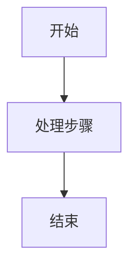

# 自动Wiki文档生成器

## 概述

这是一个智能化的wiki文档自动化生成和更新技能。该技能能够：

- 自动扫描项目代码结构和文件变更
- 生成符合项目现有风格的wiki文档
- 增量更新现有文档，只修改变化部分
- 创建标准格式的markdown文档，包含图表和代码示例

## 核心功能

### 1. 项目分析能力

- 递归扫描项目目录结构
- 识别源代码文件类型和用途
- 分析文件间的依赖关系
- 检测最近修改的文件和变更内容

### 2. 文档生成规范

生成的文档严格遵循现有wiki格式：

- 使用 `<cite>` 标签引用源文件
- 包含 Mermaid 流程图、时序图、ER图
- 标注 **Section sources** 和 **Diagram sources**
- 中文命名，结构层次清晰
- 包含详细的代码示例和 SQL 查询

### 3. 增量更新机制

- 对比现有文档与项目当前状态
- 识别新增、修改、删除的文件
- 只更新受影响的文档部分
- 保持文档其他内容不变

## 使用方法

### 触发命令

```
更新wiki
生成wiki文档
自动更新项目文档
```

### 执行流程

当收到上述任一命令时，技能将按以下步骤执行：

1. **项目扫描**

   - 分析项目根目录结构
   - 识别前端(src/)和后端(server/)目录
   - 统计各类文件数量和修改时间
2. **变更检测**

   - 对比文件修改时间戳
   - 识别最近7天内的变更
   - 分类变更类型（新增/修改/删除）
3. **文档策略制定**

   - 根据变更范围确定更新策略
   - 选择需要重新生成的文档
   - 制定增量更新计划
4. **内容生成**

   - 为每个目标文档生成内容
   - 创建标准格式的markdown结构
   - 插入适当的Mermaid图表
   - 添加代码示例和引用链接
5. **文档更新**

   - 读取现有文档内容
   - 应用增量更新
   - 保存修改后的文档

## 文档结构模板

### 标准文档头部

```markdown
# 文档标题

<cite>
**本文档引用的文件**
- [filename.ext](file://path/to/file)
- [another-file.ext](file://path/to/another-file)
</cite>

## 目录

1. [章节一](#章节一)
2. [章节二](#章节二)
```

### 内容章节格式

```markdown
## 章节标题

章节内容描述...

### 子章节

详细说明...

**Section sources**
- [source-file.js](file://path/to/source-file.js#L10-L50)



**Diagram sources**

- [related-file.js](file://path/to/related-file.js#L20-L30)

```

## 支持的文档类型

### 1. 项目结构文档
- 目录结构分析
- 文件组织方式
- 模块划分说明

### 2. 架构设计文档
- 系统架构图
- 组件关系说明
- 数据流向分析

### 3. API参考文档
- 接口端点列表
- 请求/响应格式
- 使用示例

### 4. 数据库设计文档
- 表结构说明
- ER关系图
- 索引策略

### 5. 配置说明文档
- 环境变量配置
- 系统参数说明
- 部署配置指南

## 技术实现细节

### 文件扫描策略
```javascript
// 递归遍历目录
function scanDirectory(dirPath) {
    const files = fs.readdirSync(dirPath);
    for (const file of files) {
        const fullPath = path.join(dirPath, file);
        const stats = fs.statSync(fullPath);
      
        if (stats.isDirectory()) {
            scanDirectory(fullPath);
        } else {
            processFile(fullPath, stats);
        }
    }
}
```

### 变更检测算法

```javascript
// 检测文件变更
function detectChanges(filePath, lastModified) {
    const currentStats = fs.statSync(filePath);
    return currentStats.mtime > lastModified;
}
```

### 文档生成引擎

```javascript
// 生成标准文档结构
function generateDocument(title, sections) {
    let content = `# ${title}\n\n`;
    content += generateCitation(sections.sources);
    content += generateTOC(sections.chapters);
  
    for (const chapter of sections.chapters) {
        content += generateChapter(chapter);
    }
  
    return content;
}
```

## 最佳实践建议

### 1. 文档维护

- 定期执行文档更新（建议每周一次）
- 重点关注核心功能模块的变更
- 保持文档与代码版本同步

### 2. 内容质量

- 确保引用链接的准确性
- 图表应清晰表达逻辑关系
- 代码示例需具有实际参考价值

### 3. 性能优化

- 避免重复扫描相同目录
- 缓存已分析的文件信息
- 并行处理多个文档生成任务

## 故障排除

### 常见问题

**Q: 生成的文档格式不符合预期**
A: 检查项目中是否包含示例文档作为模板参考

**Q: 某些文件未被正确引用**
A: 确认文件路径是否正确，检查文件访问权限

**Q: 图表无法正常显示**
A: 验证Mermaid语法是否正确，检查图表数据完整性

### 日志记录

技能执行过程中会记录关键操作：

- 扫描的文件数量和类型
- 检测到的变更文件列表
- 生成/更新的文档清单
- 执行过程中的错误信息

## 扩展能力

### 自定义模板

支持为不同类型文档定义专属模板：

```javascript
const templates = {
    'architecture': architectureTemplate,
    'api-reference': apiTemplate,
    'database-design': databaseTemplate
};
```

### 多语言支持

可根据需要扩展支持其他语言文档生成。

### 集成CI/CD

可与持续集成流程结合，在代码提交时自动更新相关文档。
