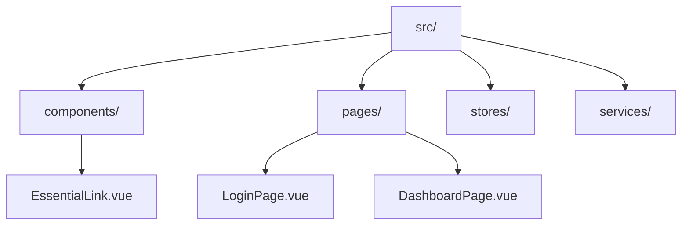
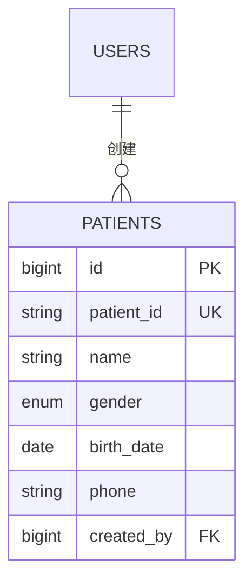

# Auto Wiki Generator 使用示例

## 基础使用场景

### 场景1: 首次生成项目文档

**用户命令:**
```
生成wiki文档
```

**执行过程:**
1. 技能扫描整个项目结构
2. 分析前端(src/)和后端(server/)目录
3. 识别核心组件和模块
4. 生成项目结构文档
5. 创建架构设计文档
6. 生成API参考文档

**输出文档:**
- `wiki/项目目录结构/项目目录结构.md`
- `wiki/前端架构/前端架构.md`
- `wiki/后端架构/后端架构.md`
- `wiki/API参考/API参考.md`

### 场景2: 增量更新变更内容

**用户命令:**
```
更新wiki
```

**执行过程:**
1. 检测最近7天的文件变更
2. 识别修改的路由文件和服务文件
3. 对比现有文档内容
4. 只更新受影响的章节
5. 保持其他内容不变

**示例变更检测:**
```javascript
// 检测到的变更文件
const changes = {
  modified: [
    'server/routes/patients.js',     // 新增了搜索功能
    'src/stores/patientStore.ts',    // 修改了数据获取逻辑
    'server/models/Patient.js'       // 添加了新字段
  ],
  added: [
    'server/services/email.service.js'  // 新增邮件服务
  ]
};

// 更新对应的wiki文档
updateDocument('wiki/患者管理API.md', changes.modified);
updateDocument('wiki/后端架构/业务逻辑层.md', changes.added);
```

## 文档生成示例

### 生成的项目结构文档示例

```markdown
# 项目目录结构

<cite>
**本文档中引用的文件**  
- [package.json](file://package.json)
- [quasar.config.ts](file://quasar.config.ts)
- [server/index.js](file://server/index.js)
- [src/main.js](file://src/main.js)
</cite>

## 目录

1. [前端目录结构](#前端目录结构)
2. [后端目录结构](#后端目录结构)
3. [配置文件说明](#配置文件说明)

## 前端目录结构

前端代码位于 `src/` 目录下，采用 Quasar 框架构建。

### 主要目录

#### components (组件目录)
存放可复用的 UI 组件：
- `EssentialLink.vue`: 导航链接组件
- `patients/`: 患者相关组件
- `studies/`: 病例相关组件

#### pages (页面目录)
包含所有路由页面：
- `LoginPage.vue`: 用户登录页面
- `DashboardPage.vue`: 仪表盘页面
- `PatientsPage.vue`: 患者管理页面



**Diagram sources**
- [目录结构分析](file://server/scripts/analyze-structure.js#L10-L50)

## 后端目录结构

后端代码位于 `server/` 目录，采用 Node.js + Express 构建。

### 核心目录

#### routes (路由目录)
定义 API 端点：
- `auth.js`: 认证相关接口
- `patients.js`: 患者管理接口
- `studies.js`: 病例管理接口

#### models (模型目录)
定义数据模型：
- `User.js`: 用户模型
- `Patient.js`: 患者模型
- `Study.js`: 病例模型

#### services (服务目录)
封装业务逻辑：
- `sms.service.js`: 短信服务
- `qwenService.js`: AI分析服务

**Section sources**
- [server/index.js](file://server/index.js#L1-L50)
- [server/models/index.js](file://server/models/index.js#L1-L30)
```

### 生成的API文档示例

```markdown
# 患者管理API

<cite>
**本文档引用的文件**
- [patients.js](file://server/routes/patients.js)
- [Patient.js](file://server/models/Patient.js)
- [patientStore.ts](file://src/stores/patientStore.ts)
</cite>

## 目录

1. [API端点列表](#api端点列表)
2. [数据模型](#数据模型)
3. [使用示例](#使用示例)

## API端点列表

### GET /api/patients
获取患者列表

**请求参数:**
- `page`: 页码 (默认: 1)
- `limit`: 每页数量 (默认: 10)
- `search`: 搜索关键词

**响应格式:**
```json
{
  "success": true,
  "data": {
    "patients": [...],
    "pagination": {
      "page": 1,
      "limit": 10,
      "total": 100
    }
  }
}
```

### POST /api/patients
创建新患者

**请求体:**
```json
{
  "name": "张三",
  "gender": "female",
  "birth_date": "1990-01-01",
  "phone": "13800138000"
}
```

## 数据模型

### Patient 表结构

```sql
CREATE TABLE patients (
  id BIGINT PRIMARY KEY AUTO_INCREMENT,
  patient_id VARCHAR(50) UNIQUE NOT NULL,
  name VARCHAR(100) NOT NULL,
  gender ENUM('male', 'female', 'other') NOT NULL,
  birth_date DATE,
  phone VARCHAR(20),
  created_by BIGINT,
  created_at TIMESTAMP DEFAULT CURRENT_TIMESTAMP,
  updated_at TIMESTAMP DEFAULT CURRENT_TIMESTAMP ON UPDATE CURRENT_TIMESTAMP
);
```



**Diagram sources**
- [Patient.js](file://server/models/Patient.js#L5-L50)

## 使用示例

### 前端调用示例

```typescript
// 在 patientStore.ts 中
import { patientAPI } from 'src/services/api';

export const usePatientStore = defineStore('patient', {
  actions: {
    async fetchPatients(params: PatientQueryParams) {
      try {
        const response = await patientAPI.getPatients(params);
        this.patients = response.data.patients;
        return response;
      } catch (error) {
        console.error('获取患者列表失败:', error);
        throw error;
      }
    }
  }
});
```

**Section sources**
- [patients.js](file://server/routes/patients.js#L15-L60)
- [patientStore.ts](file://src/stores/patientStore.ts#L25-L45)
```

## 高级使用技巧

### 1. 定制扫描范围

```javascript
// 只扫描特定目录
const scanConfig = {
  include: ['src/components', 'server/routes'],
  exclude: ['node_modules', 'dist']
};
```

### 2. 设置更新阈值

```javascript
// 当变更超过30%时重新生成整个文档
const updateConfig = {
  incrementalThreshold: 0.3,
  backupOriginal: true
};
```

### 3. 批量处理多个项目

```javascript
const projects = [
  { name: 'frontend', path: './src' },
  { name: 'backend', path: './server' },
  { name: 'database', path: './server/models' }
];

for (const project of projects) {
  await generateWiki(project.path, project.name);
}
```

## 故障排除示例

### 问题1: 生成的图表显示异常

**现象:** Mermaid图表无法正确渲染

**解决方案:**
```javascript
// 检查图表语法
function validateMermaidSyntax(chartCode) {
  try {
    // 验证基本语法结构
    const requiredElements = ['graph', 'flowchart', 'sequenceDiagram'];
    return requiredElements.some(el => chartCode.includes(el));
  } catch (error) {
    return false;
  }
}
```

### 问题2: 文件引用链接失效

**现象:** 点击文件链接无法跳转到正确位置

**解决方案:**
```javascript
// 验证文件路径有效性
function validateFileReferences(docContent) {
  const fileLinks = docContent.match(/\[.*?\]\(file:\/\/.*?\)/g) || [];
  
  for (const link of fileLinks) {
    const filePath = link.match(/file:\/\/([^)]+)/)[1];
    if (!fs.existsSync(filePath)) {
      console.warn(`无效的文件引用: ${filePath}`);
    }
  }
}
```

### 问题3: 文档更新不完整

**现象:** 部分变更内容未被包含在更新中

**解决方案:**
```javascript
// 增强变更检测
function enhancedChangeDetection() {
  return {
    // 检测文件内容哈希变化
    contentChanged: compareFileHashes(),
    // 检测依赖关系变化
    dependenciesChanged: analyzeImportStatements(),
    // 检测注释和文档字符串变化
    documentationChanged: extractJSDocComments()
  };
}
```