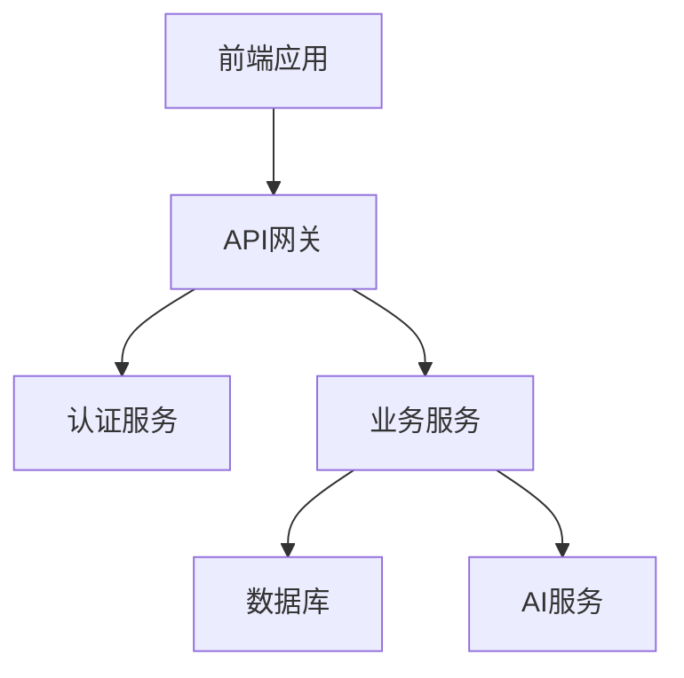
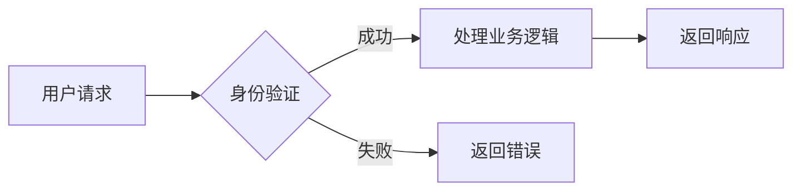
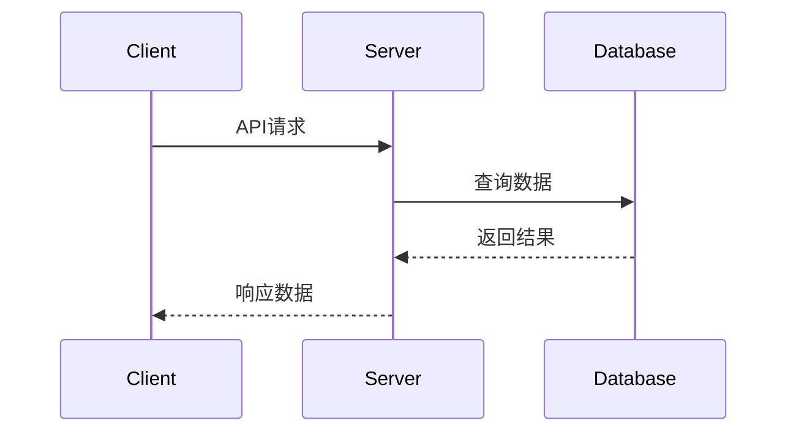

# Auto Wiki Generator Reference

## 核心组件说明

### 1. 项目扫描器 (ProjectScanner)
负责递归扫描项目目录，识别文件类型和结构。

**主要方法:**
- `scanProject(rootPath)`: 扫描整个项目
- `analyzeDirectory(dirPath)`: 分析单个目录
- `getFileMetadata(filePath)`: 获取文件元数据
- `classifyFiles(fileList)`: 文件分类

### 2. 变更检测器 (ChangeDetector)
检测项目文件的变更情况，识别新增、修改、删除的文件。

**核心算法:**
```javascript
function detectFileChanges(files, baselineTimestamp) {
    const changes = {
        added: [],
        modified: [],
        deleted: []
    };
    
    for (const file of files) {
        const stats = fs.statSync(file.path);
        if (stats.mtime > baselineTimestamp) {
            if (file.existsInBaseline) {
                changes.modified.push(file);
            } else {
                changes.added.push(file);
            }
        }
    }
    
    return changes;
}
```

### 3. 文档生成器 (DocumentGenerator)
根据分析结果生成标准格式的wiki文档。

**支持的文档模板:**
- 项目结构文档模板
- 架构设计文档模板  
- API参考文档模板
- 数据库设计文档模板
- 配置说明文档模板

### 4. 增量更新器 (IncrementalUpdater)
实现文档的精准更新，只修改变化部分内容。

**更新策略:**
- 基于文件哈希值检测内容变更
- 保留未变更部分的原有格式
- 智能合并新增和修改的内容

## 配置选项

### 扫描配置
```yaml
scan:
  exclude_patterns:
    - node_modules/**
    - .git/**
    - dist/**
    - uploads/**
  file_extensions:
    - .js
    - .ts
    - .vue
    - .sql
  max_depth: 10
```

### 更新配置
```yaml
update:
  lookback_days: 7
  backup_original: true
  incremental_threshold: 0.3  # 30%内容变更时重新生成
```

## Mermaid 图表示例

### 架构图


### 流程图


### 序列图


## 代码引用规范

### JavaScript/TypeScript 引用
```markdown
**Section sources**
- [userService.ts](file://src/services/userService.ts#L15-L45)
- [auth.middleware.js](file://server/middleware/auth.js#L10-L30)
```

### SQL 查询示例
```sql
SELECT u.id, u.username, p.name as patient_name
FROM users u
JOIN patients p ON u.id = p.created_by
WHERE u.status = 'active';
```

### Vue 组件引用
```markdown
**Component sources**
- [PatientList.vue](file://src/components/patients/PatientList.vue#L25-L80)
- [StudyForm.vue](file://src/components/studies/StudyForm.vue#L10-L150)
```

## 性能优化技巧

### 1. 缓存机制
```javascript
const fileCache = new Map();
const metadataCache = new Map();

function getCachedFileData(filePath) {
    if (fileCache.has(filePath)) {
        return fileCache.get(filePath);
    }
    
    const data = readFileAndProcess(filePath);
    fileCache.set(filePath, data);
    return data;
}
```

### 2. 并行处理
```javascript
async function processMultipleFiles(filePaths) {
    const promises = filePaths.map(async (filePath) => {
        return await processFile(filePath);
    });
    
    return Promise.all(promises);
}
```

### 3. 增量计算
只重新计算变更部分，避免全量重新生成。

## 错误处理机制

### 文件访问错误
```javascript
try {
    const content = fs.readFileSync(filePath, 'utf8');
} catch (error) {
    if (error.code === 'ENOENT') {
        console.warn(`文件不存在: ${filePath}`);
    } else if (error.code === 'EACCES') {
        console.error(`无权限访问: ${filePath}`);
    }
}
```

### 格式解析错误
```javascript
function parseMarkdown(content) {
    try {
        return marked.parse(content);
    } catch (error) {
        console.error('Markdown解析失败:', error.message);
        return content; // 返回原始内容
    }
}
```

## 扩展开发指南

### 添加新的文档模板
1. 在 `templates/` 目录下创建新模板文件
2. 定义模板结构和占位符
3. 实现对应的数据处理器
4. 注册到模板管理系统

### 自定义分析规则
```javascript
const customAnalyzers = {
    'vue-components': analyzeVueComponents,
    'api-routes': analyzeApiRoutes,
    'database-models': analyzeDatabaseModels
};
```

### 集成外部工具
- 支持ESLint分析代码质量
- 集成JSDoc提取API文档
- 连接数据库获取实时结构信息