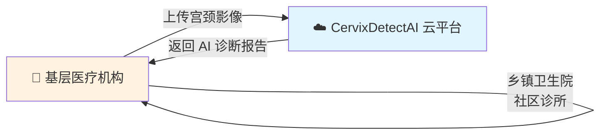
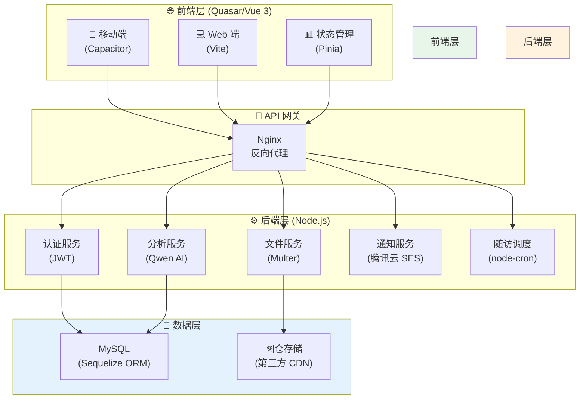
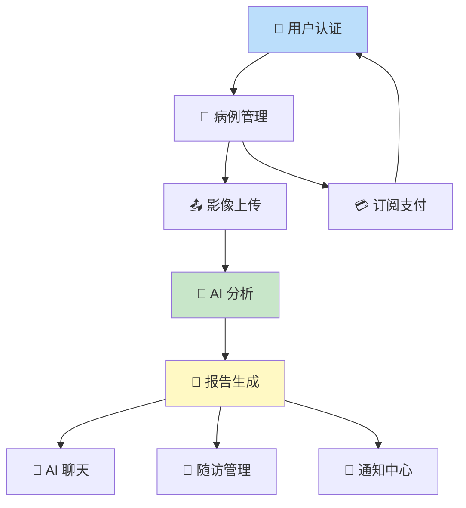
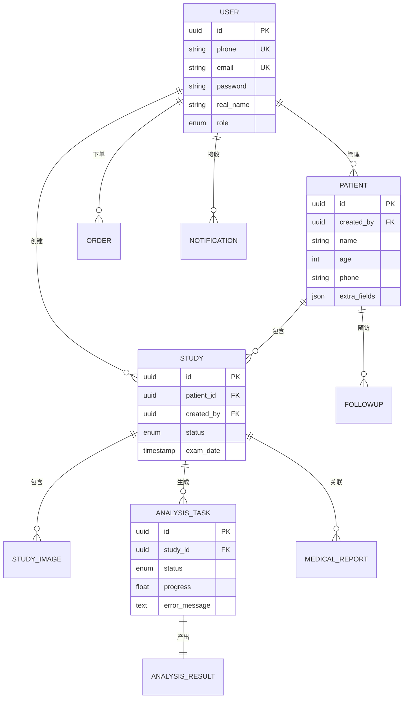
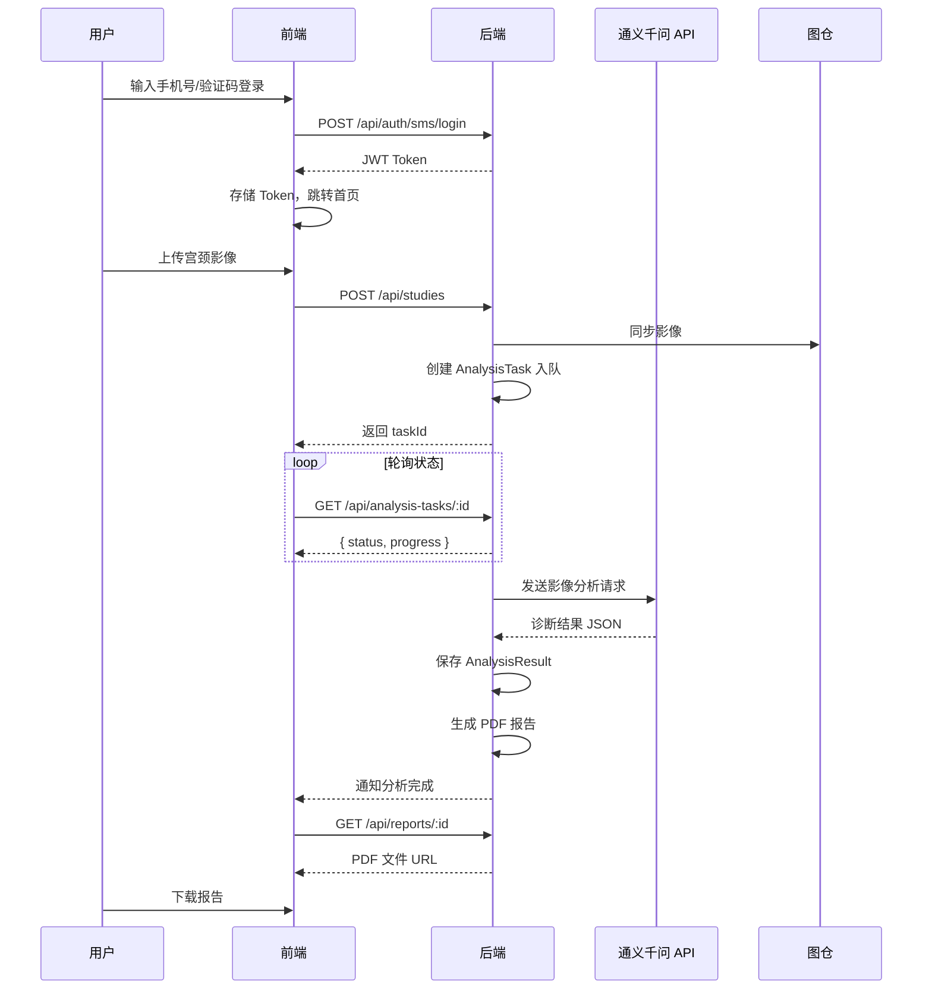

CervixDetectAI 是一个基于**深度学习**的宫颈癌影像 AI 辅助筛查 SaaS 云平台，隶属于"互联网+医疗"的新型服务模式。本文档面向初级开发者，帮助您快速理解项目的整体架构、核心功能和开发环境。

## 项目定位与愿景

宫颈癌是女性最常见的恶性肿瘤之一，早期筛查对提高治愈率至关重要。然而，基层医疗机构普遍面临专业病理医生不足、诊断成本高昂等挑战。

CervixDetectAI 平台通过云端部署 AI 模型，使基层医疗机构能够以**按次付费**或**订阅制**的方式获取智能筛查服务。这种 SaaS 模式大幅降低了智能医疗的准入门槛，让更多女性能够享受到精准的宫颈癌筛查服务。



| 创新维度 | 具体说明 |
|:---------|:---------|
| **技术创新** | 自研算法在保持高准确率的同时降低计算成本，可在普通硬件上流畅运行 |
| **模式创新** | SaaS 云服务实现筛查普惠化，基层医疗机构也能负担得起智能筛查 |
| **体验创新** | 支持批量上传、流式 AI 对话、PDF 报告自动生成等现代化交互 |

Sources: [README.md](README.md#L1-L44)

## 系统架构概览

CervixDetectAI 采用**前后端分离**架构，前端使用 Vue 3 + Quasar 框架构建响应式界面，后端使用 Node.js + Express 提供 RESTful API 服务。



### 技术栈一览

| 层级 | 技术选型 | 版本要求 | 职责说明 |
|:-----|:---------|:---------|:---------|
| **前端框架** | Vue 3 + Quasar | ^3.5 / ^2.18 | 组件化 UI 开发，支持移动端打包 |
| **类型系统** | TypeScript | ^5.0 | 静态类型检查，提升代码质量 |
| **构建工具** | Vite | ^6.0 | 快速热更新和生产构建 |
| **状态管理** | Pinia | ^3.0 | Vue 3 官方推荐的状态管理库 |
| **HTTP 客户端** | Axios | ^1.2 | API 请求与拦截器处理 |
| **后端框架** | Express | ^5.1 | RESTful API 服务 |
| **数据库** | MySQL + Sequelize | ^3.15 / ^6.37 | 关系型数据存储与 ORM 映射 |
| **文件上传** | Multer | ^2.0 | multipart/form-data 处理 |
| **AI 服务** | 通义千问 API | - | 宫颈影像智能分析 |
| **图像存储** | 图仓 CDN | - | 影像文件云端存储 |
| **邮件服务** | 腾讯云 SES | - | 邮件通知推送 |
| **定时任务** | node-cron | ^4.2 | 随访提醒调度 |

Sources: [package.json](package.json#L1-L60)
Sources: [server/package.json](server/package.json#L1-L42)

## 核心功能模块

CervixDetectAI 包含八大核心功能模块，覆盖从用户认证到报告生成的完整业务流程。



### 功能模块详解

| 模块 | 功能亮点 | 技术实现 |
|:-----|:---------|:---------|
| **用户认证** | 双通道登录（邮箱/手机）、JWT 双 Token、阿里云验证码 | `server/routes/auth.js`、`server/middleware/auth.js` |
| **病例管理** | 患者信息管理、历史趋势分析、风险画像 | `server/models/Patient.js`、`server/routes/patients.js` |
| **影像上传** | 批量上传（最多 10 张）、拖拽支持、图仓同步 | `server/services/studyImageStorage.service.js` |
| **AI 分析** | 通义千问模型、TBS 诊断分类、置信度评分 | `server/services/qwenService.js` |
| **报告生成** | PDF 自动生成、ECharts 图表展示 | `src/utils/pdfGenerator.js` |
| **AI 聊天** | SSE 流式输出、Markdown 渲染、上下文关联 | `server/routes/chat.js` |
| **随访管理** | 定时提醒、预设模板、状态流转 | `server/services/followupScheduler.service.js` |
| **站内通知** | 分析完成通知、高风险预警、跳转联动 | `server/services/notificationService.js` |

Sources: [README.md](README.md#L46-L120)
Sources: [server/index.js](server/index.js#L1-L100)

## 数据模型关系

系统使用 Sequelize ORM 定义了 14 个核心数据模型，支撑完整的业务数据流转。



Sources: [server/models/index.js](server/models/index.js)
Sources: [wiki/数据库设计/关系图.md](wiki/数据库设计/关系图.md)

## 项目目录结构

```
CervixDetectAI/
├── src/                          # 🎯 前端源代码
│   ├── pages/                    # 页面组件 (21 个页面)
│   │   ├── LoginPage.vue        # 登录页
│   │   ├── RegisterPage.vue     # 注册页
│   │   ├── DashboardPage.vue    # 仪表盘
│   │   ├── UploadPage.vue       # 上传分析页
│   │   ├── StudiesPage.vue      # 病例列表页
│   │   ├── ReportsPage.vue      # 报告管理页
│   │   └── ...
│   ├── components/              # 可复用组件
│   ├── layouts/                 # 页面布局 (MainLayout, PublicLayout)
│   ├── stores/                  # Pinia 状态管理
│   │   ├── authStore.ts        # 认证状态
│   │   ├── studyStore.ts       # 病例数据
│   │   └── analysisStore.ts    # AI 分析任务
│   ├── services/                # API 请求服务
│   │   └── api.ts              # Axios 实例配置
│   └── utils/                   # 工具函数
│       └── pdfGenerator.ts     # PDF 报告生成
│
├── server/                       # ⚙️ 后端源代码
│   ├── routes/                  # API 路由 (17 个路由文件)
│   │   ├── auth.js             # 认证路由
│   │   ├── analyze.js          # AI 分析路由
│   │   ├── patients.js          # 患者管理路由
│   │   └── ...
│   ├── models/                  # Sequelize 数据模型
│   ├── services/                # 业务逻辑服务
│   │   ├── qwenService.js      # 通义千问 AI 服务
│   │   ├── email.service.js     # 邮件服务
│   │   └── followupScheduler.service.js  # 随访调度
│   ├── middleware/              # 中间件
│   │   └── auth.js             # JWT 认证中间件
│   ├── config/                  # 配置文件
│   │   └── sequelize.js        # 数据库配置
│   ├── uploads/                 # 上传文件目录
│   └── reports/                 # PDF 报告目录
│
├── public/                       # 🖼️ 静态资源
├── docs/                         # 📚 项目文档
└── wiki/                         # 🌐 GitHub Wiki
```

Sources: [CLAUDE.md](CLAUDE.md#L1-L60)

## 业务流程示意

### 用户从登录到获取报告的完整流程



Sources: [wiki/系统概述.md](wiki/系统概述.md#L1-L100)

## 环境配置要点

| 环境变量 | 用途 | 配置建议 |
|:---------|:-----|:---------|
| `DB_HOST` | MySQL 数据库地址 | 生产环境使用内网 IP |
| `DB_SYNC` | 自动同步表结构 | 生产环境设为 `false` |
| `JWT_SECRET` | Token 签名密钥 | **必须修改**，禁止使用默认值 |
| `QWEN_API_KEY` | 通义千问 API 密钥 | 从阿里云百炼平台获取 |
| `TUCANG_TOKEN` | 图仓存储令牌 | 用于影像云端存储 |
| `TENCENT_SES_*` | 腾讯云邮件服务 | 用于发送通知邮件 |

Sources: [server/.env](server/.env)
Sources: [CLAUDE.md](CLAUDE.md#L70-L90)

## 下一步学习路径

完成本概述后，建议按以下顺序深入学习：

| 顺序 | 文档页面 | 内容要点 |
|:----:|:---------|:---------|
| 1 | [快速启动](2-kuai-su-qi-dong) | 本地开发环境搭建与运行 |
| 2 | [前端技术栈概览](5-qian-duan-ji-zhu-zhan-gai-lan) | Vue 3、Quasar、TypeScript 深入理解 |
| 3 | [后端服务架构](8-hou-duan-fu-wu-jia-gou) | Express 路由设计、中间件机制 |
| 4 | [通义千问 AI 分析服务](10-tong-yi-qian-wen-aifen-xi-fu-wu) | AI 模型调用与结果解析 |
| 5 | [用户认证系统](12-yong-hu-ren-zheng-xi-tong) | JWT 双 Token 机制详解 |
| 6 | [部署与运维指南](18-bu-shu-yu-yun-wei-zhi-nan) | Docker 容器化与 Nginx 配置 |