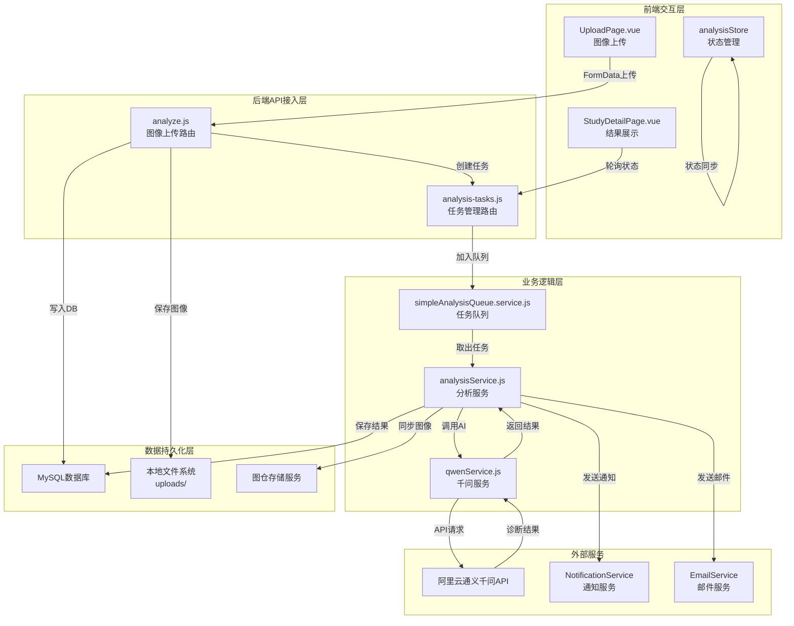
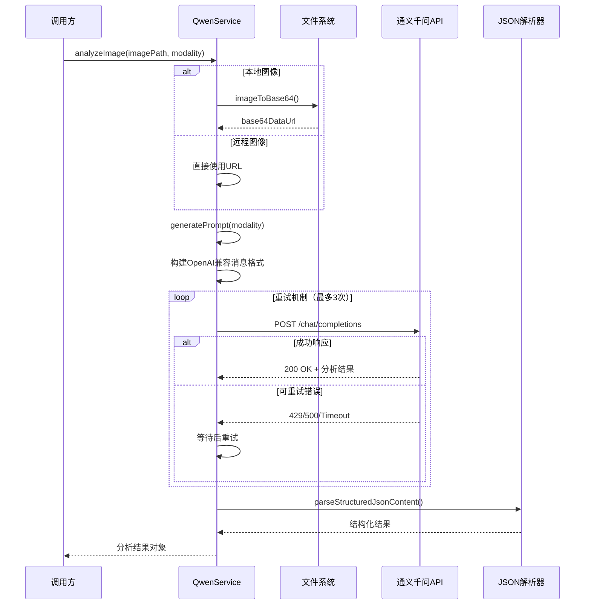

本文档描述 CervixDetectAI 系统中通义千问AI分析服务的完整技术架构、核心流程与实现细节。该服务负责接收宫颈细胞学图像，通过阿里云通义千问视觉大模型进行智能分析，输出标准化诊断报告。

## 系统架构概览

通义千问AI分析服务采用**分层异步处理架构**，由API接入层、业务逻辑层、任务队列层和AI模型层组成。这种设计实现了图像上传与分析的解耦，确保高并发场景下的服务稳定性。



Sources: [server/routes/analyze.js](server/routes/analyze.js#L1-L100), [server/services/qwenService.js](server/services/qwenService.js#L1-L100), [server/services/analysisService.js](server/services/analysisService.js#L1-L100)

## 核心服务组件

### 1. 通义千问服务（qwenService.js）

通义千问服务是整个分析链路的核心，负责与阿里云视觉大模型进行交互。该服务实现了图像编码、提示词生成、响应解析和错误处理等关键功能。



服务类 `QwenService` 在初始化时验证 `QWEN_API_KEY` 环境变量，并创建配置了超时和认证头的 Axios 实例。默认使用 `qwen-vl-max` 模型，可通过 `QWEN_MODEL` 环境变量覆盖。

```javascript
// qwenService.js 核心配置
class QwenService {
  constructor() {
    this.apiKey = process.env.QWEN_API_KEY;
    this.apiUrl = process.env.QWEN_API_URL;  // https://dashscope.aliyuncs.com/compatible-mode/v1
    this.model = process.env.QWEN_MODEL || 'qwen-vl-max';
    
    this.axiosInstance = axios.create({
      baseURL: this.apiUrl,
      timeout: parseInt(process.env.QWEN_API_TIMEOUT_MS || '') || 180000,
      headers: {
        Authorization: `Bearer ${this.apiKey}`,
        'Content-Type': 'application/json',
      },
    });
  }
}
```

Sources: [server/services/qwenService.js](server/services/qwenService.js#L330-L400)

### 2. 检查方式与诊断分类

系统支持多种宫颈细胞学检查方式的图像分析，每种检查方式对应特定的分析提示词和诊断分类选项。

| 检查方式 | 诊断分类（TBS/病理系统） | 关键生物标志物 |
|---------|------------------------|--------------|
| 巴氏染色涂片（Pap Smear） | NILM/ASC-US/ASC-H/LSIL/HSIL/SCC/AGC | HPV状态推测 |
| 液基细胞学（TCT/LCT） | NILM/ASC-US/ASC-H/LSIL/HSIL/SCC/AGC | HPV状态推测 |
| 宫颈活检切片（HE染色） | 正常/CIN 1/2/3/原位癌/浸润癌/腺癌 | p16/Ki67 |
| p16/Ki67双染图像 | 阴性/阳性/可疑 | p16/Ki67双阳性 |
| 阴道镜检查图像 | 正常/低度病变/高度病变/可疑浸润癌 | 醋酸白/碘染色 |

`generatePrompt()` 函数根据传入的 `modality` 参数动态生成专业化的系统提示词，确保AI模型针对特定检查类型输出准确的诊断结果。

Sources: [server/services/qwenService.js](server/services/qwenService.js#L68-L300)

### 3. 分析服务（analysisService.js）

分析服务负责管理分析任务的完整生命周期，包括任务状态流转、进度更新、结果存储和通知发送。

任务状态机定义如下：

| 状态 | 含义 | 触发条件 |
|-----|------|---------|
| PENDING | 等待处理 | 任务创建，未开始分析 |
| PROCESSING | 分析中 | 开始调用AI服务 |
| SUCCESS | 分析成功 | AI返回有效诊断结果 |
| FAILED | 分析失败 | 超时、API错误或解析失败 |

```javascript
// analysisService.js 核心流程
async function processTask(analysisTaskId, imagePath, studyId) {
  const processingStartedAt = Date.now();
  
  // 更新状态为 PROCESSING
  await AnalysisTask.update(
    { status: 'PROCESSING', progress: 10, started_at: new Date() },
    { where: { id: analysisTaskId } }
  );
  
  // 启动进度模拟器
  let currentProgress = 30;
  progressInterval = setInterval(async () => {
    if (currentProgress < 85) {
      currentProgress += 5;
      await AnalysisTask.update({ progress: currentProgress }, ...);
    }
  }, 3000);
  
  // 调用通义千问API
  const result = await withAnalysisTimeout(
    qwenService.analyzeImage(imagePath, modality),
    resolveAnalysisTimeoutMs()
  );
  
  // 风险等级判定
  const riskLevel = getRiskLevel(result.diagnosis);
  
  // 事务保存结果
  await sequelize.transaction(async (t) => {
    await AnalysisResult.create({ task_id, diagnosis, confidence, risk_level, ... }, { transaction: t });
    await AnalysisTask.update({ status: 'SUCCESS', progress: 100, ... }, { transaction: t });
  });
}
```

Sources: [server/services/analysisService.js](server/services/analysisService.js#L70-L170)

### 4. 任务队列服务（simpleAnalysisQueue.service.js）

任务队列实现简单的并发控制机制，无需Redis即可支撑中小规模部署。通过 `MAX_CONCURRENT_ANALYSIS` 环境变量控制同时运行的分析任务数量上限。

```javascript
class SimpleTaskQueue {
  constructor(concurrency = 3) {
    this.concurrency = concurrency;  // 默认3个并发
    this.running = 0;
    this.queue = [];
  }
  
  async add(taskFn, taskId) {
    if (this.running < this.concurrency) {
      // 立即执行
      this._execute(taskFn, taskId);
    } else {
      // 进入等待队列
      await new Promise((resolve, reject) => {
        this.queue.push({ taskFn, resolve, reject, taskId });
      });
    }
  }
}
```

Sources: [server/services/simpleAnalysisQueue.service.js](server/services/simpleAnalysisQueue.service.js#L1-L80)

## API端点参考

### 图像上传与分析

```
POST /api/analyze
Content-Type: multipart/form-data
```

| 参数 | 类型 | 必填 | 说明 |
|-----|------|-----|------|
| image | File | 是 | 图像文件（支持JPG/PNG/TIFF/BMP，最大20MB） |
| patientName | string | 是 | 患者姓名 |
| patientId | string | 是 | 患者编号 |
| studyDate | string | 是 | 检查日期（YYYY-MM-DD格式） |
| modality | string | 是 | 检查方式 |
| description | string | 否 | 病例描述 |

**响应示例**：
```json
{
  "success": true,
  "data": {
    "taskId": "task_xxxxxxxx-xxxx-xxxx-xxxx-xxxxxxxxxxxx",
    "studyId": "study_xxxxxxxx-xxxx-xxxx-xxxx-xxxxxxxxxxxx",
    "studyDbId": 123,
    "status": "PENDING",
    "estimatedTime": 30
  }
}
```

Sources: [server/routes/analyze.js](server/routes/analyze.js#L50-L150)

### 任务状态查询

```
GET /api/analyze/:taskId
```

**响应示例（分析成功）**：
```json
{
  "success": true,
  "data": {
    "taskId": "task_xxx",
    "status": "SUCCESS",
    "progress": 100,
    "result": {
      "diagnosis": "LSIL（低度鳞状上皮内病变）",
      "confidence": 0.87,
      "riskLevel": "high",
      "recommendations": ["建议3-6个月后复查", "可行HPV分型检测"],
      "suspiciousAreas": [
        {
          "description": "异常鳞状上皮细胞",
          "location": "中央区域",
          "box_2d": [350, 400, 520, 580],
          "features": ["核异型性", "核浆比增高"]
        }
      ],
      "biomarkers": {
        "HPV": "阳性（推测）",
        "p16": "未检测",
        "Ki67": "未检测"
      },
      "detailedReport": "镜下可见大量表层鳞状上皮细胞，细胞核增大..."
    }
  }
}
```

Sources: [server/routes/analyze.js](server/routes/analyze.js#L300-L400)

### 分析结果查询

```
GET /api/analyze/study/:studyId
```

根据病例ID查询完整的分析结果，包含病例信息和诊断报告。

Sources: [server/routes/analyze.js](server/routes/analyze.js#L352-L450)

## 数据模型设计

### AnalysisTask 模型

分析任务表记录每次分析的元数据信息。

| 字段 | 类型 | 说明 |
|-----|------|-----|
| id | BIGINT | 主键，自增 |
| task_id | STRING(50) | 业务任务ID（唯一） |
| study_id | BIGINT | 关联病例ID |
| user_id | BIGINT | 创建者用户ID |
| status | ENUM | 任务状态 |
| progress | INTEGER | 进度（0-100） |
| ai_model_version | STRING | AI模型版本 |
| processing_time | INTEGER | 处理耗时（毫秒） |
| error_message | TEXT | 错误信息 |
| started_at | DATE | 开始时间 |
| completed_at | DATE | 完成时间 |

Sources: [server/models/AnalysisTask.js](server/models/AnalysisTask.js#L1-L109)

### AnalysisResult 模型

分析结果表存储AI返回的完整诊断信息。

| 字段 | 类型 | 说明 |
|-----|------|-----|
| id | BIGINT | 主键，自增 |
| task_id | BIGINT | 关联任务ID（一对一） |
| study_id | BIGINT | 关联病例ID |
| diagnosis | STRING | 诊断分类 |
| confidence | DECIMAL | 置信度（0-1） |
| risk_level | ENUM | 风险等级（low/medium/high/critical） |
| recommendations | JSON | 医疗建议列表 |
| suspicious_areas | JSON | 可疑区域坐标 |
| biomarkers | JSON | 生物标志物数据 |
| detailed_report | TEXT | 详细病理报告 |
| raw_output | JSON | AI原始输出（调试用） |

Sources: [server/models/AnalysisResult.js](server/models/AnalysisResult.js#L1-L127)

## 前端集成

### 状态管理（analysisStore.ts）

Pinia Store 负责管理分析任务状态，提供任务列表查询、轮询和结果转换等功能。

```typescript
export const useAnalysisStore = defineStore('analysis', {
  state: () => ({
    tasks: [] as AnalysisTask[],
    currentTask: null as AnalysisTask | null,
    pollingIntervals: new Map<string, NodeJS.Timeout>(),
  }),
  
  getters: {
    getActiveTaskByStudyId: (state) => (studyId: string) => {
      return state.tasks.find(
        (task) => task.studyId === studyId && 
        (task.status === 'PENDING' || task.status === 'PROCESSING')
      );
    },
  },
  
  actions: {
    async startPolling(taskId: string) {
      const interval = setInterval(async () => {
        const status = await getTaskStatus(taskId);
        // 更新状态...
        if (status.status === 'SUCCESS' || status.status === 'FAILED') {
          clearInterval(interval);
        }
      }, 2000);
      
      this.pollingIntervals.set(taskId, interval);
    },
  },
});
```

Sources: [src/stores/analysisStore.ts](src/stores/analysisStore.ts#L1-L100)

### 轮询机制

前端使用 `pollTaskStatus()` 函数实现任务状态轮询，默认轮询间隔2秒，最大尝试150次（5分钟超时）。

```typescript
export async function pollTaskStatus(
  taskId: string,
  onProgress?: (status: TaskStatusResponse) => void,
  interval = 2000,
  maxAttempts = 150
): Promise<TaskStatusResponse> {
  return new Promise((resolve, reject) => {
    const poll = async () => {
      try {
        const status = await getTaskStatus(taskId);
        onProgress?.(status);
        
        const normalizedStatus = status.status?.toUpperCase();
        if (normalizedStatus === 'SUCCESS' || normalizedStatus === 'FAILED') {
          resolve(status);
          return;
        }
        
        if (attempts >= maxAttempts) {
          reject(new Error('分析超时，请稍后重试'));
          return;
        }
        
        setTimeout(() => poll(), interval);
      } catch (error) {
        reject(error);
      }
    };
    poll();
  });
}
```

Sources: [src/services/apiService.ts](src/services/apiService.ts#L100-L150)

## 环境配置

| 环境变量 | 默认值 | 说明 |
|---------|-------|------|
| QWEN_API_KEY | - | 阿里云API密钥（必填） |
| QWEN_API_URL | - | API地址（必填） |
| QWEN_MODEL | qwen-vl-max | 分析模型 |
| QWEN_API_TIMEOUT_MS | 180000 | API超时（毫秒） |
| ANALYSIS_TIMEOUT_MS | 180000 | 分析总超时（毫秒） |
| MAX_CONCURRENT_ANALYSIS | 10 | 最大并发分析数 |

Sources: [server/.env](server/.env#L1-L20)

## 错误处理机制

服务实现了多层次的错误处理和自动重试机制：

| 错误类型 | 处理策略 | 重试次数 |
|---------|---------|---------|
| 网络超时（ECONNABORTED/ETIMEDOUT） | 指数退避重试 | 3次 |
| API限流（429） | 等待后重试 | 3次 |
| 服务器错误（5xx） | 等待后重试 | 3次 |
| 客户端错误（400/401/403） | 直接失败 | 不重试 |
| JSON解析失败 | 尝试提取JSON片段 | 最多3次尝试 |

```javascript
shouldRetry(error) {
  if (error.code === 'ECONNABORTED' || error.code === 'ETIMEDOUT') return true;
  if (error.response?.status === 429) return true;
  if (error.response?.status >= 500) return true;
  return false;
}
```

Sources: [server/services/qwenService.js](server/services/qwenService.js#L480-L520)

## 下一步

- 了解影像如何存储与同步至图仓服务：[影像存储与图仓集成](11-ying-xiang-cun-chu-yu-tu-cang-ji-cheng)
- 查看完整的API接口定义：[AI分析API](../API参考/AI分析API)
- 了解分析结果如何在病例详情页展示：[病例管理API](../API参考/病例管理API)