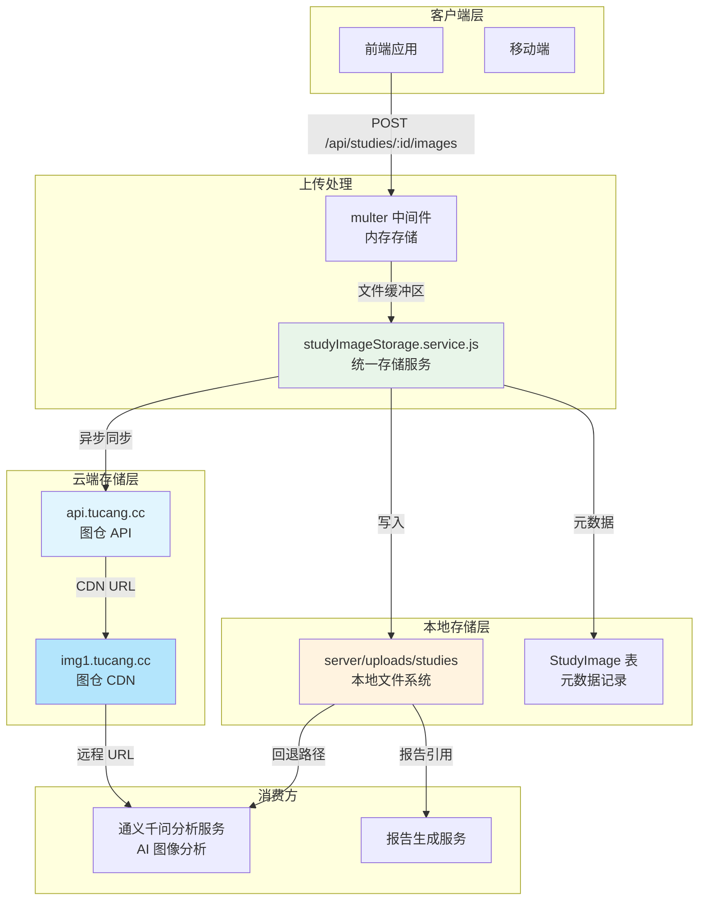
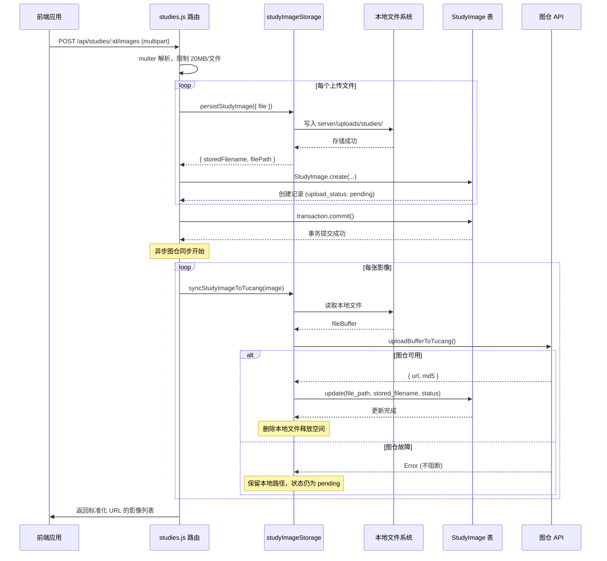
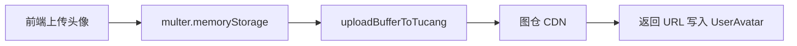

本文档介绍 CervixDetectAI 系统中病例影像的存储架构与图仓（TuCang）云服务集成方案。该模块实现了从本地临时存储到云端持久化的完整链路，并为 AI 分析服务提供统一图像访问接口。

## 系统架构概览

该系统采用**双层存储架构**：本地存储层作为临时缓存和故障回退，云端图仓作为主要的持久化存储和分发层。这种设计既保证了上传的即时响应，又为后续的 AI 分析和前端访问提供了稳定的远程 URL。



### 架构设计原则

**可靠性优先**：图仓同步采用异步模式，同步失败不影响主事务提交。本地文件作为最终回退方案，确保影像始终可访问。

**一致性保障**：通过 `upload_status` 字段追踪每张影像的同步状态，支持后续批量补偿同步。

**性能优化**：远程 URL 直接用于 AI 分析，避免大文件的 Base64 编解码开销。前端通过统一的序列化接口获取标准化路径。

Sources: [server/services/studyImageStorage.service.js](server/services/studyImageStorage.service.js#L1-L100)
Sources: [server/services/tucang.service.js](server/services/tucang.service.js#L1-L80)

## 核心数据模型

### StudyImage 实体

`StudyImage` 模型定义了病例影像的完整元数据结构，包含本地存储信息和云端同步状态：

| 字段 | 类型 | 说明 |
|------|------|------|
| `id` | BIGINT | 主键，自增 |
| `study_id` | BIGINT | 关联病例 ID，外键级联删除 |
| `original_filename` | STRING(255) | 用户上传时的原始文件名 |
| `stored_filename` | STRING(255) | 存储文件名（UUID 或图仓 MD5） |
| `file_path` | STRING(500) | 文件路径（本地相对路径或远程 URL） |
| `thumbnail_path` | STRING(500) | 缩略图路径（可为空） |
| `file_size` | BIGINT | 文件大小（字节） |
| `mime_type` | STRING(50) | MIME 类型 |
| `file_format` | STRING(20) | 格式标识（DICOM、JPEG、PNG 等） |
| `width/height` | INTEGER | 图像尺寸 |
| `series_number` | INTEGER | DICOM 序列号 |
| `instance_number` | INTEGER | DICOM 实例号 |
| `dicom_metadata` | JSON | DICOM 重要标签 |
| `is_primary` | BOOLEAN | 是否为主图 |
| `upload_status` | ENUM | 同步状态：`pending`、`completed`、`failed` |

**索引策略**：在 `study_id` 上建立单列索引，在 `(study_id, series_number, instance_number)` 上建立复合索引，支持按病例快速检索和 DICOM 序列排序。

Sources: [server/models/StudyImage.js](server/models/StudyImage.js#L1-L104)

## 存储服务详解

### studyImageStorage.service.js

该服务是影像存储的核心模块，提供五个主要功能：

**持久化上传**：`persistStudyImage()` 函数接收 multer 传递的文件对象，首先写入 `server/uploads/studies` 目录，然后返回存储元信息。文件名采用时间戳+随机数前缀，保留原始扩展名，既避免冲突又便于调试。

**异步图仓同步**：`syncStudyImageToTucang()` 在事务提交后被调用，读取本地文件并调用图仓 API 上传。上传成功后更新 `file_path` 为远程 URL，`stored_filename` 更新为图仓返回的 MD5 值。

**分析前路径准备**：`prepareStudyImageForAnalysis()` 是分析链路的入口函数，优先判断是否存在远程 URL，否则尝试同步图仓，最后回退到本地绝对路径。

**响应序列化**：`serializeStudyImageForResponse()` 和 `serializeStudyForResponse()` 对外输出的路径进行标准化处理，包括纠正历史错误的主机名（如 `https://uploads/...`）和重建图仓直链。

```javascript
// 核心路径解析优先级
function resolvePreferredStudyImagePath(record) {
  // 1. 已是标准图仓 URL，直接返回
  if (isStandardTucangImageUrl(normalizedFilePath)) {
    return normalizedFilePath;
  }
  
  // 2. stored_filename 是 MD5，尝试重建图仓 URL
  if (isMd5(storedFilename)) {
    const canonicalUrl = buildTucangImageUrl(storedFilename);
    if (canonicalUrl) return canonicalUrl;
  }
  
  // 3. 返回原始路径
  return normalizedFilePath;
}
```

Sources: [server/services/studyImageStorage.service.js](server/services/studyImageStorage.service.js#L100-L200)
Sources: [server/services/studyImageStorage.service.js](server/services/studyImageStorage.service.js#L200-L295)

### tucang.service.js

图仓服务封装了与 TuCang API 的交互细节，提供企业级的上传能力：

**环境配置支持**：通过 `TUCANG_*` 系列环境变量配置 API 地址、Token、文件夹 ID、超时时间和 TLS 校验策略。

**重试机制**：对于可恢复的错误（429 限流、5xx 服务器错误、网络超时等），服务支持自动重试，默认最多 2 次，每次重试间隔递增（800ms × 尝试次数）。

**TLS 灵活配置**：生产环境默认启用 TLS 证书校验，开发环境可通过 `TUCANG_TLS_REJECT_UNAUTHORIZED=false` 绕过自签名证书问题。

```javascript
// 上传配置参数
const config = {
  endpoint: 'https://api.tucang.cc/api/v1/upload',
  timeoutMs: 15000,
  retryMax: 2,
  tlsRejectUnauthorized: true
};
```

**返回格式标准化**：图仓返回的原始 URL 会被转换为标准格式 `https://img1.tucang.cc/api/image/show/{md5}`，确保路径一致性和 CDN 缓存效率。

Sources: [server/services/tucang.service.js](server/services/tucang.service.js#L80-L270)

## 影像上传完整流程



### 关键设计决策

**事务分离**：主事务负责本地存储和数据库写入，在事务提交后才进行图仓同步，避免长时间锁表。图仓同步失败不会导致主事务回滚，但会记录警告日志。

**原子性保障**：上传前注册 `rollback` 回调函数，如果数据库写入失败，自动清理已创建的本地文件，防止磁盘空间泄漏。

**批量支持**：单次请求最多上传 10 个文件（`multer.array('images', 10)`），支持 JPEG、PNG、TIFF、BMP 四种医学影像格式。

Sources: [server/routes/studies.js](server/routes/studies.js#L89-L200)

## AI 分析图像路径处理

### 通义千问服务兼容性

`qwenService.js` 的 `analyzeImage()` 方法通过 `isHttpUrl()` 函数自动判断图像来源类型：

| 来源类型 | 处理方式 | API 参数 |
|----------|----------|----------|
| 远程 URL | 直接使用 URL 字符串 | `image_url.url` |
| 本地文件 | 读取文件并 Base64 编码 | `image_url.url` (data URI) |

```javascript
// qwenService.js 中的路径判断逻辑
const imageDataUrl = isHttpUrl(imagePath) ? imagePath : await this.imageToBase64(imagePath);
```

远程 URL 传输的优势在于：避免大文件在 Node.js 内存中 Base64 编解码的 CPU 开销和内存占用，图仓 CDN 可以直接流式传输给模型服务，减少端到端延迟。

### 分析前同步策略

`prepareStudyImageForAnalysis()` 实现了三级回退机制：

1. **直接使用远程 URL**：如果 `file_path` 已是标准图仓 URL，跳过本地检查。
2. **尝试同步图仓**：如果 `stored_filename` 是有效的 MD5 值但路径未知，主动触发一次图仓同步。
3. **回退本地路径**：同步失败时使用 `resolveUploadAbsolutePath()` 转换为服务器本地绝对路径。

```javascript
// 分析前路径准备流程
async function prepareStudyImageForAnalysis(studyImageRecord) {
  const normalizedFilePath = resolvePreferredStudyImagePath(plain);
  
  if (isRemoteFilePath(normalizedFilePath)) {
    return { imagePath: normalizedFilePath, cleanup: async () => {} };
  }

  try {
    const synced = await syncStudyImageToTucang(studyImageRecord);
    if (isRemoteFilePath(synced?.filePath)) {
      return { imagePath: synced.filePath, cleanup: async () => {} };
    }
  } catch (error) {
    console.warn(`分析前图仓同步失败，将使用本地路径: ${error.message}`);
  }

  const localPath = resolveUploadAbsolutePath(normalizedFilePath);
  return { imagePath: localPath, cleanup: async () => {} };
}
```

Sources: [server/services/qwenService.js](server/services/qwenService.js#L1-L50)
Sources: [server/services/qwenService.js](server/services/qwenService.js#L350-L400)

## API 端点参考

| 方法 | 路径 | 功能 | 认证 | 限流 |
|------|------|------|------|------|
| `POST` | `/api/studies` | 创建病例记录 | 必需 | — |
| `POST` | `/api/studies/:id/images` | 上传影像文件（最多 10 个） | 必需 | 20MB/文件 |
| `GET` | `/api/studies` | 查询病例列表（含影像摘要） | 必需 | — |
| `GET` | `/api/studies/:id` | 获取病例详情（含完整影像信息） | 必需 | — |
| `PUT` | `/api/studies/:id` | 更新病例信息 | 必需 | — |
| `DELETE` | `/api/studies/:id` | 软删除病例 | 必需 | — |
| `DELETE` | `/api/studies/:id/images/:imageId` | 删除单张影像 | 必需 | — |

### 影像上传请求示例

```
POST /api/studies/123/images
Content-Type: multipart/form-data
Authorization: Bearer {token}

images: [file1.jpg, file2.png]
```

### 响应数据结构

```json
{
  "success": true,
  "message": "成功上传 2 个影像文件",
  "data": {
    "images": [
      {
        "id": 456,
        "file_path": "https://img1.tucang.cc/api/image/show/a1b2c3d4e5f6...",
        "stored_filename": "a1b2c3d4e5f6...",
        "original_filename": "宫颈细胞学1.jpg",
        "is_primary": true,
        "upload_status": "completed",
        "created_at": "2026-03-03T10:30:00Z"
      }
    ]
  }
}
```

Sources: [server/routes/studies.js](server/routes/studies.js#L89-L230)

## 环境配置参考

### 图仓相关配置

```bash
# 图仓 API 配置
TUCANG_API_BASE_URL=https://api.tucang.cc
TUCANG_TOKEN=your_api_token_here

# 分类文件夹 ID
TUCANG_STUDY_FOLDER_ID=3564       # 病例影像
TUCANG_AVATAR_FOLDER_ID=3565      # 用户头像

# 传输配置
TUCANG_TIMEOUT_MS=15000           # 15 秒超时
TUCANG_RETRY_MAX=2                # 最多重试 2 次
TUCANG_TLS_REJECT_UNAUTHORIZED=false  # 开发环境禁用 TLS 校验

# 可选：完全禁用图仓同步（使用本地存储）
# STUDY_IMAGE_SYNC_DISABLED=false
```

### 文件上传配置

```bash
# 单文件大小限制（建议与 multer 配置保持一致）
MAX_IMAGE_SIZE=10485760           # 10MB

# 本地存储根目录
UPLOAD_DIR=./uploads
```

Sources: [server/.env](server/.env#L65-L84)

## 错误处理与故障排查

### 常见错误及解决方案

| 错误信息 | 原因 | 解决方案 |
|----------|------|----------|
| `图仓上传失败：未配置 TUCANG_TOKEN` | 环境变量缺失 | 检查 `.env` 文件中的 `TUCANG_TOKEN` 配置 |
| `图仓上传超时，请稍后重试` | 网络延迟或图仓服务波动 | 系统会自动重试 2 次，可适当增加 `TUCANG_TIMEOUT_MS` |
| `TLS 证书链校验失败` | 自签名证书问题 | 设置 `TUCANG_TLS_REJECT_UNAUTHORIZED=false` |
| `影像文件无效，未读取到文件内容` | multer 解析失败 | 检查文件是否过大（>20MB）或格式不支持 |
| `只支持 JPEG, PNG, TIFF, BMP 格式` | 尝试上传不支持的格式 | 转换文件格式后重新上传 |

### 同步状态监控

通过查询 `StudyImage.upload_status` 字段可以监控同步健康度：

```sql
-- 统计各状态的影像数量
SELECT upload_status, COUNT(*) as count 
FROM study_images 
GROUP BY upload_status;

-- 查找同步失败的影像（可手动重试）
SELECT * FROM study_images 
WHERE upload_status = 'failed' 
  AND created_at > DATE_SUB(NOW(), INTERVAL 7 DAY);
```

Sources: [server/services/tucang.service.js](server/services/tucang.service.js#L100-L180)

## 头像存储集成

除了病例影像，系统还使用图仓存储用户头像。头像上传采用**直传模式**：不经过本地文件系统，multer 内存存储后直接调用 `uploadBufferToTucang()` 上传到图仓，响应返回头像 URL。



**当前实现说明**：`UserAvatar` 表定义了 `large_url`、`medium_url`、`small_url`、`thumbnail_url` 四个字段用于多尺寸头像，但当前实现中这四个字段统一写入同一图仓 URL。这种设计保留了扩展空间，未来可通过图仓的图像处理能力或 `sharp` 库生成分尺寸缩略图。

Sources: [wiki/更新日志/2026-03-03-影像存储链路重构与图仓集成.md](wiki/更新日志/2026-03-03-影像存储链路重构与图仓集成.md#L1-L162)

## 相关文档

- [通义千问 AI 分析服务](10-tong-yi-qian-wen-aifen-xi-fu-wu) — 了解图仓 URL 如何传递给 AI 模型进行分析
- [API 端点参考](16-apijie-kou-gui-fan) — 完整的 REST API 接口文档
- [后端服务架构](8-hou-duan-fu-wu-jia-gou) — 服务层整体架构设计
- [数据库设计](9-shu-ju-mo-xing-yu-ormying-she) — 数据模型与关系映射