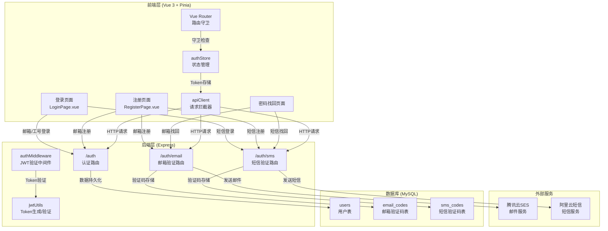
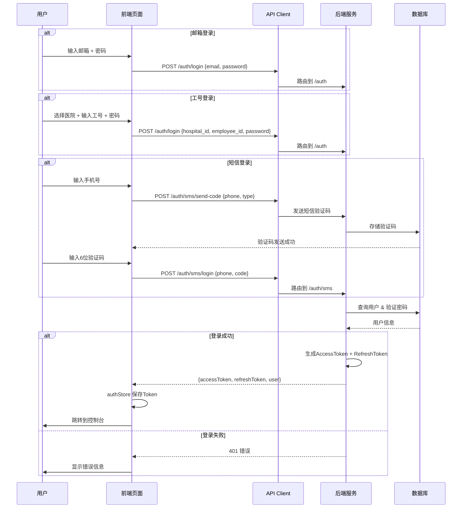
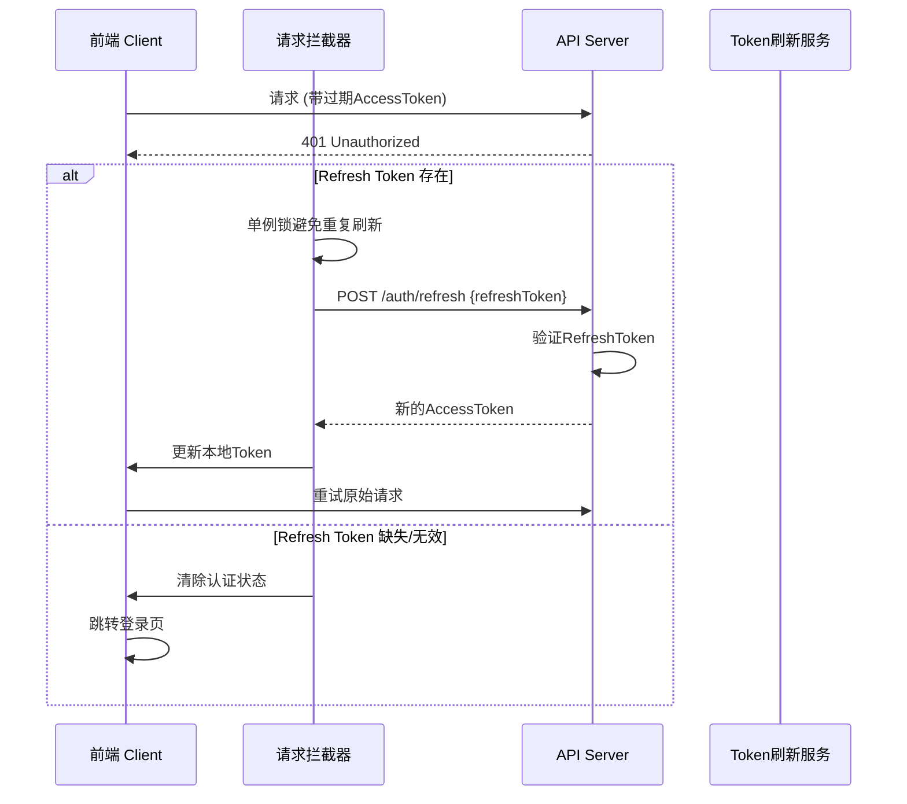

CervixDetectAI 采用基于 JWT 的多通道认证体系，支持邮箱密码登录、工号认证登录和短信验证码快捷登录三种方式。系统通过 Pinia 状态管理维护认证状态，配合路由守卫实现受保护页面的访问控制，并通过腾讯云 SES 和阿里云短信服务提供双通道验证码能力。

## 系统架构



## 认证流程

### 登录流程

系统支持三种登录方式，核心流程如下：



### Token 刷新机制

Access Token 有效期为 1 小时，Refresh Token 有效期为 7 天。当 Access Token 过期时，前端自动使用 Refresh Token 换取新的 Access Token：



Sources: [apiClient.ts](src/services/apiClient.ts#L46-L67)

## 核心组件

### 后端路由模块

| 路由文件 | 路径前缀 | 功能说明 |
|---------|---------|---------|
| `server/routes/auth.js` | `/api/auth` | 邮箱/工号登录、注册、登出、Token刷新 |
| `server/routes/email-auth.js` | `/api/auth/email` | 邮箱验证码发送与验证、密码重置 |
| `server/routes/sms-auth.js` | `/api/auth/sms` | 短信验证码发送与验证、登录注册 |

Sources: [server/routes/auth.js](server/routes/auth.js#L1-L368), [server/routes/email-auth.js](server/routes/email-auth.js#L1-L280), [server/routes/sms-auth.js](server/routes/sms-auth.js#L1-L494)

### 认证中间件

认证中间件 `authenticate` 是保护 API 端点的核心组件，负责 Token 解析、用户状态校验和请求上下文注入：

```javascript
// 验证流程
async function authenticate(req, res, next) {
  // 1. 从请求头提取 Bearer Token
  const token = extractToken(req);
  
  // 2. JWT 签名验证
  const decoded = verifyToken(token);
  
  // 3. Token 类型校验（必须是 access 类型）
  if (decoded.type !== 'access') {
    return res.status(401).json({ message: '令牌类型错误' });
  }
  
  // 4. 用户状态校验（账号未禁用）
  const user = await User.findByPk(decoded.userId);
  if (user.status !== 'active') {
    return res.status(403).json({ message: '账号已被禁用' });
  }
  
  // 5. 注入用户信息到请求对象
  req.user = user;
  next();
}
```

系统还提供 `authorize` 中间件用于角色权限校验，支持 `admin`、`doctor`、`user` 三种角色。

Sources: [server/middleware/auth.js](server/middleware/auth.js#L1-L125)

### JWT Token 工具

```javascript
// Token 配置
JWT_ACCESS_EXPIRATION = '1h'      // 访问令牌有效期
JWT_REFRESH_EXPIRATION = '7d'     // 刷新令牌有效期
JWT_SECRET = process.env.JWT_SECRET

// Access Token Payload
{
  userId: number,
  username: string,
  email: string,
  role: string,
  type: 'access'
}

// Refresh Token Payload
{
  userId: number,
  type: 'refresh'
}
```

Sources: [server/utils/jwt.js](server/utils/jwt.js#L1-L69)

### 前端状态管理

`authStore` 使用 Pinia 管理全局认证状态：

| 状态字段 | 类型 | 说明 |
|---------|------|------|
| `user` | `User \| null` | 当前登录用户信息 |
| `token` | `string \| null` | Access Token |
| `refreshToken` | `string \| null` | Refresh Token |
| `isAuthenticated` | `boolean` | 认证状态标志 |
| `hasInitialized` | `boolean` | 防止路由守卫误判刷新 |

核心方法包括 `login()`、`logout()`、`smsLogin()`、`register()` 等，所有认证方法通过 `_handleAuthRequest` 统一封装，规范化 loading 状态和错误处理。

Sources: [src/stores/authStore.ts](src/stores/authStore.ts#L1-L192)

### 路由守卫

```typescript
Router.beforeEach((to, from, next) => {
  const authStore = useAuthStore();
  
  // 页面刷新时，从 localStorage 恢复认证状态
  if (!authStore.hasInitialized) {
    authStore.initializeAuth();
  }

  // 检查路由是否需要认证
  if (to.matched.some((record) => record.meta.requiresAuth)) {
    if (!authStore.isAuthenticated) {
      next({ path: '/login', query: { redirect: to.fullPath } });
    } else {
      next();
    }
  } else {
    next();
  }
});
```

Sources: [src/router/index.ts](src/router/index.ts#L1-L67)

## 数据模型

### 用户表 (users)

| 字段 | 类型 | 约束 | 说明 |
|-----|------|-----|------|
| `id` | BIGINT | PK, AUTO | 用户ID |
| `username` | VARCHAR(50) | UNIQUE, NOT NULL | 用户名 |
| `email` | VARCHAR(100) | UNIQUE | 邮箱 |
| `password_hash` | VARCHAR(255) | NOT NULL | 密码哈希 (bcrypt) |
| `phone` | VARCHAR(20) | - | 手机号 |
| `hospital_id` | VARCHAR(50) | - | 医院ID |
| `employee_id` | VARCHAR(50) | UNIQUE | 工号 |
| `role` | ENUM | NOT NULL | 角色: admin/doctor/user |
| `status` | ENUM | NOT NULL | 状态: active/disabled |
| `subscription_type` | ENUM | - | 订阅类型 |
| `last_login_at` | DATETIME | - | 最后登录时间 |
| `last_login_ip` | VARCHAR(45) | - | 最后登录IP (IPv6) |

Sources: [server/models/User.js](server/models/User.js#L1-L130)

### 邮箱验证码表 (email_codes)

| 字段 | 类型 | 说明 |
|-----|------|------|
| `email` | VARCHAR(100) | 邮箱地址 |
| `code` | VARCHAR(6) | 6位验证码 |
| `biz_id` | VARCHAR(100) | 腾讯云RequestId |
| `type` | ENUM | 类型: register/reset_password/change_email |
| `status` | ENUM | 状态: pending/used/expired |
| `expires_at` | DATETIME | 过期时间（5分钟后） |

Sources: [server/models/EmailCode.js](server/models/EmailCode.js#L1-L160)

### 短信验证码表 (sms_codes)

| 字段 | 类型 | 说明 |
|-----|------|------|
| `phone` | VARCHAR(20) | 手机号 |
| `code` | VARCHAR(6) | 6位验证码 |
| `biz_id` | VARCHAR(100) | 阿里云业务ID |
| `type` | ENUM | 类型: login/register/reset_password |
| `status` | ENUM | 状态: pending/used/expired |
| `expires_at` | DATETIME | 过期时间 |
| `ip_address` | VARCHAR(45) | 请求IP |

Sources: [server/models/SmsCode.js](server/models/SmsCode.js#L1-L74)

## 验证码机制

### 邮箱验证码

通过腾讯云 SES 服务发送，支持模板化邮件：

| 模板类型 | 用途 | 验证码有效期 |
|---------|------|------------|
| `register` | 注册验证 | 5分钟 |
| `reset_password` | 密码重置 | 5分钟 |
| `change_email` | 邮箱更换 | 5分钟 |

**频率限制**：
- 同一邮箱 60 秒内仅可发送一次
- 同一邮箱每日最多发送 10 次

Sources: [server/routes/email-auth.js](server/routes/email-auth.js#L1-L280), [server/services/email.service.js](server/services/email.service.js#L1-L214)

### 短信验证码

通过阿里云短信服务发送，验证码由服务端生成并存储：

| 验证类型 | 用途 | 有效期 |
|---------|------|------|
| `login` | 短信登录 | 5分钟 |
| `register` | 短信注册 | 5分钟 |
| `reset_password` | 密码重置 | 5分钟 |

**频率限制**：
- 同一手机号 60 秒内仅可发送一次
- 同一手机号每日最多发送 10 次

Sources: [server/routes/sms-auth.js](server/routes/sms-auth.js#L1-L494), [server/services/sms.service.js](server/services/sms.service.js#L1-L128)

## 安全特性

| 安全机制 | 实现位置 | 说明 |
|---------|---------|------|
| 密码加密 | `User.beforeSave` hook | bcrypt 盐值 10 轮哈希 |
| 滑动验证 | `AliCaptcha` 组件 | 阿里云行为验证 |
| 频率限制 | 各认证路由 | 防止暴力破解 |
| Token 类型校验 | `authenticate` 中间件 | 区分 access/refresh |
| 账号锁定 | 用户状态字段 | 禁用账号无法登录 |
| 请求日志 | 登录/登出记录 | 审计追踪 |

Sources: [server/models/User.js](server/models/User.js#L1-L130), [server/middleware/auth.js](server/middleware/auth.js#L1-L125)

## 前端页面组件

| 页面 | 路径 | 功能 |
|-----|------|------|
| `LoginPage.vue` | `/login` | 三通道登录（工号/邮箱/短信） |
| `RegisterPage.vue` | `/register` | 双模式注册（工号/邮箱） |
| `ForgotPasswordPage.vue` | `/forgot-password` | 密码找回（邮箱/短信） |

认证页面统一使用 `AuthSplitLayout` 双栏布局，桌面端展示品牌介绍面板，移动端自适应显示工作台区域。

Sources: [src/pages/LoginPage.vue](src/pages/LoginPage.vue#L1-L944), [src/pages/RegisterPage.vue](src/pages/RegisterPage.vue#L1-L797), [src/pages/ForgotPasswordPage.vue](src/pages/ForgotPasswordPage.vue#L1-L558), [src/components/auth/AuthSplitLayout.vue](src/components/auth/AuthSplitLayout.vue#L1-L206)

## 环境配置

认证系统依赖以下环境变量：

```bash
# JWT 配置
JWT_SECRET=your-secret-key
JWT_ACCESS_EXPIRATION=1h
JWT_REFRESH_EXPIRATION=7d

# 腾讯云 SES (邮件服务)
TENCENT_SECRET_ID=
TENCENT_SECRET_KEY=
TENCENT_SES_REGION=ap-guangzhou
TENCENT_SES_FROM_EMAIL=no-reply@hpvsc.icu
TEMPLATE_ID_REGISTER=123456
TEMPLATE_ID_RESET_PASSWORD=123457

# 阿里云短信
ALIYUN_ACCESS_KEY_ID=
ALIYUN_ACCESS_KEY_SECRET=
ALIYUN_SMS_SIGN_NAME=速通互联验证码
ALIYUN_SMS_TEMPLATE_CODE=100001
```

Sources: [server/.env](server/.env), [server/config/loadEnv.js](server/config/loadEnv.js)

## 后续阅读

- 深入了解 API 权限控制机制：[认证与授权机制](15-ren-zheng-yu-shou-quan-ji-zhi)
- 查看完整 API 端点文档：[认证API](API参考/认证API)
- 了解安全防护措施：[Web攻击防护](Web攻击防护/Web攻击防护)