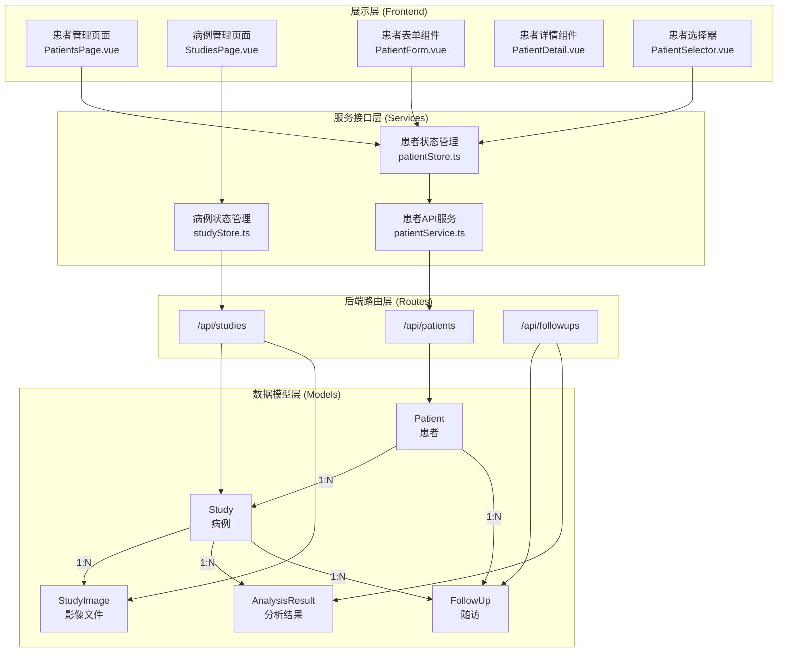
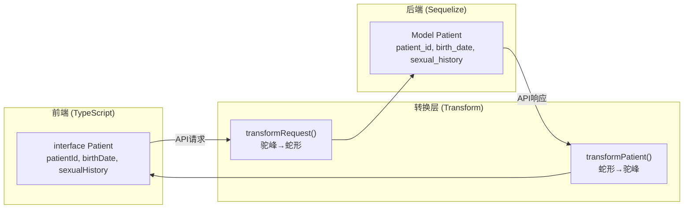
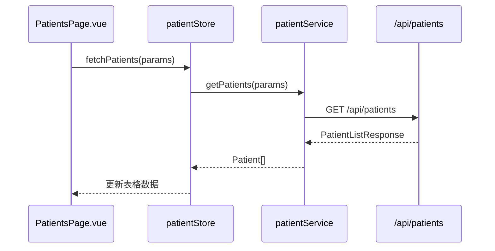
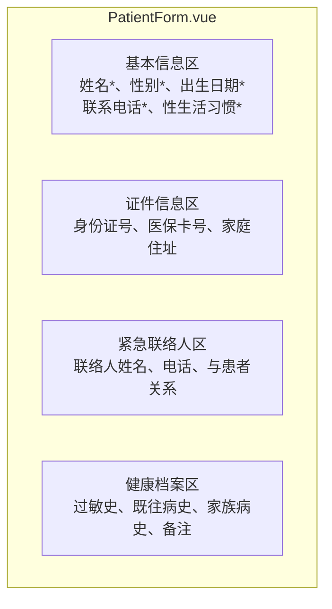
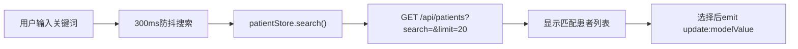

患者与病例管理是宫颈癌筛查AI辅助诊断系统的核心业务模块，负责管理患者基本健康信息与医学影像检查记录，并为后续的AI分析、随访追踪提供数据基础。该模块采用前后端分离架构，通过RESTful API实现数据交互，并使用Pinia进行前端状态管理。

## 系统架构概览

患者与病例管理系统由数据模型层、业务逻辑层、服务接口层和展示层四部分组成。数据模型层定义患者（Patient）、病例（Study）和随访（FollowUp）三个核心实体的数据结构与关联关系；业务逻辑层处理CRUD操作和权限校验；服务接口层暴露统一的RESTful API；展示层提供患者管理页面和病例管理页面等UI组件。

患者与病例之间存在一对多关联关系：一个患者可以拥有多个检查病例，而每个病例仅属于一个患者。随访计划与患者和病例分别存在关联，可以在随访时指定关联的具体检查病例。

Sources: [server/models/index.js](server/models/index.js#L21-L30) [src/pages/PatientsPage.vue](src/pages/PatientsPage.vue#L1-L50) [src/pages/StudiesPage.vue](src/pages/StudiesPage.vue#L1-L50)

## 数据模型设计

### 患者模型（Patient）

患者模型存储患者的基本信息、联系方式、健康档案和紧急联络人信息。系统通过`patient_id`字段生成唯一标识符，采用时间戳加随机数的格式（`P{timestamp}{random}`）。

| 字段名 | 数据类型 | 说明 | 约束 |
|--------|----------|------|------|
| id | BIGINT | 主键 | autoIncrement |
| patient_id | STRING(50) | 患者唯一编号 | unique |
| name | STRING(100) | 姓名 | 必填 |
| gender | ENUM | 性别（male/female/other） | 必填 |
| birth_date | DATEONLY | 出生日期 | 可选 |
| phone | STRING(20) | 联系电话 | 可选 |
| sexual_history | ENUM | 性生活史 | 默认none |
| id_card | STRING(50) | 身份证号 | 加密存储 |
| medical_card_no | STRING(50) | 医保卡号 | 可选 |
| address | STRING(500) | 家庭住址 | 可选 |
| emergency_contact | STRING(100) | 紧急联络人 | 可选 |
| emergency_phone | STRING(20) | 紧急联络电话 | 可选 |
| emergency_relation | STRING(50) | 紧急联系人关系 | 可选 |
| allergy_history | TEXT | 过敏史 | 可选 |
| medical_history | TEXT | 既往病史 | 可选 |
| family_history | TEXT | 家族病史 | 可选 |
| notes | TEXT | 备注信息 | 可选 |
| created_by | BIGINT | 创建用户ID | 外键关联users表 |

性生活史（sexual_history）采用枚举类型，包含六个选项：无性生活、规律性生活、不规律性生活、多个性伴侣、过早开始性生活（<18岁）和其他。这一字段对于宫颈癌筛查风险评估具有重要意义。

Sources: [server/models/Patient.js](server/models/Patient.js#L1-L136) [src/services/patientService.ts](src/services/patientService.ts#L1-L50)

### 病例模型（Study）

病例模型记录每次医学检查的详细信息，包括检查类型、症状描述、临床诊断和检查状态。病例编号（study_id）采用日期格式（`S{date}{sequence}`），例如`S20260326{000001}`。

| 字段名 | 数据类型 | 说明 | 约束 |
|--------|----------|------|------|
| id | BIGINT | 主键 | autoIncrement |
| study_id | STRING(50) | 病例唯一编号 | unique |
| patient_id | BIGINT | 患者ID | 必填，外键 |
| user_id | BIGINT | 创建用户ID | 外键（可为null） |
| study_date | DATE | 检查日期 | 必填 |
| study_type | STRING(50) | 检查类型 | 必填 |
| description | TEXT | 检查描述 | 可选 |
| department | STRING(100) | 科室 | 可选 |
| doctor_name | STRING(100) | 医生姓名 | 可选 |
| clinical_diagnosis | TEXT | 临床诊断 | 可选 |
| symptoms | TEXT | 症状描述 | 可选 |
| status | ENUM | 状态 | pending/uploaded/processing/completed/failed |
| priority | ENUM | 优先级 | normal/urgent/emergency |
| uploaded_at | DATE | 上传时间 | 默认NOW |

病例状态（status）贯穿整个分析流程：`pending`表示等待上传影像；`uploaded`表示影像已上传；`processing`表示分析进行中；`completed`表示分析完成；`failed`表示分析失败。

Sources: [server/models/Study.js](server/models/Study.js#L1-L132) [src/types/study.ts](src/types/study.ts#L1-L38)

### 随访模型（FollowUp）

随访模型支持创建、管理宫颈癌筛查后的定期随访计划。系统根据最近一次分析结果的风险等级自动推荐随访间隔：高风险或极高风险建议1个月后复查；中等风险建议3个月后复查；低风险建议6个月后复查。

| 字段名 | 数据类型 | 说明 |
|--------|----------|------|
| follow_up_id | STRING(50) | 随访编号 |
| patient_id | BIGINT | 患者ID |
| study_id | BIGINT | 关联病例ID（可选） |
| created_by | BIGINT | 创建医生ID |
| assigned_doctor_id | BIGINT | 分配医生ID |
| planned_date | DATEONLY | 计划日期 |
| recommended_interval_months | INTEGER | 推荐间隔月数 |
| risk_level_snapshot | ENUM | 风险等级快照 |
| ai_flagged_high_attention | BOOLEAN | AI标记高关注 |
| doctor_marked_high_attention | BOOLEAN | 医生标记高关注 |
| status | ENUM | 状态（pending/overdue/completed/cancelled） |

Sources: [server/models/FollowUp.js](server/models/FollowUp.js#L1-L153) [server/routes/followups.js](server/routes/followups.js#L70-L100)

## 前后端数据映射

前端采用TypeScript进行类型定义，后端使用Sequelize ORM框架。由于命名规范差异（前端驼峰、后端蛇形），系统实现了自动转换逻辑。

前端`Patient`接口定义了完整的数据结构，包含所有可选字段的健康档案信息。`transformPatient`函数负责将后端返回的蛇形命名数据转换为驼峰命名，而`transformRequest`函数则执行反向转换以适配后端API的请求格式。

Sources: [src/services/patientService.ts](src/services/patientService.ts#L90-L145)

## API接口规范

### 患者管理API

| 方法 | 路径 | 功能 | 认证 |
|------|------|------|------|
| POST | /api/patients | 创建患者 | 必填 |
| GET | /api/patients | 获取患者列表（分页） | 必填 |
| GET | /api/patients/:id | 获取患者详情 | 必填 |
| PUT | /api/patients/:id | 更新患者信息 | 必填 |
| DELETE | /api/patients/:id | 删除患者（软删除） | 必填 |
| GET | /api/patients/:id/studies | 获取患者的所有病例 | 必填 |

创建患者时，系统通过`beforeValidate` Hook自动生成`patient_id`。若请求中包含`id_card`（身份证号），系统会检查是否已存在重复记录，避免同一身份证号对应多个患者档案。

Sources: [server/routes/patients.js](server/routes/patients.js#L1-L378)

### 病例管理API

| 方法 | 路径 | 功能 | 认证 |
|------|------|------|------|
| POST | /api/studies | 创建病例 | 必填 |
| POST | /api/studies/:id/images | 上传影像文件 | 必填 |
| GET | /api/studies | 获取病例列表（分页） | 必填 |
| GET | /api/studies/:id | 获取病例详情 | 必填 |
| PUT | /api/studies/:id | 更新病例信息 | 必填 |
| DELETE | /api/studies/:id | 删除病例（软删除） | 必填 |
| DELETE | /api/studies/:id/images/:imageId | 删除影像文件 | 必填 |

病例编号采用日期加序列号的格式生成，确保每日病例编号连续且唯一。上传影像时支持JPEG、PNG、TIFF、BMP格式，单文件限制20MB，每次最多上传10个文件。首张上传的影像自动设为主图（is_primary=true），主图用于AI分析的默认输入。

Sources: [server/routes/studies.js](server/routes/studies.js#L1-L629) [src/stores/studyStore.ts](src/stores/studyStore.ts#L1-L100)

## 前端状态管理

### 患者状态管理（patientStore）

患者状态管理使用Pinia定义 store，支持患者列表的获取、详情加载、创建、更新和删除操作。Store实现了缓存机制：当访问患者详情时，优先从本地缓存获取，避免重复请求。

Store的`fetchPatients`方法接收分页和搜索参数，返回标准化的患者列表响应。每次创建新患者后，数据会立即添加到本地列表并更新总数统计，无需重新请求API。

Sources: [src/stores/patientStore.ts](src/stores/patientStore.ts#L1-L244) [src/services/patientService.ts](src/services/patientService.ts#L150-L200)

### 病例状态管理（studyStore）

病例状态管理提供病例的CRUD操作以及分析结果的更新。创建病例时可以同时上传影像文件，系统会自动创建对应的分析任务并更新病例状态为`processing`。

病例状态与最新任务状态存在联动关系：当创建分析任务后，病例的`latestTaskStatus`更新为`PENDING`；分析完成后自动更新为`SUCCESS`并关联分析结果。Store提供了`updateStudyAnalysisResult`方法用于接收分析服务推送的结果。

Sources: [src/stores/studyStore.ts](src/stores/studyStore.ts#L50-L200)

## 前端组件架构

### 患者表单组件（PatientForm）

患者表单组件提供完整的新增和编辑功能，按业务逻辑分为四个区域：基本信息、证件信息、紧急联络人和健康档案。

表单使用q-input组件构建输入框，日期选择器集成在出生日期字段上。必填字段通过`:rules`属性设置验证规则，包括姓名、性别、出生日期、联系电话和性生活习惯。证件信息和健康档案为可选填写项。

Sources: [src/components/patients/PatientForm.vue](src/components/patients/PatientForm.vue#L1-L278)

### 患者详情组件（PatientDetail）

患者详情组件以只读方式展示患者完整信息，根据是否有健康档案数据动态显示对应区域。组件接收`Patient`类型prop，通过计算属性`hasHealthInfo`判断是否渲染健康档案区块。

Details组件采用分栏布局，标签使用浅灰色字体，内容使用深色加粗字体展示。深色模式下自动切换为对应的语义化颜色变量，确保视觉效果一致性。

Sources: [src/components/patients/PatientDetail.vue](src/components/patients/PatientDetail.vue#L1-L210)

### 患者选择器组件（PatientSelector）

患者选择器组件用于在其他页面（如新建病例页）快速选择已有患者。组件集成搜索功能，支持输入关键词实时过滤患者列表。

选择器提供实时搜索和快捷新增两个入口：搜索时通过API获取最多20条匹配结果；用户也可以直接点击"快捷新增患者"按钮触发新增流程，无需跳转到患者管理页面。

Sources: [src/components/patients/PatientSelector.vue](src/components/patients/PatientSelector.vue#L1-L133)

## 权限控制策略

系统采用基于角色的权限控制（RBAC）策略，普通用户和管理员拥有不同的数据访问范围。

| 操作 | 普通用户 | 管理员 |
|------|----------|--------|
| 查看患者列表 | 全部患者 | 全部患者 |
| 创建患者 | 仅为自己创建 | 无限制 |
| 更新患者 | 仅更新自己创建的 | 无限制 |
| 删除患者 | 仅删除自己创建的 | 无限制 |
| 创建病例 | 仅为自己创建的患者创建 | 无限制 |
| 查看病例 | 仅查看自己创建的+匿名病例 | 全部 |
| 上传影像 | 仅为自己创建的病例上传 | 无限制 |

当前代码中患者列表的权限检查已被注释，实际运行时所有用户均可查看全部患者记录，便于医疗机构内部的协作会诊场景。

Sources: [server/routes/patients.js](server/routes/patients.js#L75-L80) [server/routes/studies.js](server/routes/studies.js#L60-L70)

## 关联文档

患者与病例管理模块与其他功能模块存在紧密关联。在完成本模块的学习后，建议继续阅读以下文档：

- **[用户认证系统](12-yong-hu-ren-zheng-xi-tong)**：了解认证中间件如何保护患者和病例API
- **[订阅与支付系统](14-ding-yue-yu-zhi-fu-xi-tong)**：了解套餐限额如何影响可创建的患者和病例数量
- **[随访管理与站内通知](13-huan-zhe-yu-bing-li-guan-li)**：与随访模块的集成方式已在本文档中详述