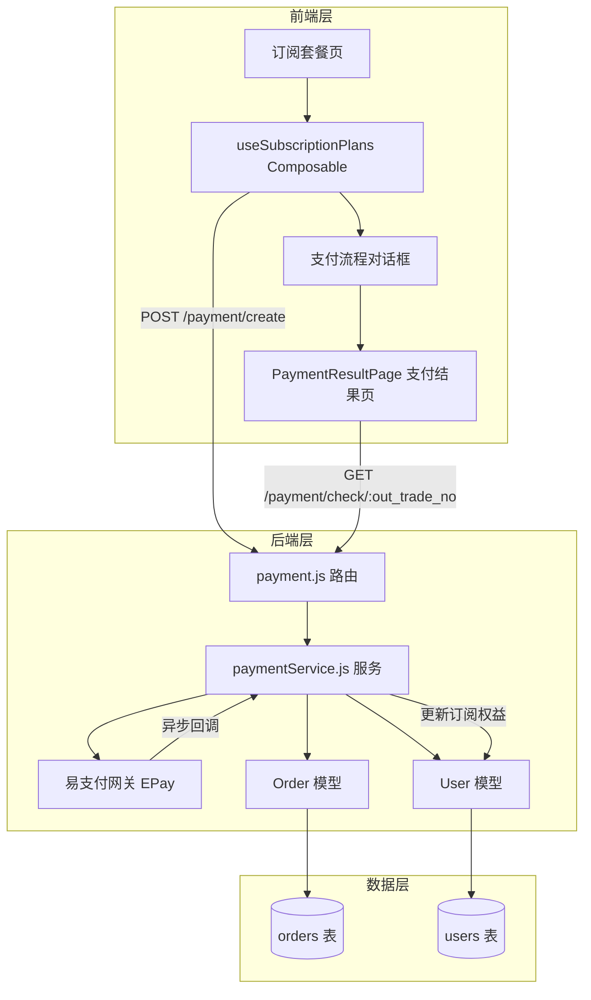
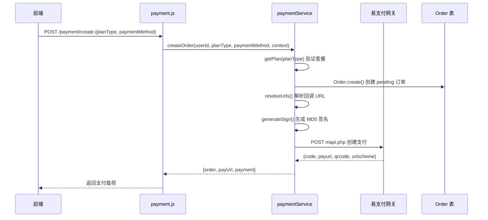
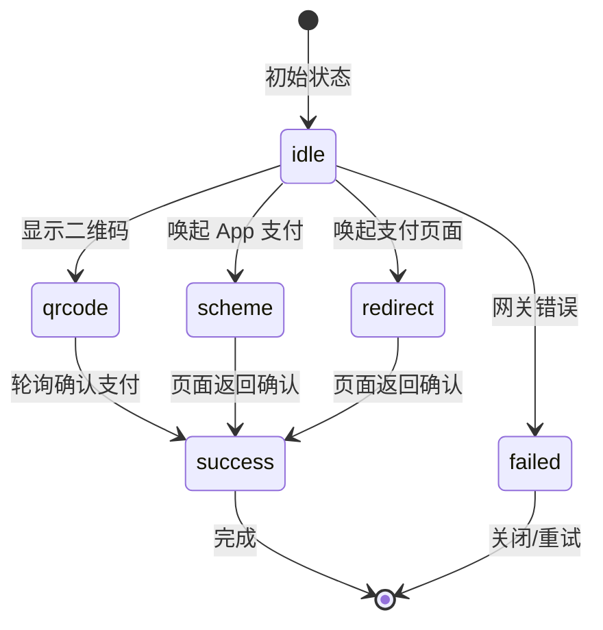

本文档详细阐述 CervixDetectAI 系统中订阅套餐、支付网关集成与权益发放的完整技术架构，涵盖后端支付服务、前端订阅管理 composable、订单数据模型以及支付流程状态机设计。

## 系统架构概览

订阅与支付系统采用前后端分离架构，后端通过 [paymentService.js](server/services/paymentService.js#L1-L498) 处理与第三方支付网关（易支付/EPay）的通信，前端通过 [useSubscriptionPlans.ts](src/composables/useSubscriptionPlans.ts#L1-L1049) 统一管理套餐展示、支付流程与权益状态。整个系统支持支付宝、微信支付和银行卡三种支付渠道，并实现了完整的订单生命周期管理。



Sources: [server/routes/payment.js](server/routes/payment.js#L1-L290), [server/services/paymentService.js](server/services/paymentService.js#L1-L498), [src/composables/useSubscriptionPlans.ts](src/composables/useSubscriptionPlans.ts#L1-L1049)

## 套餐体系设计

### 套餐层级架构

系统采用双层套餐体系，分为基础套餐（Basic）和顶级套餐（Premium），分别适配不同规模的医疗机构场景。基础套餐覆盖三种核心检测方式，适合门诊常规筛查；顶级套餐则补齐 HPV 分型检测、p16/Ki67 双染、随访管理、多格式报告与自定义水印等高阶能力。

```typescript
// 套餐定义结构 (demoSubscriptionCatalog.ts)
export interface DemoOffer {
  code: string;              // 套餐代码
  tier: DemoPlanTier;        // 'basic' | 'premium'
  billingMode: DemoBillingMode; // 'duration' | 'usage'
  durationDays?: number;      // 周期天数（duration 模式）
  amount: number;            // 价格
  originalAmount?: number;   // 原价（用于显示折扣）
  planName: string;           // 套餐名称
  autoRenewHint?: string;    // 自动续费提示
  featureSummary: string[];  // 功能摘要
}
```

Sources: [src/constants/demoSubscriptionCatalog.ts](src/constants/demoSubscriptionCatalog.ts#L1-L393)

### 套餐分类明细

| 套餐层级 | 计费模式 | 套餐代码 | 价格（元） | 周期 | 权益特点 |
|---------|---------|---------|-----------|------|---------|
| 基础套餐 | 按次试用 | `basic-trial-once` | 0.1 | 单次 | 三种检测方式 + 标准 PDF 报告 |
| 基础套餐 | 按次正式 | `basic-formal-once` | 9.9 | 单次 | 三种检测方式 + 标准 PDF 报告 |
| 基础套餐 | 连续包月 | `basic-monthly-auto` | 888 | 30 天 | 到期自动续费 |
| 基础套餐 | 一年版 | `basic-yearly` | 9,888 | 365 天 | 省 ¥1,872 |
| 顶级套餐 | 连续包月 | `premium-monthly-auto` | 999 | 30 天 | 五种检测方式 + 随访管理 |
| 顶级套餐 | 半年版 | `premium-half-year` | 6,699 | 180 天 | 省 ¥981 |
| 顶级套餐 | 一年版 | `premium-yearly` | 12,699 | 365 天 | 省 ¥699 |

Sources: [src/constants/demoSubscriptionCatalog.ts](src/constants/demoSubscriptionCatalog.ts#L200-L393), [server/services/paymentService.js](server/services/paymentService.js#L7-L66)

## 后端支付服务

### 支付服务核心类

`PaymentService` 是后端支付处理的核心类，负责订单创建、支付网关通信、异步通知处理与权益发放。该服务通过单例模式导出，确保全局共享同一配置实例。

```javascript
class PaymentService {
  constructor() {
    this.pid = process.env.EPAY_PID;           // 商户号
    this.key = process.env.EPAY_KEY;             // 商户密钥
    this.apiUrl = normalizeGatewayBaseUrl(process.env.EPAY_API_URL);
    this.notifyUrl = process.env.EPAY_NOTIFY_URL;
    this.returnUrl = process.env.EPAY_RETURN_URL;
    this.frontendResultUrl = process.env.FRONTEND_RESULT_URL;
    this.requestTimeout = parseInt(process.env.EPAY_TIMEOUT_MS || '') || 15000;
  }
}
```

Sources: [server/services/paymentService.js](server/services/paymentService.js#L92-L104)

### 订单创建流程

订单创建是支付流程的起点，涉及参数校验、URL 解析、签名生成与网关下单四个关键步骤。



Sources: [server/services/paymentService.js](server/services/paymentService.js#L235-L325), [server/routes/payment.js](server/routes/payment.js#L44-L75)

### 签名验证机制

支付安全通过 MD5 签名机制保障，所有请求参数按字典序排列后与商户密钥拼接进行哈希运算。

```javascript
generateSign(params) {
  const keys = Object.keys(params).sort();
  const signStr = keys
    .filter((key) => {
      const value = params[key];
      return key !== 'sign' && key !== 'sign_type' 
        && value !== '' && value !== undefined && value !== null;
    })
    .map((key) => `${key}=${params[key]}`)
    .join('&');

  return crypto
    .createHash('md5')
    .update(`${signStr}${this.key}`)
    .digest('hex');
}
```

Sources: [server/services/paymentService.js](server/services/paymentService.js#L161-L181)

### 权益发放机制

支付成功后调用 `fulfillBenefits` 方法，在数据库事务中完成订单状态更新与用户权益发放。该方法采用行级锁防止并发重复发放。

```javascript
async fulfillBenefits(order, tradeNo, options = {}) {
  const transaction = await sequelize.transaction();
  
  try {
    // 加锁查询订单
    const lockedOrder = await Order.findOne({
      where: { id: order.id },
      transaction,
      lock: transaction.LOCK.UPDATE,
    });
    
    // 权益发放逻辑
    user.remaining_credits = (user.remaining_credits || 0) + (plan.credits || 0);
    
    // 订阅模式：延长有效期
    if (plan.type === 'subscription' && plan.days) {
      const newExpiry = new Date(startDate.getTime() + plan.days * 24 * 60 * 60 * 1000);
      user.subscription_type = lockedOrder.plan_type;
      user.subscription_expires_at = newExpiry;
    }
    
    await transaction.commit();
    return lockedOrder;
  } catch (error) {
    await transaction.rollback();
    throw error;
  }
}
```

Sources: [server/services/paymentService.js](server/services/paymentService.js#L399-L471)

## 数据模型设计

### Order 订单模型

订单模型记录每一笔支付交易的核心信息，包含用户关联、金额、状态与权益字段。

```javascript
const Order = sequelize.define('Order', {
  id: { type: DataTypes.BIGINT, primaryKey: true, autoIncrement: true },
  user_id: { type: DataTypes.BIGINT, allowNull: false },
  out_trade_no: { type: DataTypes.STRING(64), allowNull: false, unique: true },  // 商户订单号
  trade_no: { type: DataTypes.STRING(64), allowNull: true },                     // 第三方交易号
  type: { type: DataTypes.STRING(20), allowNull: false },                         // alipay/wxpay/bank
  name: { type: DataTypes.STRING(127), allowNull: false },                        // 套餐名称
  money: { type: DataTypes.DECIMAL(10, 2), allowNull: false },                     // 金额
  plan_type: { type: DataTypes.STRING(50), allowNull: false },                    // 套餐代码
  credits: { type: DataTypes.INTEGER, defaultValue: 0 },                           // 获得点数
  status: { type: DataTypes.ENUM('pending', 'paid', 'failed', 'expired'), defaultValue: 'pending' },
  pay_time: { type: DataTypes.DATE, allowNull: true },
  notify_data: { type: DataTypes.TEXT, allowNull: true },                         // 回调原始数据
});
```

Sources: [server/models/Order.js](server/models/Order.js#L1-L80)

### User 用户订阅字段

用户模型通过以下字段关联订阅权益状态：

```javascript
subscription_type: {
  type: DataTypes.ENUM('none', 'monthly', 'yearly', 'package'),
  defaultValue: 'none',
},
subscription_expires_at: {
  type: DataTypes.DATE,
  allowNull: true,  // 订阅到期时间（包时模式）
},
remaining_credits: {
  type: DataTypes.INTEGER,
  defaultValue: 0,  // 剩余点数（按次模式）
}
```

Sources: [server/models/User.js](server/models/User.js#L55-L65)

## 前端订阅管理

### Composable 核心状态

`useSubscriptionPlans` 是前端订阅管理的核心 composable，封装了套餐数据、支付流程、状态轮询与本地持久化逻辑。

```typescript
export function useSubscriptionPlans() {
  // 套餐数据
  const demoPlanGroups = [demoSubscriptionCatalog.basic, demoSubscriptionCatalog.premium];
  const selectedOfferByTier = ref<Record<DemoPlanTier, string>>({
    basic: 'basic-monthly-auto',
    premium: 'premium-monthly-auto',
  });
  
  // 支付流程状态
  const paymentDisplayState = ref<PaymentDisplayState>('idle');
  const paymentGatewayData = ref<PaymentGatewayData | null>(null);
  const paymentStep = ref(1);
  
  // 轮询控制
  const paymentPollTimer: number | null = null;
  const PAYMENT_POLL_INTERVAL_MS = 2500;
  const MAX_PAYMENT_POLL_COUNT = 40;
  // ... 核心方法
}
```

Sources: [src/composables/useSubscriptionPlans.ts](src/composables/useSubscriptionPlans.ts#L75-L150)

### 支付流程状态机

前端支付流程通过 `paymentDisplayState` 状态机管理，涵盖从下单到完成的完整生命周期：



Sources: [src/composables/useSubscriptionPlans.ts](src/composables/useSubscriptionPlans.ts#L238-L310)

### 支付二维码生成

针对扫码支付场景，前端使用 `qrcode` 库生成支付二维码：

```typescript
const prepareQrCode = async (content: string) => {
  paymentQrCodeDataUrl.value = await QRCode.toDataURL(content, {
    width: 280,
    margin: 1,
    color: {
      dark: '#144768',
      light: '#ffffff',
    },
  });
};
```

Sources: [src/composables/useSubscriptionPlans.ts](src/composables/useSubscriptionPlans.ts#L825-L835)

### 状态持久化与会话恢复

为支持支付过程中页面刷新或切换后继续支付，composable 将支付状态持久化到 SessionStorage：

```typescript
const PENDING_PAYMENT_MAX_AGE_MS = 2 * 60 * 60 * 1000; // 2小时

const persistPendingPaymentState = (payment: PaymentGatewayData) => {
  setItem(
    STORAGE_KEYS.PENDING_PAYMENT_STATE,
    {
      payment,
      paymentMethod: selectedPaymentMethod.value,
      paymentInfo: paymentInfo.value,
      createdAt: Date.now(),
    },
    'session',  // SessionStorage
  );
};

const readPendingPaymentState = (): PendingPaymentState | null => {
  const savedState = getItem<PendingPaymentState>(
    STORAGE_KEYS.PENDING_PAYMENT_STATE, null, 'session'
  );
  // 检查过期
  if (Date.now() - Number(savedState?.createdAt || 0) > PENDING_PAYMENT_MAX_AGE_MS) {
    removeItem(STORAGE_KEYS.PENDING_PAYMENT_STATE, 'session');
    return null;
  }
  return savedState;
};
```

Sources: [src/composables/useSubscriptionPlans.ts](src/composables/useSubscriptionPlans.ts#L520-L575)

## 支付结果处理

### 支付结果页轮询机制

[PaymentResultPage.vue](src/pages/PaymentResultPage.vue#L1-L469) 是支付完成后的结果展示页，通过轮询机制确认支付状态：

```typescript
const MAX_POLL_COUNT = 15;

onMounted(() => {
  if (!outTradeNo) {
    status.value = 'failed';
    return;
  }

  void checkStatus();  // 立即查询一次

  // 启动轮询
  pollTimer = setInterval(() => {
    pollCount++;
    if (pollCount > MAX_POLL_COUNT) {
      clearInterval(pollTimer);
      status.value = 'failed';
      errorMessage.value = '查询超时，请手动刷新';
      return;
    }
    void checkStatus();
  }, 2000);
});
```

Sources: [src/pages/PaymentResultPage.vue](src/pages/PaymentResultPage.vue#L136-L170)

### 套餐权益文案映射

支付结果页通过预定义映射表将套餐代码转换为用户可读权益描述：

```typescript
const planBenefitTextMap: Record<string, string> = {
  monthly: '月度订阅会员（30天）',
  yearly: '年度订阅会员（365天）',
  'basic-monthly-auto': '基础套餐连续包月（30天）',
  'basic-yearly': '基础套餐一年版（365天）',
  'premium-monthly-auto': '顶级套餐连续包月（30天）',
  'premium-yearly': '顶级套餐一年版（365天）',
  // ...
};

const getBenefitText = (order: any) => {
  if (typeof order.plan_type === 'string' && planBenefitTextMap[order.plan_type]) {
    return planBenefitTextMap[order.plan_type];
  }
  return `${order.credits}次 AI分析点数`;
};
```

Sources: [src/pages/PaymentResultPage.vue](src/pages/PaymentResultPage.vue#L86-L116)

## API 端点参考

| 端点 | 方法 | 认证 | 功能 |
|------|------|------|------|
| `/payment/create` | POST | 必须 | 创建支付订单 |
| `/payment/check/:out_trade_no` | GET | 不需要 | 公开查询订单状态（支付结果页） |
| `/payment/status/:out_trade_no` | GET | 必须 | 认证后查询订单详情 |
| `/payment/orders` | GET | 必须 | 获取用户订单列表 |
| `/payment/notify` | GET/POST | 不需要 | 支付网关异步回调 |
| `/payment/return` | GET | 不需要 | 支付网关同步跳转 |

Sources: [server/routes/payment.js](server/routes/payment.js#L1-L290)

## 环境配置

支付网关相关环境变量在 [server/.env](server/.env#L65-L74) 中配置：

```bash
# 易支付配置
EPAY_PID=10002                    # 商户号
EPAY_KEY=9XvQOE6Cp0Na1OrW2sEL    # 商户密钥
EPAY_API_URL=https://mpay.qzz.io/xpay/epay/  # 支付网关地址

# 回调地址（需公网可达）
EPAY_NOTIFY_URL=http://hpvsc.icu/api/payment/notify   # 异步回调
EPAY_RETURN_URL=http://hpvsc.icu/api/payment/return   # 同步跳转
FRONTEND_RESULT_URL=http://hpvsc.icu/#/payment/result # 前端结果页
```

Sources: [server/.env](server/.env#L65-L74)

## 后续学习路径

- [订阅与支付功能.md](6-zu-jian-yu-ye-mian-jia-gou) — 前端组件架构中订阅相关组件的详细设计
- [API接口规范](16-apijie-kou-gui-fan) — 完整的 API 端点参考与响应格式
- [用户认证系统](12-yong-hu-ren-zheng-xi-tong) — 用户认证机制如何与订阅权益联动