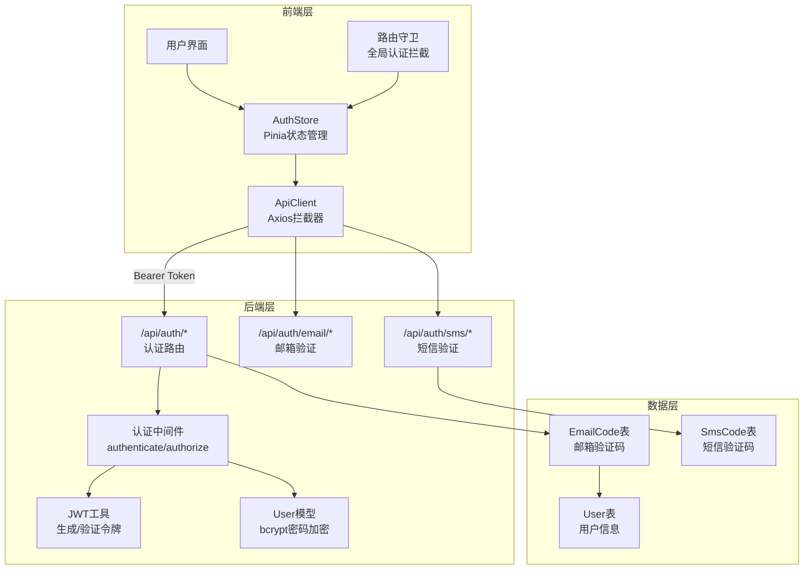
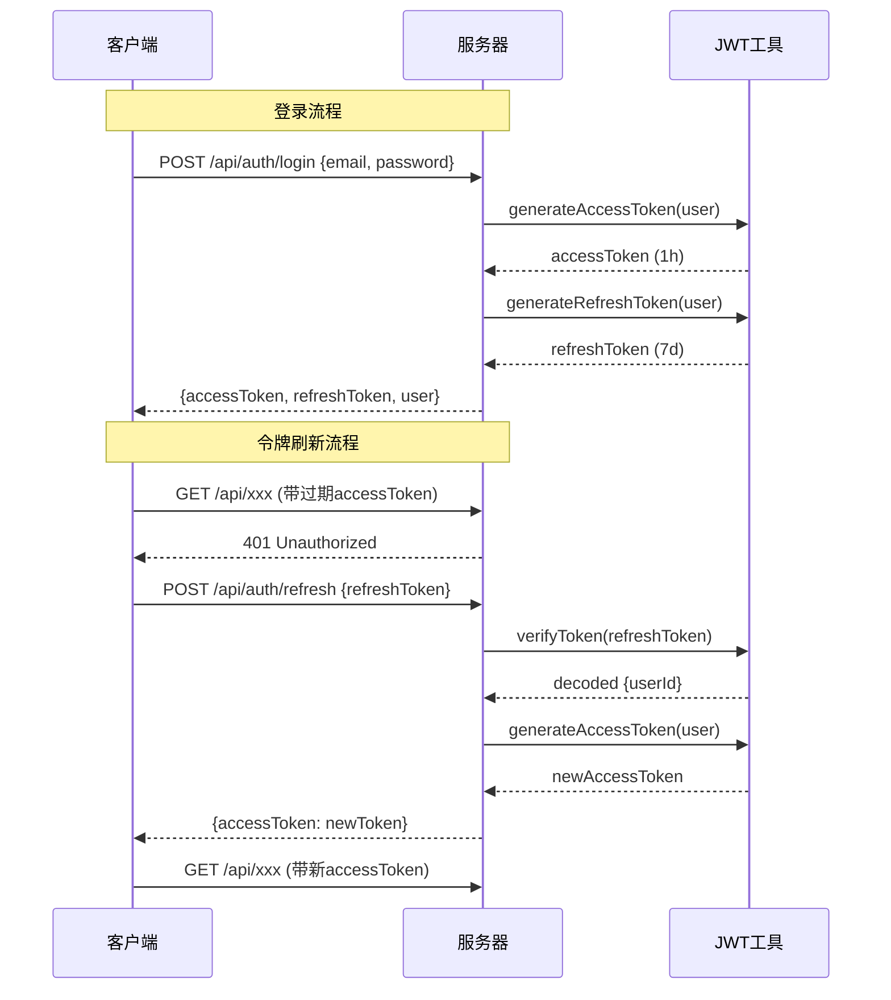
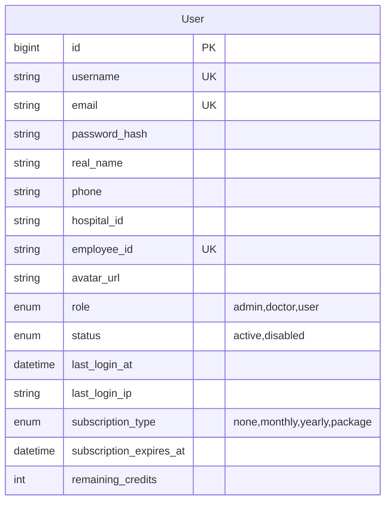
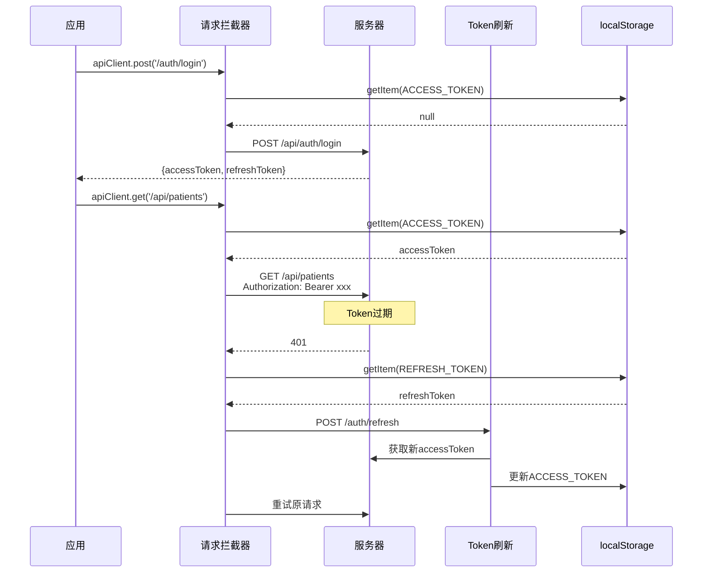
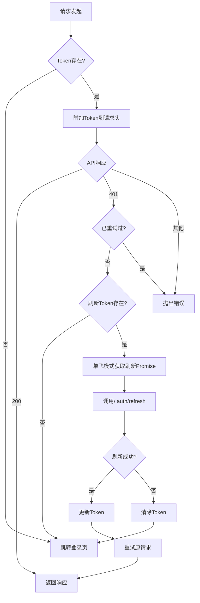

本文档详细阐述 CervixDetectAI 系统的认证与授权机制，涵盖后端 JWT 令牌体系、多因素认证流程、前端状态管理及 API 安全拦截的完整实现。

## 系统架构概览

该系统采用 **JWT (JSON Web Token)** 实现无状态认证，支持三种登录方式：邮箱密码登录、工号登录、短信验证码登录，并配合邮箱/短信验证码实现用户注册与密码重置功能。



## 后端认证机制

### JWT 令牌体系

系统使用双令牌机制实现安全的无状态认证：**访问令牌 (Access Token)** 用于 API 请求认证，**刷新令牌 (Refresh Token)** 用于获取新的访问令牌。

访问令牌有效期为 **1 小时**，包含用户身份信息（userId、username、email、role），刷新令牌有效期为 **7 天**，仅包含 userId 用于识别用户身份。 [server/utils/jwt.js](server/utils/jwt.js#L1-L69)



**JWT 核心实现**：`jwt.sign()` 创建令牌，`jwt.verify()` 验证令牌有效性，从请求头 `Authorization: Bearer <token>` 提取令牌。

### 认证中间件

系统提供三层认证中间件：**authenticate**（强制认证）、**authorize**（角色授权）、**optionalAuth**（可选认证）。 [server/middleware/auth.js](server/middleware/auth.js#L1-L125)

| 中间件 | 功能 | 使用场景 |
|--------|------|----------|
| `authenticate` | 验证 JWT Token 并加载用户信息 | 需要强制登录的 API 路由 |
| `authorize(...roles)` | 验证用户角色权限 | 管理员/医生专属功能 |
| `optionalAuth` | 有 Token 则验证，无则放行 | 公开接口中的用户识别 |

**authenticate 中间件执行流程**：提取 Token → 验证 Token → 检查 Token 类型（必须是 'access'）→ 查询用户 → 检查用户状态 → 附加用户信息到 `req.user`。

**authorize 中间件**接收角色数组参数，例如 `authorize('admin', 'doctor')` 允许管理员和医生角色访问，返回 403 状态码表示权限不足。

### 密码加密机制

用户密码通过 **bcrypt** 算法加密，salt 轮次为 10。User 模型使用 Sequelize Hook 在创建或更新用户前自动加密密码。 [server/models/User.js](server/models/User.js#L99-L118)

```javascript
// 密码验证方法
User.prototype.validatePassword = async function(password) {
  return await bcrypt.compare(password, this.password_hash);
};

// 保存前自动加密
User.beforeSave(async (user) => {
  if (user._changed && user._changed.has('password_hash') && 
      !user.password_hash.startsWith('$2')) {
    user.password_hash = await bcrypt.hash(user.password_hash, 10);
  }
});
```

### 用户数据模型

User 模型包含以下核心字段：用户标识（id、username）、认证信息（email、password_hash、phone）、机构信息（hospital_id、employee_id）、权限控制（role、status）、会话追踪（last_login_at、last_login_ip）、订阅信息（subscription_type、subscription_expires_at、remaining_credits）。



## 认证 API 端点

系统提供完整的认证 RESTful API，所有接口均返回统一响应格式 `{success, message, data}`。

### 核心认证接口

| 接口 | 方法 | 功能 | 认证要求 |
|------|------|------|----------|
| `/api/auth/register` | POST | 用户注册 | 无 |
| `/api/auth/login` | POST | 登录（邮箱/工号） | 无 |
| `/api/auth/refresh` | POST | 刷新令牌 | 无 |
| `/api/auth/logout` | POST | 登出 | 需要 |
| `/api/auth/me` | GET | 获取当前用户 | 需要 |

**注册接口**支持邮箱或工号二选一注册，配合邮箱验证码完成验证。注册成功后自动发送欢迎邮件，密码长度至少 6 位。 [server/routes/auth.js](server/routes/auth.js#L17-L130)

**登录接口**支持两种方式：邮箱登录（`{email, password}`）和工号登录（`{hospital_id, employee_id, password}`），登录成功后更新 `last_login_at` 字段。 [server/routes/auth.js](server/routes/auth.js#L170-L235)

### 邮箱验证码接口

| 接口 | 方法 | 功能 | 频率限制 |
|------|------|------|----------|
| `/api/auth/email/send-code` | POST | 发送验证码 | 60秒/次，10次/天 |
| `/api/auth/email/verify` | POST | 验证验证码 | - |
| `/api/auth/email/reset-password` | POST | 邮箱重置密码 | - |

邮箱验证码有效期为 **5 分钟**，存储在 `EmailCode` 表中，包含邮件标识、IP 地址、User-Agent 等审计字段。 [server/routes/email-auth.js](server/routes/email-auth.js#L1-L100)

### 短信验证码接口

| 接口 | 方法 | 功能 | 频率限制 |
|------|------|------|----------|
| `/api/auth/sms/send-code` | POST | 发送短信验证码 | 60秒/次，10次/天 |
| `/api/auth/sms/login` | POST | 短信登录 | - |
| `/api/auth/sms/register` | POST | 短信注册 | - |
| `/api/auth/sms/reset-password` | POST | 短信重置密码 | - |

短信验证码同样有效期为 **5 分钟**，短信内容由阿里云短信服务生成。 [server/routes/sms-auth.js](server/routes/sms-auth.js#L1-L120)

## 前端认证实现

### 认证状态管理

Pinia 的 authStore 集中管理认证状态，包括用户信息、令牌、登录状态。 [src/stores/authStore.ts](src/stores/authStore.ts#L1-L192)

```mermaid
flowchart LR
    subgraph State["状态"]
        user["user: User | null"]
        token["accessToken: string | null"]
        refreshToken["refreshToken: string | null"]
        isAuthenticated["isAuthenticated: boolean"]
        hasInitialized["hasInitialized: boolean"]
    end

    subgraph Actions["操作"]
        login["login()"]
        register["register()"]
        logout["logout()"]
        smsLogin["smsLogin()"]
        initializeAuth["initializeAuth()"]
    end

    subgraph Storage["持久化"]
        localStorage["localStorage"]
    end

    Actions --> State
    State <--> localStorage
```



**核心设计要点**：
- `_handleAuthRequest()` 封装统一的认证请求处理逻辑，自动管理 `isAuthenticating` 状态和错误处理
- `initializeAuth()` 从 localStorage 恢复认证状态，避免页面刷新后丢失登录状态
- `hasInitialized` 标记用于解决路由守卫先于 App.vue 初始化导致的误判问题

### API 客户端拦截

Axios 实例的请求拦截器自动附加 Bearer Token，响应拦截器处理 401 错误并自动刷新令牌。 [src/services/apiClient.ts](src/services/apiClient.ts#L1-L147)



**单飞模式 (Singleflight)**：并发多个 401 请求时，只触发一次令牌刷新，避免刷新风暴。

### 路由守卫

全局路由守卫在导航前检查目标路由的认证要求，保护 `/app` 路径下的所有页面。 [src/router/index.ts](src/router/index.ts#L38-L62)

```typescript
Router.beforeEach((to, from, next) => {
  const authStore = useAuthStore();

  // 页面刷新时初始化认证状态
  if (!authStore.hasInitialized) {
    authStore.initializeAuth();
  }

  // 检查路由是否需要认证
  if (to.matched.some((record) => record.meta.requiresAuth)) {
    if (!authStore.isAuthenticated) {
      next({ path: '/login', query: { redirect: to.fullPath } });
    } else {
      next();
    }
  } else {
    next();
  }
});
```

路由配置中，`/app` 路径设置了 `meta: { requiresAuth: true }`，所有子路由自动继承认证要求。公开路由（登录、注册、忘记密码等）放在根路径下。 [src/router/routes.ts](src/router/routes.ts#L1-L122)

## 令牌刷新流程



**刷新失败处理**：清除所有令牌后重定向到登录页，Hash 路由模式下自动适配路径格式。

## 安全最佳实践

系统实现以下安全措施确保认证安全性：

| 安全措施 | 实现位置 | 说明 |
|----------|----------|------|
| 密码加密 | bcrypt (salt: 10) | 不可逆哈希存储 |
| 令牌时效 | Access: 1h, Refresh: 7d | 限制凭证暴露窗口 |
| 频率限制 | 60秒间隔，10次/天 | 防止暴力破解 |
| IP 审计 | 登录/注册记录 IP | 可追溯异常行为 |
| 账号锁定 | status 字段控制 | 禁用账号无法登录 |
| CSRF 防护 | Bearer Token | API 无状态认证 |

## 存储键管理

前端使用 localStorage 持久化认证数据，通过 `STORAGE_KEYS` 统一管理键名避免硬编码。 [src/utils/storage.ts](src/utils/storage.ts#L85-L101)

| 键名 | 用途 |
|------|------|
| `accessToken` | 访问令牌 |
| `refreshToken` | 刷新令牌 |
| `user` | 用户信息对象 |

---

## 相关文档

- [API接口规范](16-apijie-kou-gui-fan) — 认证 API 的详细接口定义
- [前端架构](5-qian-duan-ji-zhu-zhan-gai-lan) — 前端状态管理与路由系统
- [后端架构](8-hou-duan-fu-wu-jia-gou) — 中间件机制与路由组织
- [数据模型与ORM映射](9-shu-ju-mo-xing-yu-ormying-she) — User 模型与数据库设计