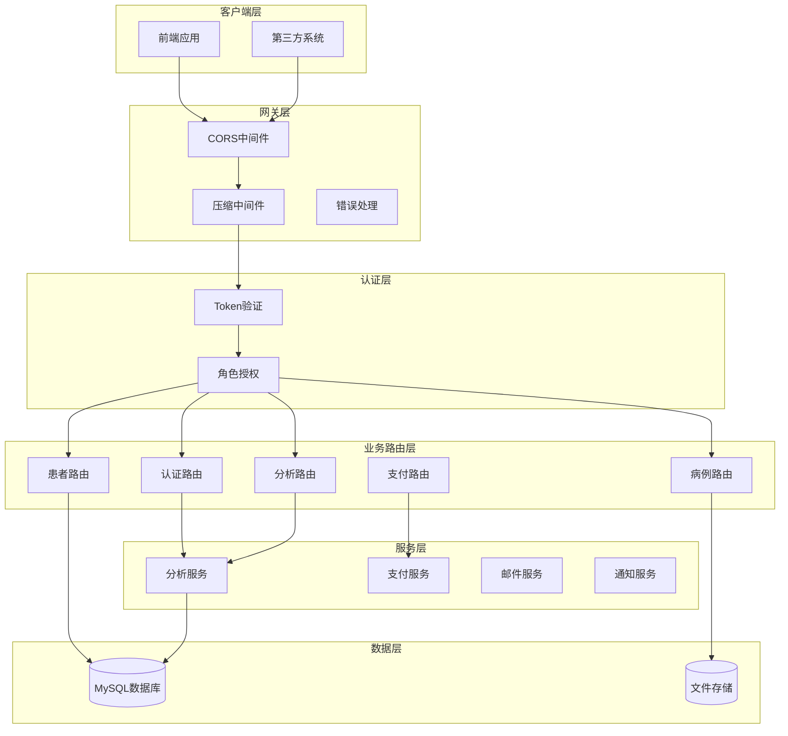
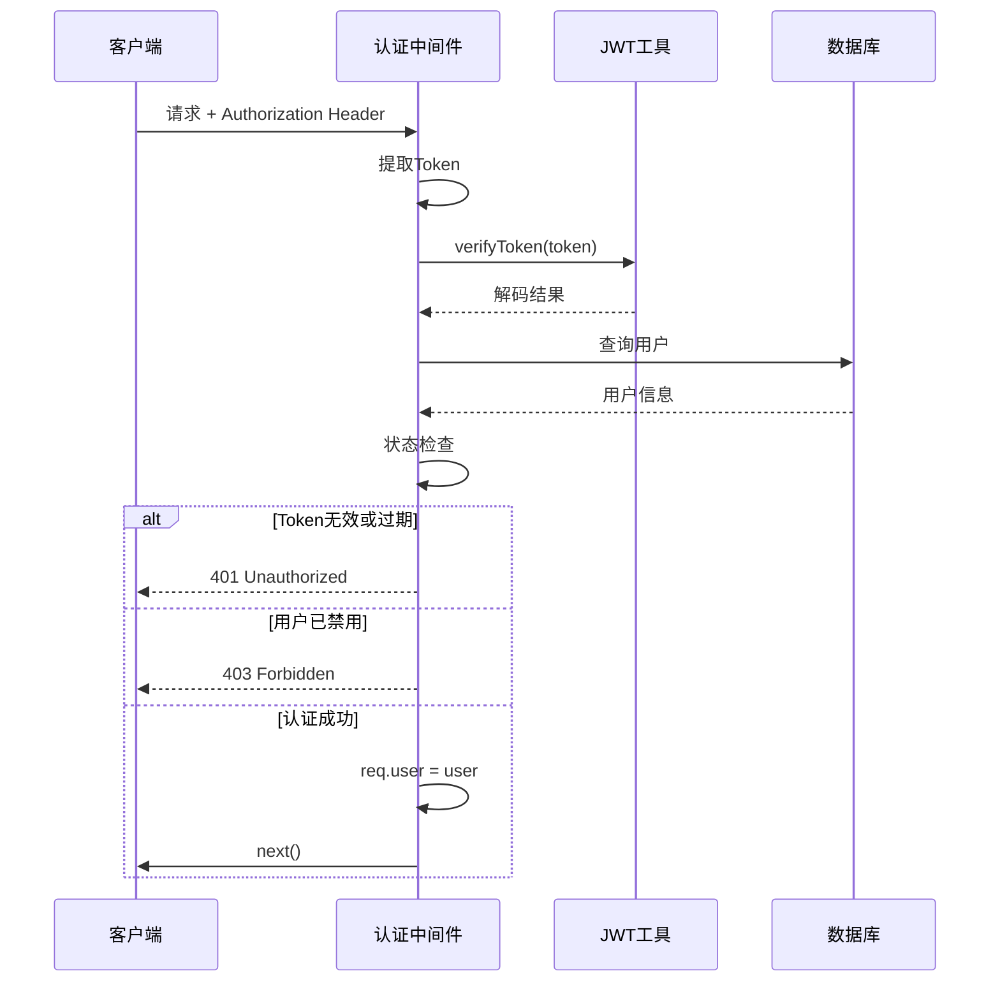
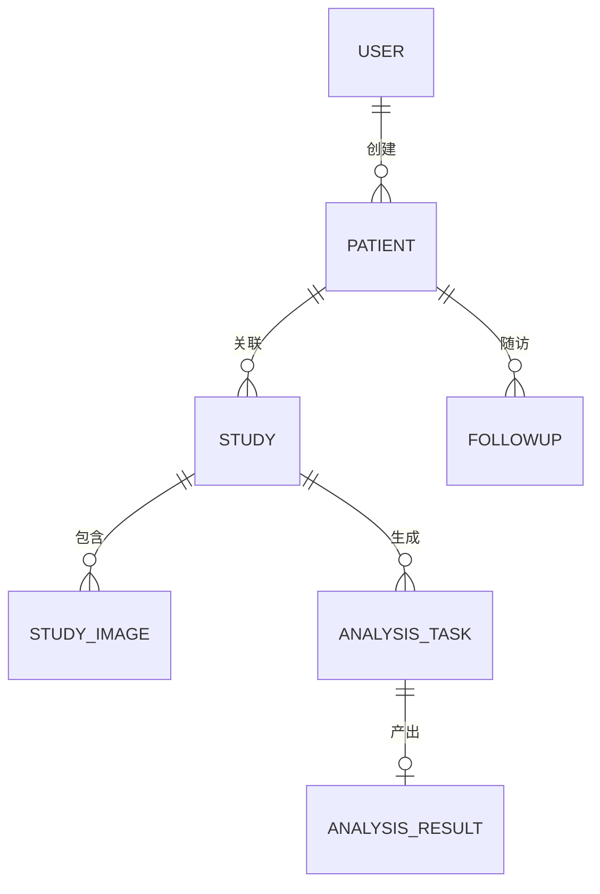
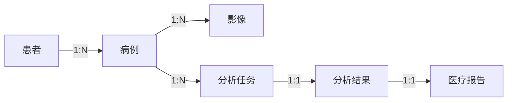
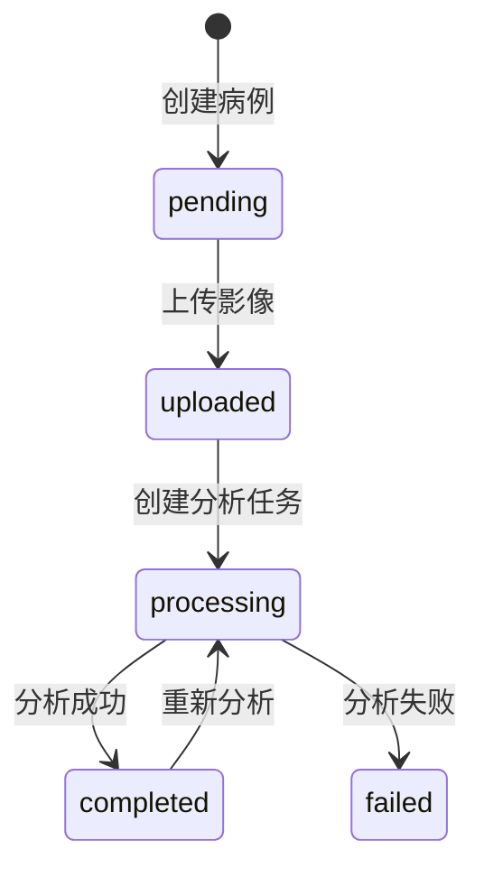
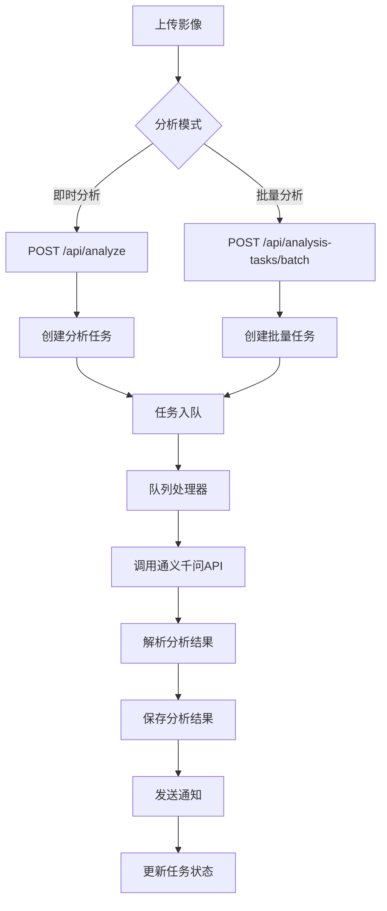
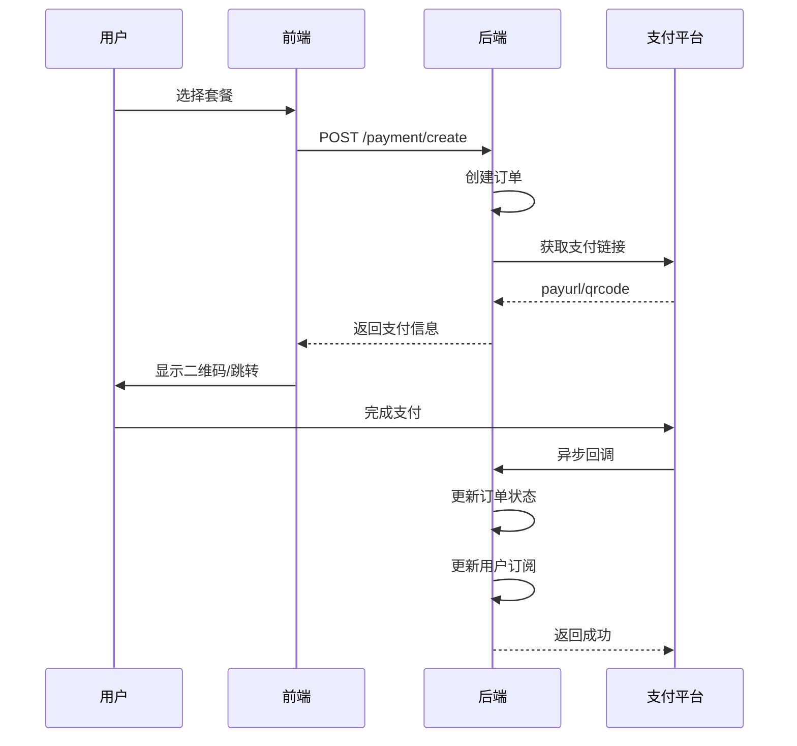
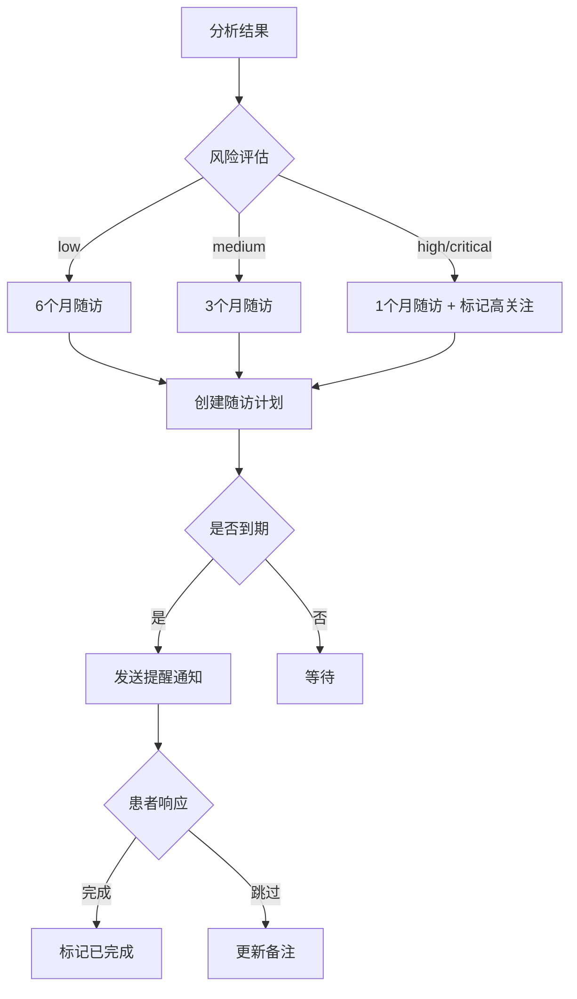

本文档详细描述了 CervixDetectAI 宫颈癌早筛系统的后端API接口设计，涵盖认证授权、用户管理、患者管理、病例管理、AI分析、支付订阅等核心业务模块的接口规范。所有接口均遵循统一的RESTful风格和响应格式，为前端开发团队和第三方集成提供完整的技术参考。

## 1. 概述

### 1.1 接口架构

CervixDetectAI 后端采用 Express.js 框架构建，提供RESTful风格的JSON API服务。系统采用分层架构设计，将路由处理、业务逻辑和数据持久化分离，确保接口的可维护性和可扩展性。API服务运行于4000端口，支持跨域请求和JWT Token认证机制。



Sources: [server/index.js](server/index.js#L1-L100) [server/middleware/auth.js](server/middleware/auth.js#L1-L125)

### 1.2 基础信息

| 配置项 | 值 |
|--------|-----|
| API基础URL | `/api` |
| 数据格式 | JSON |
| 字符编码 | UTF-8 |
| 认证方式 | Bearer Token (JWT) |
| 公共接口前缀 | `/api/analyze` |
| 文档地址 | `/api-docs` |

Sources: [server/index.js](server/index.js#L85-L100) [server/docs/openapi.yaml](server/docs/openapi.yaml#L1-L50)

### 1.3 通用响应格式

系统所有API接口均采用统一的JSON响应格式，包含 `success`、`message`、`data` 三个标准字段。

**成功响应格式：**

```json
{
  "success": true,
  "message": "操作成功",
  "data": { ... }
}
```

**错误响应格式：**

```json
{
  "success": false,
  "message": "错误描述信息",
  "error": "详细错误信息（仅开发环境）"
}
```

Sources: [server/routes/auth.js](server/routes/auth.js#L30-L40) [server/index.js](server/index.js#L170-L185)

## 2. 认证与授权

### 2.1 认证中间件机制

系统提供三种认证中间件以满足不同场景的需求：`authenticate`（强制认证）、`optionalAuth`（可选认证）和`authorize`（角色授权）。

| 中间件 | 用途 | 无Token处理 |
|--------|------|-------------|
| `authenticate` | 保护需要登录的接口 | 返回401 |
| `optionalAuth` | 分析上传等Token可选场景 | 跳过认证继续处理 |
| `authorize` | 限制特定角色的访问 | 返回403 |

认证中间件通过提取请求头中的 `Authorization: Bearer <token>` 进行JWT验证，验证通过后将用户信息附加到 `req.user` 对象供后续处理函数使用。



Sources: [server/middleware/auth.js](server/middleware/auth.js#L1-L125)

### 2.2 认证接口

#### 2.2.1 用户注册

**接口地址：** `POST /api/auth/register`

用户注册支持邮箱注册和工号注册两种方式，邮箱和工号至少需要提供一种。注册时可选发送邮箱验证码进行邮箱验证，验证码有效期为5分钟。

| 参数 | 类型 | 必填 | 说明 |
|------|------|------|------|
| password | string | 是 | 密码，最少6位 |
| email | string | 条件 | 邮箱地址（与工号二选一） |
| employee_id | string | 条件 | 工号（与邮箱二选一） |
| hospital_id | string | 条件 | 医院ID（与邮箱二选一） |
| emailCode | string | 条件 | 邮箱验证码（提供邮箱时必填） |
| real_name | string | 否 | 真实姓名 |
| phone | string | 否 | 手机号 |
| username | string | 否 | 用户名 |

**响应示例：**

```json
{
  "success": true,
  "message": "注册成功",
  "data": {
    "user": {
      "id": 1,
      "username": "user_123456",
      "email": "doctor@hospital.com",
      "role": "user",
      "status": "active"
    },
    "accessToken": "eyJhbGciOiJIUzI1NiIsInR5cCI6IkpXVCJ9...",
    "refreshToken": "eyJhbGciOiJIUzI1NiIsInR5cCI6IkpXVCJ9..."
  }
}
```

Sources: [server/routes/auth.js](server/routes/auth.js#L20-L100) [server/docs/openapi.yaml](server/docs/openapi.yaml#L900-L1000)

#### 2.2.2 用户登录

**接口地址：** `POST /api/auth/login`

系统支持三种登录方式：邮箱密码登录、工号密码登录和短信验证码登录。

| 登录方式 | 必填参数 |
|----------|----------|
| 邮箱登录 | email + password |
| 工号登录 | hospital_id + employee_id + password |
| 短信登录 | phone + code（见短信接口） |

**邮箱/工号登录请求：**

```json
{
  "email": "doctor@hospital.com",
  "password": "******"
}
```

登录成功后返回JWT访问令牌和刷新令牌，访问令牌有效期为2小时，刷新令牌有效期为30天。

Sources: [server/routes/auth.js](server/routes/auth.js#L100-L180) [server/docs/openapi.yaml](server/docs/openapi.yaml#L1000-L1100)

#### 2.2.3 Token刷新

**接口地址：** `POST /api/auth/refresh`

当访问令牌过期时，客户端需要使用刷新令牌获取新的访问令牌。系统采用单flight模式防止并发刷新时产生多个请求。

| 参数 | 类型 | 必填 | 说明 |
|------|------|------|------|
| refreshToken | string | 是 | 刷新令牌 |

Sources: [src/services/apiClient.ts](src/services/apiClient.ts#L1-L147) [src/services/api.ts](src/services/api.ts#L1-L100)

### 2.3 短信认证接口

#### 2.3.1 发送短信验证码

**接口地址：** `POST /api/auth/sms/send-code`

| 参数 | 类型 | 必填 | 说明 |
|------|------|------|------|
| phone | string | 是 | 手机号 |
| type | string | 否 | 场景类型：login/register/reset_password |

系统实现了短信发送频率限制，同一手机号60秒内只能发送一次，每天最多发送10次。

Sources: [server/routes/sms-auth.js](server/routes/sms-auth.js#L1-L150)

#### 2.3.2 短信登录

**接口地址：** `POST /api/auth/sms/login`

| 参数 | 类型 | 必填 | 说明 |
|------|------|------|------|
| phone | string | 是 | 手机号 |
| code | string | 是 | 6位验证码 |

#### 2.3.3 短信注册

**接口地址：** `POST /api/auth/sms/register`

| 参数 | 类型 | 必填 | 说明 |
|------|------|------|------|
| phone | string | 是 | 手机号 |
| code | string | 是 | 6位验证码 |
| username | string | 否 | 用户名 |
| real_name | string | 否 | 真实姓名 |
| email | string | 否 | 邮箱（可选绑定） |

Sources: [server/docs/openapi.yaml](server/docs/openapi.yaml#L1100-L1250)

### 2.4 邮箱认证接口

#### 2.4.1 发送邮箱验证码

**接口地址：** `POST /api/auth/email/send-code`

| 参数 | 类型 | 必填 | 说明 |
|------|------|------|------|
| email | string | 是 | 邮箱地址 |
| type | string | 否 | 场景类型：register/reset_password |

**响应数据：**

```json
{
  "success": true,
  "message": "验证码已发送到您的邮箱",
  "data": {
    "expiresIn": 300
  }
}
```

邮箱验证码有效期为5分钟，发送间隔为60秒，每日最多发送10次。

Sources: [server/routes/email-auth.js](server/routes/email-auth.js#L1-L120)

#### 2.4.2 重置密码

**接口地址：** `POST /api/auth/email/reset-password`

| 参数 | 类型 | 必填 | 说明 |
|------|------|------|------|
| email | string | 是 | 邮箱地址 |
| code | string | 是 | 验证码 |
| newPassword | string | 是 | 新密码（最少6位） |

Sources: [server/routes/email-auth.js](server/routes/email-auth.js#L150-L200)

## 3. 用户管理接口

### 3.1 用户资料

#### 3.1.1 获取当前用户

**接口地址：** `GET /api/users/me`

返回当前登录用户的完整信息，包括订阅状态和剩余额度。

**响应数据：**

```typescript
interface UserProfile {
  id: number;
  username: string;
  email: string;
  real_name: string;
  phone: string;
  hospital_id: string;
  employee_id: string;
  avatar_url: string;
  role: 'admin' | 'doctor' | 'user';
  status: 'active' | 'disabled';
  subscription_type: 'none' | 'monthly' | 'yearly' | 'package';
  subscription_expires_at: string;
  remaining_credits: number;
}
```

Sources: [server/routes/users.js](server/routes/users.js#L1-L100) [server/docs/openapi.yaml](server/docs/openapi.yaml#L1300-L1400)

#### 3.1.2 更新用户资料

**接口地址：** `PUT /api/users/me`

| 参数 | 类型 | 必填 | 说明 |
|------|------|------|------|
| real_name | string | 否 | 真实姓名 |
| phone | string | 否 | 手机号 |
| email | string | 否 | 邮箱地址 |

#### 3.1.3 修改密码

**接口地址：** `PUT /api/users/me/password`

| 参数 | 类型 | 必填 | 说明 |
|------|------|------|------|
| current_password | string | 是 | 当前密码 |
| new_password | string | 是 | 新密码（最少6位） |

#### 3.1.4 上传头像

**接口地址：** `POST /api/users/me/avatar`

Content-Type: `multipart/form-data`

| 参数 | 类型 | 必填 | 说明 |
|------|------|------|------|
| avatar | File | 是 | 头像图片（最大2MB） |

Sources: [src/services/api.ts](src/services/api.ts#L200-L280)

### 3.2 邮箱变更

#### 3.2.1 发送变更验证码

**接口地址：** `POST /api/users/me/email/send-code`

| 参数 | 类型 | 必填 | 说明 |
|------|------|------|------|
| new_email | string | 是 | 新邮箱地址 |

#### 3.2.2 确认邮箱变更

**接口地址：** `POST /api/users/me/email/confirm`

| 参数 | 类型 | 必填 | 说明 |
|------|------|------|------|
| new_email | string | 是 | 新邮箱地址 |
| code | string | 是 | 验证码 |

## 4. 患者管理接口

### 4.1 患者数据模型

患者是系统的核心业务实体之一，与病例形成一对多关系。系统支持按姓名、身份证号、手机号等多维度检索患者信息。



Sources: [server/models/Patient.js](server/models/Patient.js#L1-L100) [server/routes/patients.js](server/routes/patients.js#L1-L100)

### 4.2 患者接口

#### 4.2.1 创建患者

**接口地址：** `POST /api/patients`

| 参数 | 类型 | 必填 | 说明 |
|------|------|------|------|
| name | string | 是 | 患者姓名 |
| gender | string | 是 | 性别：male/female/other |
| birth_date | string | 否 | 出生日期（YYYY-MM-DD） |
| phone | string | 否 | 手机号 |
| sexual_history | string | 否 | 性史：none/regular/irregular/multiple_partners/early_sexual_activity/other |
| id_card | string | 否 | 身份证号（唯一） |
| medical_card_no | string | 否 | 就诊卡号 |
| address | string | 否 | 地址 |
| emergency_contact | string | 否 | 紧急联系人 |
| emergency_phone | string | 否 | 紧急联系电话 |
| allergy_history | string | 否 | 过敏史 |
| medical_history | string | 否 | 病史 |
| family_history | string | 否 | 家族史 |
| notes | string | 否 | 备注 |

#### 4.2.2 获取患者列表

**接口地址：** `GET /api/patients`

| 参数 | 类型 | 必填 | 说明 |
|------|------|------|------|
| page | number | 否 | 页码（默认1） |
| limit | number | 否 | 每页数量（默认10） |
| search | string | 否 | 搜索关键词（支持姓名、ID、电话、身份证） |
| gender | string | 否 | 性别筛选 |

**响应数据：**

```json
{
  "success": true,
  "data": {
    "patients": [...],
    "pagination": {
      "total": 100,
      "page": 1,
      "limit": 10,
      "pages": 10
    }
  }
}
```

#### 4.2.3 获取患者详情

**接口地址：** `GET /api/patients/:id`

返回指定患者的完整信息，包括基本信息、病史和关联的创建者信息。

#### 4.2.4 更新患者信息

**接口地址：** `PUT /api/patients/:id`

#### 4.2.5 删除患者

**接口地址：** `DELETE /api/patients/:id`

Sources: [server/routes/patients.js](server/routes/patients.js#L1-L378) [server/docs/openapi.yaml](server/docs/openapi.yaml#L1500-L1600)

## 5. 病例与影像管理

### 5.1 病例数据模型

病例（Study）记录每次医学影像检查的完整信息，包含检查日期、检查类型、临床诊断等关键字段。每个病例可关联多张医学影像。



Sources: [server/models/Study.js](server/models/Study.js#L1-L100) [server/routes/studies.js](server/routes/studies.js#L1-L100)

### 5.2 病例状态流转

| 状态 | 说明 |
|------|------|
| pending | 待上传 |
| uploaded | 已上传影像 |
| processing | 分析中 |
| completed | 分析完成 |
| failed | 分析失败 |



Sources: [server/models/Study.js](server/models/Study.js#L50-L80)

### 5.3 病例接口

#### 5.3.1 创建病例

**接口地址：** `POST /api/studies`

| 参数 | 类型 | 必填 | 说明 |
|------|------|------|------|
| patient_id | number | 是 | 患者ID |
| study_date | string | 是 | 检查日期（ISO格式） |
| study_type | string | 是 | 检查类型/模态 |
| description | string | 否 | 描述 |
| department | string | 否 | 科室 |
| doctor_name | string | 否 | 医生姓名 |
| clinical_diagnosis | string | 否 | 临床诊断 |
| symptoms | string | 否 | 症状描述 |

#### 5.3.2 上传影像

**接口地址：** `POST /api/studies/:id/images`

Content-Type: `multipart/form-data`

| 参数 | 类型 | 必填 | 说明 |
|------|------|------|------|
| images | File[] | 是 | 影像文件（最多10张，单张最大20MB） |

**支持的影像格式：** JPEG、PNG、TIFF、BMP

系统自动将第一张上传的影像设为主图，支持生成缩略图并同步到图仓存储。

Sources: [server/routes/studies.js](server/routes/studies.js#L80-L200) [server/services/studyImageStorage.service.js](server/services/studyImageStorage.service.js#L1-L100)

#### 5.3.3 获取病例列表

**接口地址：** `GET /api/studies`

| 参数 | 类型 | 必填 | 说明 |
|------|------|------|------|
| page | number | 否 | 页码 |
| limit | number | 否 | 每页数量 |
| patient_id | number | 否 | 患者ID筛选 |
| status | string | 否 | 状态筛选 |
| study_type | string | 否 | 检查类型筛选 |
| search | string | 否 | 搜索关键词 |

#### 5.3.4 获取病例详情

**接口地址：** `GET /api/studies/:id`

返回病例的完整信息，包括关联的患者信息、影像列表、分析结果等。

Sources: [server/docs/openapi.yaml](server/docs/openapi.yaml#L1600-L1800)

#### 5.3.5 删除影像

**接口地址：** `DELETE /api/studies/:studyId/images/:imageId`

## 6. AI分析接口

### 6.1 分析架构

AI分析模块采用任务队列架构，支持即时分析和批量分析两种模式。分析服务集成了通义千问大语言模型，用于生成结构化的分析报告。



Sources: [server/routes/analyze.js](server/routes/analyze.js#L1-L100) [server/services/analysisService.js](server/services/analysisService.js#L1-L100)

### 6.2 即时分析接口

#### 6.2.1 创建即时分析任务

**接口地址：** `POST /api/analyze`

此接口支持Token可选，适用于快速分析场景。系统会自动创建患者和病例记录。

| 参数 | 类型 | 必填 | 说明 |
|------|------|------|------|
| image | File | 是 | 影像文件（最大20MB） |
| patientName | string | 是 | 患者姓名 |
| patientId | string | 是 | 患者ID/编号 |
| studyDate | string | 是 | 检查日期（ISO格式） |
| modality | string | 是 | 检查模态/类型 |
| description | string | 否 | 描述信息 |

**响应数据：**

```json
{
  "success": true,
  "data": {
    "taskId": "task_xxx-xxx-xxx",
    "status": "PENDING",
    "patientId": 123,
    "studyId": "study_xxx-xxx-xxx",
    "message": "分析任务已创建"
  }
}
```

Sources: [server/routes/analyze.js](server/routes/analyze.js#L70-L180) [server/docs/openapi.yaml](server/docs/openapi.yaml#L2000-L2100)

#### 6.2.2 查询分析状态

**接口地址：** `GET /api/analyze/:taskId`

| 参数 | 类型 | 必填 | 说明 |
|------|------|------|------|
| taskId | string | 是 | 任务ID |

**响应数据：**

```json
{
  "success": true,
  "data": {
    "taskId": "task_xxx",
    "status": "SUCCESS",
    "progress": 100,
    "result": {
      "diagnosis": "LSIL",
      "confidence": 0.85,
      "risk_level": "medium",
      "recommendations": ["建议活检", "定期复查"],
      "suspicious_areas": [
        {
          "description": "醋白上皮区域",
          "location": "宫颈3-6点",
          "box_2d": [120, 340, 280, 520]
        }
      ],
      "biomarkers": {
        "acetowhite": "阳性",
        "iodine": "部分不着色"
      }
    }
  }
}
```

### 6.3 批量分析接口

#### 6.3.1 创建批量分析任务

**接口地址：** `POST /api/analysis-tasks/batch`

Content-Type: `multipart/form-data`

| 参数 | 类型 | 必填 | 说明 |
|------|------|------|------|
| images | File[] | 是 | 影像文件（最多10张） |
| patientName | string | 是 | 患者姓名 |
| patientId | string | 是 | 患者ID |
| studyDate | string | 是 | 检查日期 |
| modality | string | 是 | 检查类型 |
| description | string | 否 | 描述 |
| priority | string | 否 | 优先级：normal/urgent/emergency |

**响应数据：**

```json
{
  "success": true,
  "data": {
    "batchId": "batch_xxx",
    "summary": {
      "total": 10,
      "created": 10,
      "failed": 0
    },
    "items": [
      {
        "index": 0,
        "originalFilename": "image1.jpg",
        "studyDbId": 123,
        "taskId": "task_xxx",
        "status": "PENDING"
      }
    ]
  }
}
```

Sources: [server/routes/analysis-tasks.js](server/routes/analysis-tasks.js#L150-L300) [server/docs/openapi.yaml](server/docs/openapi.yaml#L1800-L1950)

### 6.4 分析任务管理

#### 6.4.1 创建分析任务

**接口地址：** `POST /api/analysis-tasks`

| 参数 | 类型 | 必填 | 说明 |
|------|------|------|------|
| study_id | number | 是 | 关联的病例ID |
| model_name | string | 否 | 模型名称 |
| model_version | string | 否 | 模型版本 |
| priority | string | 否 | 优先级 |

#### 6.4.2 获取任务列表

**接口地址：** `GET /api/analysis-tasks`

| 参数 | 类型 | 必填 | 说明 |
|------|------|------|------|
| page | number | 否 | 页码 |
| limit | number | 否 | 每页数量 |
| status | string | 否 | 任务状态筛选 |
| study_id | number | 否 | 病例ID筛选 |
| priority | string | 否 | 优先级筛选 |

#### 6.4.3 查询任务详情

**接口地址：** `GET /api/analysis-tasks/:id`

#### 6.4.4 更新任务状态

**接口地址：** `PUT /api/analysis-tasks/:id/status`

| 参数 | 类型 | 必填 | 说明 |
|------|------|------|------|
| status | string | 否 | 状态 |
| progress | number | 否 | 进度（0-100） |
| error_message | string | 否 | 错误信息 |

#### 6.4.5 保存分析结果

**接口地址：** `POST /api/analysis-tasks/:id/result`

| 参数 | 类型 | 必填 | 说明 |
|------|------|------|------|
| diagnosis | string | 是 | 诊断结果 |
| confidence | number | 是 | 置信度（0-1） |
| risk_level | string | 是 | 风险等级：low/medium/high/critical |
| recommendations | string[] | 否 | 建议 |
| suspicious_areas | object[] | 否 | 可疑区域 |
| biomarkers | object | 否 | 生物标志物 |
| detailed_report | string | 否 | 详细报告 |

Sources: [server/routes/analysis-tasks.js](server/routes/analysis-tasks.js#L300-L500)

## 7. 支付与订阅接口

### 7.1 支付流程

系统集成智腾码支付平台，支持支付宝和微信支付。支付流程采用异步回调机制，确保订单状态的可靠性。



Sources: [server/routes/payment.js](server/routes/payment.js#L1-L150) [server/services/paymentService.js](server/services/paymentService.js#L1-L100)

### 7.2 支付接口

#### 7.2.1 创建支付订单

**接口地址：** `POST /api/payment/create`

| 参数 | 类型 | 必填 | 说明 |
|------|------|------|------|
| planType | string | 是 | 套餐类型：package-10/package-30/monthly/yearly |
| paymentMethod | string | 是 | 支付方式：alipay/wxpay |

**套餐说明：**

| 套餐类型 | 说明 |
|----------|------|
| package-10 | 10次分析包 |
| package-30 | 30次分析包 |
| monthly | 月度订阅 |
| yearly | 年度订阅 |

**响应数据：**

```json
{
  "success": true,
  "data": {
    "order": {
      "id": 1,
      "out_trade_no": "ORDER_xxx",
      "plan_type": "monthly",
      "money": 99.00,
      "credits": 0,
      "status": "pending"
    },
    "payUrl": "https://...",
    "payment": {
      "outTradeNo": "ORDER_xxx",
      "displayMode": "qrcode",
      "qrcode": "weixin://..."
    }
  }
}
```

Sources: [server/routes/payment.js](server/routes/payment.js#L40-L100) [server/docs/openapi.yaml](server/docs/openapi.yaml#L1950-L2000)

#### 7.2.2 查询订单状态（公开）

**接口地址：** `GET /api/payment/check/:out_trade_no`

此接口无需认证，用于支付结果页查询订单状态。

#### 7.2.3 查询订单状态（认证）

**接口地址：** `GET /api/payment/status/:out_trade_no`

需要Bearer Token认证，仅可查询本人订单。

#### 7.2.4 获取订单列表

**接口地址：** `GET /api/payment/orders`

| 参数 | 类型 | 必填 | 说明 |
|------|------|------|------|
| page | number | 否 | 页码 |
| limit | number | 否 | 每页数量 |

## 8. 随访管理接口

### 8.1 随访架构

随访模块支持自动生成和手动创建两种模式。系统根据患者的风险等级自动计算建议的随访间隔，高风险患者会自动标记需重点关注。

| 风险等级 | 建议随访间隔 |
|----------|--------------|
| low | 6个月 |
| medium | 3个月 |
| high | 1个月 |
| critical | 1个月 |



Sources: [server/routes/followups.js](server/routes/followups.js#L1-L100) [server/services/followupScheduler.service.js](server/services/followupScheduler.service.js#L1-L100)

### 8.2 随访接口

#### 8.2.1 创建随访计划

**接口地址：** `POST /api/followups`

| 参数 | 类型 | 必填 | 说明 |
|------|------|------|------|
| patient_id | number | 是 | 患者ID |
| study_id | number | 否 | 关联病例ID |
| planned_date | string | 否 | 计划日期 |
| assigned_doctor_id | number | 否 | 指派医生ID |
| reason | string | 否 | 随访原因 |
| notes | string | 否 | 备注 |
| doctor_marked_high_attention | boolean | 否 | 医生标记高关注 |

#### 8.2.2 获取随访列表

**接口地址：** `GET /api/followups`

| 参数 | 类型 | 必填 | 说明 |
|------|------|------|------|
| page | number | 否 | 页码 |
| limit | number | 否 | 每页数量 |
| status | string | 否 | 状态：pending/overdue/completed/cancelled |
| patient_id | number | 否 | 患者ID |
| high_attention | boolean | 否 | 高关注筛选 |
| date_from | string | 否 | 开始日期 |
| date_to | string | 否 | 结束日期 |
| keyword | string | 否 | 关键词搜索 |

#### 8.2.3 完成随访

**接口地址：** `PATCH /api/followups/:id/complete`

#### 8.2.4 取消随访

**接口地址：** `PATCH /api/followups/:id/cancel`

#### 8.2.5 设置高关注

**接口地址：** `PATCH /api/followups/:id/high-attention`

| 参数 | 类型 | 必填 | 说明 |
|------|------|------|------|
| marked | boolean | 是 | 是否标记高关注 |

#### 8.2.6 立即发送提醒

**接口地址：** `POST /api/followups/:id/remind`

Sources: [server/routes/followups.js](server/routes/followups.js#L100-L400)

## 9. 工作台与统计接口

### 9.1 工作台数据

#### 9.1.1 获取统计数据

**接口地址：** `GET /api/dashboard/stats`

| 参数 | 类型 | 必填 | 说明 |
|------|------|------|------|
| period | string | 否 | 时间范围：today/week/month |

**响应数据：**

```json
{
  "success": true,
  "data": {
    "todayTotal": 25,
    "todayGrowth": 15,
    "highRiskCount": 3,
    "highRiskPercent": 12,
    "avgProcessTime": 2.5,
    "timeImprovement": -0.3,
    "diagnosisStats": {
      "阴性/Normal": 45,
      "ASC-US": 25,
      "LSIL": 15,
      "HSIL": 10,
      "可疑癌/SCC": 5
    },
    "completedToday": 20
  }
}
```

#### 9.1.2 获取待处理任务

**接口地址：** `GET /api/dashboard/pending-tasks`

返回当前用户的待处理分析任务列表。

Sources: [server/routes/dashboard.js](server/routes/dashboard.js#L1-L200) [server/docs/openapi.yaml](server/docs/openapi.yaml#L2100-L2200)

## 10. 错误码规范

### 10.1 HTTP状态码

| 状态码 | 说明 | 使用场景 |
|--------|------|----------|
| 200 | OK | 请求成功 |
| 201 | Created | 资源创建成功 |
| 400 | Bad Request | 参数错误或缺少必填参数 |
| 401 | Unauthorized | 未认证或Token无效 |
| 403 | Forbidden | 无权限访问 |
| 404 | Not Found | 资源不存在 |
| 409 | Conflict | 资源冲突（如邮箱已注册） |
| 429 | Too Many Requests | 请求过于频繁 |
| 500 | Internal Server Error | 服务器内部错误 |

### 10.2 业务错误码

| 错误信息 | 说明 |
|----------|------|
| 请填写邮箱或工号信息 | 认证凭证缺失 |
| 密码长度至少6位 | 密码强度不足 |
| 邮箱验证码无效或已过期 | 验证码校验失败 |
| 账号或密码错误 | 登录失败 |
| 无权访问该患者信息 | 权限不足 |
| 病例不存在 | 病例ID无效 |
| 只支持 JPEG、PNG、TIFF、BMP 格式 | 文件格式不支持 |
| 发送过于频繁，请稍后再试 | 频率限制触发 |

Sources: [server/index.js](server/index.js#L170-L185) [server/routes/auth.js](server/routes/auth.js#L30-L80)

## 11. 客户端集成

### 11.1 前端API客户端

系统前端使用Axios封装统一的API客户端，实现了请求拦截、响应拦截、Token自动刷新等功能。

**核心特性：**

| 特性 | 说明 |
|------|------|
| 自动Token注入 | 请求自动附加Authorization头 |
| Token刷新 | 401响应时自动刷新Token并重试 |
| 错误日志 | 开发环境自动打印请求/响应日志 |
| 超时控制 | 全局30秒超时限制 |

```typescript
// 请求拦截器示例
apiClient.interceptors.request.use((config) => {
  const token = getItem(STORAGE_KEYS.ACCESS_TOKEN);
  if (token) {
    config.headers.Authorization = `Bearer ${token}`;
  }
  return config;
});

// 响应拦截器示例
apiClient.interceptors.response.use(
  (response) => response,
  async (error) => {
    if (error.response?.status === 401) {
      // 触发Token刷新流程
      const newToken = await refreshToken();
      // 重试原请求
    }
    return Promise.reject(error);
  }
);
```

Sources: [src/services/apiClient.ts](src/services/apiClient.ts#L1-L147)

### 11.2 API服务模块

前端按业务领域封装了多个API服务模块：

| 模块 | 文件 | 主要功能 |
|------|------|----------|
| authAPI | api.ts | 认证、登录、注册 |
| userAPI | api.ts | 用户资料管理 |
| studyAPI | api.ts | 病例管理 |
| analysisTaskAPI | api.ts | 分析任务管理 |
| reportAPI | api.ts | 报告管理 |
| paymentAPI | api.ts | 支付订阅 |
| followUpAPI | api.ts | 随访管理 |
| notificationAPI | api.ts | 通知管理 |
| patientInsightsAPI | api.ts | 患者洞察 |

Sources: [src/services/api.ts](src/services/api.ts#L1-L1180)

## 12. 相关文档

- [认证与授权机制](15-ren-zheng-yu-shou-quan-ji-zhi) — JWT令牌设计、刷新机制详解
- [通义千问AI分析服务](10-tong-yi-qian-wen-aifen-xi-fu-wu) — AI模型集成与分析流程
- [订阅与支付系统](14-ding-yue-yu-zhi-fu-xi-tong) — 支付平台对接与订单管理
- [后端服务架构](8-hou-duan-fu-wu-jia-gou) — 服务器架构与中间件设计