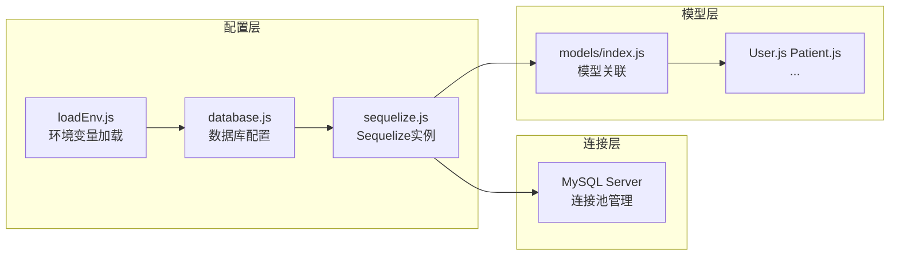
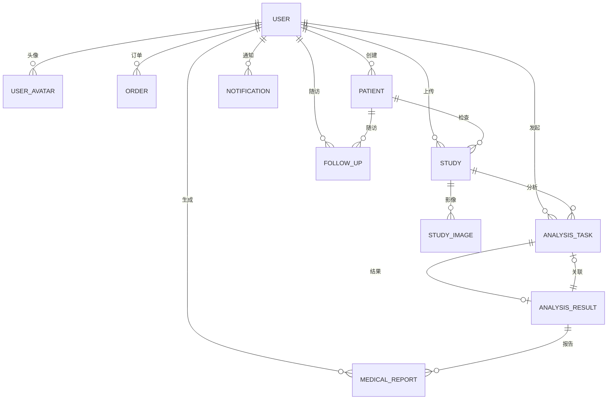
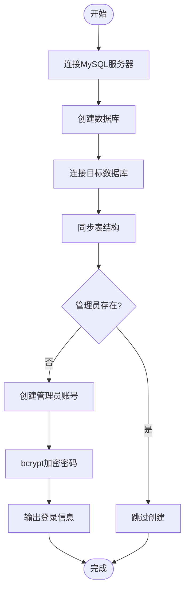
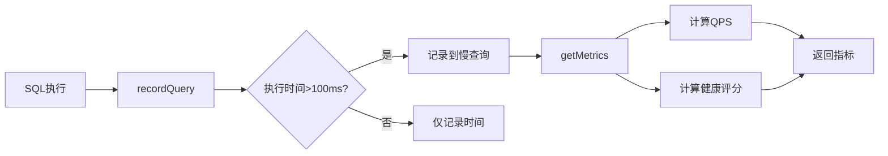
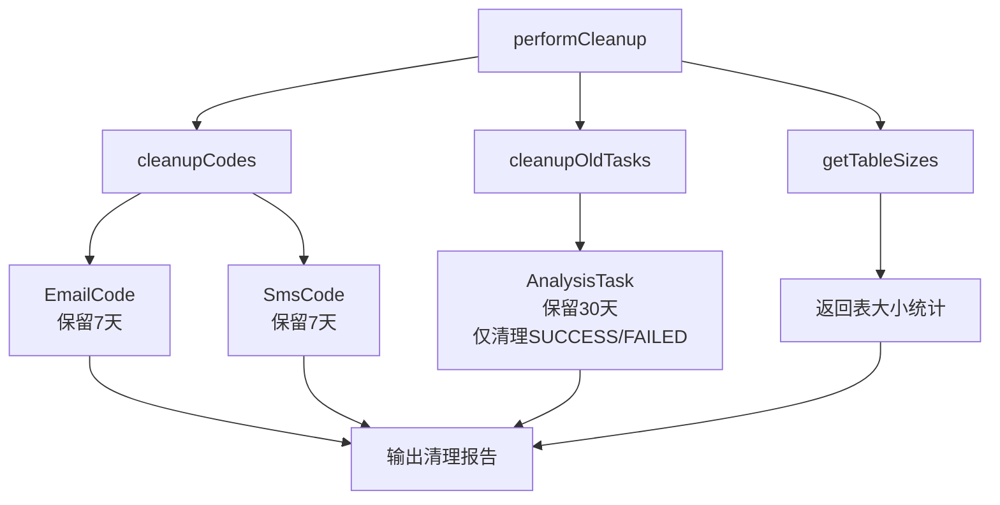

本页面系统阐述 CervixDetectAI 项目的数据库架构、配置体系与维护机制。该系统基于 **Sequelize ORM** 构建，采用 **MySQL** 作为主数据库，通过 `server/config/database.js` 配置文件实现环境差异化配置，支持开发环境与生产环境的无缝切换。项目数据库包含 13 个核心数据表，涵盖用户管理、患者档案、AI 分析、随访追踪、支付订单等完整业务链条。

## 数据库配置架构

### 配置文件体系

系统采用分层配置架构，通过 `server/config/` 目录下的核心文件实现数据库连接的统一管理。

**Sequelize 实例配置** 通过 `server/config/sequelize.js` 实现，该文件封装了数据库连接创建、连接测试、基准测试日志和数据库同步等核心功能。配置文件通过 `benchmark: true` 选项启用查询性能基准测试，能够精确记录每条 SQL 语句的执行耗时，为性能监控提供数据基础。连接池配置采用动态管理策略，最大连接数设为 20，最小空闲连接数设为 5，获取连接超时时间为 30 秒，空闲连接回收周期为 10 秒，确保在高并发场景下数据库连接的稳定性和资源高效利用。



Sources: [loadEnv.js](server/config/loadEnv.js#L1-L10), [database.js](server/config/database.js#L1-L64), [sequelize.js](server/config/sequelize.js#L1-L73)

### 环境变量配置

数据库连接参数通过环境变量注入，支持开发环境与生产环境的差异化配置。核心配置项包括主机地址 `DB_HOST`、端口 `DB_PORT`、用户名 `DB_USER`、密码 `DB_PASSWORD` 和数据库名 `DB_NAME`。系统固定读取 `server/.env` 文件作为配置源，通过 `server/config/loadEnv.js` 确保无论从哪个目录启动服务，配置加载路径的一致性。

| 配置项 | 开发环境 | 生产环境 | 说明 |
|--------|----------|----------|------|
| `DB_HOST` | `mysql7.sqlpub.com` | `localhost` | 数据库服务器地址 |
| `DB_PORT` | `3312` | `3306` | MySQL 服务端口 |
| `DB_USER` | `xingranya` | `root` | 数据库用户名 |
| `DB_NAME` | `cervix_detect_ai` | `cervix_detect_ai` | 数据库名称 |
| `DB_SYNC` | `false` | `false` | 是否自动同步表结构 |

Sources: [.env](server/.env#L24-L28), [.env(服务器)](server/.env(服务器)#L24-L28)

### 连接池与性能优化

数据库连接池是保障系统稳定性的关键组件。系统使用 Sequelize 内置的 generic-pool 连接池实现，通过 `server/config/database.js` 中的 `pool` 配置项进行精细化管理。连接池采用饥饿式预加载策略，在服务启动时即建立最小连接数 `min: 5`，确保常规请求能够快速获取连接。最大连接数 `max: 20` 限制了并发连接上限，防止数据库过载。

```javascript
pool: {
  max: 20,        // 最大连接数
  min: 5,         // 最小空闲连接
  acquire: 30000, // 获取连接超时(ms)
  idle: 10000,    // 空闲连接回收周期(ms)
}
```

Sources: [database.js](server/config/database.js#L24-L28)

### 慢查询监控

系统实现了自定义日志函数 `customLogger`，用于捕获和分析慢查询。当查询执行时间超过 100 毫秒时，在开发环境下会输出 `[DB Slow Query]` 标记，便于开发者识别性能瓶颈。日志函数集成了 `dbMonitorService` 的查询记录功能，将所有 SQL 执行时间和慢查询记录存储到内存缓冲区中，供性能分析接口调用。

```javascript
const customLogger = (sql, timing) => {
  if (process.env.NODE_ENV === 'development' && timing > 100) {
    console.log(`[DB Slow Query] ${timing}ms`);
  }
};
```

Sources: [sequelize.js](server/config/sequelize.js#L13-L29)

## 数据模型体系

### 模型关系总览

系统通过 `server/models/index.js` 集中定义 13 个数据模型之间的关联关系，采用 Sequelize 的关联 API 构建清晰的数据模型网络。



Sources: [models/index.js](server/models/index.js#L1-L105)

### 核心业务表

#### 用户表 (users)

用户表是系统权限控制的基础，采用 `BIGINT` 作为主键类型以支持大规模用户扩展。密码字段使用 bcrypt 算法加密存储，通过 `beforeSave` 钩子实现自动加密。角色枚举包含 `admin`、`doctor`、`user` 三种类型，支持细粒度的权限管理。订阅相关字段 `subscription_type` 和 `subscription_expires_at` 支持按月、按年或按套餐计费的多种订阅模式。

| 字段 | 类型 | 说明 |
|------|------|------|
| `id` | BIGINT | 主键自增 |
| `username` | VARCHAR(50) | 用户名，唯一 |
| `email` | VARCHAR(100) | 邮箱，唯一 |
| `password_hash` | VARCHAR(255) | bcrypt加密密码 |
| `role` | ENUM | admin/doctor/user |
| `subscription_type` | ENUM | none/monthly/yearly/package |
| `remaining_credits` | INTEGER | 剩余分析次数 |

Sources: [User.js](server/models/User.js#L1-L130)

#### 患者表 (patients)

患者表存储患者的医疗档案信息，支持 HIPAA 合规的隐私保护需求。`patient_id` 通过 `beforeValidate` 钩子自动生成，格式为 `P` + 时间戳 + 3 位随机数。敏感字段如 `id_card` 在应用层加密存储。`created_by` 外键关联创建者用户，便于追溯数据来源。

Sources: [Patient.js](server/models/Patient.js#L1-L136)

#### 检查表 (studies)

检查表是连接患者与 AI 分析的核心实体，存储每次医学检查的完整信息。`study_id` 采用日期序列号格式 `S{YYYYMMDD}{序号}`，支持按日期快速检索和统计。状态字段支持 `pending → uploaded → processing → completed/failed` 的状态机流转。优先级字段支持 `normal`、`urgent`、`emergency` 三级紧急度处理。

Sources: [Study.js](server/models/Study.js#L1-L132)

#### AI 分析任务表 (analysis_tasks)

任务表管理 AI 分析任务的完整生命周期，支持并发控制和失败重试机制。`task_id` 格式为 `TASK{时间戳}{随机字符}`，确保任务标识的唯一性。`retry_count` 字段记录重试次数，结合 `MAX_CONCURRENT_ANALYSIS` 环境变量控制并发分析数量，防止 API 配额耗尽。

```javascript
// 任务状态流转
// PENDING → PROCESSING → SUCCESS
//                  ↓
//               FAILED → (可重试) → PENDING
```

Sources: [AnalysisTask.js](server/models/AnalysisTask.js#L1-L109)

#### AI 分析结果表 (analysis_results)

结果表存储 AI 模型输出的诊断信息，采用 JSON 字段存储结构化数据。`confidence` 字段使用 `DECIMAL(5,4)` 类型存储 0-1 区间的置信度值，通过验证器确保数据合法性。`recommendations`、`biomarkers`、`suspicious_areas` 等 JSON 字段支持灵活的数据扩展，便于存储 AI 模型的多维度分析结果。

Sources: [AnalysisResult.js](server/models/AnalysisResult.js#L1-L127)

#### 随访计划表 (follow_ups)

随访表支持患者的周期性复查管理，通过 `planned_date` 字段规划复查时间。系统根据风险等级快照 `risk_level_snapshot` 和 AI 标记 `ai_flagged_high_attention` 自动识别需要重点关注的患者。状态支持 `pending → overdue → completed/cancelled` 流转，配合定时任务实现逾期提醒。

Sources: [FollowUp.js](server/models/FollowUp.js#L1-L153)

### 辅助业务表

#### 验证码表 (email_codes / sms_codes)

验证码表采用双字段复合索引 `(email, code)` 加速验证查询。过期时间 `expires_at` 字段结合 `status` 枚举实现验证码的生命周期管理。`ip_address` 字段支持 IP 级别的频次控制，防止暴力破解。邮箱验证码支持 `register`、`reset_password`、`change_email` 三种类型，通过 `ensureEmailInfrastructure` 服务扩展枚举值。

Sources: [EmailCode.js](server/models/EmailCode.js#L1-L160), [SmsCode.js](server/models/SmsCode.js#L1-L74)

#### 订单表 (orders)

订单表记录用户的支付交易信息，采用第三方支付平台的交易号作为业务标识。`out_trade_no` 由系统生成用于发起支付，`trade_no` 由支付平台返回用于回调验证。订单状态支持 `pending → paid/failed/expired` 流转，与支付网关的异步回调机制联动。

Sources: [Order.js](server/models/Order.js#L1-L80)

#### 通知表 (notifications)

通知表实现站内消息推送功能，支持随访提醒和系统通知两类消息。`related_type` 和 `related_id` 字段关联业务实体，实现通知的可追溯性。`is_read` 字段配合 `read_at` 支持已读/未读状态管理。

Sources: [Notification.js](server/models/Notification.js#L1-L68)

## 初始化与同步机制

### 数据库初始化脚本

系统通过 `server/scripts/init-database.js` 实现数据库的自动化初始化，支持从零开始创建完整的数据库结构。



初始化流程包含四个核心步骤：首先测试 MySQL 服务器连接，然后创建目标数据库（如果不存在），接着通过 `sequelize.sync({ alter: true })` 同步所有表结构，最后检查并创建默认管理员账号。脚本使用 `ALTER TABLE` 语句安全地添加可能缺失的字段，确保增量更新的兼容性。

```bash
# 执行数据库初始化
npm run db:init
```

Sources: [init-database.js](server/scripts/init-database.js#L1-L165)

### 服务启动时的同步策略

系统启动时通过 `server/index.js` 的 `syncDatabase` 函数管理表结构同步。`DB_SYNC` 环境变量控制是否执行全量同步，默认为 `false` 以避免生产环境的意外表结构变更。

```javascript
const isDbSyncEnabled = String(process.env.DB_SYNC || '')
  .trim()
  .toLowerCase() === 'true';

if (isDbSyncEnabled) {
  await syncDatabase({ alter: true });
}
```

对于新功能的独立表结构，系统采用按需同步策略。`ensureFollowUpInfrastructure` 和 `ensureEmailInfrastructure` 服务在各自功能首次调用时独立确保表存在，避免因 `DB_SYNC=false` 导致新功能报 500 错误。

Sources: [index.js](server/index.js#L200-L216)

## 性能监控服务

### 数据库监控服务 (dbMonitorService)

`server/services/dbMonitorService.js` 实现数据库性能指标的实时采集和计算，支持系统健康状态评估。



健康评分算法综合考虑平均响应时间、错误率和连接池待处理请求数：
- 平均响应时间 > 200ms：扣 20 分
- 平均响应时间 > 500ms：再扣 30 分
- 错误率 > 1%：扣 20 分
- 待处理请求 > 5：扣 10 分

Sources: [dbMonitorService.js](server/services/dbMonitorService.js#L1-L116)

### API 端点

性能监控数据通过 `/api/system/db-metrics` 接口暴露，包含 QPS、平均响应时间、错误率、连接池状态和慢查询记录等关键指标。该接口集成了操作系统级指标（内存使用、CPU 负载），提供完整的性能视图。

Sources: [system.js](server/routes/system.js#L15-L50)

## 数据维护机制

### 数据库清理服务 (databaseCleanupService)

`server/services/databaseCleanup.service.js` 实现过期数据的自动清理，防止数据库无限增长。



清理配置支持通过环境变量调整：
- `CODE_RETENTION_DAYS`：验证码保留天数，默认 7 天
- `TASK_RETENTION_DAYS`：分析任务保留天数，默认 30 天
- `CLEANUP_BATCH_SIZE`：每次清理批次大小，默认 1000 条

清理采用批次删除策略，每次最多删除 `batchSize` 条记录，避免一次性删除大量数据导致的锁表问题。

Sources: [databaseCleanup.service.js](server/services/databaseCleanup.service.js#L1-L191)

### 随访定时任务

`server/services/followupScheduler.service.js` 实现随访提醒的自动化调度，使用 node-cron 按配置的 cron 表达式定时执行。

```javascript
// 默认执行时间：每天早上9点（北京时间）
const cronExpression = process.env.FOLLOWUP_REMINDER_CRON || '0 9 * * *';
const timezone = process.env.FOLLOWUP_REMINDER_TIMEZONE || 'Asia/Shanghai';
```

定时任务扫描所有待随访和已逾期记录，对当日应提醒且未提醒的记录发送站内通知，并将随访状态从 `pending` 更新为 `overdue`。

Sources: [followupScheduler.service.js](server/services/followupScheduler.service.js#L1-L196)

### 清理 API 接口

系统提供 `/api/system/database/cleanup` 接口支持手动触发数据库清理，返回清理统计和表大小信息。管理员可通过该接口在业务低峰期执行维护操作。

Sources: [system.js](server/routes/system.js#L52-L100)

## 配置最佳实践

### 开发环境配置

开发环境配置文件位于 `server/.env`，数据库连接到远程开发服务器。开发环境开启 SQL 日志输出，便于调试。默认 `DB_SYNC=false` 避免意外修改表结构，需要手动执行 `npm run db:init` 进行初始化。

### 生产环境配置

生产环境配置文件为 `server/.env(服务器)`，数据库连接到本地 MySQL 服务。生产环境关闭所有 SQL 日志输出，禁止 `DB_SYNC=true`，所有表结构变更必须通过迁移脚本执行。环境变量应通过容器编排工具或配置中心管理，避免敏感信息明文存储。

### 安全性配置

数据库连接采用 `utf8mb4` 字符集支持完整的 Unicode 字符，包括 emoji 和生僻字。密码字段使用 `utf8mb4_unicode_ci` 排序规则，确保比较的准确性。生产环境必须修改 `JWT_SECRET` 为强随机字符串，长度不少于 128 位。

---

**相关文档**：
- [数据模型与ORM映射](9-shu-ju-mo-xing-yu-ormying-she) — Sequelize 模型定义详解
- [关系图](database-design/relation-diagram) — 表间关联可视化
- [表结构](database-design/table-structures) — 各表字段详细说明
- [部署与运维指南](18-bu-shu-yu-yun-wei-zhi-nan) — 生产环境运维实践