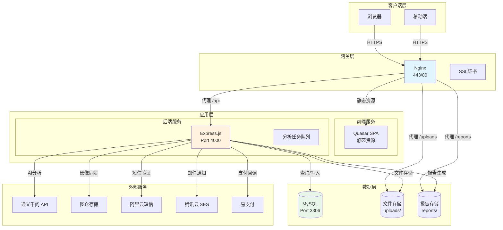
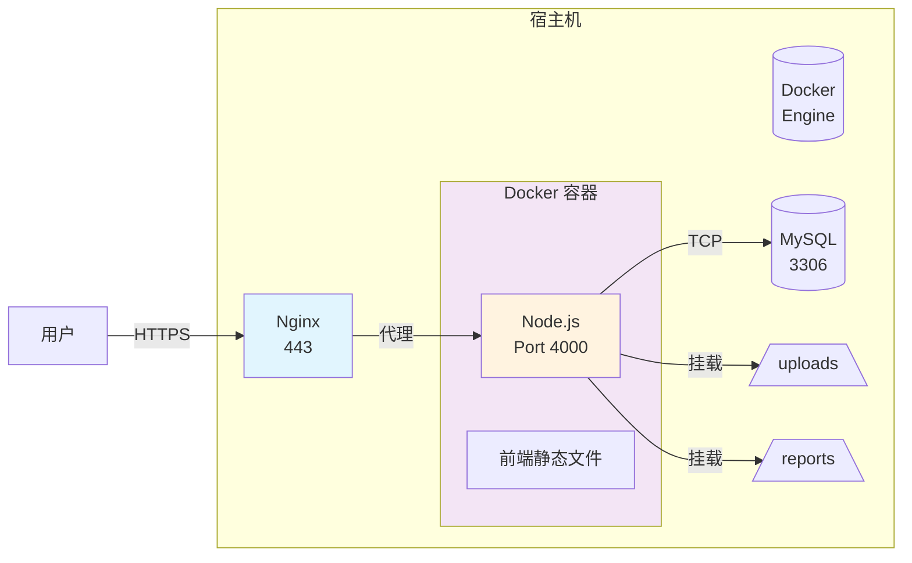

本文档全面介绍 CervixDetectAI 项目的生产环境部署流程、运维监控方案及故障处理策略。项目采用前后端分离架构，通过 Nginx 反向代理实现 HTTPS 访问，支持传统 PM2 部署和 Docker 容器化两种部署模式。

## 部署架构概述

### 技术架构图



### 部署模式对比

| 特性 | PM2 部署模式 | Docker 部署模式 |
| :--- | :--- | :--- |
| **适用场景** | 单机部署、轻量级运维 | 弹性扩展、环境隔离 |
| **依赖环境** | Node.js + PM2 | 仅需 Docker Engine |
| **配置管理** | `.env` 文件 | 环境变量 + 挂载卷 |
| **资源隔离** | 共享系统资源 | 独立容器环境 |
| **更新部署** | `git pull` + 重启 | 重新构建镜像 |
| **日志管理** | `pm2 logs` | `docker logs` |

Sources: [nginx配置.txt](nginx配置.txt#L1-L180), [docs/docker-deployment.md](docs/docker-deployment.md#L1-L131), [server/ecosystem.config.js](server/ecosystem.config.js#L1-L22)

## 环境准备与配置

### 服务器环境要求

生产环境服务器应满足以下最低配置：

| 资源类型 | 最低配置 | 推荐配置 |
| :--- | :--- | :--- |
| **CPU** | 2 核心 | 4 核心+ |
| **内存** | 2 GB | 4 GB+ |
| **磁盘** | 40 GB SSD | 100 GB+ SSD |
| **带宽** | 5 Mbps | 10 Mbps+ |

确保系统已安装以下软件：

```bash
# 验证 Node.js 版本（支持 Node.js 20+）
node --version

# 验证包管理器（Bun 推荐）
bun --version

# 验证 MySQL 客户端
mysql --version

# PM2（用于传统部署模式）
pm2 --version
```

Sources: [README.md](README.md#L230-L250), [package.json](package.json#L42-L45)

### 环境变量配置

生产环境配置通过 `server/.env(服务器)` 文件管理。以下是关键配置项分类说明：

#### 基础服务配置

```env
# 服务器配置
PORT=4000
NODE_ENV=production

# 允许的跨域源（生产环境应设为实际域名）
CORS_ORIGINS=https://hpvsc.icu
```

Sources: [server/.env(服务器)](server/.env(服务器)#L1-L10)

#### 数据库连接配置

```env
DB_HOST=localhost
DB_PORT=3306
DB_USER=root
DB_PASSWORD=xingran8
DB_NAME=cervix_detect_ai
DB_SYNC=false
```

数据库连接池参数在 `server/config/database.js` 中配置：

```javascript
pool: {
  max: 20,        // 最大连接数
  min: 5,         // 最小连接数
  acquire: 30000, // 获取连接超时(ms)
  idle: 10000     // 空闲连接超时(ms)
}
```

Sources: [server/config/database.js](server/config/database.js#L41-L48), [server/.env(服务器)](server/.env(服务器)#L20-L26)

#### 外部服务配置

```env
# 通义千问 AI 服务
QWEN_API_KEY=sk-xxxxxxxxxxxxx
QWEN_API_URL=https://dashscope.aliyuncs.com/compatible-mode/v1
QWEN_MODEL=qwen3.5-plus
QWEN_API_TIMEOUT_MS=180000

# 图仓存储
TUCANG_API_BASE_URL=https://api.tucang.cc
TUCANG_TOKEN=xxxxxxxxxxxxxxxx
TUCANG_STUDY_FOLDER_ID=3564

# 支付服务
EPAY_PID=12636
EPAY_KEY=ehggOKRexj5hbKu5RA52
EPAY_NOTIFY_URL=https://hpvsc.icu/api/payment/notify
```

Sources: [server/.env(服务器)](server/.env(服务器)#L1-L75)

## PM2 部署流程

### PM2 进程管理配置

项目根目录的 `server/ecosystem.config.js` 定义了 PM2 进程管理策略：

```javascript
module.exports = {
  apps: [{
    name: 'cervix-detect-ai-backend',
    script: 'index.js',
    interpreter: 'bun',
    instances: 1,
    autorestart: true,
    watch: false,
    max_memory_restart: '1G',
    env: {
      NODE_ENV: 'production',
      PORT: 4000,
    },
  }],
};
```

**关键参数说明**：

| 参数 | 值 | 说明 |
| :--- | :--- | :--- |
| `interpreter` | `bun` | 使用 Bun 运行器提升性能 |
| `instances` | `1` | 单实例部署（多实例需注意数据库连接池） |
| `autorestart` | `true` | 进程异常退出自动重启 |
| `watch` | `false` | 生产环境禁用热重载 |
| `max_memory_restart` | `1G` | 内存超限自动重启 |

Sources: [server/ecosystem.config.js](server/ecosystem.config.js#L1-L22)

### 部署步骤

#### 1. 构建前端生产版本

```bash
# 进入项目根目录
cd /www/wwwroot/CervixDetectAI

# 安装依赖
bun install

# 构建前端
bun run build
```

构建产物将输出到 `dist/spa` 目录。

Sources: [package.json](package.json#L14)

#### 2. 安装后端依赖

```bash
cd server
bun install
```

Sources: [server/package.json](server/package.json#L8-L10)

#### 3. 配置环境变量

```bash
# 复制生产环境配置
cp server/.env\(服务器\) server/.env

# 编辑关键配置
vim server/.env
```

确保修改以下敏感配置：

```env
JWT_SECRET=<使用随机字符串生成工具创建>
DB_PASSWORD=<生产环境数据库密码>
QWEN_API_KEY=<生产环境 API Key>
```

#### 4. 启动服务

```bash
# 使用 PM2 启动后端服务
cd server
pm2 start ecosystem.config.js

# 查看服务状态
pm2 status

# 查看实时日志
pm2 logs cervix-detect-ai-backend
```

Sources: [server/index.js](server/index.js#L1-L50)

#### 5. 设置开机自启

```bash
# 保存 PM2 进程列表
pm2 save

# 生成开机自启脚本
pm2 startup
```

## Nginx 反向代理配置

### 生产环境配置解析

项目提供了完整的 Nginx 配置模板（`nginx配置.txt`），支持 HTTPS 和多端口访问。

#### 主站配置（域名访问）

```nginx
server {
    listen 80;
    listen 443 ssl http2;
    server_name hpvsc.icu www.hpvsc.icu;

    root /www/wwwroot/36.50.226.32_9001;
    index index.html;
    
    # SSL 证书配置
    ssl_certificate /www/server/panel/vhost/cert/36.50.226.32/fullchain.pem;
    ssl_certificate_key /www/server/panel/vhost/cert/36.50.226.32/privkey.pem;
    ssl_protocols TLSv1.1 TLSv1.2 TLSv1.3;
    
    # Gzip 压缩配置
    gzip on;
    gzip_types text/plain text/css application/javascript application/json;
    
    # API 反向代理
    location /api/ {
        proxy_pass http://127.0.0.1:4000/api/;
        proxy_http_version 1.1;
        proxy_set_header Host $host;
        proxy_set_header X-Real-IP $remote_addr;
        proxy_set_header X-Forwarded-For $proxy_add_x_forwarded_for;
    }
    
    # 上传文件访问（7天缓存）
    location ^~ /uploads {
        proxy_pass http://localhost:4000/uploads;
        expires 7d;
    }
    
    # SPA 路由支持
    location / {
        try_files $uri $uri/ /index.html;
    }
}
```

Sources: [nginx配置.txt](nginx配置.txt#L1-L180)

#### IP 直接访问配置

```nginx
server {
    listen 9001;
    server_name 49.235.182.21;

    root /www/wwwroot/36.50.226.32_9001;
    
    # 上传文件直接访问
    location /uploads/ {
        alias /www/wwwroot/CervixDetectAI/server/uploads/;
        expires 30d;
    }
    
    # 报告文件访问
    location /reports/ {
        alias /www/wwwroot/CervixDetectAI/server/reports/;
        expires 7d;
    }
}
```

### 配置部署步骤

```bash
# 1. 备份原有配置
cp /www/server/panel/vhost/nginx/hpvsc.icu.conf /backup/

# 2. 复制新配置到 Nginx 配置目录
cp nginx配置.txt /www/server/panel/vhost/nginx/hpvsc.icu.conf

# 3. 测试配置语法
nginx -t

# 4. 重载 Nginx
nginx -s reload
```

## Docker 容器化部署

### 容器架构原理



Sources: [docs/docker-deployment.md](docs/docker-deployment.md#L1-L50)

### 构建 Docker 镜像

```bash
# 在项目根目录执行
docker build -t cervix-app:v1 .
```

### 启动容器

```bash
docker run -d \
  --name cervix-container \
  -p 8080:4000 \
  --add-host=host.docker.internal:host-gateway \
  -e DB_HOST=host.docker.internal \
  -e DB_USER=root \
  -e DB_PASSWORD=xingran8 \
  -e NODE_ENV=production \
  -e CORS_ORIGINS=https://hpvsc.icu \
  -e EPAY_NOTIFY_URL=https://hpvsc.icu/api/payment/notify \
  -v $(pwd)/server/uploads:/app/server/uploads \
  -v $(pwd)/server/reports:/app/server/reports \
  --restart always \
  cervix-app:v1
```

**关键参数说明**：

| 参数 | 说明 |
| :--- | :--- |
| `-p 8080:4000` | 容器 4000 端口映射到宿主机 8080 |
| `--add-host` | 允许容器访问宿主机 MySQL |
| `-v` | 数据卷挂载，防止容器删除后数据丢失 |

Sources: [docs/docker-deployment.md](docs/docker-deployment.md#L60-L90)

### Nginx 流量切换

测试通过后，修改 Nginx 配置将流量指向 Docker 容器：

```nginx
location / {
    proxy_pass http://127.0.0.1:8080;
    proxy_http_version 1.1;
    proxy_set_header Host $host;
    proxy_set_header X-Real-IP $remote_addr;
}
```

```bash
nginx -s reload
```

## 运维监控

### 服务健康检查

后端服务提供健康检查端点：

```bash
# 检查服务状态
curl http://localhost:4000/health

# 预期响应
{"status":"ok","timestamp":"2024-03-20T10:30:00.000Z"}
```

Sources: [server/index.js](server/index.js#L180-L183)

### 数据库监控

项目集成了数据库监控服务，实时跟踪查询性能和连接池状态：

```javascript
// server/services/dbMonitorService.js
class DbMonitorService {
  getMetrics() {
    return {
      uptime,           // 服务运行时间
      totalQueries,     // 总查询数
      qps,             // 每秒查询数
      avgResponseTime, // 平均响应时间
      errorRate,       // 错误率
      poolStats,       // 连接池状态
      healthScore,     // 健康评分 (0-100)
      slowQueries      // 慢查询记录
    };
  }
}
```

**健康评分计算规则**：

| 条件 | 扣分 |
| :--- | :--- |
| 平均响应时间 > 200ms | -20 |
| 平均响应时间 > 500ms | -30 |
| 错误率 > 1% | -20 |
| 等待连接数 > 5 | -10 |

Sources: [server/services/dbMonitorService.js](server/services/dbMonitorService.js#L55-L80)

### PM2 常用运维命令

```bash
# 查看进程状态
pm2 status

# 查看实时日志
pm2 logs cervix-detect-ai-backend --lines 100

# 重启服务
pm2 restart cervix-detect-ai-backend

# 停止服务
pm2 stop cervix-detect-ai-backend

# 删除进程
pm2 delete cervix-detect-ai-backend

# 监控资源使用
pm2 monit

# 查看详细信息
pm2 info cervix-detect-ai-backend
```

### Docker 运维命令

```bash
# 查看容器状态
docker ps -a | grep cervix

# 查看容器日志
docker logs -f cervix-container --tail 100

# 进入容器调试
docker exec -it cervix-container /bin/sh

# 查看资源使用
docker stats cervix-container

# 容器重启
docker restart cervix-container

# 更新版本
docker pull cervix-app:v2
docker stop cervix-container
docker rm cervix-container
docker run -d <new_args> cervix-app:v2
```

## 故障排查

### 常见问题与解决方案

| 问题现象 | 可能原因 | 解决方案 |
| :--- | :--- | :--- |
| **数据库连接失败** | MySQL 服务未启动 | `systemctl start mysql` |
| | 用户权限不足 | 授权用户：`GRANT ALL ON cervix_detect_ai.* TO 'user'@'%';` |
| | 防火墙拦截 | 开放 3306 端口 |
| **端口已被占用** | 进程冲突 | `pm2 stop all` 或 `kill -9 <pid>` |
| **文件上传失败** | 目录权限不足 | `chmod -R 755 server/uploads` |
| **API 返回 502** | 后端服务未启动 | `pm2 restart cervix-detect-ai-backend` |
| | Nginx 无法连接后端 | 检查 `proxy_pass` 配置 |
| **HTTPS 证书错误** | 证书过期 | 续签 SSL 证书 |
| | 证书路径错误 | 检查 `ssl_certificate` 配置 |

### 日志分析

```bash
# Nginx 错误日志
tail -f /www/wwwlogs/hpvsc.icu.error.log

# PM2 应用日志
pm2 logs cervix-detect-ai-backend --err --lines 50

# Docker 容器日志
docker logs cervix-container 2>&1 | tail -100
```

### 数据库连接问题排查

```bash
# 1. 测试 MySQL 连接
mysql -h localhost -u root -p -e "SELECT 1;"

# 2. 检查数据库连接数
mysql -e "SHOW STATUS LIKE 'Threads_connected';"

# 3. 查看最大连接数配置
mysql -e "SHOW VARIABLES LIKE 'max_connections';"
```

## 数据备份与恢复

### 数据库备份

```bash
# 备份数据库
mysqldump -h localhost -u root -p cervix_detect_ai > backup_$(date +%Y%m%d).sql

# 压缩备份
tar -czvf cervix_backup_$(date +%Y%m%d).tar.gz backup_*.sql server/uploads/ server/reports/
```

### 数据恢复

```bash
# 恢复数据库
mysql -h localhost -u root -p cervix_detect_ai < backup_20240320.sql
```

## 安全配置清单

生产环境部署前请确认以下安全配置：

- [ ] JWT 密钥已更换为随机字符串（至少 128 位）
- [ ] 数据库密码已更换为强密码
- [ ] HTTPS 证书已正确配置
- [ ] `NODE_ENV=production` 已设置
- [ ] `CORS_ORIGINS` 已设为实际域名
- [ ] 支付回调地址已设为公网可访问的 URL
- [ ] 防火墙仅开放必要端口（80, 443, 22）
- [ ] 定期执行数据库备份

Sources: [server/.env(服务器)](server/.env(服务器)#L1-L75), [server/config/database.js](server/config/database.js#L49-L60)

## 下一步

完成部署后，建议继续阅读以下文档：

- [数据库配置与维护](17-shu-ju-ku-pei-zhi-yu-wei-hu) — 了解数据库性能优化和备份策略
- [通义千问AI分析服务](10-tong-yi-qian-wen-aifen-xi-fu-wu) — 了解 AI 服务配置
- [安全考虑](安全考虑/安全考虑) — 了解生产环境安全加固措施