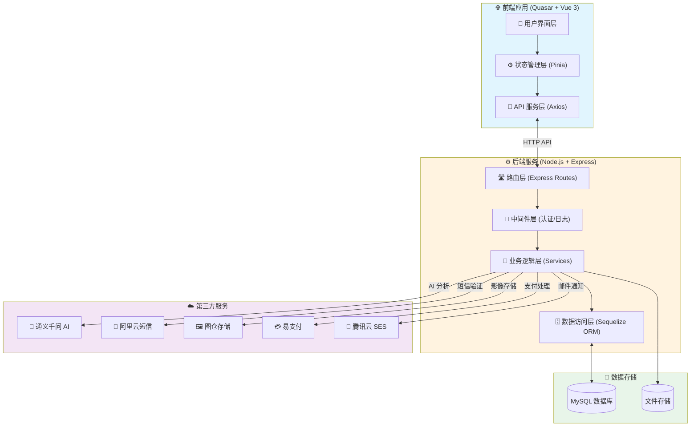
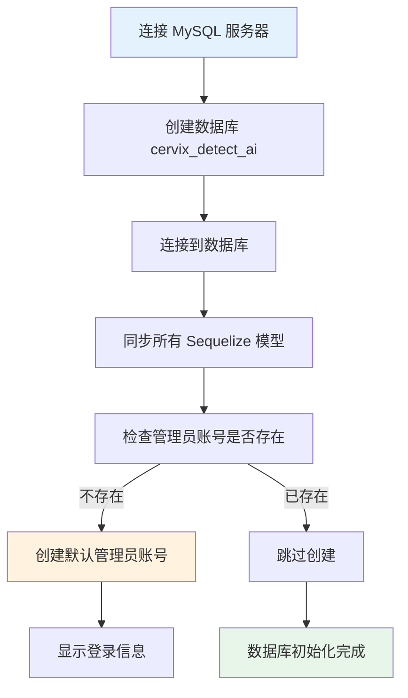
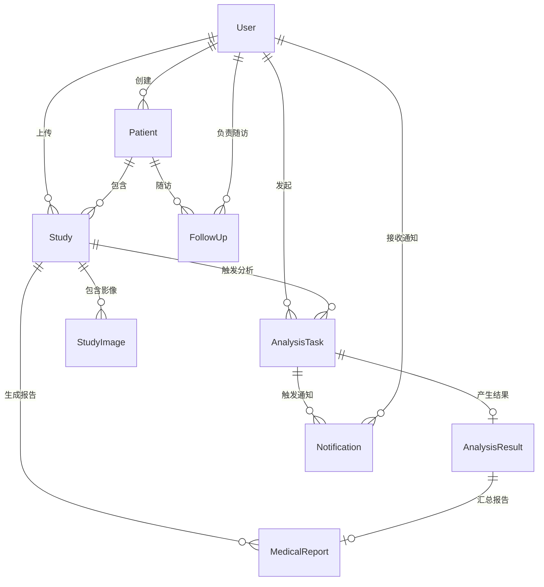

本文档面向刚接触 CervixDetectAI 项目的开发者，提供从环境准备到项目运行的全流程指导。通过本文档，您将了解系统的整体架构、技术选型，以及如何快速搭建本地开发环境并启动项目。

## 系统架构全景

CervixDetectAI 是一个采用前后端分离架构的宫颈癌 AI 筛查云平台。项目由前端应用和后端服务两部分组成，通过 RESTful API 进行数据交互。整体系统架构如图所示：



**架构说明**：前端基于 Quasar 框架构建单页应用，通过 Axios 封装 API 请求，经开发服务器代理转发至后端 API。后端采用 Express 框架构建 RESTful 接口，使用 Sequelize ORM 操作 MySQL 数据库，集成通义千问 API 实现 AI 分析功能。

Sources: [quasar.config.ts](quasar.config.ts#L70-L85), [server/index.js](server/index.js#L50-L80), [src/services/api.ts](src/services/api.ts#L1-L30)

---

## 环境准备

### 基础环境要求

在开始开发之前，请确保您的系统已安装以下软件：

| 软件 | 版本要求 | 用途说明 |
|:---|:---|:---|
| **Node.js** | ≥20.0（推荐 20 LTS） | 后端运行环境 |
| **Bun** | 最新稳定版 | 前端包管理器和构建工具（比 npm 更快） |
| **MySQL** | 5.7 或 8.0+ | 关系型数据库存储业务数据 |
| **Git** | 任意稳定版本 | 版本控制 |

**验证环境安装**：

```bash
node --version    # 应显示 v20.x.x 或更高版本
bun --version     # 应显示版本号
mysql --version   # 应显示 MySQL 版本
```

Sources: [package.json](package.json#L42-L45), [server/package.json](server/package.json#L35-L38)

### 开发工具推荐

| 工具 | 推荐理由 |
|:---|:---|
| **Visual Studio Code** | 主流前端 IDE，生态丰富 |
| **Volar** | Vue 3 官方推荐的 VSCode 扩展 |
| **ESLint + Prettier** | 代码格式化和风格统一 |
| **Quasar Extension** | Quasar 框架专用开发辅助 |

---

## 项目结构概览

CervixDetectAI 项目采用前后端分离的目录结构：

```
CervixDetectAI/
├── 📁 src/                    # 🎨 前端源代码目录
│   ├── 📁 pages/              # 页面组件（路由对应的视图）
│   ├── 📁 components/         # 可复用组件
│   ├── 📁 layouts/            # 页面布局（MainLayout、PublicLayout）
│   ├── 📁 stores/             # Pinia 状态管理
│   ├── 📁 services/           # API 服务封装
│   ├── 📁 router/             # Vue Router 路由配置
│   ├── 📁 composables/        # Vue Composition API 组合函数
│   ├── 📁 constants/          # 常量配置
│   ├── 📁 utils/              # 工具函数
│   └── 📁 boot/               # Quasar 启动文件（Axios 配置等）
│
├── 📁 server/                 # ⚙️ 后端服务目录
│   ├── 📁 routes/             # Express 路由定义
│   ├── 📁 services/           # 业务逻辑层
│   ├── 📁 models/             # Sequelize 数据模型
│   ├── 📁 middleware/         # Express 中间件
│   ├── 📁 config/             # 配置文件
│   ├── 📁 scripts/            # 数据库初始化脚本
│   ├── 📁 uploads/            # 文件上传目录
│   ├── 📁 reports/           # PDF 报告输出目录
│   └── index.js               # 后端服务入口
│
├── 📁 wiki/                   # 📚 项目文档目录
├── 📁 docs/                   # 📄 HTML 邮件模板
├── 📁 public/                 # 🖼️ 静态资源
├── quasar.config.ts           # ⚙️ Quasar 框架配置
├── package.json               # 📦 前端依赖配置
└── .env                       # 🔒 前端环境变量
```

Sources: [src/router/routes.ts](src/router/routes.ts#L1-L50), [server/index.js](server/index.js#L1-L50)

---

## 安装步骤

### 步骤一：克隆项目

```bash
git clone https://github.com/xingranya/CervixDetectAI.git
cd CervixDetectAI
```

### 步骤二：安装前端依赖

项目使用 Bun 作为包管理器（比 npm 更快）：

```bash
# 如果尚未安装 Bun
curl -fsSL https://bun.com/install | bash

# 安装前端依赖
bun install
```

Sources: [package.json](package.json#L1-L60)

### 步骤三：安装后端依赖

```bash
cd server
bun install
cd ..
```

Sources: [server/package.json](server/package.json#L1-L42)

---

## 配置详解

### 前端环境变量配置

项目根目录下的 `.env` 文件控制前端行为：

```env
# API 代理配置（开发环境使用 Vite 开发服务器代理）
VITE_API_BASE_URL=/api

# 文件上传限制（10MB）
VITE_MAX_FILE_SIZE=10485760

# 支持的图片格式
VITE_SUPPORTED_IMAGE_FORMATS=.jpg,.jpeg,.png,.tiff
```

前端开发服务器通过 `quasar.config.ts` 中的 proxy 配置将 `/api` 请求代理到后端服务：

```typescript
devServer: {
  proxy: {
    '/api': {
      target: 'http://localhost:4000',  // 后端服务地址
      changeOrigin: true,
    },
  },
},
```

Sources: [.env](.env#L1-L9), [quasar.config.ts](quasar.config.ts#L70-L85)

### 后端环境变量配置

`server/.env` 文件包含数据库、API 密钥等敏感配置：

| 配置项 | 说明 | 示例值 |
|:---|:---|:---|
| `PORT` | 后端服务端口 | `4000` |
| `DB_HOST` | MySQL 服务器地址 | `localhost` |
| `DB_PORT` | MySQL 端口 | `3306` |
| `DB_NAME` | 数据库名称 | `cervix_detect_ai` |
| `JWT_SECRET` | JWT 签名密钥 | `your-secret-key` |
| `QWEN_API_KEY` | 通义千问 API 密钥 | `sk-xxx` |
| `QWEN_MODEL` | AI 分析模型 | `qwen3.5-plus` |

> ⚠️ **安全提示**：生产环境请务必修改所有密钥和密码，不要使用示例值。

Sources: [server/.env](server/.env#L1-L84), [server/config/database.js](server/config/database.js#L1-L30)

---

## 数据库初始化

### 创建数据库

使用 MySQL 客户端创建数据库：

```sql
CREATE DATABASE cervix_detect_ai CHARACTER SET utf8mb4 COLLATE utf8mb4_unicode_ci;
```

### 运行初始化脚本

初始化脚本会自动创建所有数据表并生成默认管理员账号：

```bash
cd server
node scripts/init-database.js
```

**初始化脚本执行流程**：



初始化成功后，输出示例如下：

```
🚀 开始初始化数据库...
📡 连接到MySQL服务器...
✅ MySQL服务器连接成功!
🔨 创建数据库（如果不存在）...
✅ 数据库创建或已存在!
📡 连接到数据库...
✅ 数据库连接成功!
🔨 同步数据库结构（创建所有表）...
✅ 数据库结构同步完成!
➕ 创建默认管理员账号...
✅ 管理员账号创建成功! ID: 1
📋 登录信息:
   邮箱: admin@cervixdetectai.com
   密码: admin123456
🎉 数据库初始化完成!
```

Sources: [server/scripts/init-database.js](server/scripts/init-database.js#L1-L165), [server/models/index.js](server/models/index.js#L1-L100)

---

## 启动项目

### 启动后端服务

```bash
# 在 server 目录下
cd server
node index.js
```

后端服务启动后，终端输出：

```
🚀 CervixDetectAI 后端服务已启动
📡 服务地址: http://localhost:4000
🏥 API基础路径: http://localhost:4000/api
🤖 通义千问模型: qwen3.5-plus
🔧 运行环境: development
✅ 数据库连接成功
```

### 启动前端开发服务器

```bash
# 在项目根目录
bun run dev
```

前端开发服务器会自动打开浏览器，访问地址为 `http://localhost:9000`。

Sources: [server/index.js](server/index.js#L150-L180), [package.json](package.json#L30-L35)

---

## 快速验证

### 验证前后端连接

1. 打开浏览器访问 `http://localhost:9000`
2. 使用默认管理员账号登录：
   - **邮箱**：`admin@cervixdetectai.com`
   - **密码**：`admin123456`

### 核心页面访问

登录后应能正常访问以下页面：

| 页面 | 路径 | 说明 |
|:---|:---|:---|
| 仪表盘 | `/app/` | 系统概览和数据统计 |
| 病例管理 | `/app/studies` | 病例列表和详情 |
| 上传分析 | `/app/upload` | 影像上传和 AI 分析 |
| 患者管理 | `/app/patients` | 患者信息管理 |
| 报告中心 | `/app/reports` | 分析报告查看和下载 |

### API 文档访问

后端提供了 Swagger API 文档，访问地址：

```
http://localhost:4000/api-docs
```

Sources: [server/index.js](server/index.js#L140-L150), [src/router/routes.ts](src/router/routes.ts#L30-L90)

---

## 数据模型关系

系统核心数据模型之间的关系如下：



Sources: [server/models/index.js](server/models/index.js#L1-L105)

---

## 常见问题排查

| 问题现象 | 可能原因 | 解决方案 |
|:---|:---|:---|
| 前端无法连接后端 | 后端服务未启动 | 确认后端服务运行在 `localhost:4000` |
| 数据库连接失败 | MySQL 服务未启动 | 检查 MySQL 服务状态 |
| 登录失败 | 管理员账号未创建 | 运行 `node scripts/init-database.js` |
| API 返回 404 | 路由未注册 | 检查 `server/index.js` 中的路由注册 |
| 文件上传失败 | 目录权限不足 | 检查 `server/uploads` 目录权限 |

---

## 下一步学习路径

完成快速启动后，建议按以下顺序深入学习：

| 阶段 | 文档 | 学习目标 |
|:---|:---|:---|
| **入门** | [项目概述](1-xiang-mu-gai-shu) | 了解产品定位和核心功能 |
| **前端** | [前端架构](5-qian-duan-ji-zhu-zhan-gai-lan) | 掌握 Vue 3 + Quasar 开发模式 |
| **后端** | [后端服务架构](8-hou-duan-fu-wu-jia-gou) | 理解 Express + Sequelize 架构 |
| **业务** | [通义千问AI分析服务](10-tong-yi-qian-wen-aifen-xi-fu-wu) | 深入 AI 分析流程实现 |
| **部署** | [安装与部署](安装与部署) | 掌握生产环境部署方法 |

---