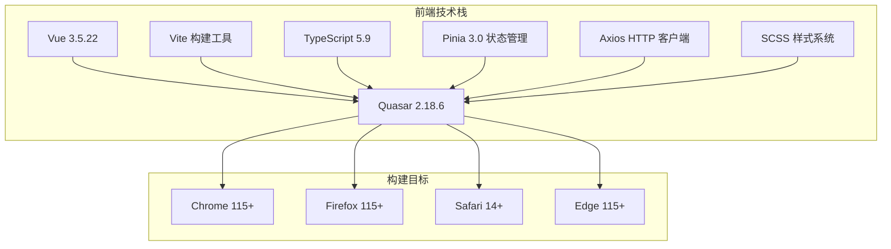
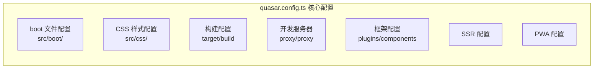
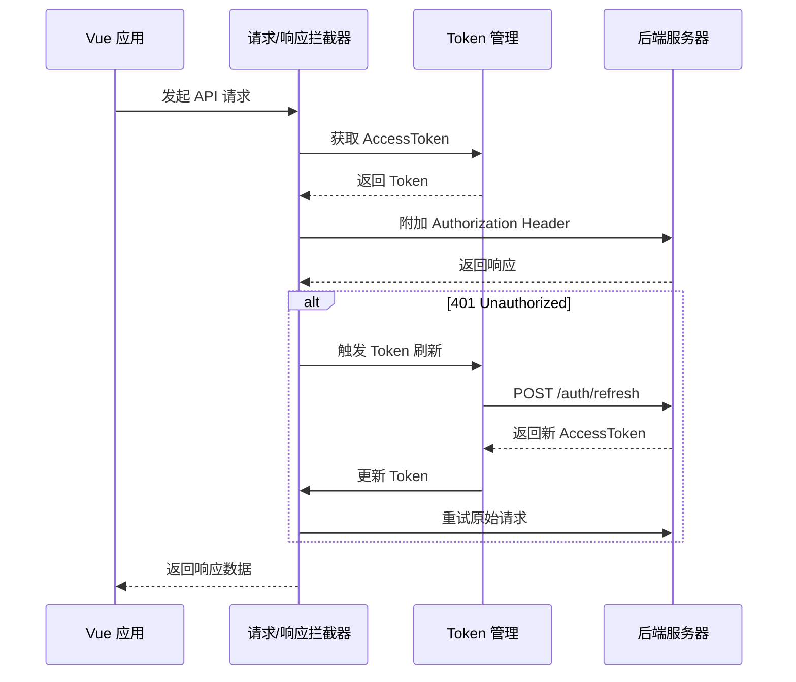
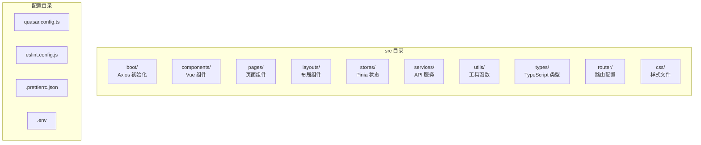

本文档详细介绍 CervixDetectAI 项目前端开发环境的搭建流程，涵盖 Node.js 环境配置、项目依赖安装、核心配置文件解析以及开发服务器的启动方法。通过本文档，初级开发者能够在 15 分钟内完成本地开发环境的全部配置。

## 技术栈概览

本项目采用 **Quasar Framework** 作为主开发框架，这是一款基于 Vue 3 的企业级 UI 组件库，集成了 Vite 构建工具、TypeScript 类型系统、Pinia 状态管理以及 SCSS 样式系统。



**关键依赖版本要求**：项目要求 Node.js 版本为 ^28、^26、^24、^22 或 ^20，推荐使用 Node.js 22 LTS 以获得最佳兼容性。

Sources: [package.json](package.json#L12-L18)

## 前置环境准备

### 安装 Node.js

本项目依赖 Node.js 运行时环境。开发者需要根据以下步骤完成安装：

**推荐使用 nvm（Node Version Manager）管理多版本 Node.js**。在 macOS 或 Linux 环境下执行以下命令安装 nvm：

```bash
curl -o- https://raw.githubusercontent.com/nvm-sh/nvm/v0.39.7/install.sh | bash
```

安装完成后，重启终端并执行以下命令安装 Node.js 22 LTS：

```bash
nvm install 22
nvm use 22
nvm alias default 22
```

验证安装是否成功：

```bash
node --version  # 应显示 v22.x.x
npm --version   # 应显示 11.x.x
```

Sources: [package.json](package.json#L12-L18)

### 包管理器选择

项目支持 npm、yarn 和 bun 三种包管理器。根据 package.json 中的 engines 字段要求：

| 包管理器 | 最低版本要求 | 推荐版本 |
|---------|------------|---------|
| npm | >= 6.13.4 | 10.x+ |
| yarn | >= 1.21.1 | 1.22.x |
| bun | 无特定要求 | 1.x |

本项目使用 Bun 作为首选包管理器，其安装命令为：

```bash
curl -fsSL https://bun.sh/install | bash
```

Sources: [package.json](package.json#L12-L18)

## 项目初始化

### 克隆项目代码

```bash
git clone <repository-url>
cd CervixDetectAI
```

### 安装项目依赖

使用 Bun 安装项目依赖：

```bash
bun install
```

Bun 会自动读取 `package.json` 中的 dependencies 和 devDependencies，并解析 `bun.lock` 锁定文件确保依赖版本一致性。安装过程通常需要 2-5 分钟，取决于网络状况。

Sources: [package.json](package.json#L1-L60)

### Quasar 框架准备

Quasar CLI 需要在安装依赖后执行一次 prepare 命令，用于生成内部类型定义文件：

```bash
bun run postinstall
```

此命令会调用 `quasar prepare` 脚本，生成 `.quasar/tsconfig.json` 等内部配置文件。

Sources: [package.json](package.json#L8-L10)

## 核心配置文件详解

### 项目入口配置

**quasar.config.ts** 是 Quasar 框架的主配置文件，采用 TypeScript 编写，定义了项目的构建、开发服务器、路由、状态管理等核心设置。



#### 开发服务器代理配置

开发环境通过 Vite 代理将前端请求转发到后端服务器，避免跨域问题：

Sources: [quasar.config.ts](quasar.config.ts#L59-L73)

| 代理路径 | 目标地址 | 用途 |
|---------|---------|------|
| `/api` | `http://localhost:4000` | RESTful API 请求 |
| `/uploads` | `http://localhost:4000` | 上传文件访问 |
| `/reports` | `http://localhost:4000` | 报告文件访问 |

开发时前端访问 `/api/users` 会被代理到 `http://localhost:4000/api/users`，生产环境则由 Nginx 处理相同的转发逻辑。

#### 构建目标配置

```typescript
build: {
  target: {
    browser: ['es2022', 'firefox115', 'chrome115', 'safari14'],
    node: 'node20',
  }
}
```

项目编译为 ES2022 语法标准，确保在主流浏览器上的兼容性。`vue-tsc` 会在构建时进行严格的 TypeScript 类型检查。

Sources: [quasar.config.ts](quasar.config.ts#L39-L47)

### TypeScript 配置

项目 TypeScript 配置继承自 Quasar 生成的内部配置：

Sources: [tsconfig.json](tsconfig.json#L1-L4)

```typescript
{
  "extends": "./.quasar/tsconfig.json"
}
```

Quasar 会在首次执行 `quasar dev` 或 `quasar build` 时自动生成 `.quasar/tsconfig.json`，包含 Vue 组件的 shim 声明和 JSX 配置。

### 环境变量配置

项目根目录的 `.env` 文件定义了前端可用的环境变量：

Sources: [.env](.env#L1-L9)

| 变量名 | 默认值 | 说明 |
|-------|-------|------|
| `VITE_API_BASE_URL` | `/api` | API 服务基础路径 |
| `VITE_MAX_FILE_SIZE` | `10485760` | 最大文件上传大小（10MB） |
| `VITE_SUPPORTED_IMAGE_FORMATS` | `.jpg,.jpeg,.png,.tiff` | 支持的图片格式 |

开发环境下使用相对路径 `/api`，请求会通过开发服务器代理转发。生产环境同样使用相对路径，由 Nginx 处理反向代理。

Sources: [src/utils/apiBaseUrl.ts](src/utils/apiBaseUrl.ts#L1-L55)

### 代码质量配置

#### ESLint 配置

项目使用 Flat Config 格式的 ESLint 配置，集成了 TypeScript 和 Vue 插件支持：

Sources: [eslint.config.js](eslint.config.js#L1-L84)

| 插件 | 配置级别 | 说明 |
|-----|---------|------|
| `@quasar/app-vite` | recommended | Quasar 框架特定规则 |
| `eslint-plugin-vue` | flat/essential | Vue 组件语法规则 |
| `@vue/eslint-config-typescript` | recommended | TypeScript 类型检查规则 |

ESLint 在开发模式下不会阻止构建，仅在终端输出警告；生产模式（`NODE_ENV=production`）下会将 `no-debugger` 规则升级为错误。

#### Prettier 配置

代码格式化使用 Prettier，配置位于项目根目录的 `.prettierrc.json`：

Sources: [.prettierrc.json](.prettierrc.json#L1-L6)

```json
{
  "singleQuote": true,
  "printWidth": 100
}
```

配置采用单引号字符串，最大行宽 100 字符，与 ESLint 的 `@vue/eslint-config-prettier/skip-formatting` 配合使用，确保格式化不会干扰 ESLint 规则。

#### 编辑器配置

`.editorconfig` 文件确保不同编辑器的代码风格一致：

Sources: [.editorconfig](.editorconfig#L1-L8)

| 配置项 | 值 | 说明 |
|-------|-----|------|
| charset | utf-8 | 文件编码 |
| indent_size | 2 | 缩进空格数 |
| indent_style | space | 使用空格缩进 |
| end_of_line | lf | Unix 风格换行符 |
| insert_final_newline | true | 文件末尾插入空行 |

### API 客户端配置

项目使用统一的 Axios 实例进行 HTTP 请求，配置位于 `src/services/apiClient.ts`：

Sources: [src/services/apiClient.ts](src/services/apiClient.ts#L1-L147)



**关键特性**：

- 30 秒请求超时控制
- 自动附加 Authorization Bearer Token
- Token 过期自动刷新（singleflight 模式防止并发刷新）
- 开发环境日志输出

### 样式系统配置

#### 设计令牌

项目建立了完整的设计令牌（Design Tokens）系统，统一管理颜色、间距、圆角等视觉变量：

Sources: [src/css/design-tokens.scss](src/css/design-tokens.scss#L1-L50)

```scss
:root {
  // 语义化颜色
  --app-bg-primary: #ffffff;
  --app-text-primary: #1e293b;
  --app-border-default: #d1dbe8;
  
  // 间距
  --app-space-xs: 4px;
  --app-space-sm: 8px;
  --app-space-md: 16px;
  
  // 圆角
  --app-radius-sm: 8px;
  --app-radius-md: 12px;
  --app-radius-lg: 16px;
}
```

#### Quasar 变量覆盖

`quasar.variables.scss` 文件覆盖了 Quasar 框架的默认主题色：

Sources: [src/css/quasar.variables.scss](src/css/quasar.variables.scss#L1-L26)

```scss
$primary: #1976d2;
$secondary: #26a69a;
$accent: #9c27b0;
$positive: #21ba45;
$negative: #c10015;
$info: #31ccec;
$warning: #f2c037;
```

#### PostCSS 配置

PostCSS 配置处理 CSS 前缀自动补全，确保浏览器兼容性：

Sources: [postcss.config.js](postcss.config.js#L1-L30)

```javascript
export default {
  plugins: [
    autoprefixer({
      overrideBrowserslist: [
        'last 4 Chrome versions',
        'last 4 Firefox versions',
        'last 4 Safari versions',
        'last 4 iOS versions',
      ],
    }),
  ],
};
```

## 启动开发服务器

### 一键启动

在项目根目录执行以下命令启动开发服务器：

```bash
bun run dev
```

此命令会调用 `quasar dev`，Quasar CLI 会自动完成以下步骤：

1. 检查 `.quasar/tsconfig.json` 是否存在，如不存在则生成
2. 启动 Vite 开发服务器
3. 配置代理规则
4. 打开浏览器窗口（默认 `http://localhost:9000`）
5. 启用 HMR（热模块替换）实现实时预览

Sources: [package.json](package.json#L8)

### 开发服务器行为

| 配置项 | 值 | 说明 |
|-------|-----|------|
| 端口 | 9000 | 开发服务器监听端口 |
| 路由模式 | hash | URL 采用 `#/` 前缀 |
| 代理 | `/api` → `localhost:4000` | API 请求转发 |
| 浏览器自动打开 | true | 启动后自动打开浏览器 |
| Vite 检查器 | vue-tsc + ESLint | 代码类型和语法检查 |

Sources: [quasar.config.ts](quasar.config.ts#L55-L73)

### 访问应用

开发服务器启动后，访问以下地址：

- **应用首页**：`http://localhost:9000/#/`
- **登录页面**：`http://localhost:9000/#/login`
- **仪表盘**：`http://localhost:9000/#/dashboard`

注意：URL 中的 `#` 是 Hash 路由模式的标准分隔符。

## 常用开发命令

### 代码质量检查

```bash
# 运行 ESLint 检查
bun run lint

# 运行 TypeScript 类型检查
bun run typecheck

# 代码格式化
bun run format
```

Sources: [package.json](package.json#L6-L10)

### 生产构建

```bash
# 构建生产环境版本
bun run build
```

构建产物输出到 `dist/spa` 目录，可直接部署到任意静态文件服务器或 CDN。

## 目录结构概览



**核心目录说明**：

| 目录 | 用途 | 关键文件 |
|-----|------|---------|
| `src/boot` | 应用启动初始化 | `axios.ts` - Axios 实例注册 |
| `src/components` | 可复用组件 | 按功能模块划分 |
| `src/pages` | 页面组件 | 对应路由的视图层 |
| `src/stores` | Pinia 状态管理 | `authStore.ts`、`studyStore.ts` 等 |
| `src/services` | API 服务层 | `apiClient.ts`、`apiService.ts` |
| `src/utils` | 工具函数 | `apiBaseUrl.ts`、`storage.ts` |

Sources: [src](src)

## 故障排除

### 常见问题

**1. `quasar: command not found`**

执行 `bun run postinstall` 重新安装 Quasar CLI 依赖。

**2. 端口 9000 被占用**

修改 `quasar.config.ts` 添加端口配置：

```typescript
devServer: {
  port: 9001,  // 使用其他端口
}
```

**3. 代理请求失败**

确保后端服务器（`localhost:4000`）已启动运行。

**4. TypeScript 类型错误**

运行 `bun run typecheck` 查看详细错误信息，常见原因包括依赖未正确安装或 `.quasar/tsconfig.json` 缺失。

## 后续步骤

完成前端环境配置后，建议按以下顺序阅读：

1. **[后端环境配置](4-hou-duan-huan-jing-pei-zhi)** - 配置后端服务器，实现前后端联调
2. **[前端技术栈概览](5-qian-duan-ji-zhu-zhan-gai-lan)** - 深入了解前端架构设计
3. **[快速启动](2-kuai-su-qi-dong)** - 完整的前后端联调启动流程