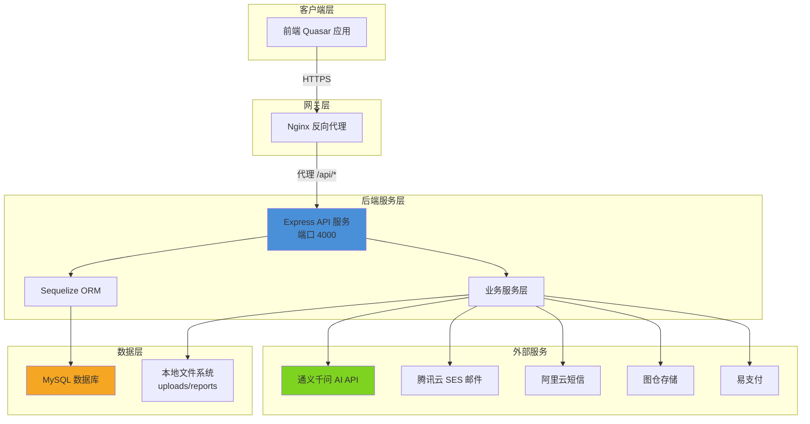
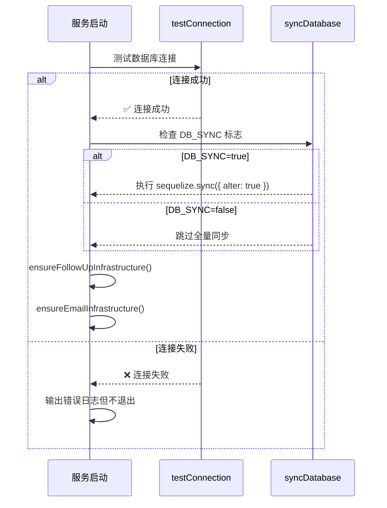
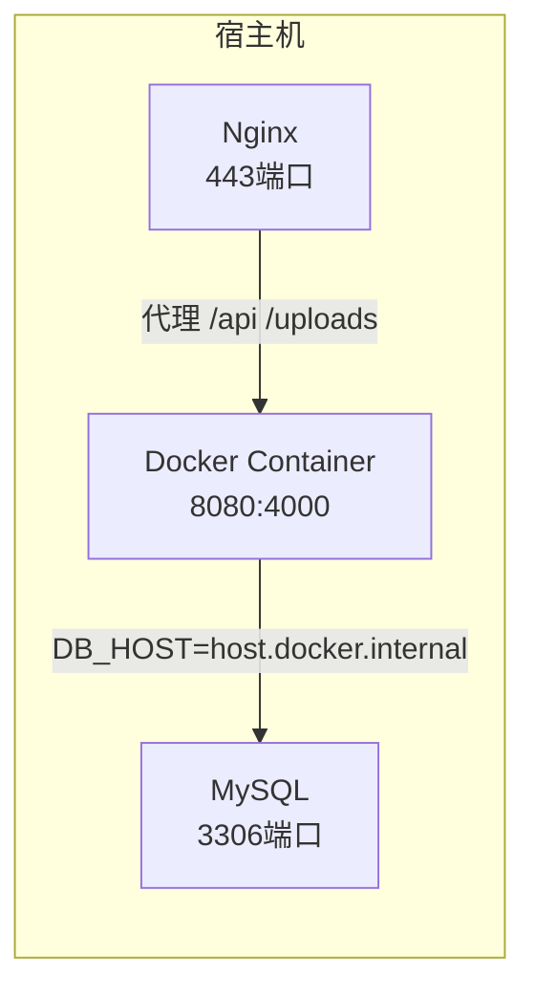

本文档为开发者提供 CervixDetectAI 后端服务的完整环境配置指南，涵盖开发环境搭建、生产环境部署以及核心服务配置说明。

## 技术架构概览

CervixDetectAI 后端采用 **Express + Sequelize** 技术栈构建，通过 MySQL 数据库存储业务数据，并通过通义千问 AI API 提供医学影像分析能力。



Sources: [index.js](server/index.js#L1-L50), [ecosystem.config.js](server/ecosystem.config.js#L1-L22)

## 依赖环境

### 运行时要求

| 组件 | 版本要求 | 说明 |
|------|---------|------|
| **Node.js** | ≥18.0.0 | 建议使用 LTS 版本 |
| **Bun** | ≥1.0.0 | 推荐作为运行时和包管理器 |
| **MySQL** | ≥8.0 | 数据库服务 |
| **npm/yarn/pnpm** | 最新稳定版 | 备选包管理器 |

### 核心依赖说明

```json
// server/package.json 关键依赖
{
  "dependencies": {
    "express": "^5.1.0",      // Web 框架
    "sequelize": "^6.37.7",   // ORM 框架
    "mysql2": "^3.15.3",      // MySQL 驱动
    "jsonwebtoken": "^9.0.2", // JWT 认证
    "bcrypt": "^6.0.0",       // 密码加密
    "multer": "^2.0.2",       // 文件上传
    "sharp": "^0.34.5",       // 图片处理
    "dotenv": "^17.2.3",     // 环境变量管理
    "node-cron": "^4.2.1",   // 定时任务
    "axios": "^1.13.2"        // HTTP 客户端
  }
}
```

Sources: [package.json](server/package.json#L1-L42)

## 环境变量配置

项目使用 `dotenv` 管理环境变量，配置文件位于 `server/.env`。系统通过 `loadEnv.js` 固定加载该文件，确保无论从哪个目录启动服务都能正确读取配置。

Sources: [loadEnv.js](server/config/loadEnv.js#L1-L10)

### 开发环境配置 (server/.env)

```bash
# 服务端口
PORT=4000
NODE_ENV=development

# 数据库配置（远程云数据库）
DB_HOST=mysql7.sqlpub.com
DB_PORT=3312
DB_USER=xingranya
DB_PASSWORD=SLGMA9FHNsKTYCMQ
DB_NAME=cervix_detect_ai
DB_SYNC=false

# 通义千问 AI 配置
QWEN_API_KEY=sk-xxxxxxxxxxxxxx
QWEN_API_URL=https://dashscope.aliyuncs.com/compatible-mode/v1
QWEN_MODEL=qwen3.5-plus
QWEN_CHAT_MODEL=qwen3.5-397b-a17b
QWEN_API_TIMEOUT_MS=180000

# JWT 认证配置
JWT_SECRET=your-secret-key-change-in-production-min-128-bits
JWT_ACCESS_EXPIRATION=1h
JWT_REFRESH_EXPIRATION=7d

# 文件上传配置
MAX_IMAGE_SIZE=10485760
UPLOAD_DIR=./uploads

# 邮件服务配置
TENCENT_SECRET_ID=AKIDxxxxxxxxxxxx
TENCENT_SECRET_KEY=xxxxxxxxxxxx
TENCENT_SES_REGION=ap-guangzhou
TENCENT_SES_FROM_EMAIL=no-reply@hpvsc.icu

# 短信服务配置
ALIYUN_ACCESS_KEY_ID=LTAI5tJ1YVm7jQsabeRe7jWz
ALIYUN_ACCESS_KEY_SECRET=xxxxxxxxxxxx
ALIYUN_SMS_SIGN_NAME=速通互联验证码
ALIYUN_SMS_TEMPLATE_CODE=100001

# 支付配置
EPAY_PID=10002
EPAY_KEY=9XvQOE6Cp0Na1OrW2sEL
EPAY_API_URL=https://mpay.qzz.io/xpay/epay/
```

Sources: [.env](server/.env#L1-L84)

### 生产环境配置 (server/.env(服务器))

生产环境配置与开发环境的主要区别在于：

| 配置项 | 开发环境 | 生产环境 |
|--------|---------|---------|
| `NODE_ENV` | `development` | `production` |
| `CORS_ORIGINS` | `localhost:9000/9001/9002` | `https://hpvsc.icu` |
| `DB_HOST` | 远程云数据库 | `localhost` |
| 数据库用户 | 远程用户 | `root` |
| 支付 PID | 测试商户 | 正式商户 |

Sources: [.env(服务器)](server/.env%28%E6%9C%8D%E5%8A%A1%E5%99%A8%29#L1-L75)

## 数据库配置详解

### Sequelize 连接配置

数据库连接通过 `config/database.js` 定义，支持开发和生产两套配置：

```javascript
// 连接池配置
pool: {
  max: 20,      // 最大连接数
  min: 5,       // 最小连接数
  acquire: 30000,  // 获取连接超时(ms)
  idle: 10000   // 空闲连接超时(ms)
}

// 字符集配置
charset: 'utf8mb4',
collate: 'utf8mb4_unicode_ci'

// 软删除配置
paranoid: true  // 启用软删除，删除操作会设置 deletedAt 而非真正删除
```

Sources: [database.js](server/config/database.js#L1-L64)

### 启动时的数据库初始化

服务启动时会执行以下数据库初始化流程：



Sources: [index.js](server/index.js#L193-L216)

## 服务启动与运行

### 开发环境启动

```bash
# 进入后端目录
cd server

# 使用 Bun 安装依赖
bun install

# 启动开发服务器
bun run dev
# 或
bun start
```

服务将在 `http://localhost:4000` 启动，自动加载 `server/.env` 中的开发配置。

Sources: [package.json](server/package.json#L6-L7)

### PM2 进程管理（生产环境推荐）

项目提供 `ecosystem.config.js` 用于 PM2 进程管理：

```javascript
module.exports = {
  apps: [{
    name: 'cervix-detect-ai-backend',
    script: 'index.js',
    interpreter: 'bun',      // 使用 Bun 作为运行时
    instances: 1,
    autorestart: true,
    watch: false,
    max_memory_restart: '1G',
    env: {
      NODE_ENV: 'production',
      PORT: 4000
    }
  }]
}
```

启动命令：
```bash
# 安装依赖后
bun install

# 使用 bun 启动（开发）
bun run start

# 使用 PM2 启动（生产）
pm2 start ecosystem.config.js

# PM2 常用命令
pm2 list           # 查看进程列表
pm2 logs           # 查看日志
pm2 restart all    # 重启所有进程
pm2 stop all       # 停止所有进程
```

Sources: [ecosystem.config.js](server/ecosystem.config.js#L1-L22)

### Docker 容器化部署

项目支持 Docker 容器化部署，容器内部同时运行后端 API 服务和前端静态资源：



**构建镜像**：
```bash
docker build -t cervix-app:v1 .
```

**启动容器**：
```bash
docker run -d \
  --name cervix-container \
  -p 8080:4000 \
  --add-host=host.docker.internal:host-gateway \
  -e DB_HOST=host.docker.internal \
  -e DB_USER=root \
  -e DB_PASSWORD=xingran8 \
  -e NODE_ENV=production \
  -v $(pwd)/server/uploads:/app/server/uploads \
  -v $(pwd)/server/reports:/app/server/reports \
  --restart always \
  cervix-app:v1
```

Sources: [docker-deployment.md](docs/docker-deployment.md#L1-L100)

### Nginx 反向代理配置

生产环境通过 Nginx 将 HTTPS 请求反向代理到后端服务：

```nginx
server {
    listen 443 ssl;
    server_name hpvsc.icu;
    
    # API 反向代理到后端
    location /api/ {
        proxy_pass http://127.0.0.1:4000/api/;
        proxy_http_version 1.1;
        proxy_set_header Host $host;
        proxy_set_header X-Real-IP $remote_addr;
        proxy_set_header X-Forwarded-For $proxy_add_x_forwarded_for;
        proxy_set_header X-Forwarded-Proto $scheme;
    }
    
    # 上传文件代理
    location /uploads {
        proxy_pass http://localhost:4000/uploads;
        proxy_set_header Host $host;
        expires 7d;
    }
    
    # SPA 路由 fallback
    location / {
        try_files $uri $uri/ /index.html;
    }
}
```

Sources: [nginx配置.txt](nginx%E9%85%8D%E7%BD%AE.txt#L1-L180)

## 核心服务配置

### 通义千问 AI 服务

AI 分析服务是系统的核心功能，配置参数说明：

| 参数 | 说明 | 推荐值 |
|------|------|--------|
| `QWEN_API_KEY` | 通义千问 API 密钥 | 向阿里云申请 |
| `QWEN_API_URL` | API 端点地址 | `https://dashscope.aliyuncs.com/compatible-mode/v1` |
| `QWEN_MODEL` | 分析模型 | `qwen3.5-plus` |
| `QWEN_CHAT_MODEL` | 对话模型 | `qwen3.5-397b-a17b` |
| `QWEN_API_TIMEOUT_MS` | API 超时时间 | `180000` (3分钟) |
| `MAX_CONCURRENT_ANALYSIS` | 最大并发分析数 | `10` |

Sources: [.env](server/.env#L2-L13)

### 图仓存储服务

系统使用图仓服务存储医学影像，配置参数：

| 参数 | 说明 |
|------|------|
| `TUCANG_API_BASE_URL` | API 基础地址 |
| `TUCANG_TOKEN` | API 访问令牌 |
| `TUCANG_STUDY_FOLDER_ID` | 影像存储文件夹 ID |
| `TUCANG_AVATAR_FOLDER_ID` | 头像存储文件夹 ID |
| `TUCANG_TIMEOUT_MS` | 请求超时 (15000ms) |
| `TUCANG_RETRY_MAX` | 最大重试次数 (2次) |

Sources: [.env](server/.env#L74-L81)

### JWT 认证配置

```bash
# JWT 密钥（生产环境必须修改，建议至少 128 位）
JWT_SECRET=your-secret-key-change-in-production-min-128-bits

# Token 过期时间
JWT_ACCESS_EXPIRATION=1h    # 访问令牌：1小时
JWT_REFRESH_EXPIRATION=7d   # 刷新令牌：7天
```

Sources: [.env](server/.env#L38-L40)

## 目录结构说明

```
server/
├── config/                 # 配置文件
│   ├── database.js        # Sequelize 数据库配置
│   ├── loadEnv.js         # 环境变量加载
│   └── sequelize.js       # Sequelize 实例创建
├── routes/                 # 路由定义 (16个路由模块)
│   ├── auth.js           # 认证
│   ├── analyze.js        # AI 分析
│   ├── patients.js       # 患者管理
│   ├── studies.js        # 影像管理
│   └── ...
├── services/              # 业务服务层
│   ├── qwenService.js    # 通义千问服务
│   ├── paymentService.js # 支付服务
│   ├── email.service.js  # 邮件服务
│   └── ...
├── models/                # Sequelize 模型
├── middleware/            # 中间件
├── scripts/               # 运维脚本
│   ├── init-database.js  # 数据库初始化
│   └── ...
├── uploads/               # 上传文件目录
├── reports/               # PDF 报告目录
├── index.js               # 应用入口
└── ecosystem.config.js    # PM2 配置
```

Sources: [目录结构](get_dir_structure#server)

## 环境变量清单速查

| 变量名 | 必填 | 说明 |
|--------|------|------|
| `PORT` | 是 | 服务端口，默认 4000 |
| `NODE_ENV` | 是 | `development` 或 `production` |
| `DB_HOST` | 是 | MySQL 主机地址 |
| `DB_PORT` | 是 | MySQL 端口，默认 3306 |
| `DB_USER` | 是 | 数据库用户名 |
| `DB_PASSWORD` | 是 | 数据库密码 |
| `DB_NAME` | 是 | 数据库名 |
| `JWT_SECRET` | 是 | JWT 密钥 |
| `QWEN_API_KEY` | 是 | 通义千问 API 密钥 |
| `QWEN_MODEL` | 否 | AI 分析模型 |
| `CORS_ORIGINS` | 否 | 允许的跨域来源 |
| `MAX_CONCURRENT_ANALYSIS` | 否 | AI 并发限制 |

## 常见问题排查

### 数据库连接失败

```
❌ 数据库连接失败: ECONNREFUSED
```

**解决方案**：
1. 检查 MySQL 服务是否运行
2. 确认 `DB_HOST` 和 `DB_PORT` 配置正确
3. 检查数据库用户是否有远程访问权限
4. Docker 部署时添加 `--add-host=host.docker.internal:host-gateway`

### 支付回调无法访问

支付网关回调失败通常是因为回调地址配置为本地地址：

```bash
# ❌ 错误配置
EPAY_NOTIFY_URL=http://localhost:4000/api/payment/notify

# ✅ 正确配置
EPAY_NOTIFY_URL=https://hpvsc.icu/api/payment/notify
```

### 前端构建产物缺失

如果日志显示 `⚠️ 未找到前端构建产物，仅运行 API 服务`，需要：

1. 在前端目录执行构建：`quasar build`
2. 配置 `FRONTEND_DIST_PATH` 指向正确的构建目录
3. 或使用 Nginx 独立托管前端静态文件

---

## 下一步

完成环境配置后，建议继续阅读：

- [后端服务架构](8-hou-duan-fu-wu-jia-gou) — 深入了解后端服务设计
- [数据模型与ORM映射](9-shu-ju-mo-xing-yu-ormying-she) — 数据库表结构设计
- [部署与运维指南](18-bu-shu-yu-yun-wei-zhi-nan) — 生产环境部署详解