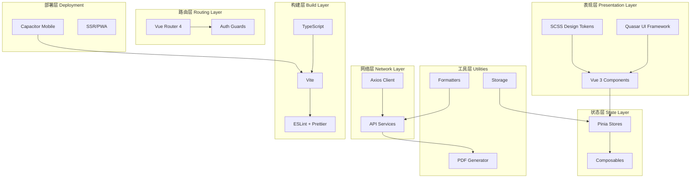

CervixDetectAI 前端采用现代化的 Vue 3 生态体系构建，基于 Quasar Framework 提供跨平台企业级医疗应用解决方案。本章节详细阐述从底层运行时到上层业务组件的完整技术选型，为开发者理解系统架构提供全局视角。

## 核心技术架构图

以下架构图展示了前端系统的核心组成部分及其依赖关系：



## 核心框架选型

### Vue 3 组合式 API

项目采用 Vue 3 作为核心框架，充分利用其组合式 API（Composition API）实现逻辑复用与代码组织优化。所有页面与组件均使用 `<script setup>` 语法糖编写，这种模式相比传统的选项式 API 在复杂组件中具有显著优势：

```typescript
// src/layouts/MainLayout.vue
import { computed, ref } from 'vue';
import { useAuthStore } from 'src/stores/authStore';

const authStore = useAuthStore();
const leftDrawerOpen = ref(true);

const currentHospital = computed(() => {
  if (!authStore.user?.hospital_id) return null;
  return HOSPITALS.find((hospital) => hospital.id === authStore.user?.hospital_id) || null;
});
```

Vue 3.5.22 版本提供了更好的响应式追踪性能和更小的包体积，为应用奠定了坚实的响应式基础。

Sources: [package.json](package.json#L1-L60), [src/layouts/MainLayout.vue](src/layouts/MainLayout.vue#L1-L62)

### Quasar Framework 2.x

Quasar Framework（v2.18.6）是本项目的 UI 组件库选择，它提供了超过 70 个响应式组件，涵盖从基础表单控件到复杂数据表格的全方位需求。Quasar 的核心优势在于其"一次编写，到处运行"的理念——同一套代码可编译为 SPA、PWA、SSR、移动应用（Capacitor/Cordova）和桌面应用（Electron）。

```typescript
// quasar.config.ts
framework: {
  config: {},
  plugins: ['Notify', 'Loading', 'Dialog', 'AppFullscreen', 'Dark'],
},

// 医疗场景动画配置：仅保留稳重克制的轻量动画
animations: ['fadeIn', 'fadeOut', 'zoomIn', 'zoomOut'],
```

项目配置了专门针对医疗场景的动画策略，移除了可能引起视觉疲劳的复杂过渡动画，仅保留 `fadeIn`、`fadeOut`、`zoomIn`、`zoomOut` 四种基础过渡效果，既保证用户体验的流畅性，又符合医疗应用的专业调性。

Sources: [quasar.config.ts](quasar.config.ts#L1-L60), [quasar.config.ts](quasar.config.ts#L70-L80)

### TypeScript 类型系统

整个前端代码库采用 TypeScript（5.9.2）进行开发，通过严格的类型检查确保代码质量。TypeScript 配置继承自 Quasar CLI 的默认配置，同时启用了严格模式：

```json
// tsconfig.json
{
  "extends": "./.quasar/tsconfig.json"
}
```

类型定义文件组织在 `src/types/` 目录下，包含 API 类型、存储类型、模型类型等核心类型定义：

```typescript
// src/types/api.ts
export interface ApiResponse<T = unknown> {
  success: boolean;
  data: T;
  message?: string;
}

export interface TaskStatusResponse {
  taskId: string;
  status: 'PENDING' | 'PROCESSING' | 'SUCCESS' | 'FAILED';
  progress: number;
  result?: {
    diagnosis: string;
    confidence: number;
    biomarkers: { HPV: string; p16: string; Ki67: string; };
    recommendations: string[];
    detailedReport: string;
  };
}
```

Sources: [tsconfig.json](tsconfig.json#L1-L4), [src/types/api.ts](src/types/api.ts#L1-L50)

## 状态管理方案

### Pinia 状态管理

项目使用 Pinia（v3.0.1）作为官方推荐的状态管理方案，相比 Vuex 提供了更简洁的 API 和更好的 TypeScript 支持。Pinia 的 store 定义采用函数式风格，支持 getter 和 action 的类型推断。

```typescript
// src/stores/authStore.ts
export const useAuthStore = defineStore('auth', {
  state: () => ({
    user: null as User | null,
    token: null as string | null,
    refreshToken: null as string | null,
    isAuthenticated: false,
    isAuthenticating: false,
    hasInitialized: false,
  }),

  getters: {
    isLoggedIn: (state) => !!state.token,
    currentUser: (state) => state.user,
    authToken: (state) => state.token,
  },

  actions: {
    async login(email: string, password: string) {
      return this._handleAuthRequest(() => authAPI.login(email, password), '登录失败');
    },
    // ...
  },
});
```

项目定义了 7 个核心 store，分别管理认证、分析任务、模型配置、患者洞察、患者数据、主题和病例数据：

| Store 文件 | 职责范围 | 核心状态 |
|-----------|---------|---------|
| `authStore.ts` | 用户认证与授权 | token、user、isAuthenticated |
| `analysisStore.ts` | AI 分析任务状态 | tasks、currentTask、loading |
| `studyStore.ts` | 病例数据管理 | studies、currentStudy、pagination |
| `patientStore.ts` | 患者信息管理 | patients、currentPatient |
| `patientInsightsStore.ts` | 患者洞察数据 | insights、loading |
| `modelStore.ts` | AI 模型配置 | models、activeModel |
| `themeStore.ts` | 主题与视觉配置 | isDark、theme |

Sources: [src/stores/index.ts](src/stores/index.ts#L1-L33), [src/stores/authStore.ts](src/stores/authStore.ts#L1-L50), [src/stores/studyStore.ts](src/stores/studyStore.ts#L1-L60)

### Composables 组合式函数

项目大量使用 Vue 3 的 Composables 模式封装可复用逻辑，这些组合式函数类似于 React Hooks，但充分利用了 Vue 的响应式系统：

```typescript
// src/composables/useNotifications.ts
export function useNotifications() {
  const router = useRouter();
  const $q = useQuasar();
  
  const notifications = ref<NotificationItem[]>([]);
  const unreadCount = ref(0);
  
  const loadNotifications = async () => {
    const response = await notificationAPI.getNotifications({ page: 1, limit: 8 });
    notifications.value = response.data.notifications;
  };
  
  return {
    notifications,
    unreadCount,
    loadNotifications,
    markAllNotificationsAsRead,
    handleNotificationClick,
  };
}
```

Composables 目录包含通知管理、订阅计划、AI 偏好设置和报告下载等通用业务逻辑的封装。

Sources: [src/composables/useNotifications.ts](src/composables/useNotifications.ts#L1-L80)

## 路由与导航系统

### Vue Router 4 路由配置

项目使用 Vue Router 4（v4.0.12）实现客户端路由，采用 Hash 模式以支持无服务器配置的直接访问。路由配置采用懒加载模式，优化首屏加载性能：

```typescript
// src/router/routes.ts
const routes: RouteRecordRaw[] = [
  {
    path: '/',
    component: () => import('layouts/PublicLayout.vue'),
    children: [
      { path: '', component: () => import('pages/LoginPage.vue') },
      { path: 'login', component: () => import('pages/LoginPage.vue') },
      { path: 'register', component: () => import('pages/RegisterPage.vue') },
      // ...
    ],
  },
  {
    path: '/app',
    component: () => import('layouts/MainLayout.vue'),
    meta: { requiresAuth: true },
    children: [
      { path: '', name: 'dashboard', component: () => import('pages/DashboardPage.vue') },
      { path: 'studies', name: 'studies', component: () => import('pages/StudiesPage.vue') },
      // ...
    ],
  },
];
```

路由守卫（Navigation Guard）实现全局认证拦截，确保需要认证的页面在未登录时自动跳转至登录页：

```typescript
// src/router/index.ts
Router.beforeEach((to, from, next) => {
  const authStore = useAuthStore();
  
  if (!authStore.hasInitialized) {
    authStore.initializeAuth();
  }
  
  if (to.matched.some((record) => record.meta.requiresAuth)) {
    if (!authStore.isAuthenticated) {
      next({ path: '/login', query: { redirect: to.fullPath } });
    } else {
      next();
    }
  } else {
    next();
  }
});
```

Sources: [src/router/routes.ts](src/router/routes.ts#L1-L122), [src/router/index.ts](src/router/index.ts#L1-L67)

## API 网络层设计

### Axios 封装与拦截器

项目使用 Axios（v1.2.1）作为 HTTP 客户端，进行了全面的封装以支持统一错误处理、Token 自动刷新和请求日志：

```typescript
// src/services/apiClient.ts
const apiClient: AxiosInstance = axios.create({
  baseURL: API_BASE_URL,
  timeout: 30000,
  headers: { 'Content-Type': 'application/json' },
});

// 请求拦截器：自动注入认证 Token
apiClient.interceptors.request.use((config) => {
  const token = getItem<string>(STORAGE_KEYS.ACCESS_TOKEN);
  if (token) {
    config.headers.Authorization = `Bearer ${token}`;
  }
  return config;
});

// 响应拦截器：实现 Token 自动刷新
apiClient.interceptors.response.use(
  (response) => response,
  async (error: AxiosError) => {
    if (error.response?.status === 401 && !originalRequest._retry) {
      originalRequest._retry = true;
      const newAccessToken = await getRefreshPromise(refreshToken);
      originalRequest.headers.Authorization = `Bearer ${newAccessToken}`;
      return apiClient(originalRequest);
    }
    return Promise.reject(error);
  },
);
```

Token 刷新采用 Singleflight 模式，确保并发 401 请求只触发一次刷新请求，避免刷新风暴。

Sources: [src/services/apiClient.ts](src/services/apiClient.ts#L1-L147)

### API 服务模块化

API 调用按照业务领域进行模块化组织，每个领域对应独立的服务模块：

```typescript
// src/services/api.ts
export const authAPI = {
  async login(email: string, password: string): Promise<ApiResponse<AuthData>> {
    const { data } = await apiClient.post('/auth/login', { email, password });
    return data;
  },
  async register(userData: {...}): Promise<ApiResponse<AuthData>> {
    const { data } = await apiClient.post('/auth/register', userData);
    return data;
  },
  // ...
};

export const studyAPI = {
  async getStudies(params?: {...}): Promise<ApiResponse<StudyListResponse>> {
    const { data } = await apiClient.get('/studies', { params });
    return data;
  },
  // ...
};
```

Sources: [src/services/api.ts](src/services/api.ts#L1-L100)

## 样式与设计系统

### SCSS 设计令牌

项目建立了完整的设计令牌（Design Tokens）系统，通过 CSS 自定义属性（CSS Variables）实现语义化的样式变量管理：

```scss
// src/css/design-tokens.scss
:root {
  // 语义化颜色
  --app-bg-primary: #ffffff;
  --app-text-primary: #1e293b;
  --app-text-secondary: #64748b;
  --app-border-default: #d1dbe8;
  
  // 圆角系统
  --app-radius-sm: 8px;
  --app-radius-md: 12px;
  --app-radius-lg: 16px;
  --app-radius-xl: 18px;
  
  // 动画过渡
  --app-transition-fast: 0.15s ease;
  --app-transition-normal: 0.2s ease;
  
  // 玻璃效果
  --app-glass-bg: rgba(255, 255, 255, 0.42);
  --app-glass-border: rgba(148, 163, 184, 0.55);
  --app-glass-blur-md: 16px;
}
```

这种设计令牌的引入解决了医疗场景下样式一致性的问题，同时支持暗色模式的平滑切换。

Sources: [src/css/design-tokens.scss](src/css/design-tokens.scss#L1-L80)

### 全局样式与组件基线

应用全局样式文件定义了 Quasar 组件的视觉基线，统一圆角、边框、阴影等属性：

```scss
// src/css/app.scss
.q-card {
  background: var(--app-card-bg);
  border: 1px solid var(--app-border-light);
  border-radius: var(--app-radius-lg);
  box-shadow: var(--app-shadow-sm);
  transition: border-color var(--app-transition-normal), 
              box-shadow var(--app-transition-normal),
              background-color var(--app-transition-normal);
}

.q-dialog__inner > .q-card {
  background: var(--app-dialog-bg);
  backdrop-filter: saturate(var(--app-dialog-saturate)) blur(var(--app-dialog-blur));
}
```

Sources: [src/css/app.scss](src/css/app.scss#L1-L60)

## 构建与开发工具链

### Vite 构建系统

项目通过 Quasar CLI 使用 Vite 作为构建工具，享受其极快的开发服务器启动速度和优化的生产构建：

```typescript
// quasar.config.ts
build: {
  target: {
    browser: ['es2022', 'firefox115', 'chrome115', 'safari14'],
    node: 'node20',
  },
  vueRouterMode: 'hash',
  extendViteConf(viteConf) {
    viteConf.build.chunkSizeWarningLimit = 1600;
  },
},
```

Vite 的依赖预构建和按需编译机制显著提升了开发体验。

Sources: [quasar.config.ts](quasar.config.ts#L30-L55)

### ESLint + Prettier 代码规范

项目使用 ESLint 9.14 和 Prettier 3.3 建立了完整的代码规范体系：

```javascript
// eslint.config.js
export default defineConfigWithVueTs(
  pluginQuasar.configs.recommended(),
  js.configs.recommended,
  pluginVue.configs['flat/essential'],
  {
    rules: {
      '@typescript-eslint/consistent-type-imports': ['error', { prefer: 'type-imports' }],
    },
  },
);
```

ESLint 配置集成了 Quasar 官方插件、Vue 插件和 TypeScript 插件，确保代码风格的一致性。

Sources: [eslint.config.js](eslint.config.js#L1-L84)

### PostCSS 与 Autoprefixer

CSS 处理使用 PostCSS 配合 Autoprefixer 自动添加浏览器前缀：

```javascript
// postcss.config.js
export default {
  plugins: [
    autoprefixer({
      overrideBrowserslist: [
        'last 4 Chrome versions',
        'last 4 Firefox versions',
        'last 4 Safari versions',
        'last 4 iOS versions',
      ],
    }),
  ],
};
```

Sources: [postcss.config.js](postcss.config.js#L1-L30)

## 移动端与跨平台

### Capacitor 集成

项目通过 Capacitor 实现移动端原生应用打包，配置了独立的 Android 应用标识：

```json
// capacitor.config.json
{
  "appId": "com.cervixdetectai.app",
  "appName": "CervixDetectAI",
  "webDir": "dist/capacitor",
  "bundledWebRuntime": false
}
```

这使得同一套 Web 代码可以编译为原生 Android 应用，通过 WebView 提供一致的医疗影像分析功能。

Sources: [capacitor.config.json](capacitor.config.json#L1-L11)

## 工具函数库

### PDF 报告生成

项目集成了 jsPDF（v4.2.1）用于生成诊断报告 PDF，支持中文字体嵌入和医学影像报告的标准化输出：

```typescript
// src/utils/pdfGenerator.ts
export async function generatePDFReport(data: PDFReportData): Promise<void> {
  const { default: jsPDF } = await import('jspdf');
  const { setupChineseFontAdvanced } = await import('./pdfFonts');
  
  const doc = new jsPDF({
    orientation: 'portrait',
    unit: 'mm',
    format: 'a4',
  });
  
  await setupChineseFontAdvanced(doc);
  // 生成报告内容...
}
```

Sources: [src/utils/pdfGenerator.ts](src/utils/pdfGenerator.ts#L1-L80)

## 依赖版本速查表

| 依赖类别 | 包名 | 版本 | 用途说明 |
|---------|------|-----|---------|
| 核心框架 | vue | 3.5.22 | Vue 3 响应式框架 |
| UI 框架 | quasar | 2.18.6 | 组件库与跨平台方案 |
| 类型系统 | typescript | 5.9.2 | TypeScript 类型检查 |
| 路由 | vue-router | 4.0.12 | 客户端路由管理 |
| 状态管理 | pinia | 3.0.1 | 响应式状态管理 |
| HTTP 客户端 | axios | 1.2.1 | API 网络请求 |
| 构建工具 | @quasar/app-vite | 2.4.1 | Quasar CLI |
| 代码检查 | eslint | 9.14.0 | ESLint 代码检查 |
| 图表库 | echarts | 5.4.3 | 数据可视化 |
| PDF 生成 | jspdf | 4.2.1 | PDF 报告生成 |
| Markdown | marked | 17.0.3 | Markdown 渲染 |
| 二维码 | qrcode | 1.5.4 | 二维码生成 |

Sources: [package.json](package.json#L1-L60)

## 目录结构规范

前端源代码组织遵循清晰的目录分层原则：

```
src/
├── assets/           # 静态资源（图片、字体）
├── boot/             # 应用初始化文件（Axios 配置等）
├── components/       # 可复用组件
│   ├── auth/         # 认证相关组件
│   ├── chat/         # AI 聊天组件
│   ├── common/       # 通用组件
│   ├── layout/       # 布局组件
│   ├── patients/     # 患者管理组件
│   ├── settings/     # 设置相关组件
│   └── studies/      # 影像分析组件
├── composables/      # Vue 组合式函数
├── constants/        # 常量定义
├── css/              # 样式文件
├── layouts/          # 页面布局组件
├── pages/            # 路由页面组件
├── router/           # 路由配置
├── services/         # API 服务层
├── stores/           # Pinia 状态管理
├── types/            # TypeScript 类型定义
└── utils/            # 工具函数
```

Sources: [src](src#structure)

## 后续阅读建议

完成本章节后，建议按以下路径继续深入：

1. **[组件与页面架构](6-zu-jian-yu-ye-mian-jia-gou)** — 深入了解组件的组织方式、复用策略与页面构建模式
2. **[状态管理设计](7-zhuang-tai-guan-li-she-ji)** — 详细解析各 store 的职责边界与状态流
3. **[路由系统](18-bu-shu-yu-yun-wei-zhi-nan)** — 了解路由守卫、懒加载与权限控制