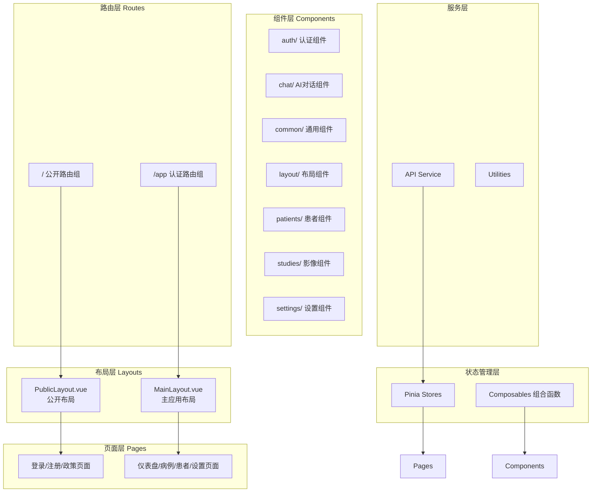
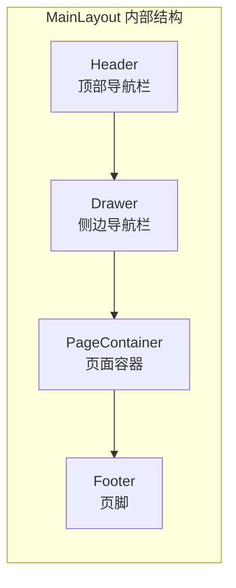
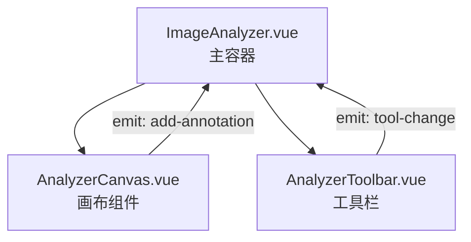
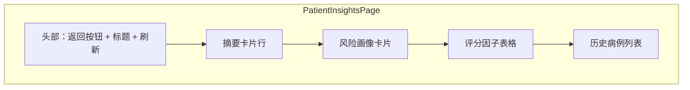
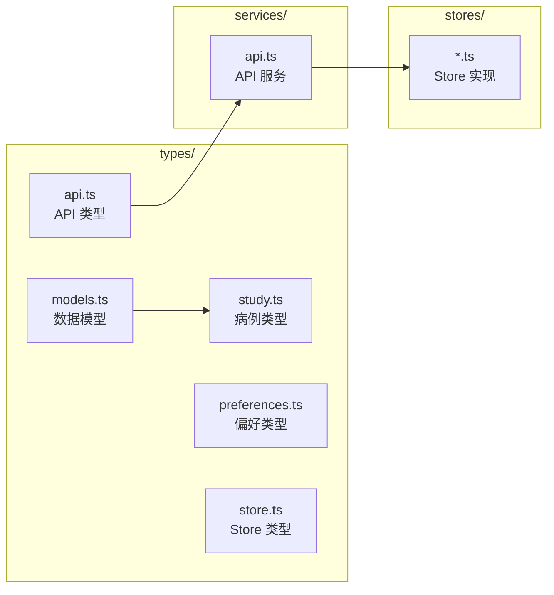

CervixDetectAI 前端采用 **Quasar Framework** 构建，基于 **Vue 3 Composition API** 构建了一套清晰的组件与页面分层架构。本文档详细阐述该架构的设计模式、组织结构和关键实现细节。

## 架构概览

该应用的组件与页面架构遵循**特征域划分**原则，将代码按业务功能领域组织，而非按技术类型划分。整体架构采用**分层布局**模式，通过路由系统将公开页面与认证页面解耦。



Sources: [src/router/routes.ts](src/router/routes.ts#L1-L122), [src/layouts/MainLayout.vue](src/layouts/MainLayout.vue#L1-L62)

## 布局系统架构

### 双布局模式

应用采用**双布局模式**处理不同安全级别的页面视图：

| 布局类型 | 路由前缀 | 用途 | 特征 |
|---------|---------|------|------|
| PublicLayout | `/` | 认证页面、公开页面 | 极简结构，无侧边栏/头部 |
| MainLayout | `/app` | 认证后的应用页面 | 完整导航侧边栏、头部导航 |

**PublicLayout** 实现为最小化容器，仅包含页面容器和页脚，适用于登录、注册、隐私政策等公开页面。桌面端可选择性展示品牌面板。

**MainLayout** 实现为完整的应用外壳，包含：
- **Header**: Logo、医院信息、主题切换、通知铃铛、用户菜单
- **Drawer**: 导航侧边栏（200px宽度）
- **PageContainer**: 页面内容插槽
- **Footer**: 应用页脚

Sources: [src/layouts/PublicLayout.vue](src/layouts/PublicLayout.vue#L1-L26), [src/layouts/MainLayout.vue](src/layouts/MainLayout.vue#L1-L62)

### 布局组件结构



MainLayout 的 Header 组件包含：
- **ThemeToggle**: 主题切换组件
- **NotificationBell**: 通知铃铛组件
- **HeaderUserMenu**: 用户菜单组件

Sources: [src/components/layout/MainNavDrawer.vue](src/components/layout/MainNavDrawer.vue#L1-L46)

## 路由系统

### 路由组织结构

路由配置采用**嵌套路由**结构，通过父级路由的 `component` 属性指定布局组件，子路由共享该布局：

```typescript
// 路由分组示例
{
  path: '/',
  component: () => import('layouts/PublicLayout.vue'),  // 公开布局
  children: [
    { path: 'login', component: () => import('pages/LoginPage.vue') },
    { path: 'register', component: () => import('pages/RegisterPage.vue') },
  ]
},
{
  path: '/app',
  component: () => import('layouts/MainLayout.vue'),     // 主应用布局
  meta: { requiresAuth: true },                           // 认证守卫
  children: [
    { path: '', component: () => import('pages/DashboardPage.vue') },
    { path: 'studies', component: () => import('pages/StudiesPage.vue') },
    { path: 'patients', component: () => import('pages/PatientsPage.vue') },
  ]
}
```

所有路由使用**懒加载模式** (`() => import()`) 优化首屏加载性能。

Sources: [src/router/routes.ts](src/router/routes.ts#L1-L122)

### 导航配置

导航菜单项通过常量配置集中管理：

```typescript
export const MAIN_NAVIGATION_SECTIONS: NavigationSection[] = [
  {
    links: [
      { title: '仪表盘', caption: '首页', icon: 'dashboard', route: '/app' },
      { title: '数据报表', caption: '病例与报告', icon: 'analytics', route: '/app/studies' },
      { title: '患者管理', caption: '患者信息', icon: 'people', route: '/app/patients' },
      { title: '上传分析', caption: '新分析', icon: 'upload', route: '/app/upload' },
    ]
  },
  {
    title: '分析功能',
    links: [
      { title: '随访管理', caption: '复查计划', icon: 'event_note', route: '/app/follow-ups' },
      { title: '套餐订阅', caption: '套餐权益', icon: 'api', route: '/app/models' },
      { title: '订单管理', caption: '账单与续约', icon: 'receipt_long', route: '/app/orders' },
    ]
  }
];
```

导航组件通过 `v-for` 动态渲染，支持分组标题和分割线。

Sources: [src/constants/navigation.ts](src/constants/navigation.ts#L1-L78)

## 组件组织架构

### 特征域划分

组件按业务领域划分为 8 个主要目录：

| 目录 | 职责 | 组件示例 |
|------|------|---------|
| `auth/` | 认证相关 UI | AuthSplitLayout, AuthBrandPanel, AuthWorkspaceShell |
| `chat/` | AI 对话功能 | AIChatPanel |
| `common/` | 全局通用组件 | AgreementDialog, AliCaptcha, ThemeToggle |
| `layout/` | 布局相关组件 | MainNavDrawer, HeaderUserMenu, NotificationBell |
| `patients/` | 患者管理功能 | PatientDetail, PatientForm, PatientSelector |
| `settings/` | 设置页面组件 | DatabaseHealth, EmailSecurityCard |
| `studies/` | 影像分析功能 | ImageAnalyzer, ImageUploader, StudyForm |
| `studies/analyzer/` | 画布标注子模块 | AnalyzerCanvas, AnalyzerToolbar |

Sources: [src/components](src/components)

### 认证组件模式

认证模块实现了**分栏布局骨架**模式：

```vue
<template>
  <q-page class="auth-split-layout">
    <!-- 品牌展示区（桌面端） -->
    <section class="auth-split-layout__brand-panel">
      <slot name="brand" />
    </section>

    <!-- 工作区（表单区） -->
    <section class="auth-split-layout__workspace-panel">
      <div class="workspace-content-wrapper">
        <slot name="workspace" />
      </div>
    </section>
  </q-page>
</template>
```

- **桌面端（≥1024px）**: 52/48 双栏分割，品牌区 + 工作区
- **移动端**: 单栏居中布局，仅显示工作区
- **响应式断点**: 1023px 和 600px 两级

该布局支持**深色模式**，通过 CSS 变量实现主题切换：

```css
.auth-split-layout {
  --auth-shared-bg: linear-gradient(100deg, #f0f9ff 0%, #e0f2fe 52%, #f8fafc 100%);
}

body.body--dark .auth-split-layout {
  --auth-shared-bg: linear-gradient(100deg, #020617 0%, #0f172a 52%, #1e293b 100%);
}
```

Sources: [src/components/auth/AuthSplitLayout.vue](src/components/auth/AuthSplitLayout.vue#L1-L206)

### 画布分析组件模式

影像分析模块采用**多组件协作**模式：



AnalyzerCanvas 实现了：
- **视口管理**: 平移、缩放控制
- **图像渲染**: SVG 覆盖层标注
- **交互绘制**: 矩形标注工具
- **标注显示**: 带标签的矩形区域，颜色编码置信度

Sources: [src/components/studies/analyzer/AnalyzerCanvas.vue](src/components/studies/analyzer/AnalyzerCanvas.vue#L1-L305)

## 页面组件架构

### 页面分类

页面组件按功能分为以下几类：

| 类别 | 页面 | 特征 |
|------|------|------|
| **认证页** | LoginPage, RegisterPage, ForgotPasswordPage | 无布局侧边栏，表单居中 |
| **公开页** | UserAgreementPage, PrivacyPolicyPage | 内容展示型，文档阅读 |
| **业务页** | DashboardPage, StudiesPage, PatientsPage | 数据表格、统计卡片 |
| **详情页** | StudyDetailPage, PatientInsightsPage | 详情展示、图表分析 |
| **表单页** | UploadPage, ProfilePage | 数据录入、文件上传 |
| **配置页** | SettingsPage, ApiSettingsPage | 配置表单、状态展示 |

Sources: [src/pages](src/pages)

### 页面结构模式

业务页面遵循统一的结构模式：

```vue
<template>
  <q-page class="q-pa-md app-gradient-page">
    <!-- 页面头部 -->
    <div class="row items-center q-mb-md">
      <div class="col">
        <div class="text-h5">页面标题</div>
        <div class="text-subtitle2 text-grey-7">页面描述</div>
      </div>
      <div class="col-auto">
        <q-btn color="primary" label="主操作" />
      </div>
    </div>

    <!-- 内容区域（网格布局） -->
    <div class="row q-col-gutter-md">
      <div class="col-lg-8 col-md-12">左侧内容</div>
      <div class="col-lg-4 col-md-12">右侧内容</div>
    </div>
  </q-page>
</template>
```

典型页面包含：
- `q-page`: Quasar 页面容器
- `app-gradient-page`: 自定义渐变背景类
- 响应式网格布局（`row q-col-gutter-md`）
- 响应式列宽（`col-lg-*`, `col-md-*`, `col-sm-*`, `col-xs-*`）

Sources: [src/pages/DashboardPage.vue](src/pages/DashboardPage.vue#L1-L1145), [src/pages/StudiesPage.vue](src/pages/StudiesPage.vue#L1-L609)

### 患者洞察页面

PatientInsightsPage 展示了复杂业务页面的架构模式：



该页面实现了：
- **多状态管理**: 加载状态、错误状态、空数据状态
- **响应式卡片网格**: 5列自适应布局
- **数据聚合展示**: 环形进度图、表格、分组列表

Sources: [src/pages/PatientInsightsPage.vue](src/pages/PatientInsightsPage.vue#L1-L1050)

## 状态管理架构

### Pinia Store 组织

状态管理采用 **Pinia**（Vue 3 官方推荐），按特征域划分 store：

| Store | 职责 | 关键状态 |
|-------|------|---------|
| `authStore` | 认证状态、用户信息 | token, user, isAuthenticated |
| `studyStore` | 病例 CRUD、列表管理 | studies, currentStudy, pagination |
| `patientStore` | 患者管理 | patients, currentPatient |
| `analysisStore` | 分析结果管理 | analysisResults |
| `patientInsightsStore` | 患者洞察数据 | riskProfile, overview |
| `modelStore` | AI 模型配置 | models, activeModel |
| `themeStore` | 主题切换 | isDark |

Sources: [src/stores/index.ts](src/stores/index.ts#L1-L33)

### Store 实现模式

以 `studyStore` 为例展示典型 Store 实现：

```typescript
export const useStudyStore = defineStore('study', {
  state: () => ({
    studies: [] as Study[],
    currentStudy: null as Study | null,
    loading: false,
    error: null as string | null,
    pagination: { total: 0, page: 1, limit: 10 },
  }),

  getters: {
    completedStudies: (state) => 
      state.studies.filter((study) => study.status === 'completed'),
    recentStudies: (state) => 
      [...state.studies]
        .sort((a, b) => new Date(b.uploadedAt).getTime() - new Date(a.uploadedAt).getTime())
        .slice(0, 5),
  },

  actions: {
    async fetchStudies(params) {
      this.loading = true;
      try {
        const response = await studyAPI.getStudies(params);
        if (response.success) {
          this.studies = response.data.studies.map(mapStudyRawToStudy);
          this.pagination = response.data.pagination;
        }
      } finally {
        this.loading = false;
      }
    },
  },
});
```

Store 遵循 **State-Getters-Actions** 三层结构：
- **State**: 响应式数据存储
- **Getters**: 计算派生属性
- **Actions**: 异步业务逻辑

Sources: [src/stores/studyStore.ts](src/stores/studyStore.ts#L1-L253)

## 组合函数（Composables）

### Composable 模式

Composables 用于封装可复用的组件逻辑，作为 Vue Composition API 的最佳实践：

| Composable | 用途 |
|-----------|------|
| `useAiPreferences` | AI 偏好设置管理 |
| `useNotifications` | 通知系统集成 |
| `useStudyReportDownload` | PDF 报告生成与下载 |
| `useSubscriptionPlans` | 订阅套餐逻辑 |

示例：`useStudyReportDownload` 实现报告下载的统一流程：

```typescript
export async function downloadStudyReport({
  id,
  $q,
}: DownloadStudyReportParams): Promise<void> {
  try {
    $q.loading.show({ message: '正在获取病例数据...' });
    const studyData = await getStudyAnalysis(String(id));
    
    $q.loading.show({ message: '正在生成PDF报告...' });
    const { generatePDFReport } = await import('src/utils/pdfGenerator');
    await generatePDFReport({ study: studyData.studyInfo, result: studyData.result });
    
    $q.notify({ type: 'positive', message: '报告已成功下载！' });
  } catch (error) {
    $q.notify({ type: 'negative', message: '生成报告失败' });
  } finally {
    $q.loading.hide();
  }
}
```

Sources: [src/composables/useStudyReportDownload.ts](src/composables/useStudyReportDownload.ts#L1-L60)

## 类型系统

### TypeScript 类型定义

应用建立了完整的 TypeScript 类型体系：



关键类型定义：

```typescript
// study.ts - 病例类型
export type LatestTaskStatus = 'PENDING' | 'PROCESSING' | 'SUCCESS' | 'FAILED';
export type StudyDisplayStatus = 'pending' | 'completed' | 'processing' | 'failed';

export interface Study {
  id: number;
  study_id: string;
  patient_id: number;
  status: StudyDisplayStatus;
  diagnosis?: string;
  riskLevel?: 'low' | 'medium' | 'high' | 'critical';
  confidence?: number;
  latestTaskStatus?: LatestTaskStatus;
}
```

Sources: [src/types/study.ts](src/types/study.ts#L1-L38), [src/types/index.ts](src/types/index.ts#L1-L4)

## 响应式设计模式

### 断点系统

应用采用 Quasar 内置断点系统：

| 断点 | 宽度 | 用途 |
|------|------|------|
| `xs` | < 600px | 手机竖屏 |
| `sm` | 600-1023px | 手机横屏/小平板 |
| `md` | 1024-1439px | 平板/小桌面 |
| `lg` | ≥ 1440px | 桌面显示器 |

典型响应式组件用法：

```vue
<div class="row q-col-gutter-md">
  <div class="col-lg-8 col-md-12">主内容区</div>
  <div class="col-lg-4 col-md-12">侧边栏</div>
</div>
```

Sources: [src/pages/DashboardPage.vue](src/pages/DashboardPage.vue#L1)

## 总结

CervixDetectAI 的组件与页面架构具有以下核心特征：

1. **双布局模式**：PublicLayout 和 MainLayout 分别处理公开和认证页面
2. **特征域组织**：组件按业务领域（auth、patients、studies 等）划分目录
3. **懒加载路由**：所有页面组件采用动态导入优化首屏性能
4. **Pinia 状态管理**：按特征域划分 store，实现关注点分离
5. **Composable 模式**：封装可复用逻辑为组合函数
6. **完整类型系统**：TypeScript 类型覆盖 API、Store、组件接口
7. **响应式设计**：基于 Quasar 断点系统的多端适配

这种架构模式既保证了代码的可维护性和可扩展性，又为未来的功能迭代预留了充足的空间。

## 下一步阅读

- [状态管理设计](7-zhuang-tai-guan-li-she-ji)：深入了解 Pinia Store 实现细节
- [前端技术栈概览](5-qian-duan-ji-zhu-zhan-gai-lan)：了解 Quasar Framework 和 Vue 3 的技术选型
- [后端服务架构](8-hou-duan-fu-wu-jia-gou)：了解前后端分离架构的服务端设计