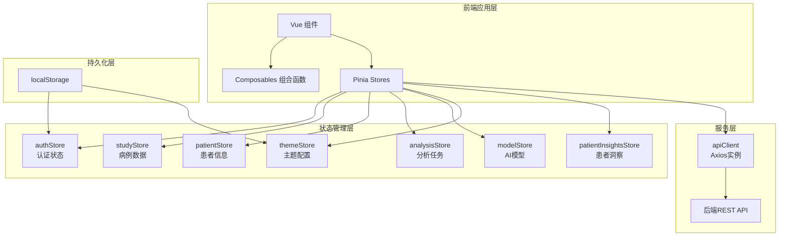

本文档详细阐述 CervixDetectAI 前端应用的状态管理架构，涵盖 Pinia 状态管理库的集成方式、各个核心 Store 的职责划分、响应式数据流设计，以及与 API 层、路由系统的协作模式。本项目采用 **Pinia** 作为唯一的状态管理解决方案，通过 Composition API 风格的 Store 定义实现数据的集中管理与响应式更新。

## 技术选型与架构概览

本项目选择 Pinia 而非 Vuex 作为状态管理方案，主要基于以下技术考量：Pinia 提供更简洁的 API 设计和更好的 TypeScript 类型推导支持，其基于 Composition API 的实现方式与 Vue 3 的设计理念高度契合。



### Store 职责矩阵

| Store 名称 | 核心职责 | 主要数据类型 | 持久化策略 |
|-----------|---------|------------|-----------|
| `authStore` | 用户认证、登录/登出 | User、Token | localStorage |
| `studyStore` | 病例 CRUD、列表管理 | Study[]、Study | 内存缓存 |
| `patientStore` | 患者 CRUD、搜索 | Patient[]、Patient | 内存缓存 |
| `analysisStore` | 分析任务轮询、结果管理 | AnalysisTask[] | 内存缓存 |
| `modelStore` | AI 模型列表、预测 | ModelInfo[]、PredictionResponse | 内存缓存 |
| `themeStore` | 主题模式切换 | ThemeMode | localStorage |
| `patientInsightsStore` | 患者洞察多维度数据 | Overview、History、Timeline | 内存缓存 |

Sources: [src/stores/index.ts](src/stores/index.ts#L1-L33), [src/types/store.ts](src/types/store.ts#L1-L46)

## Pinia 初始化与插件机制

Pinia 的初始化配置位于 `src/stores/index.ts`，采用 Quasar 框架推荐的封装模式，通过 `#q-app/wrappers` 实现 SSR 与客户端环境的统一处理。

```typescript
// src/stores/index.ts
import { defineStore } from '#qapp/wrappers';
import { createPinia } from 'pinia';

export default defineStore((/* { ssrContext } */) => {
  const pinia = createPinia();
  
  // 插件扩展区域 - 可在此添加自定义插件
  // pinia.use(SomePiniaPlugin)
  
  return pinia;
});
```

该配置文件采用工厂函数模式，支持接收 SSR 上下文参数（尽管当前实现中未使用），为后续服务端渲染扩展预留了接口。TypeScript 类型扩展通过 `PiniaCustomProperties` 接口声明实现，确保自定义属性能够获得完整的类型推导支持。

Sources: [src/stores/index.ts](src/stores/index.ts#L1-L33)

## 认证状态管理 (authStore)

`authStore` 是应用中最核心的 Store，负责管理用户的登录状态、认证令牌和用户信息。该 Store 实现了本地存储与内存状态的双向同步机制。

### 状态定义与计算属性

```typescript
// src/stores/authStore.ts
state: () => ({
  user: null as User | null,
  token: null as string | null,
  refreshToken: null as string | null,
  isAuthenticated: false,
  isAuthenticating: false,
  hasInitialized: false,  // 防止路由守卫误判
}),

getters: {
  isLoggedIn: (state) => !!state.token,
  currentUser: (state) => state.user,
  authToken: (state) => state.token,
},
```

`hasInitialized` 字段是解决页面刷新场景下路由守卫误判的关键设计。当用户刷新页面时，路由守卫会先于 App.vue 执行，此时若 Store 未完成从 localStorage 的状态恢复，可能错误地将已登录用户重定向至登录页。该字段确保路由守卫能够感知 Store 的初始化状态。

Sources: [src/stores/authStore.ts](src/stores/authStore.ts#L17-L39)

### 认证请求封装模式

`authStore` 实现了统一的认证请求处理模式，通过 `_handleAuthRequest` 内部方法封装登录、注册、短信登录等多种认证场景的通用逻辑：

```typescript
async _handleAuthRequest(
  apiCall: () => Promise<{ success: boolean; data: AuthData; message?: string }>,
  defaultErrorMsg: string,
): Promise<{ success: boolean; error?: string | undefined }> {
  this.isAuthenticating = true;
  try {
    const response = await apiCall();
    if (response.success) {
      this._saveAuthData(response.data);  // 统一保存逻辑
      return { success: true };
    } else {
      return { success: false, error: response.message };
    }
  } catch (error) {
    // 统一错误提取逻辑
    const err = error as { response?: { data?: { message?: string } } };
    const errorMessage = err.response?.data?.message || defaultErrorMsg;
    return { success: false, error: errorMessage };
  } finally {
    this.isAuthenticating = false;
  }
}
```

这种设计模式将认证流程中的 loading 状态管理、异常捕获、数据持久化等关注点分离到统一处理函数中，各认证 action 只需关注 API 调用的差异部分。

Sources: [src/stores/authStore.ts](src/stores/authStore.ts#L42-L68)

### 本地存储同步机制

```typescript
_saveAuthData(data: { accessToken: string; refreshToken: string; user: User }) {
  this.token = data.accessToken;
  this.refreshToken = data.refreshToken;
  this.user = data.user;
  this.isAuthenticated = true;
  this.hasInitialized = true;
  setItem(STORAGE_KEYS.ACCESS_TOKEN, data.accessToken);
  setItem(STORAGE_KEYS.REFRESH_TOKEN, data.refreshToken);
  setItem(STORAGE_KEYS.USER_INFO, data.user);
},

initializeAuth(): void {
  const token = getItem<string>(STORAGE_KEYS.ACCESS_TOKEN);
  const refreshToken = getItem<string>(STORAGE_KEYS.REFRESH_TOKEN);
  const user = getItem<User>(STORAGE_KEYS.USER_INFO);

  if (token && user && typeof user === 'object') {
    // 恢复状态
    this.token = token;
    this.refreshToken = refreshToken;
    this.user = user;
    this.isAuthenticated = true;
  } else {
    this.clearAuthData();
  }
  this.hasInitialized = true;
}
```

`initializeAuth` 方法在应用启动时（App.vue 的 `onMounted` 钩子）和路由守卫中被调用，确保用户在刷新页面后能够自动恢复登录状态。

Sources: [src/stores/authStore.ts](src/stores/authStore.ts#L44-L58), [src/App.vue](src/App.vue#L26-L31)

## 病例与患者状态管理

### studyStore 病例管理

`studyStore` 负责管理影像病例的完整生命周期，包括列表查询、详情加载、创建更新等操作。

```typescript
// src/stores/studyStore.ts
state: () => ({
  studies: [] as Study[],
  currentStudy: null as Study | null,
  loading: false,
  error: null as string | null,
  pagination: { ...DEFAULT_PAGINATION } as StudiesPaginationState,
}),

getters: {
  allStudies: (state) => state.studies,
  getStudyById: (state) => (id: string) => {
    const numId = Number.parseInt(id, 10);
    return state.studies.find((study) => study.id === numId) || null;
  },
  completedStudies: (state) => state.studies.filter((study) => study.status === 'completed'),
  processingStudies: (state) => state.studies.filter((study) => study.status === 'processing'),
  recentStudies: (state) => [...state.studies].sort(...).slice(0, 5),
},
```

该 Store 的设计特点在于支持缓存优先的加载策略：`loadStudyById` 方法在 `forceRefresh` 为 false 时优先从现有列表中查找缓存数据，避免重复请求。

Sources: [src/stores/studyStore.ts](src/stores/studyStore.ts#L1-L45)

### patientStore 患者管理

`patientStore` 采用类似 studyStore 的设计模式，通过分页状态管理患者列表：

```typescript
// src/stores/patientStore.ts
state: (): PatientState => ({
  patients: [],
  currentPatient: null,
  loading: false,
  error: null,
  pagination: { page: 1, limit: 10, total: 0 },
}),

actions: {
  async fetchPatients(params?: { page?: number; limit?: number; search?: string }) {
    // 支持搜索条件
    if (params?.search) {
      queryParams.search = params.search;
    }
    // 更新分页状态
    this.pagination = { page: response.page, limit: response.limit, total: response.total };
  }
}
```

Sources: [src/stores/patientStore.ts](src/stores/patientStore.ts#L1-L70)

## 分析任务状态管理 (analysisStore)

`analysisStore` 是最具复杂性的 Store，负责管理 AI 分析任务的创建、轮询、状态同步和结果处理。该 Store 需要处理异步任务的多个状态阶段（`PENDING` → `PROCESSING` → `SUCCESS`/`FAILED`）。

### 任务状态机

```typescript
interface AnalysisTask {
  id: string;
  studyId: string;
  status: 'PENDING' | 'PROCESSING' | 'SUCCESS' | 'FAILED';
  progress: number;  // 0-100
  result?: AnalysisResult;
  error?: string;
  createdAt: string;
  completedAt?: string;
}
```

状态转换逻辑中实现了大小写兼容处理：后端可能返回大写或小写的状态值，Store 统一将其规范化为大写格式。

```typescript
// 标准化状态为大写
const normalizedStatus = (task.status || '').toUpperCase();
let status: AnalysisTask['status'];
switch (normalizedStatus) {
  case 'PENDING': status = 'PENDING'; break;
  case 'PROCESSING': status = 'PROCESSING'; break;
  case 'SUCCESS':
  case 'COMPLETED': status = 'SUCCESS'; break;
  default: status = 'FAILED';
}
```

Sources: [src/stores/analysisStore.ts](src/stores/analysisStore.ts#L1-L50)

### 轮询间隔管理

```typescript
state: () => ({
  tasks: [] as AnalysisTask[],
  pollingIntervals: new Map<string, NodeJS.Timeout>(),
}),

actions: {
  // 使用 Map 管理轮询定时器，支持按任务ID取消
  startPolling(taskId: string, interval: NodeJS.Timeout) {
    this.pollingIntervals.set(taskId, interval);
  },
  
  stopPolling(taskId: string) {
    const interval = this.pollingIntervals.get(taskId);
    if (interval) {
      clearInterval(interval);
      this.pollingIntervals.delete(taskId);
    }
  }
}
```

使用 `Map<string, NodeJS.Timeout>` 类型管理多个并发轮询任务，便于精确控制单个或全部轮询的启停。

Sources: [src/stores/analysisStore.ts](src/stores/analysisStore.ts#L23-L35)

### 数据转换与格式兼容

Store 内置了 API 响应格式的适配逻辑，兼容后端可能返回的多种数据结构：

```typescript
convertApiResult(apiResult: TaskStatusResponse['result']): AnalysisResult | undefined {
  // 置信度格式兼容：可能为 number 或 string
  const confidence = typeof apiResult.confidence === 'number'
    ? apiResult.confidence
    : Number(apiResult.confidence) || 0;

  // 可疑区域格式兼容：string[] 或 object[]
  const suspiciousAreas: SuspiciousArea[] | undefined = apiResult.suspiciousAreas
    ?.map((item) => {
      if (typeof item === 'string') {
        return { description: item };
      }
      // 处理对象格式...
    });
}
```

Sources: [src/stores/analysisStore.ts](src/stores/analysisStore.ts#L130-L175)

## 主题状态管理 (themeStore)

`themeStore` 展示了 Pinia Setup 语法（Composition API 风格）的实际应用：

```typescript
// src/stores/themeStore.ts
import { defineStore } from 'pinia';
import { ref } from 'vue';
import { Dark } from 'quasar';

export const useThemeStore = defineStore('theme', () => {
  const themeMode = ref<ThemeMode>('system');
  const isDark = ref(false);

  function resolveTheme(mode: ThemeMode): boolean {
    if (mode === 'dark') return true;
    if (mode === 'light') return false;
    return window.matchMedia('(prefers-color-scheme: dark)').matches;
  }

  function setTheme(mode: ThemeMode): void {
    themeMode.value = mode;
    isDark.value = resolveTheme(mode);
    Dark.set(isDark.value);  // Quasar 主题切换 API
    localStorage.setItem('app_theme_preference', mode);
  }

  // 监听系统主题变化
  window.matchMedia('(prefers-color-scheme: dark)').addEventListener('change', () => {
    if (themeMode.value === 'system') {
      isDark.value = resolveTheme('system');
      Dark.set(isDark.value);
    }
  });

  return { themeMode, isDark, setTheme, toggleDark, initTheme };
});
```

Setup Store 语法允许直接返回响应式状态和方法，代码结构更加简洁。该 Store 还实现了系统主题监听器，在用户选择"跟随系统"模式时自动响应系统主题变化。

Sources: [src/stores/themeStore.ts](src/stores/themeStore.ts#L1-L49)

## 患者洞察状态管理 (patientInsightsStore)

`patientInsightsStore` 负责管理患者洞察页面的多维度数据展示，采用请求令牌机制防止竞态条件：

```typescript
state: (): PatientInsightsState => ({
  currentPatientId: null,
  overview: null,
  history: null,
  compareResult: null,
  timeline: null,
  riskProfile: null,
  loading: { overview: false, history: false, compare: false, timeline: false, riskProfile: false },
  requestSerial: 0,
  requestTokens: { overview: 0, history: 0, compare: 0, timeline: 0, riskProfile: 0 },
}),

actions: {
  // 请求令牌机制：确保响应不会覆盖过期请求的数据
  nextRequestToken(key: keyof PatientInsightsRequestTokens) {
    this.requestSerial += 1;
    const token = this.requestSerial;
    this.requestTokens[key] = token;
    return token;
  },

  isActiveRequest(key: keyof PatientInsightsRequestTokens, token: number, patientId: number) {
    return this.currentPatientId === patientId && this.requestTokens[key] === token;
  }
}
```

该机制确保当用户在多个患者之间快速切换时，旧的异步请求不会覆盖新请求返回的数据。

Sources: [src/stores/patientInsightsStore.ts](src/stores/patientInsightsStore.ts#L1-L100)

## Store 与路由守卫的协作

路由守卫在 `src/router/index.ts` 中集成状态检查逻辑：

```typescript
Router.beforeEach((to, from, next) => {
  const authStore = useAuthStore();

  // 刷新页面时初始化认证状态
  if (!authStore.hasInitialized) {
    authStore.initializeAuth();
  }

  if (to.matched.some((record) => record.meta.requiresAuth)) {
    if (!authStore.isAuthenticated) {
      next({ path: '/login', query: { redirect: to.fullPath } });
    } else {
      next();
    }
  } else {
    next();
  }
});
```

这种设计避免了 Store 实例化顺序的问题，同时通过 `hasInitialized` 标志防止重复初始化。

Sources: [src/router/index.ts](src/router/index.ts#L42-L67)

## API 拦截器与状态联动

`apiClient`（基于 Axios）通过拦截器实现 Token 自动刷新机制：

```typescript
// src/services/apiClient.ts
let refreshPromise: Promise<string> | null = null;

async function getRefreshPromise(refreshToken: string): Promise<string> {
  if (!refreshPromise) {
    refreshPromise = (async () => {
      const { data } = await axios.post(`${API_BASE_URL}/auth/refresh`, { refreshToken });
      const newAccessToken = data?.data?.accessToken;
      setItem(STORAGE_KEYS.ACCESS_TOKEN, newAccessToken);
      apiClient.defaults.headers.common['Authorization'] = `Bearer ${newAccessToken}`;
      return newAccessToken;
    })();
    void refreshPromise.finally(() => { refreshPromise = null; });
  }
  return refreshPromise;
}
```

Singleflight 模式确保并发 401 请求只会触发一次 Token 刷新，避免重复请求和潜在的死锁问题。

Sources: [src/services/apiClient.ts](src/services/apiClient.ts#L1-L147)

## Composable 与 Store 的协作模式

项目中使用 Composable 封装跨组件复用的逻辑，与 Store 形成互补：

```typescript
// src/composables/useNotifications.ts
export function useNotifications() {
  const router = useRouter();
  const $q = useQuasar();
  const notificationMenuVisible = ref(false);
  const notifications = ref<NotificationItem[]>([]);
  const unreadCount = ref(0);

  // Composable 负责 UI 状态，Store 负责业务数据
  const loadNotifications = async () => {
    const response = await notificationAPI.getNotifications({ page: 1, limit: 8 });
    notifications.value = response.data.notifications;
  };

  // 通过自定义事件机制触发 Store 更新
  window.addEventListener('notification-updated', handleNotificationUpdated);

  return { notifications, unreadCount, handleNotificationClick, ... };
}
```

这种设计将 UI 状态（菜单可见性、加载状态）保留在 Composable 中，而业务数据通过 API 获取后直接更新组件状态或触发 Store 更新。

Sources: [src/composables/useNotifications.ts](src/composables/useNotifications.ts#L1-L175)

## 总结与最佳实践

本项目的状态管理设计遵循以下核心原则：

**单一数据源**：各业务域的数据由对应的 Pinia Store 集中管理，避免状态分散导致的同步问题。**响应式优先**：充分利用 Pinia 的响应式系统，通过 getters 实现派生状态的自动计算。**持久化分层**：敏感数据（Token、用户信息、主题偏好）通过 localStorage 持久化，常规业务数据仅保留在内存中。**类型安全**：通过 TypeScript 接口定义状态结构，配合 Pinia 的类型推导确保开发时类型安全。**性能优化**：采用缓存优先策略（studyStore、patientStore）、请求令牌机制（patientInsightsStore）减少不必要的网络请求和数据覆盖问题。

如需了解路由系统的具体实现，请参阅 [路由系统](6-zu-jian-yu-ye-mian-jia-gou)；如需深入 API 集成细节，请参阅 [API集成](5-qian-duan-ji-zhu-zhan-gai-lan)。