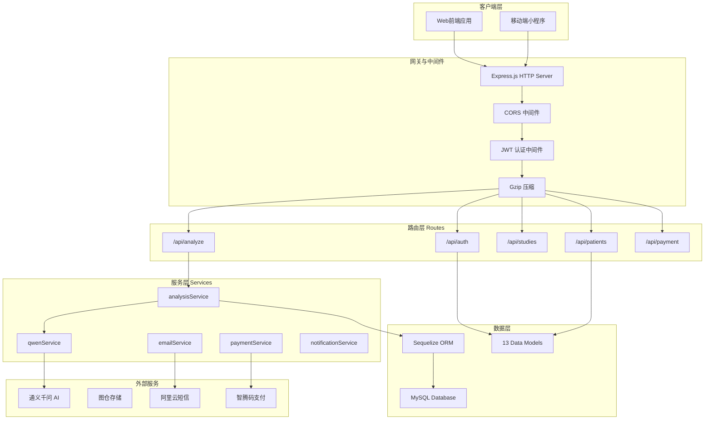
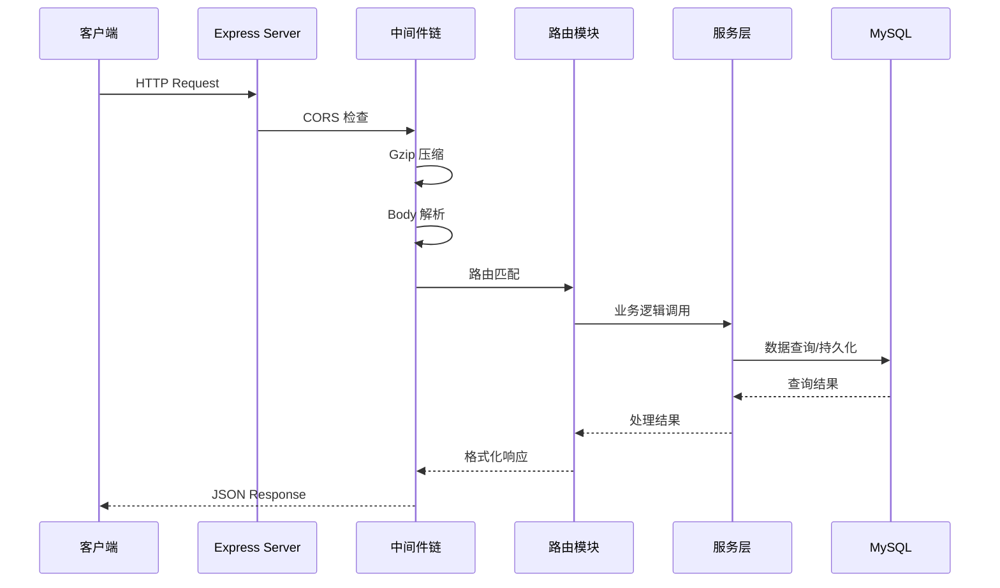
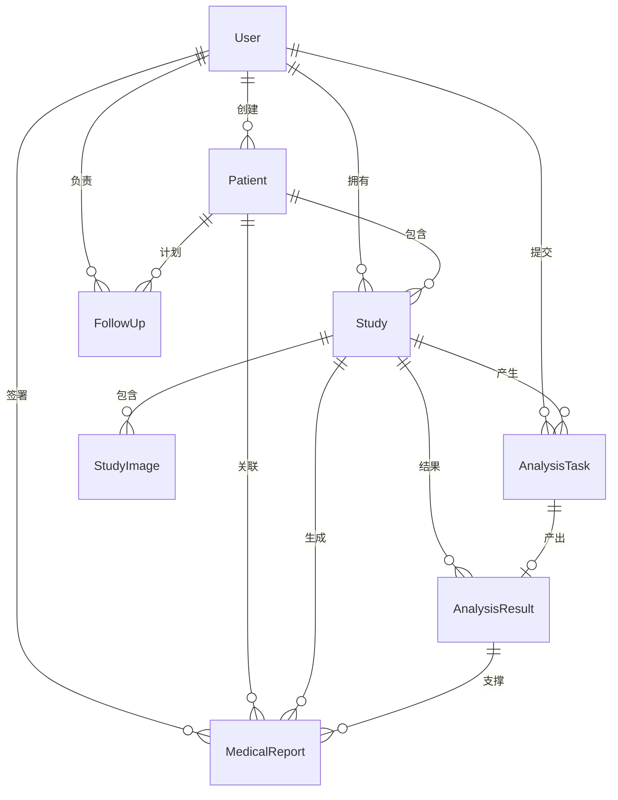
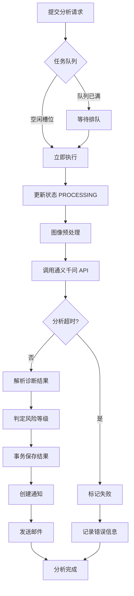

本文档详细阐述 CervixDetectAI 后端服务的架构设计，涵盖运行时环境、技术栈选型、模块划分、服务编排及部署配置。该系统采用 **Bun + Express** 作为核心运行时和框架，通过 Sequelize ORM 与 MySQL 数据库交互，并集成了通义千问 AI 服务、图仓存储服务、支付服务等外部能力。

## 技术栈概览

后端服务基于 Node.js 环境构建，选用 Bun 作为运行时解释器，Express 作为 HTTP 框架。数据库层采用 Sequelize ORM 连接 MySQL，认证机制使用 JWT（JSON Web Token）配合 bcrypt 密码加密。服务通过 PM2 的 ecosystem.config.js 进行进程管理，支持多环境配置切换。



| 组件 | 技术选型 | 版本 | 用途说明 |
|------|----------|------|----------|
| 运行时 | Bun | 最新 | 高性能 JavaScript 运行时 |
| Web 框架 | Express | 5.1.0 | HTTP 请求处理与路由分发 |
| ORM | Sequelize | 6.37.7 | 数据库抽象与模型管理 |
| 数据库 | MySQL | - | 关系型数据存储 |
| 认证 | jsonwebtoken + bcrypt | 9.0.2 / 6.0.0 | Token 生成与密码加密 |
| 文件上传 | multer | 2.0.2 | Multipart 表单处理 |
| 图像处理 | sharp | 0.34.5 | 服务端图像压缩优化 |
| 定时任务 | node-cron | 4.2.1 | 随访提醒调度 |
| API 文档 | swagger-ui-express | 5.0.1 | OpenAPI 规范展示 |

Sources: [package.json](server/package.json#L1-L42), [ecosystem.config.js](server/ecosystem.config.js#L1-L22)

## 项目结构与模块划分

后端项目采用经典的**路由-服务-模型**三层架构，辅以中间件层和配置层。这种划分使得关注点分离清晰，路由层专注于 HTTP 请求解析与响应格式化，服务层封装业务逻辑，数据模型层负责数据库交互。

```
server/
├── index.js              # 应用入口，Express 实例配置与启动
├── config/               # 配置层
│   ├── database.js       # Sequelize 数据库配置（开发/生产环境）
│   ├── sequelize.js      # Sequelize 实例创建与连接管理
│   └── loadEnv.js        # 环境变量加载
├── middleware/           # 中间件层
│   └── auth.js           # JWT 认证与角色授权
├── models/               # 数据模型层（13 个模型）
│   ├── index.js           # 模型关系定义与导出
│   ├── User.js           # 用户模型
│   ├── Patient.js        # 患者模型
│   ├── Study.js          # 病例模型
│   ├── StudyImage.js     # 影像模型
│   ├── AnalysisTask.js   # 分析任务模型
│   ├── AnalysisResult.js # 分析结果模型
│   ├── MedicalReport.js  # 医疗报告模型
│   └── ...
├── routes/               # 路由层（16 个路由模块）
│   ├── auth.js           # 认证相关（注册/登录/Token刷新）
│   ├── patients.js       # 患者管理 CRUD
│   ├── studies.js        # 病例管理
│   ├── analyze.js        # AI 分析触发
│   ├── analysis-tasks.js # 分析任务查询
│   ├── reports.js        # 报告生成与下载
│   ├── payment.js        # 支付集成
│   ├── followups.js      # 随访管理
│   ├── notifications.js  # 站内通知
│   └── ...
├── services/             # 服务层（14 个服务）
│   ├── analysisService.js        # AI 分析核心逻辑
│   ├── simpleAnalysisQueue.service.js  # 分析任务队列
│   ├── qwenService.js             # 通义千问 API 封装
│   ├── email.service.js           # 邮件发送
│   ├── notificationService.js     # 通知创建
│   ├── paymentService.js          # 支付处理
│   ├── patientInsights.service.js # 患者洞察
│   ├── followupScheduler.service.js # 随访调度
│   └── ...
└── utils/
    └── jwt.js            # JWT 工具函数
```

Sources: [index.js](server/index.js#L1-L50)

## 入口文件与服务器配置

入口文件 `server/index.js` 负责初始化 Express 应用、配置中间件、注册路由模块、启动数据库连接，以及可选地托管前端静态资源。服务器默认监听 4000 端口，支持通过环境变量 `PORT` 覆盖。

**核心配置流程**包括：CORS 跨域策略配置（支持多域名白名单）、Gzip 压缩（排除 SSE 流式响应）、JSON body 解析（限制 50MB）、静态资源托管（上传目录和报告目录）。在生产环境中还会设置安全响应头（X-Content-Type-Options、X-Frame-Options、X-XSS-Protection）。



Express 应用支持**可选的前端资源托管**：当检测到 `FRONTEND_DIST_PATH` 环境变量指向的前端构建产物存在时，自动启用 SPA 路由处理，所有非 API 请求返回 `index.html`。这使得后端服务可以独立部署为全栈应用。

Sources: [index.js](server/index.js#L50-L150)

## 中间件体系

### 认证中间件

认证中间件位于 `server/middleware/auth.js`，提供三层认证能力：**强制认证**（`authenticate`）、**角色授权**（`authorize`）、**可选认证**（`optionalAuth`）。

`authenticate` 中间件执行完整的 Token 验证流程：提取请求头中的 Bearer Token、验证 Token 签名和类型（必须是 `access` 类型）、查询用户记录、检查账号状态。仅当所有验证通过后，用户对象才被附加到 `req.user` 传递给下游处理器。

```javascript
// 认证流程伪代码
async function authenticate(req, res, next) {
  const token = extractToken(req);      // 1. 提取 Token
  const decoded = verifyToken(token);   // 2. 验证签名
  if (decoded.type !== 'access') {      // 3. 检查 Token 类型
    return res.status(401).json({ message: '令牌类型错误' });
  }
  const user = await User.findByPk(decoded.userId); // 4. 查询用户
  if (user.status !== 'active') {       // 5. 检查账号状态
    return res.status(403).json({ message: '账号已被禁用' });
  }
  req.user = user;
  next();
}
```

`authorize` 中间件采用高阶函数模式，接收角色数组作为参数，返回中间件函数进行权限校验。`optionalAuth` 则允许未登录用户访问公开接口，但会在 Token 有效时附加用户信息，适用于需要区分登录与非登录状态的场景。

Sources: [auth.js](server/middleware/auth.js#L1-L125)

### 错误处理中间件

Express 应用配置了全局错误处理中间件和 404 处理器。错误中间件捕获所有未处理的同步/异步错误，根据环境变量决定是否返回错误堆栈信息。生产环境仅返回错误消息，开发环境返回完整堆栈便于调试。

Sources: [index.js](server/index.js#L180-L216)

## 路由层设计

系统将 API 按功能域划分为 16 个独立路由模块，每个模块对应一组相关功能，挂载到特定的 URL 前缀下。

| 路由模块 | 基础路径 | 主要功能 |
|----------|----------|----------|
| auth.js | `/api/auth` | 注册、登录、Token 刷新、邮箱验证 |
| sms-auth.js | `/api/auth/sms` | 手机验证码登录 |
| email-auth.js | `/api/auth/email` | 邮箱验证码验证 |
| users.js | `/api/users` | 用户信息管理、头像上传 |
| patients.js | `/api/patients` | 患者 CRUD、批量导入 |
| studies.js | `/api/studies` | 病例管理、影像上传 |
| analyze.js | `/api/analyze` | AI 分析触发 |
| analysis-tasks.js | `/api/analysis-tasks` | 分析任务查询、进度轮询 |
| reports.js | `/api/reports` | 报告生成、下载 |
| payment.js | `/api/payment` | 支付下单、回调处理 |
| chat.js | `/api/chat` | AI 聊天对话 |
| followups.js | `/api/followups` | 随访计划管理 |
| notifications.js | `/api/notifications` | 站内通知查询、标记已读 |
| patient-insights.js | `/api/patient-insights` | 患者洞察分析 |
| dashboard.js | `/api/dashboard` | 仪表盘统计数据 |
| settings.js | `/api/settings` | 系统设置 |
| system.js | `/api/system` | 系统健康检查 |

每个路由模块内部采用标准的 MVC 模式：路由定义处理函数调用 Service 层方法，Service 层封装业务逻辑并操作数据库模型。这种划分使得路由层保持简洁，业务逻辑易于测试和复用。

Sources: [index.js](server/index.js#L60-L90)

## 数据模型与关系

系统定义了 13 个数据模型，通过 Sequelize 建立关联关系，形成完整的领域模型。



**核心模型说明**：

- **User**：用户模型，支持 username/email/工号多种登录方式，包含角色（admin/doctor/user）、订阅状态、剩余额度等字段。使用 bcrypt hook 自动加密密码。
- **Patient**：患者模型，关联创建者用户，包含基本信息（姓名、年龄、联系方式）和医疗相关字段。
- **Study**：病例模型，代表一次检查会话，关联患者和创建者，包含检查类型（巴氏染色/TCT/活检切片等）和状态。
- **StudyImage**：影像模型，关联病例，支持本地存储或图仓 URL。
- **AnalysisTask**：分析任务模型，封装异步分析作业，包含任务 ID、状态（PENDING/PROCESSING/SUCCESS/FAILED）、进度百分比、处理耗时。
- **AnalysisResult**：分析结果模型，存储 AI 诊断结论、置信度、风险等级、建议、可疑区域。
- **MedicalReport**：医疗报告模型，关联分析结果、患者、生成医生和签署医生。
- **Order**：订单模型，关联用户和支付信息。
- **FollowUp**：随访计划模型，关联患者和病例，支持提醒调度。
- **Notification**：通知模型，关联用户，包含类型、标题、内容、已读状态。

Sources: [models/index.js](server/models/index.js#L1-L105), [User.js](server/models/User.js#L1-L130), [AnalysisTask.js](server/models/AnalysisTask.js#L1-L109)

## 服务层架构

### AI 分析服务

分析服务是系统的核心业务逻辑层，封装了从图像上传到 AI 诊断完成的完整流程。

**分析流程**：

1. 用户通过 `/api/analyze` 提交分析请求，路由层调用 `queueAnalysisTask` 将任务加入队列
2. `SimpleTaskQueue` 维护并发控制（默认 3 个并发），控制同时运行的 AI 分析任务数量
3. 队列取出任务后，调用 `analysisService.processTask` 执行分析
4. 分析过程中通过进度更新（10% → 30% → 90% → 95% → 100%）反馈状态
5. 调用 `qwenService.analyzeImage` 与通义千问 API 交互
6. 根据诊断结论自动判定风险等级（critical/high/medium/low）
7. 事务性保存分析结果，更新任务和病例状态
8. 创建站内通知，高风险病例额外触发预警通知
9. 可选发送邮件通知用户



**超时控制**：分析服务内置超时机制，默认 180 秒，可通过 `ANALYSIS_TIMEOUT_MS` 环境变量配置。使用 `Promise.race` 实现超时中断，避免无限等待。

**图像预处理**：分析前调用 `studyImageStorage.service` 准备图像，该服务支持本地存储和图仓 URL 两种模式，并可进行服务端压缩优化。

Sources: [analysisService.js](server/services/analysisService.js#L1-L267), [simpleAnalysisQueue.service.js](server/services/simpleAnalysisQueue.service.js#L1-L123)

### 通义千问服务

`qwenService.js` 封装了与通义千问视觉大模型的交互逻辑。服务根据检查方式（巴氏染色/TCT/活检切片/HPV/p16-Ki67双染）动态生成专业提示词，支持多模态图像分析。

**响应解析机制**：
1. 接收 AI 返回的 Markdown 格式 JSON 响应
2. 去除代码块标记（` ```json `）
3. 使用括号匹配算法提取第一个完整的 JSON 对象
4. 多策略尝试解析，记录解析错误供调试
5. 返回结构化诊断结果

```javascript
// 响应解析流程
const parseStructuredJsonContent = (content) => {
  const normalized = stripMarkdownCodeFence(content);  // 去标记
  const extractedObject = extractFirstJsonObject(normalized); // 提取 JSON
  
  // 多策略解析
  for (const candidate of [normalized, extractedObject]) {
    try {
      return JSON.parse(candidate);
    } catch (e) { /* 继续尝试 */ }
  }
  throw new Error('解析失败');
};
```

Sources: [qwenService.js](server/services/qwenService.js#L1-L200)

### 通知服务

通知服务提供幂等的通知创建能力，避免重复通知。核心函数 `createAnalysisNotifications` 在分析完成时创建「报告分析完成」通知，并对 high/critical 风险等级额外创建「高风险病变预警」通知。

```javascript
async function createAnalysisNotifications(params) {
  const { userId, studyId, diagnosis, riskLevel, confidence } = params;
  
  // 创建基础通知
  await createNotificationOnce({
    user_id: userId,
    type: 'system',
    title: '报告分析完成',
    content: `病例${studyCode}分析已完成...`
  });
  
  // 高风险额外预警
  if (riskLevel === 'high' || riskLevel === 'critical') {
    await createNotificationOnce({
      user_id: userId,
      type: 'followup_high_attention',
      title: '高风险病变预警',
      content: `病例${studyCode}评估为${riskLabel}...`
    });
  }
}
```

Sources: [notificationService.js](server/services/notificationService.js#L1-L118)

## 数据库配置

数据库配置支持开发环境和生产环境两套配置，通过 `NODE_ENV` 环境变量切换。关键配置项包括：连接池参数（最大 20 连接，最小 5 连接，获取超时 30 秒，空闲回收 10 秒）、字符集（utf8mb4）、时区（+08:00）、软删除（paranoid 模式）。

```javascript
// 生产环境连接池配置
pool: {
  max: 20,      // 最大连接数
  min: 5,       // 最小连接数
  acquire: 30000, // 获取连接超时(ms)
  idle: 10000,   // 空闲连接回收(ms)
}
```

Sequelize 实例启用慢查询日志（开发环境超过 100ms 的查询），并集成了 `dbMonitorService` 进行查询性能监控。

Sources: [database.js](server/config/database.js#L1-L64), [sequelize.js](server/config/sequelize.js#L1-L73)

## 部署配置

### PM2 进程管理

使用 PM2 通过 `ecosystem.config.js` 管理后端进程：

```javascript
module.exports = {
  apps: [{
    name: 'cervix-detect-ai-backend',
    script: 'index.js',
    interpreter: 'bun',        // 使用 Bun 运行时
    instances: 1,              // 单实例（可扩展为 'max'）
    autorestart: true,         // 自动重启
    watch: false,              // 生产环境禁用热重载
    max_memory_restart: '1G',  // 内存超限自动重启
    env: {
      NODE_ENV: 'production',
      PORT: 4000,
    },
  }]
};
```

### 环境变量

关键环境变量说明：

| 变量名 | 用途 | 示例值 |
|--------|------|--------|
| `PORT` | 服务监听端口 | `4000` |
| `NODE_ENV` | 运行环境 | `production` |
| `DB_HOST/DB_NAME/DB_USER/DB_PASSWORD` | 数据库连接 | - |
| `JWT_SECRET` | JWT 签名密钥 | - |
| `QWEN_API_KEY/QWEN_MODEL` | 通义千问配置 | - |
| `CORS_ORIGINS` | 允许的跨域域名 | 逗号分隔列表 |
| `MAX_CONCURRENT_ANALYSIS` | AI 分析并发数 | `3` |
| `ANALYSIS_TIMEOUT_MS` | 分析超时时间 | `180000` |
| `FRONTEND_DIST_PATH` | 前端构建产物路径 | `/var/www/dist/spa` |

Sources: [ecosystem.config.js](server/ecosystem.config.js#L1-L22)

## 扩展阅读

本文档介绍了后端服务的基础架构设计。后续文档将深入各模块实现细节：

- **[数据模型与ORM映射](9-shu-ju-mo-xing-yu-ormying-she)**：详细阐述各数据模型的字段定义、关联关系、钩子函数
- **[通义千问AI分析服务](10-tong-yi-qian-wen-aifen-xi-fu-wu)**：深入解析 AI 分析提示词工程和响应处理逻辑
- **[影像存储与图仓集成](11-ying-xiang-cun-chu-yu-tu-cang-ji-cheng)**：图像上传、压缩优化、图仓服务对接
- **[用户认证系统](12-yong-hu-ren-zheng-xi-tong)**：完整的注册、登录、Token 刷新流程