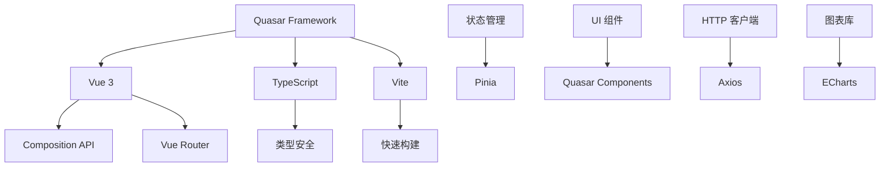
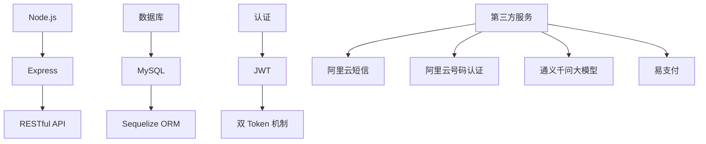

<div align="center">


# CervixDetectAI - 宫颈癌AI筛查云平台

**🌟 基于深度学习的智能宫颈癌影像辅助诊断 SaaS 平台**

[](https://opensource.org/licenses/MIT)
[](https://nodejs.org)
[](https://vuejs.org)
[](https://quasar.dev)
[](https://www.typescriptlang.org)
[](#-项目统计)

[](https://github.com/xingranya/CervixDetectAI/stargazers)
[](https://github.com/xingranya/CervixDetectAI/network/members)

**[📖 在线文档](#documentation)** • **[🚀 快速开始](#quick-start)** • **[💡 功能特性](#features)** • **[🎨 技术栈](#tech-stack)**

</div>

---

## 📋 目录

- [项目概述](#项目概述)
- [✨ 功能特性](#-功能特性)
- [🎨 技术栈](#-技术栈)
- [🏗️ 系统架构](#️-系统架构)
- [📊 项目结构](#-项目结构)
- [🚀 快速开始](#-快速开始)
- [⚙️ 配置说明](#️-配置说明)
- [🔌 API 接口](#-api-接口)
- [📈 项目统计](#-项目统计)
- [🛠️ 开发指南](#️-开发指南)
- [🔮 未来规划](#-未来规划)
- [📝 许可证](#-许可证)

---

## 项目概述

### 🎯 核心定位

**CervixDetectAI** 是一个基于 **Quasar Framework** 开发的宫颈癌影像 AI 辅助筛查 SaaS 云平台。本项目采用**"互联网+医疗"**的电子商务 SaaS 模式，通过云端提供服务，医疗机构可按次、按年或定制化购买服务，极大降低了初始投入门槛，实现了筛查服务的**"即插即用"**。

### 💡 核心创新

| 创新维度        | 说明                                                                                                       |
| :-------------- | :--------------------------------------------------------------------------------------------------------- |
| **🔬 技术创新** | 通过自研算法，在保持高准确率的同时，显著降低了计算成本和参数数量，使其能在基层医疗机构的普通硬件上流畅运行 |
| **💼 模式创新** | 采用 SaaS 云服务模式，实现宫颈癌筛查的普惠化，让基层医疗机构也能负担得起智能筛查服务                       |

### 🎬 应用场景

```
┌─────────────────┐      上传影像       ┌─────────────────┐
│   基层医疗机构   │  ───────────────>  │   云端 AI 平台   │
│  (乡镇卫生院等)  │                     │  (智能分析引擎)  │
└─────────────────┘                     └─────────────────┘
        ↑                                       ↓
        │                                       │
        │         返回诊断报告                   │
        └───────────────────────────────────────┘
```

---

## ✨ 功能特性

### 🔐 用户认证系统

| 功能                | 说明                                                   |
| :------------------ | :----------------------------------------------------- |
| **📧 邮箱登录**     | 支持邮箱 + 密码登录                                    |
| **📱 手机号登录**   | 支持手机号 + 短信验证码登录                            |
| **✨ 注册即登录**   | 手机号登录时，新用户自动注册并登录                     |
| **🧭 双路径注册向导** | 注册页采用“两步向导”，支持工号路径与邮箱路径分流填写   |
| **🔑 JWT 认证**     | accessToken（1小时）+ refreshToken（7天）双 Token 机制 |
| **🔒 忘记密码**     | 通过短信验证码重置密码                                 |
| **🛡️ 阿里云验证码** | 集成 ESA AI 验证码，防止恶意注册                       |

### 👥 用户管理

| 功能            | 说明                                                   |
| :-------------- | :----------------------------------------------------- |
| **🏥 医院配置** | 支持多家医院配置（荆州市中心医院、武汉大学人民医院等） |
| **👤 工号账号** | 支持“医院 + 工号 + 密码”登录，并提供工号注册路径       |
| **🎭 个人资料** | 头像上传（图仓远程 URL）、个人信息管理                 |
| **⚙️ 系统设置** | 通知偏好、密码修改、隐私设置                           |

### 🏥 病例管理

| 功能            | 说明                             |
| :-------------- | :------------------------------- |
| **📋 病例列表** | 查看所有病例记录，支持搜索和筛选 |
| **🔍 病例详情** | 查看完整的病例信息和分析结果     |
| **📊 状态跟踪** | 已完成、处理中、失败等状态管理   |
| **👥 患者管理** | 患者信息录入、扩展字段、病历查看 |
| **🧭 患者洞察** | 提供历史趋势、风险画像、时间线与检查对比 |

### 🤖 AI 分析

| 功能            | 说明                               |
| :-------------- | :--------------------------------- |
| **📤 图像上传** | 支持拖拽上传、多图上传             |
| **☁️ 图仓同步** | 影像本地持久化后异步同步图仓，异常时保留本地回退链路 |
| **📦 批量任务** | 单次最多 10 张影像，批量创建任务并返回成功/失败明细 |
| **🌐 远程 URL 分析** | 分析前优先使用图仓远程 URL，失败时自动回退本地路径 |
| **⚡ 实时分析** | AI 自动分析处理，实时进度跟踪      |
| **📈 结果展示** | 详细的诊断结果和置信度             |
| **💡 临床建议** | 提供专业的临床建议和生物标志物信息 |
| **📄 报告生成** | 自动生成 PDF 报告，支持下载        |

### 💬 AI 聊天助手

| 功能                  | 说明                                                                  |
| :-------------------- | :-------------------------------------------------------------------- |
| **🧠 双模式问答**     | 支持深度思考模式与快速回复模式切换                                    |
| **🌊 SSE 流式输出**   | 支持思考过程（reasoning）与正式回答（content）分流式展示              |
| **⏹️ 中断回复**       | 生成过程中可随时停止 AI 回复，避免长响应阻塞                          |
| **📜 Markdown 渲染**  | 支持列表、代码块、表格、引用等 Markdown 输出，并做 HTML 安全净化      |
| **📌 上下文关联**     | 自动结合当前病例分析结果、检查方式与历史对话生成回复                  |
| **🎨 主题与可用性**   | 已优化浅色/深色主题、自动滚动到最新内容、思考卡片展开折叠与状态提示   |

### 🔔 站内通知中心

| 功能                        | 说明                                                                 |
| :-------------------------- | :------------------------------------------------------------------- |
| **🔔 顶栏通知面板**         | 提供铃铛入口、未读计数、通知列表、空状态与“全部已读”操作            |
| **🧭 通知跳转联动**         | 按通知关联类型跳转病例详情或随访管理，并在点击后自动标记已读        |
| **✅ 分析完成通知**         | AI 分析结果落库后自动创建“报告分析完成”站内通知                     |
| **⚠️ 高风险预警通知**      | 风险等级为高/极高时自动追加“高风险病变预警”通知                     |
| **⚙️ 通知偏好入口**         | API 设置页已提供“站内通知（in_app）”渠道开关与默认值                |

### 📅 随访管理

| 功能                        | 说明                                                                 |
| :-------------------------- | :------------------------------------------------------------------- |
| **🗂️ 随访计划管理**         | 支持创建、编辑、查看、完成、取消、重点关注等完整随访状态流转        |
| **🧩 一键预设模板**         | 提供低/中/高风险、术后复查等预设模板，减少手动录入成本              |
| **⏰ 定时提醒任务**          | 基于 `node-cron` 定期巡检，自动生成到期/逾期/高关注随访通知         |
| **📨 手动提醒**             | 支持单条随访“立即提醒”，并实时联动站内通知未读计数                  |
| **🛡️ 基础设施兜底**         | 在 `DB_SYNC=false` 场景下仍会确保随访与通知依赖表可用，降低 500 风险 |

### 🎨 UI 体验优化

| 功能                        | 说明                                                                 |
| :-------------------------- | :------------------------------------------------------------------- |
| **🧱 设计令牌统一**         | 统一圆角、边框、阴影与玻璃化变量，提升跨页面视觉一致性              |
| **🌗 主题一致性**           | 浅色/深色模式下通知面板、聊天面板、病例分析区域均保持可读性与层次感 |
| **🪟 玻璃与模糊增强**       | 关键卡片增加渐变与高斯模糊层次，减少“条框感”并增强信息聚焦          |
| **📱 响应式细节修正**       | 通知面板定位、弹层表现与移动端宽度策略优化，交互更稳定              |
| **🔐 认证页体验重塑**       | 登录/注册页面统一视觉语义；注册页改为两步向导并支持短信通道深链跳转 |
| **📜 软著证书预览**         | 认证品牌区与 API 设置页支持软件著作权卡片点击预览，深色主题同步适配 |
| **🪟 对话框主题细化**       | 对话框渐变背景、文字层级与蒙版颜色统一到浅色/深色设计令牌           |
| **🎛️ 设置页控制台重构**     | 设置页新增运行概览、分区卡片与日志时间轴，提升演示表达与操作反馈一致性 |
| **🌀 全站视觉统一**         | 业务页统一渐变背景与蓝色圆角 Tab 强调色，跨页面风格更一致            |

### 💳 订阅支付

| 功能            | 说明                               |
| :-------------- | :--------------------------------- |
| **🛒 套餐购买** | 支持多种套餐选择（按次/按月/按年） |
| **💰 支付集成** | 集成易支付（支付宝/微信/银行卡）   |
| **🎁 优惠计算** | 自动计算折扣和优惠价格             |
| **📜 订单管理** | 订单历史查询和状态跟踪             |
| **🔄 积分系统** | 购买套餐自动发放积分               |

### 📄 报告系统

| 功能            | 说明                            |
| :-------------- | :------------------------------ |
| **📊 图表展示** | 使用 ECharts 可视化展示分析结果 |
| **📑 历史报告** | 访问历史分析报告                |
| **⬇️ 报告下载** | 支持 PDF 格式下载               |

---

## 🎨 技术栈

### 前端技术栈

<div align="center">



</div>

| 技术                 |  版本  | 用途        |
| :------------------- | :----: | :---------- |
| **Quasar Framework** | 2.16.0 | UI 框架     |
| **Vue**              |  3.x   | 前端框架    |
| **TypeScript**       |  5.x   | 类型系统    |
| **Pinia**            | Latest | 状态管理    |
| **Vue Router**       |  4.x   | 路由管理    |
| **Vite**             | Latest | 构建工具    |
| **Axios**            | Latest | HTTP 客户端 |
| **ECharts**          | Latest | 数据可视化  |
| **Capacitor**        | Latest | 移动端打包  |

### 后端技术栈

<div align="center">



</div>

| 技术          |   版本    | 用途     |
| :------------ | :-------: | :------- |
| **Node.js**   |  >=20.0   | 运行环境 |
| **Express**   |  Latest   | Web 框架 |
| **MySQL**     | 5.7+/8.0+ | 数据库   |
| **Sequelize** |  Latest   | ORM      |
| **JWT**       |  Latest   | 认证     |
| **Multer**    |  Latest   | 文件上传 |
| **PM2**       |  Latest   | 进程管理 |

### 第三方集成

| 服务                  | 用途          |
| :-------------------- | :------------ |
| **🔐 阿里云号码认证** | 一键登录/注册 |
| **📱 阿里云短信服务** | 短信验证码    |
| **🤖 通义千问大模型** | AI 诊断建议   |
| **💳 易支付**         | 支付接口      |
| **📧 腾讯云 SES**     | 邮件推送      |

---

## 🏗️ 系统架构

### 前端架构

```
┌─────────────────────────────────────────────────┐
│                   前端应用                        │
├─────────────────────────────────────────────────┤
│                                                 │
│  ┌──────────────┐    ┌──────────────┐          │
│  │ PublicLayout │    │ MainLayout   │          │
│  │  (公共页面)   │    │  (主界面)     │          │
│  └──────────────┘    └──────────────┘          │
│         │                     │                 │
│         └──────────┬──────────┘                 │
│                    ↓                            │
│         ┌──────────────────┐                   │
│         │   Vue Router     │                   │
│         │  (路由管理)       │                   │
│         └──────────────────┘                   │
│                    ↓                            │
│  ┌────────────────────────────────────────┐   │
│  │            Pages (页面)                  │   │
│  │  ┌─────┐ ┌─────┐ ┌─────┐ ┌─────┐      │   │
│  │  │登录 │ │注册 │ │仪表盘│ │上传 │      │   │
│  │  └─────┘ └─────┘ └─────┘ └─────┘      │   │
│  └────────────────────────────────────────┘   │
│                    ↓                            │
│  ┌────────────────────────────────────────┐   │
│  │         Components (组件)                │   │
│  └────────────────────────────────────────┘   │
│                    ↓                            │
│  ┌────────────────────────────────────────┐   │
│  │         Stores (Pinia)                   │   │
│  │  ┌──────────┐ ┌──────────┐             │   │
│  │  │authStore │ │studyStore│  ...        │   │
│  │  └──────────┘ └──────────┘             │   │
│  └────────────────────────────────────────┘   │
│                    ↓                            │
│  ┌────────────────────────────────────────┐   │
│  │         Services (API)                   │   │
│  │         Axios + Interceptors            │   │
│  └────────────────────────────────────────┘   │
└─────────────────────────────────────────────────┘
                    ↓
┌─────────────────────────────────────────────────┐
│                  后端 API                        │
└─────────────────────────────────────────────────┘
```

### 数据模型关系

```
┌─────────────┐       ┌─────────────┐       ┌──────────────┐
│    User     │───1:N─│   Patient   │───1:N─│    Study     │
│   (用户)     │       │   (患者)     │       │   (病例)      │
└─────────────┘       └─────────────┘       └──────┬───────┘
                                                      │
                                                      │ 1:1
                                                      ↓
                                              ┌──────────────┐
                                              │AnalysisTask  │
                                              │ (分析任务)    │
                                              └──────┬───────┘
                                                     │ 1:1
                                                     ↓
                                              ┌──────────────┐
                                              │AnalysisResult│
                                              │ (分析结果)    │
                                              └──────┬───────┘
                                                     │ 1:1
                                                     ↓
                                              ┌──────────────┐
                                              │ MedicalReport│
                                              │  (医疗报告)   │
                                              └──────────────┘
```

---

## 📊 项目结构

```
CervixDetectAI/
├── 📁 src/                          # 前端源代码
│   ├── 📁 assets/                   # 静态资源
│   │   └── 📁 logos/                # 医院图标
│   ├── 📁 boot/                     # Quasar 启动文件
│   │   └── axios.ts                 # Axios 配置
│   ├── 📁 components/               # 公共组件
│   │   ├── 📁 common/               # 通用组件
│   │   │   └── AgreementDialog.vue  # 用户协议对话框
│   │   ├── 📁 chat/                 # AI 聊天组件
│   │   │   └── AIChatPanel.vue      # AI 聊天面板（病例详情页）
│   │   ├── 📁 patients/             # 患者相关组件
│   │   └── EssentialLink.vue        # 侧边栏链接
│   ├── 📁 constants/                # 常量配置
│   │   └── hospitals.ts             # 医院配置
│   ├── 📁 layouts/                  # 页面布局
│   │   ├── MainLayout.vue           # 主应用布局
│   │   └── PublicLayout.vue         # 公共页面布局
│   ├── 📁 pages/                    # 页面组件
│   │   ├── DashboardPage.vue        # 仪表盘
│   │   ├── StudiesPage.vue          # 病例管理
│   │   ├── UploadPage.vue           # 上传分析
│   │   ├── PatientsPage.vue         # 患者管理
│   │   ├── LoginPage.vue            # 登录页
│   │   ├── RegisterPage.vue         # 注册页
│   │   └── ...                      # 其他页面
│   ├── 📁 router/                   # 路由配置
│   │   └── index.ts                 # 路由定义
│   ├── 📁 services/                 # API 服务
│   │   ├── api.ts                   # HTTP 请求封装
│   │   ├── authAPI.ts               # 认证接口
│   │   ├── studyAPI.ts              # 病例接口
│   │   ├── chatService.ts           # SSE 聊天流式服务
│   │   └── ...                      # 其他接口
│   ├── 📁 stores/                   # Pinia 状态管理
│   │   ├── authStore.ts             # 认证状态
│   │   ├── studyStore.ts            # 病例数据
│   │   └── ...                      # 其他 Store
│   ├── 📁 utils/                    # 工具函数
│   └── App.vue                      # 根组件
│
├── 📁 server/                       # 后端服务器
│   ├── 📁 config/                   # 配置文件
│   │   └── sequelize.js             # 数据库配置
│   ├── 📁 models/                   # Sequelize 模型
│   │   ├── User.js                  # 用户模型
│   │   ├── Patient.js               # 患者模型
│   │   ├── Study.js                 # 病例模型
│   │   ├── AnalysisTask.js          # 分析任务模型
│   │   ├── Report.js                # 报告模型
│   │   ├── SmsCode.js               # 短信验证码模型
│   │   └── index.js                 # 模型关联
│   ├── 📁 routes/                   # 路由控制器
│   │   ├── auth.js                  # 认证接口
│   │   ├── sms-auth.js              # 短信认证接口
│   │   ├── studies.js               # 病例管理
│   │   ├── patients.js              # 患者管理
│   │   ├── analysis-tasks.js        # 分析任务
│   │   ├── chat.js                  # AI 聊天接口（SSE）
│   │   ├── reports.js               # 报告管理
│   │   ├── payment.js               # 支付接口
│   │   └── system.js                # 系统管理
│   ├── 📁 services/                 # 业务逻辑
│   │   ├── sms.service.js           # 短信服务
│   │   ├── paymentService.js        # 支付服务
│   │   ├── qwenService.js           # 通义千问分析/对话服务
│   │   └── databaseCleanup.service.js # 数据库清理服务
│   ├── 📁 middleware/               # 中间件
│   │   └── auth.js                  # JWT 认证中间件
│   ├── 📁 scripts/                  # 数据库脚本
│   │   ├── init-database.js         # 数据库初始化
│   │   └── ...                      # 其他脚本
│   ├── 📁 uploads/                  # 上传文件目录
│   ├── 📁 reports/                  # 生成的报告目录
│   ├── .env                         # 环境变量
│   ├── index.js                     # 服务器入口
│   └── package.json                 # 后端依赖
│
├── 📁 public/                       # 静态资源
│   ├── logo.svg                     # 项目 Logo
│   └── favicon.ico                  # 网站图标
│
├── 📄 .env                          # 前端环境变量
├── 📄 quasar.config.ts              # Quasar 构建配置
├── 📄 package.json                  # 前端依赖
├── 📄 tsconfig.json                 # TypeScript 配置
├── 📄 eslint.config.js              # ESLint 配置
└── 📄 README.md                     # 项目说明
```

---

## 🚀 快速开始

### 📋 环境要求

| 环境        | 版本要求     |
| :---------- | :----------- |
| **Node.js** | >= 20.0.0    |
| **Bun**     | Latest       |
| **MySQL**   | 5.7+ 或 8.0+ |
| **Git**     | Latest       |

### 🗄️ 数据库配置

#### 1️⃣ 创建数据库

```sql
CREATE DATABASE cervix_detect_ai
CHARACTER SET utf8mb4
COLLATE utf8mb4_unicode_ci;
```

#### 2️⃣ 配置环境变量

编辑 `server/.env` 文件：

```env
# 数据库配置
DB_HOST=localhost
DB_PORT=3306
DB_USER=root
DB_PASSWORD=your_password
DB_NAME=cervix_detect_ai

# JWT 配置
JWT_SECRET=your-secret-key-change-in-production-min-128-bits
JWT_ACCESS_EXPIRATION=1h
JWT_REFRESH_EXPIRATION=7d

# 服务器配置
PORT=4000
NODE_ENV=development
```

#### 3️⃣ 初始化数据库

```bash
cd server
node scripts/init-database.js
```

该脚本会自动创建以下数据表：

- ✅ `users` - 用户表
- ✅ `patients` - 患者信息表
- ✅ `studies` - 病例研究表
- ✅ `study_images` - 病例图像表
- ✅ `analysis_tasks` - AI 分析任务表
- ✅ `analysis_results` - 分析结果表
- ✅ `medical_reports` - 医疗报告表
- ✅ `sms_codes` - 短信验证码表
- ✅ `email_codes` - 邮箱验证码表
- ✅ `orders` - 订单表

并创建默认管理员账户：

```
邮箱: admin@cervixdetectai.com
密码: admin123456
```

### 🔧 安装步骤

#### 0. 安装 Bun 环境

本项目使用 Bun 作为包管理器和极速运行环境，请先确保系统已全局安装 Bun：

```bash
# macOS / Linux / WSL
curl -fsSL https://bun.com/install | bash

# Windows (PowerShell)
powershell -c "irm bun.sh/install.ps1 | iex"
```

#### 前端安装

```bash
# 1. 克隆项目
git clone https://github.com/xingranya/CervixDetectAI.git
cd CervixDetectAI

# 2. 安装依赖
bun install

# 3. 启动开发服务器
bun run dev
```

前端将运行在: **http://localhost:9000**

#### 后端安装

```bash
# 1. 进入服务端目录
cd server

# 2. 安装依赖
bun install

# 3. 初始化数据库
bun scripts/init-database.js

# 4. 启动服务器
bun start
# 或使用开发模式
bun run dev
```

后端将运行在: **http://localhost:4000**

### 🏗️ 构建生产版本

```bash
# 前端构建
bun run build

# 构建产物位于 dist/spa 目录
```

---

## ⚙️ 配置说明

### 🔌 阿里云服务配置（可选）

如需使用短信验证码、号码认证等功能，需在 `server/.env` 中配置：

```env
# 阿里云号码认证
ALIYUN_ACCESS_KEY_ID=your_access_key_id
ALIYUN_ACCESS_KEY_SECRET=your_access_key_secret
ALIYUN_SMS_SIGN_NAME=速通互联验证码
ALIYUN_SMS_TEMPLATE_CODE=100001

# 阿里云 AI 验证码
ALIYUN_CAPTCHA_SCENEID_LOGIN=u1g43fza
ALIYUN_CAPTCHA_SCENEID_VERIFY=1dynwu1h
```

### 💳 易支付配置

```env
# 易支付配置
EPAY_PID=your_epay_pid_here
EPAY_KEY=your_epay_key_here
EPAY_API_URL=https://pay.mymzf.com/xpay/epay/
EPAY_NOTIFY_URL=https://api.example.com/api/payment/notify
EPAY_RETURN_URL=https://api.example.com/api/payment/return
FRONTEND_RESULT_URL=https://app.example.com/#/payment/result
```

### 🌐 CORS 配置（生产推荐）

```env
# 允许的前端来源（逗号分隔）
CORS_ORIGINS=https://app.example.com,https://admin.example.com
```

### 🤖 通义千问 AI 配置

```env
# 通义千问 API
QWEN_API_KEY=your_qwen_api_key_here
QWEN_API_URL=https://dashscope.aliyuncs.com/compatible-mode/v1
QWEN_MODEL=qwen-vl-max
```

### ☁️ 图仓存储配置

```env
# 图仓基础配置
TUCANG_TOKEN=your_tucang_token_here
TUCANG_API_BASE_URL=https://api.tucang.cc
TUCANG_TIMEOUT_MS=15000
TUCANG_RETRY_MAX=2
TUCANG_TLS_REJECT_UNAUTHORIZED=true

# 图仓目录
TUCANG_STUDY_FOLDER_ID=your_study_folder_id_here
TUCANG_AVATAR_FOLDER_ID=your_avatar_folder_id_here
```

- 病例影像上传后会先写入本地持久化目录，再异步同步到图仓。
- 用户头像上传直接走内存缓冲区上传图仓，并将远程 URL 写回 `avatar_url`。
- 若图仓同步失败，病例影像仍保留本地路径，分析阶段自动使用回退链路。

### 📧 腾讯云邮件配置

```env
# 腾讯云 SES 邮件推送
TENCENT_SECRET_ID=your_tencent_secret_id_here
TENCENT_SECRET_KEY=your_tencent_secret_key_here
TENCENT_SES_REGION=ap-guangzhou
TENCENT_SES_FROM_EMAIL=no-reply@hpvsc.icu

# 邮件模板 ID
TEMPLATE_ID_REGISTER=42423
TEMPLATE_ID_RESET_PASSWORD=42424
TEMPLATE_ID_CHANGE_EMAIL=42475
TEMPLATE_ID_REPORT_READY=42476
TEMPLATE_ID_REGISTER_SUCCESS=42477
```

### 📮 邮件推送场景矩阵

| 场景 | 模板键 | 模板 ID | 触发入口 |
| :--- | :--- | :--- | :--- |
| 注册验证码 | `register` | `TEMPLATE_ID_REGISTER` | `POST /api/auth/email/send-code` (`type=register`) |
| 重置密码验证码 | `reset_password` | `TEMPLATE_ID_RESET_PASSWORD` | `POST /api/auth/email/send-code` (`type=reset_password`) |
| 更换邮箱验证码 | `change_email` | `TEMPLATE_ID_CHANGE_EMAIL=42475` | `POST /api/users/me/email/send-code` |
| 报告生成完成 | `report_ready` | `TEMPLATE_ID_REPORT_READY=42476` | 分析结果落库后自动触发 |
| 注册成功欢迎 | `register_success` | `TEMPLATE_ID_REGISTER_SUCCESS=42477` | 用户注册成功后自动触发 |

### 🔐 邮箱安全与找回密码 UI

- `SettingsPage` 与 `ProfilePage` 已统一为独立的“邮箱安全”卡片流程（输入新邮箱 -> 发送验证码 -> 确认更换）。
- `ForgotPasswordPage` 已恢复邮箱通道可用，支持邮箱验证码直接重置密码。
- 新增前端复用组件：`src/components/settings/EmailSecurityCard.vue`，避免页面重复逻辑。

### 🔐 认证页交互与样式重构（2026-02-28）

- 登录页：工号/邮箱/短信三通道视觉统一，支持 `mode=phone` 深链直达短信通道。
- 注册页：由平铺表单改为“两步向导”（先选路径，再填信息），工号与邮箱路径分流清晰。
- 注册补充资料中手机号定位为可选联系信息，不作为本页主注册凭据；提供“使用手机号验证码注册”快捷入口。

### 🆕 近期更新（2026-03）

- **2026-03-09**：认证页新增软件著作权卡片与证书预览对话框，`AuthBrandPanel`、`ApiSettingsPage`、`AuthSplitLayout` 同步完成交互与滚动适配。
- **2026-03-09**：对话框背景、边框、正文/辅助文字及蒙版颜色统一到浅色/深色设计令牌，随访页输入框补充 `stack-label` 优化标签显示。
- **2026-03-08 / 2026-03-03**：病例影像与头像上传链路重构为“本地持久化/内存缓冲 + 图仓同步”，AI 分析支持直接消费远程 URL，失败时自动回退本地路径。

---

## 🔌 API 接口

完整接口与字段说明以 **`/api-docs`**（Swagger UI）和 **`/openapi.yaml`** 为准。

### 认证相关 `/api/auth`

| 方法 | 路径                    | 说明               |
| :--- | :---------------------- | :----------------- |
| POST | `/register`             | 工号或邮箱注册     |
| POST | `/login`                | 邮箱登录           |
| POST | `/logout`               | 登出               |
| POST | `/refresh`              | 刷新 Token         |
| GET  | `/me`                   | 获取当前用户信息   |
| POST | `/email/send-code`      | 发送邮箱验证码     |
| POST | `/email/verify`         | 校验邮箱验证码     |
| POST | `/email/reset-password` | 邮箱验证码重置密码 |

> `POST /api/auth/register` 规则补充：`password` 必填；`email` 与 `employee_id` 至少其一。工号路径需同时提供 `hospital_id`。

### 用户邮箱变更 `/api/users/me/email`

| 方法 | 路径         | 说明                   |
| :--- | :----------- | :--------------------- |
| POST | `/send-code` | 发送更换邮箱验证码     |
| POST | `/confirm`   | 校验验证码并确认更换邮箱 |

### 短信认证 `/api/auth/sms`

| 方法 | 路径              | 说明               |
| :--- | :---------------- | :----------------- |
| POST | `/send-code`      | 发送短信验证码     |
| POST | `/login`          | 短信验证码登录     |
| POST | `/register`       | 短信验证码注册     |
| POST | `/reset-password` | 短信验证码重置密码 |

### 病例管理 `/api/studies`

| 方法   | 路径   | 说明         |
| :----- | :----- | :----------- |
| GET    | `/`    | 获取病例列表 |
| POST   | `/`    | 创建新病例   |
| GET    | `/:id` | 获取病例详情 |
| PUT    | `/:id` | 更新病例信息 |
| DELETE | `/:id` | 删除病例     |

### AI 分析上传 `/api/analyze`

| 方法 | 路径              | 说明                 |
| :--- | :---------------- | :------------------- |
| POST | `/`               | 上传单张影像并创建任务（本地持久化后分析前优先使用图仓 URL） |
| GET  | `/:taskId`        | 按任务 ID 查询状态     |
| GET  | `/study/:studyId` | 按病例 ID 查询结果     |

> 单图分析链路说明：上传文件会先落地到安全临时目录并持久化为病例影像，后台分析前优先尝试同步图仓；若图仓不可用，则自动回退本地路径继续分析。

### AI 任务管理 `/api/analysis-tasks`

| 方法 | 路径         | 说明                                   |
| :--- | :----------- | :------------------------------------- |
| POST | `/`          | 创建单个分析任务（基于已有病例，分析前优先解析远程 URL） |
| POST | `/batch`     | 批量上传影像并创建任务（最多 10 张，支持部分成功与图仓异步同步） |
| GET  | `/`          | 获取任务列表（支持分页与筛选）         |
| GET  | `/:id`       | 获取任务详情                           |
| PUT  | `/:id/status` | 更新任务状态和进度                    |
| POST | `/:id/result` | 保存分析结果                          |
| DELETE | `/:id`      | 删除分析任务（软删除）                |

### 近期存储与分析口径

- `POST /api/studies/:id/images`：上传成功后立即返回病例影像记录，随后异步尝试同步图仓，不阻塞主响应。
- `POST /api/analysis-tasks` / `POST /api/analysis-tasks/batch`：任务触发前优先通过 `prepareStudyImageForAnalysis` 获取远程 URL，失败时回退本地绝对路径。
- `POST /api/users/me/avatar`：头像上传走图仓缓冲区上传，`UserAvatar` 多尺寸字段当前写入同一远程 URL，并保留图像元数据。

### AI 对话 `/api/chat`

| 方法 | 路径 | 说明 |
| :--- | :--- | :--- |
| POST | `/`  | 基于病例上下文进行 AI 对话（SSE 流式返回，支持深度思考与中断） |

### 报告管理 `/api/reports`

| 方法 | 路径            | 说明          |
| :--- | :-------------- | :------------ |
| GET  | `/`             | 获取报告列表  |
| GET  | `/:id`          | 获取报告详情  |
| GET  | `/:id/download` | 下载 PDF 报告 |

### 支付相关 `/api/payment`

| 方法 | 路径            | 说明         |
| :--- | :-------------- | :----------- |
| POST | `/create-order` | 创建支付订单 |
| POST | `/notify`       | 支付回调     |
| GET  | `/return`       | 支付返回跳转 |
| GET  | `/orders`       | 获取订单列表 |

### 系统管理 `/api/system`

| 方法 | 路径                | 说明           |
| :--- | :------------------ | :------------- |
| GET  | `/health`           | 健康检查       |
| GET  | `/stats`            | 获取统计数据   |
| POST | `/database/cleanup` | 执行数据库清理 |
| GET  | `/database/size`    | 获取表大小统计 |

---

## 📈 项目统计

### 代码统计

| 指标         |    数量 |
| :----------- | ------: |
| **前端页面** |     15+ |
| **前端组件** |     20+ |
| **后端接口** |     50+ |
| **数据模型** |     10+ |
| **代码行数** | 20,000+ |

### 功能覆盖

```
┌────────────────────────────────────────────┐
│              功能完成度统计                  │
├────────────────────────────────────────────┤
│                                            │
│  用户认证  ████████████████████  100%      │
│  病例管理  ████████████████████  100%      │
│  AI 分析  █████████████████░░░  90%       │
│  报告系统  ████████████████████  100%      │
│  订阅支付  ████████████████████  100%      │
│  系统设置  ████████████████████  100%      │
│                                            │
└────────────────────────────────────────────┘
```

### 已配置医院

| 医院名称               | ID  | 图标 |
| :--------------------- | :-: | :--- |
| 荆州市中心医院         |  1  | ✅   |
| 荆州区金盾门诊         |  2  | ✅   |
| 武汉大学人民医院       |  3  | ✅   |
| 华中科技大学同济医学院 |  4  | ✅   |
| 江陵县三湖管理区卫生院 |  5  | ✅   |
| 荆州保和堂中医诊所     |  6  | ✅   |
| 荆州市妇幼保健院       |  7  | ✅   |

---

## 🛠️ 开发指南

### 🏗️ 开发规范

#### 代码风格

```bash
# ESLint 检查
bun run lint

# ESLint 自动修复
bun run lint:fix
```

#### Git 提交规范

```
feat: 新功能
fix: 修复 Bug
docs: 文档更新
style: 代码格式调整
refactor: 代码重构
test: 测试相关
chore: 构建/工具变动
```

### 🔐 认证机制

```
┌─────────────────┐
│   用户登录      │
└────────┬────────┘
         │
         ↓
┌─────────────────┐
│  验证用户名密码  │
└────────┬────────┘
         │
         ↓
┌─────────────────┐
│  生成双 Token    │
│  accessToken    │ 1小时
│  refreshToken   │ 7天
└────────┬────────┘
         │
         ↓
┌─────────────────┐
│  返回给前端      │
└─────────────────┘
```

- **accessToken** 存储在内存中，有效期 1 小时
- **refreshToken** 存储在 localStorage，有效期 7 天
- 前端自动刷新 Token 机制
- 后端使用 JWT 中间件验证受保护路由

### 📱 短信验证码

| 配置项       | 值               |
| :----------- | :--------------- |
| 验证码长度   | 6 位数字         |
| 有效期       | 5 分钟           |
| 发送频率限制 | 60 秒/次         |
| 每日上限     | 10 次/手机号     |
| 一次性使用   | 验证后标记已使用 |

### 📤 文件上传

| 配置项       | 值                |
| :----------- | :---------------- |
| 最大文件大小 | 20MB（头像 5MB）  |
| 支持格式     | JPG, PNG, JPEG, TIFF, BMP |
| 存储位置     | `server/uploads/` + 图仓远程 URL |
| 报告生成位置 | `server/reports/` |

### 🗄️ 数据库设计

- 所有表使用 `utf8mb4_unicode_ci` 字符集
- 时间字段统一使用 `TIMESTAMP` 或 `DATETIME`
- 软删除使用 `deleted_at` 字段
- 外键关联使用 Sequelize 的关联方法

---

## 🔮 未来规划

> 详细计划见：[docs/roadmap.md](docs/roadmap.md)（2026-03-01 同步版）

### P0（安全闭环）

- [ ] 完成 `S1-S10` 高风险安全项闭环（鉴权、静态资源、Token、幂等）

### P1（去 Mock 与口径统一）

- [ ] 报告中心真实化（`F14`）
- [ ] Dashboard 去 Mock 与口径统一（`F24`）
- [ ] API 服务层去重与类型补全（`T8/T9`）
- [ ] 已落地功能验收优化（`F1/F2/F8/F9/F10/F19/U11/T15`）

### P2-P4（质量基线与扩展）

- [ ] 建立 Migration、最小测试基线、主题规范持续收敛
- [ ] 推进导入导出、审计日志、CI/CD 与接口文档同步
- [ ] 评估协作会诊、移动端增强、性能与监控等扩展能力

---

## 📝 许可证

本项目仅供**演示和学术研究**使用。

---

## 🤝 贡献

欢迎提交 Issue 和 Pull Request 来改进本项目！

### 贡献指南

1. Fork 本仓库
2. 创建特性分支 (`git checkout -b feature/AmazingFeature`)
3. 提交更改 (`git commit -m 'feat: Add some AmazingFeature'`)
4. 推送到分支 (`git push origin feature/AmazingFeature`)
5. 提交 Pull Request

---

## 📞 联系我们

如有问题或建议，请通过以下方式联系我们：

| 方式            | 信息                                                                                       |
| :-------------- | :----------------------------------------------------------------------------------------- |
| **📧 邮箱**     | [xingranya@outlook.jp](mailto:xingranya@outlook.jp)                                        |
| **🔗 GitHub**   | [xingranya](https://github.com/xingranya)                                                  |
| **🌐 项目主页** | [https://github.com/xingranya/CervixDetectAI](https://github.com/xingranya/CervixDetectAI) |

---

<div align="center">

**⭐ 如果这个项目对你有帮助，请给个 Star！**

Made with ❤️ by [CervixDetectAI Team](https://github.com/xingranya)

</div>
