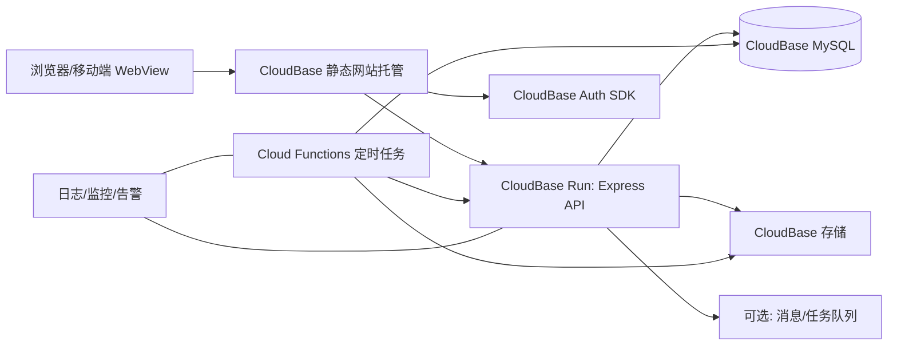

# CervixDetectAI CloudBase 全栈迁移可行性评估与最佳实践方案

**版本**：v1.0  
**日期**：2026-03-02  
**适用对象**：项目负责人、前后端开发、运维/交付  
**结论摘要**：**可行，且建议采用“CloudRun 为主、Cloud Functions 为辅、CloudBase Auth 分阶段迁移”的渐进方案。**

---

## 1. 目标与范围

你提出的目标是将项目前后端尽量统一到腾讯云 CloudBase 体系，核心诉求包括：

1. 前端托管到 CloudBase 静态网站托管。  
2. 后端迁移到 CloudBase（云托管/云函数）。  
3. 数据层使用 CloudBase MySQL。  
4. 认证能力评估并接入 CloudBase Auth（含短信登录）。  
5. 给出可落地、分阶段、可回滚的实施计划。

---

## 2. 官方文档要点（与你项目直接相关）

> 以下结论来自你指定文档与 CloudBase 官方文档页：
> - Node SDK 初始化：https://docs.cloudbase.net/api-reference/server/node-sdk/initialization  
> - Web SDK 初始化：https://docs.cloudbase.net/api-reference/webv2/initialization  
> - 云托管概述：https://docs.cloudbase.net/run/introduction  
> - 静态网站托管：https://docs.cloudbase.net/hosting/web-hosting  
> - Web 认证（含短信登录）：https://docs.cloudbase.net/api-reference/webv2/authentication#authsigninwithsms  
> - 云托管访问 MySQL（最佳实践）：https://docs.cloudbase.net/run/best-practice/using-mysql

### 2.1 与方案设计强相关的约束

| 类别 | 官方要点 | 对你项目的影响 |
|---|---|---|
| Node SDK 初始化 | `@cloudbase/node-sdk` v3 不指定 `env` 时，默认取当前函数环境 ID | 后端统一封装初始化器时必须显式设计 `env` 策略，避免环境串用 |
| Web SDK 初始化 | Web 端必须先配置安全域名，否则会 CORS 失败 | 前端切换托管域名前必须先完成安全域名白名单 |
| CloudRun 适配 | 云托管支持容器化、任意语言框架、SSE/WebSocket、VPC 资源访问 | 你的 Express 现有后端适合优先“整站平移”到 CloudRun |
| Auth 短信能力 | 文档标注短信注册/登录能力与地域相关（页面标注上海） | 认证迁移必须先做地域可用性核验，不建议盲目一次性替换现有登录体系 |
| 静态托管 | 支持上传包/模板/Git 仓库部署 | 前端可快速上线，建议走 Git 仓库持续部署 |
| MySQL 访问 | 推荐 CloudRun 走 VPC 私网访问 MySQL；且服务 VPC 选择要一次选对 | 云托管与数据库网络规划必须在落地前定版，否则返工成本高 |

---

## 3. 现有系统与 CloudBase 能力映射

### 3.1 现有后端模块（已识别）

- 路由：`auth/sms-auth/email-auth/users/patients/studies/analyze/analysis-tasks/reports/followups/notifications/settings/dashboard/system/payment/patient-insights/chat`
- 服务：`analysisService/paymentService/followupScheduler/notificationService/patientInsights/...`
- 技术栈：Express + Sequelize + MySQL + JWT + 定时任务 + 文件上传 + 第三方短信/邮件/支付

### 3.2 CloudBase 目标映射（推荐）

| 当前能力 | 目标服务 | 迁移建议 |
|---|---|---|
| Express 主 API | CloudBase Run（云托管） | **优先整站迁移**，先不拆微服务 |
| 定时任务（随访提醒、清理任务） | 云函数 + 定时触发器 | 从主 API 中拆出，减少主服务负担 |
| MySQL（Sequelize） | CloudBase MySQL | 先同构迁移，后续再做模型优化 |
| 上传文件/报告文件 | CloudBase 存储 + 签名下载 | 替换本地磁盘路径，消除静态暴露风险 |
| 前端 Quasar 构建产物 | CloudBase 静态网站托管 | 先灰度域名，再切正式域名 |
| JWT 登录体系 | 分阶段迁移到 CloudBase Auth | 建议“双轨过渡”，避免一次切换导致登录中断 |

---

## 4. 可行性评估（结论：高可行）

## 4.1 评分（100 分）

| 维度 | 分数 | 说明 |
|---|---:|---|
| 技术可行性 | 28/30 | Express + MySQL + 前端静态托管与 CloudBase 匹配度高 |
| 改造成本 | 18/25 | 认证与文件链路是主要改造点 |
| 风险可控性 | 20/25 | 可通过双轨、灰度、回滚策略控制 |
| 交付速度 | 14/20 | 先 CloudRun 平移可显著缩短周期 |
| 长期运维收益 | 9/10 | 统一平台后运维复杂度和成本可下降 |

**综合分：89/100（建议立项执行）**

---

## 5. 推荐目标架构（最佳实践）

### 5.1 为什么不是“一上来全云函数”

你的后端是完整 Express API，模块多、状态多、外部依赖多。  
云函数全量重写会把迁移项目变成“重构项目”，周期与风险都会显著增加。

**最佳路径**：  
先 CloudRun 承接主 API（快速稳定上线） -> 再把定时/异步任务拆到云函数 -> 最后做认证与深度平台化。

---

## 6. 分阶段实施计划（详细）

## Phase 0：落地前基线与决策冻结（2-3 天）

**目标**：冻结关键设计，避免中途返工。  
**产出**：

1. 环境策略：`dev/staging/prod` 三环境命名与隔离规则。  
2. 地域策略：确认 CloudRun、MySQL、Auth（尤其短信）同地域可用。  
3. 网络策略：确认 VPC/子网/安全组（服务与 MySQL 同 VPC）。  
4. 密钥策略：统一 Secrets 注入规范（不进代码仓）。

**验收**：形成《迁移参数清单》并评审通过。

## Phase 1：云托管平移主后端（5-8 天）

**目标**：Express 主服务先在 CloudRun 稳定跑起来。  
**任务**：

1. 为 `server/` 增加生产级容器构建（Dockerfile、健康检查、启动参数）。  
2. 配置 CloudRun 服务：CPU/内存、最小实例、自动扩缩容策略。  
3. 注入环境变量：DB、JWT、第三方服务密钥、回调地址。  
4. 接通日志与基础监控。  

**验收**：

- 核心 API（登录、病例、分析、报告、随访）成功率达标。  
- 冷启动、峰值并发可接受。  
- 回滚到旧环境方案可执行。

## Phase 2：MySQL 与存储链路迁移（4-7 天）

**目标**：把“数据与文件”迁到平台可持续运维的形态。  
**任务**：

1. MySQL 迁移：结构校验、全量迁移、增量同步、最终切换。  
2. 文件迁移：`uploads/reports` 迁至 CloudBase 存储。  
3. 下载改造：改为受控下载/签名 URL（替代本地静态目录暴露）。  
4. 数据库连接池与超时参数按 CloudRun 调优。

**验收**：

- 数据一致性抽样通过（行数、关键字段、业务查询）。  
- 文件可读写、可鉴权下载、旧链接有兼容跳转或迁移说明。  

## Phase 3：前端静态托管切换（2-4 天）

**目标**：前端部署流程云化与域名切换。  
**任务**：

1. 前端构建产物部署到 CloudBase 静态托管（建议 Git 仓库部署）。  
2. 安全域名配置（含 `localhost` 开发白名单、正式域名白名单）。  
3. CORS 与 API 基址切换。  
4. 灰度发布与回滚预案。

**验收**：

- 全链路可访问，CORS 无异常。  
- 灰度域名与正式域名均通过关键路径回归。

## Phase 4：云函数承接定时/异步任务（3-5 天）

**目标**：降低主 API 压力，提高任务可维护性。  
**任务**：

1. 拆分 `followupScheduler/databaseCleanup` 等任务为云函数。  
2. 定时触发器接管原进程内 cron。  
3. 统一任务日志与告警；失败重试策略。  

**验收**：

- 定时任务触发准确、重复执行可控、失败可追踪。  

## Phase 5：认证体系迁移（可选分步，5-10 天）

**目标**：平滑迁到 CloudBase Auth，不中断现网登录。  
**建议策略（强烈推荐）**：

1. **双轨阶段**：保留现有 JWT 登录，新增 CloudBase Auth 通道。  
2. **桥接阶段**：用户首次 CloudBase 登录时完成账号关联。  
3. **切换阶段**：灰度放量后再切主认证路径。  

**重点约束**：

- 短信认证能力的地域限制要先验证。  
- 角色权限（admin/doctor）需要额外映射机制，不能只依赖默认用户态。

**验收**：

- 老用户无感迁移，登录成功率不下降。  
- 权限校验与审计不弱化。

---

## 7. 关键设计决策（Best Practices）

1. **主 API 先 CloudRun，避免一次性重写云函数。**  
2. **云函数只承接“定时/异步/事件驱动”任务。**  
3. **MySQL 必须走私网访问，避免公网暴露数据库。**  
4. **服务环境分层（dev/staging/prod）强隔离，禁止混用。**  
5. **密钥全部走环境变量/密钥管理，仓库零明文。**  
6. **文件访问改受控下载或签名 URL，不再裸露静态目录。**  
7. **Auth 采用双轨过渡，不做“大爆炸切换”。**  
8. **CI/CD 先打通部署，再做质量门禁（lint/test/e2e）。**  
9. **观测先行：日志、指标、告警和追踪同时接入。**  
10. **每阶段必须有回滚开关与回滚演练。**

---

## 8. 风险清单与缓解

| 风险 | 概率 | 影响 | 缓解方案 |
|---|---|---|---|
| 认证切换导致登录失败 | 中 | 高 | 双轨登录 + 小流量灰度 + 用户映射表 |
| 数据迁移不一致 | 中 | 高 | 全量+增量双阶段迁移，切换前对账 |
| 文件链路中断 | 中 | 中 | 先双写/双读一段时间，再切换 |
| 地域能力不匹配（尤其短信） | 中 | 高 | Phase 0 先核验地域，必要时保留现短信服务 |
| CloudRun 配置不当导致成本上涨 | 中 | 中 | 设置最小实例、扩缩容阈值、预算告警 |
| VPC 规划错误 | 低 | 高 | 迁移前冻结网络方案，先 staging 演练 |

---

## 9. 迁移验收标准（Go/No-Go）

### 9.1 功能验收

1. 用户认证、病例管理、分析、报告、随访、通知全流程通过。  
2. 患者洞察（F2/F8/F9）数据正确，无旧请求覆盖问题。  
3. 文件上传/下载/预览链路稳定。

### 9.2 非功能验收

1. API 成功率、P95 响应时间、错误率达到基线。  
2. 数据一致性抽样通过。  
3. 监控告警齐全，演练可触发。  
4. 回滚演练成功（15-30 分钟内可回切）。

---

## 10. 建议工期与人力

| 阶段 | 预估工期 | 建议角色 |
|---|---:|---|
| Phase 0 | 2-3 天 | 架构/后端/运维 |
| Phase 1 | 5-8 天 | 后端/运维 |
| Phase 2 | 4-7 天 | 后端/DBA/运维 |
| Phase 3 | 2-4 天 | 前端/运维 |
| Phase 4 | 3-5 天 | 后端 |
| Phase 5 | 5-10 天 | 前后端/后端 |

**总计**：约 3-6 周（视认证迁移深度浮动）。

---

## 11. 你这个项目的推荐执行顺序（最终建议）

1. **先上 CloudRun（主后端平移）**  
2. **再迁 MySQL + 文件存储**  
3. **再切前端静态托管**  
4. **再拆云函数任务**  
5. **最后迁 Auth（双轨渐进）**

这个顺序能最大化“可控上线”，同时最小化业务中断和返工。

---

## 12. 下一步可直接开工的任务清单（本周）

1. 输出《CloudBase 环境与网络参数清单》（环境 ID、地域、VPC、子网、安全组）。  
2. 准备 `server` 容器化配置并在 staging CloudRun 跑通。  
3. 选定 MySQL 迁移工具链并做一次小样本迁移演练。  
4. 前端准备托管域名与安全域名白名单。  
5. 设计认证双轨方案（账号映射表 + 灰度策略）。

---

## 附录 A：认证迁移策略建议

### A.1 若你追求最稳妥（推荐）

- 现有 JWT 保持不动 -> CloudBase Auth 作为新增登录入口 -> 用户迁移完成后再切主路径。

### A.2 若你追求最快切换（风险更高）

- 直接替换登录体系。  
- 不建议在当前项目执行，除非能接受短期登录波动与较长回归周期。

---

## 附录 B：参考文档

1. Node SDK 初始化：<https://docs.cloudbase.net/api-reference/server/node-sdk/initialization>  
2. Web SDK 初始化：<https://docs.cloudbase.net/api-reference/webv2/initialization>  
3. CloudBase Run 概述：<https://docs.cloudbase.net/run/introduction>  
4. 静态网站托管：<https://docs.cloudbase.net/hosting/web-hosting>  
5. 身份认证（含短信登录）：<https://docs.cloudbase.net/api-reference/webv2/authentication#authsigninwithsms>  
6. 云托管访问 MySQL 最佳实践：<https://docs.cloudbase.net/run/best-practice/using-mysql>

