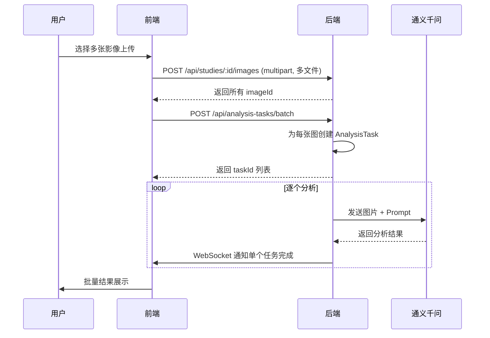

# 第二阶段：核心体验升级

> **周期**: 4-5 周  
> **目标**: 提升核心功能体验，完善 UI/UX 细节，建立基础架构规范  
> **前置条件**: 第一阶段安全加固全部完成  
> **验收标准**: 核心功能流畅可用，UI 一致性显著提升，测试覆盖关键路径

---

## 任务总览

### 2a — 核心功能（第 3-4 周）

| 任务               | 编号 | 预估工时 |  依赖   |
| :----------------- | :--: | :------: | :-----: |
| 批量检测支持       |  F1  |   16h    | S2 完成 |
| WebSocket 实时通知 | F18  |   12h    |   无    |
| 站内消息中心       | F19  |    8h    |   F18   |
| 报告在线预览       | F14  |    6h    |   无    |
| 置信度校准         |  F5  |    4h    |   无    |

### 2b — 体验优化 + 架构（第 5-6 周）

| 任务                     | 编号 | 预估工时 |  依赖   |
| :----------------------- | :--: | :------: | :-----: |
| 暗色模式完善             |  U1  |    8h    |   无    |
| 骨架屏加载               |  U7  |    4h    |   无    |
| 新手引导系统             | U12  |    6h    |   无    |
| 品牌化错误页面           | U14  |    2h    |   无    |
| 面包屑导航               | U17  |    3h    |   无    |
| Service 层重构           |  T1  |   16h    | T8 完成 |
| 数据库迁移流程           |  T2  |    8h    |   无    |
| TypeScript 类型补全      |  T9  |    8h    |   无    |
| 单元测试覆盖（核心路径） | T13  |   16h    | T1 完成 |

**合计预估**: ~117h（约 15 个工作日，分两个子阶段）

---

## 详细执行方案

### 1. F1 — 批量检测支持

**设计方案**:



**执行步骤**:

1. **后端**: 修改 `server/routes/studies.js` 的影像上传接口：
   - `multer` 配置改为 `.array('images', 10)`（最多10张）
   - 循环创建 `StudyImage` 记录，第一张设为 `is_primary: true`

2. **后端**: 新增 `POST /api/analysis-tasks/batch` 接口：
   - 接收 `studyId` + `imageIds` 数组
   - 为每张图创建独立的 `AnalysisTask`
   - 返回所有 `taskId`

3. **前端**: 扩展 `UploadPage.vue` 上传组件：
   - 支持多文件拖拽选择
   - 显示上传进度列表（每个文件单独进度条）
   - 上传完成后自动触发批量分析

4. **前端**: 新增批量结果展示视图：
   - 卡片网格布局展示多个分析结果
   - 支持点击单个结果查看详情

**验收条件**:

- [ ] 可一次上传 2-10 张影像
- [ ] 每张影像独立创建分析任务
- [ ] 批量分析结果正确展示
- [ ] 单个任务失败不影响其他任务

---

### 2. F18 — WebSocket 实时通知

**技术选型**: `socket.io`（兼容性好，自动降级，支持房间/命名空间）

**执行步骤**:

1. **后端**: 安装依赖

   ```bash
   cd server && npm install socket.io
   ```

2. **后端**: 在 `server/index.js` 中初始化 Socket.IO：

   ```javascript
   const { Server } = require('socket.io');
   const io = new Server(httpServer, { cors: { origin: '*' } });
   // JWT 鉴权中间件
   io.use((socket, next) => {
     const token = socket.handshake.auth.token;
     // 验证 token...
   });
   // 按 userId 加入房间
   io.on('connection', (socket) => {
     socket.join(`user_${socket.userId}`);
   });
   ```

3. **后端**: 在分析任务完成时推送通知：

   ```javascript
   // server/routes/analysis-tasks.js — 分析完成回调
   io.to(`user_${userId}`).emit('analysis:complete', { taskId, result });
   ```

4. **前端**: 安装 `socket.io-client` 并创建 `src/services/socketService.ts`：
   - 连接管理（自动重连、鉴权）
   - 事件监听与分发（通过 Pinia Store 或事件总线）
   - 连接状态指示器（UI 右上角小圆点）

**推送事件清单**:

| 事件                | 触发时机       | 推送数据                       |
| :------------------ | :------------- | :----------------------------- |
| `analysis:complete` | 分析任务完成   | taskId, result, studyId        |
| `analysis:failed`   | 分析任务失败   | taskId, error                  |
| `alert:high-risk`   | 检测到高危病例 | taskId, patientName, riskLevel |
| `system:message`    | 系统广播       | title, content, type           |

**验收条件**:

- [ ] 分析完成后前端实时收到通知（无需手动刷新）
- [ ] 高危病例触发醒目警告通知
- [ ] 断线自动重连
- [ ] 页面切换后通知依然有效

---

### 3. F19 — 站内消息中心

**数据模型**:

```sql
CREATE TABLE notifications (
  id INT PRIMARY KEY AUTO_INCREMENT,
  user_id INT NOT NULL,
  type ENUM('analysis', 'alert', 'system', 'follow_up') NOT NULL,
  title VARCHAR(200) NOT NULL,
  content TEXT,
  is_read BOOLEAN DEFAULT FALSE,
  metadata JSON,  -- 存储 taskId/studyId 等关联信息
  created_at DATETIME DEFAULT NOW(),
  FOREIGN KEY (user_id) REFERENCES users(id)
);
```

**执行步骤**:

1. 新建 `server/models/Notification.js`
2. 新建 `server/routes/notifications.js`：
   - `GET /api/notifications` — 获取通知列表（分页、筛选已读/未读）
   - `PUT /api/notifications/:id/read` — 标记已读
   - `PUT /api/notifications/read-all` — 全部已读
   - `DELETE /api/notifications/:id` — 删除通知
3. 后端事件触发点自动创建 Notification 记录
4. 前端：在 `MainLayout.vue` 头部添加消息图标 + 未读数 Badge
5. 前端：消息抽屉/弹出面板组件

**验收条件**:

- [ ] 分析完成后自动生成消息记录
- [ ] 消息列表支持分页和已读筛选
- [ ] 全部标记已读功能正常
- [ ] 头部消息图标实时显示未读数

---

### 4. F14 — 报告在线预览

**执行步骤**:

1. 方案 A（推荐）：HTML 报告预览
   - 复用 `src/utils/pdfGenerator.ts` 的 HTML 模板
   - 新建 `ReportPreviewDialog.vue` 组件
   - 在对话框中渲染完整报告（与 PDF 生成使用同一模板）
   - 提供"预览" + "下载 PDF"两个按钮

2. 方案 B：PDF 内嵌预览
   - 使用 `<iframe>` 或 `vue-pdf-embed` 组件
   - 先在后端生成 PDF，再通过 Blob URL 预览

**推荐方案 A**，原因：

- 避免重复生成 PDF 的性能开销
- HTML 渲染更快，支持自适应大小
- 与现有前端 PDF 生成流程无缝集成

**验收条件**:

- [ ] 点击"预览报告"可在弹窗中查看完整报告
- [ ] 预览内容与下载的 PDF 一致
- [ ] 支持打印（`window.print()`）

---

### 5. F5 — 置信度校准

**执行步骤**:

1. **后端**: 在 `server/services/qwenService.js` 分析结果中提取 `confidence` 值
2. **后端**: 在 `server/routes/analysis-tasks.js` 分析完成后判断：
   ```javascript
   if (result.confidence < THRESHOLD) {
     result.needs_manual_review = true;
     // 创建提醒通知
   }
   ```
3. **前端**: 在 `SettingsPage.vue` 中增加置信度阈值配置项
4. **前端**: 在分析结果页面显示"需人工复核"标记

**验收条件**:

- [ ] 低于阈值的结果自动标记"需人工复核"
- [ ] 管理员可调整阈值
- [ ] "需复核"病例在列表中有醒目标识

---

### 6. U1 — 暗色模式完善

**现状**: `themeStore.ts` 已实现基础切换逻辑，但各页面适配不完整。

**执行步骤**:

1. 建立 CSS 变量统一体系（`src/css/theme-variables.css`）：

   ```css
   :root {
     --bg-primary: #ffffff;
     --bg-secondary: #f5f6fa;
     --text-primary: #1a1a2e;
     --border-color: #e0e0e0;
     /* ... */
   }
   body.body--dark {
     --bg-primary: #121212;
     --bg-secondary: #1e1e1e;
     --text-primary: #e0e0e0;
     --border-color: #333333;
   }
   ```

2. 逐页替换硬编码颜色值为 CSS 变量：
   - `DashboardPage.vue`（优先，使用了大量硬编码色值）
   - `StudyDetailPage.vue`
   - `PatientsPage.vue`
   - `SettingsPage.vue`
   - `ProfilePage.vue`

3. 确保 ECharts 图表跟随主题切换配色

**验收条件**:

- [ ] 所有页面在暗色模式下无白色背景块残留
- [ ] 文字/图标在暗色模式下可读性良好
- [ ] ECharts 图表配色跟随切换
- [ ] 主题切换无闪烁

---

### 7. U7 — 骨架屏加载

将数据加载等待从空白替换为 Quasar `q-skeleton` 组件。

**优先覆盖页面**:

- `DashboardPage.vue` — 统计卡片 + 图表区域
- `PatientsPage.vue` — 患者列表
- `StudiesPage.vue` — 病例列表
- `StudyDetailPage.vue` — 详情页

**实现模式**:

```vue
<template>
  <div v-if="loading">
    <q-skeleton type="rect" height="100px" class="q-mb-md" />
    <q-skeleton type="text" width="60%" />
  </div>
  <div v-else>
    <!-- 实际内容 -->
  </div>
</template>
```

**验收条件**:

- [ ] 主要页面加载时显示骨架屏
- [ ] 数据到达后平滑过渡到实际内容

---

### 8. U12 — 新手引导系统

**技术选型**: `driver.js`（轻量、无依赖、支持步骤高亮）

**执行步骤**:

1. 安装 `driver.js`
2. 创建 `src/utils/guideTour.ts`，定义各页面的引导步骤
3. 在 `DashboardPage.vue`（首页）首次登录时触发引导
4. 使用 `localStorage` 记录用户是否已完成引导
5. 在设置页面提供"重新查看引导"按钮

**引导步骤设计**:
| 步骤 | 元素 | 说明 |
|:---:|:---|:---|
| 1 | 侧边栏 | "这是功能导航栏，点击切换不同模块" |
| 2 | Dashboard 统计卡片 | "这里展示您的数据概览" |
| 3 | 快捷上传按钮 | "点击这里快速上传影像进行 AI 分析" |
| 4 | 用户头像 | "这里可以查看个人信息和系统设置" |

**验收条件**:

- [ ] 首次登录自动弹出引导
- [ ] 引导步骤高亮正确元素
- [ ] 完成后不再自动弹出
- [ ] 可手动重新触发

---

### 9. T1 — Service 层重构

**目标**: 将路由文件中的业务逻辑抽离到 Service 层，路由文件仅负责：参数校验 → 调用 Service → 返回响应。

**重构顺序**（按文件大小/复杂度排序）:

1. `server/routes/studies.js`（17KB）→ `server/services/studyService.js`
2. `server/routes/analysis-tasks.js`（17KB）→ `server/services/analysisTaskService.js`
3. `server/routes/dashboard.js`（13KB）→ `server/services/dashboardService.js`
4. `server/routes/sms-auth.js`（13KB）→ 复用现有 `sms.service.js`
5. `server/routes/analyze.js`（10KB）→ 复用/扩展 `analysisService.js`

**重构模式**:

```javascript
// 重构前 (routes/studies.js)
router.post('/', authenticate, async (req, res) => {
  try {
    // 30行业务逻辑...
    res.json({ success: true, data: study });
  } catch (err) { ... }
});

// 重构后
router.post('/', authenticate, validate(createStudySchema), async (req, res) => {
  const study = await studyService.createStudy(req.user.id, req.body);
  res.json({ success: true, data: study });
});
```

**验收条件**:

- [ ] 路由文件不超过 5KB（仅包含路由定义和参数校验）
- [ ] Service 文件纯函数、可独立测试
- [ ] 所有现有 API 行为无回归

---

### 10. T2 — 数据库迁移流程

**执行步骤**:

1. 安装 `sequelize-cli`：

   ```bash
   cd server && npm install --save-dev sequelize-cli
   npx sequelize-cli init
   ```

2. 从现有模型生成初始迁移文件（快照当前 schema）

3. 修改 `server/models/index.js`：

   ```diff
   - await sequelize.sync({ alter: true });
   + // 生产环境禁止自动同步，改用 migration
   + if (process.env.NODE_ENV === 'development') {
   +   await sequelize.sync({ alter: true });
   + }
   ```

4. 添加 npm scripts：
   ```json
   "db:migrate": "npx sequelize-cli db:migrate",
   "db:migrate:undo": "npx sequelize-cli db:migrate:undo",
   "db:seed": "npx sequelize-cli db:seed:all"
   ```

**验收条件**:

- [ ] 初始迁移文件可在空数据库上正确创建所有表
- [ ] `npm run db:migrate` 执行成功
- [ ] 生产环境不再执行 `sync({ alter: true })`

---

### 11. T13 — 单元测试覆盖（核心路径）

**测试框架**:

- 前端: `vitest` + `@vue/test-utils`
- 后端: `jest` + `supertest`

**优先覆盖**:

| 模块       | 测试范围             | 文件                                      |
| :--------- | :------------------- | :---------------------------------------- |
| 后端鉴权   | 登录/注册/Token 刷新 | `server/routes/auth.test.js`              |
| 后端权限   | 患者数据隔离验证     | `server/routes/patients.test.js`          |
| 后端支付   | 幂等性/权益发放      | `server/services/paymentService.test.js`  |
| 前端 Store | authStore 状态管理   | `src/stores/__tests__/authStore.test.ts`  |
| 前端 Store | studyStore CRUD      | `src/stores/__tests__/studyStore.test.ts` |

**验收条件**:

- [ ] 后端核心路由测试覆盖率 > 60%
- [ ] 前端核心 Store 测试通过
- [ ] `npm test` 命令可正常执行

---

## 里程碑检查清单

- [ ] 批量上传 + 分析正常工作
- [ ] WebSocket 实时推送通知正常
- [ ] 消息中心 UI 完善
- [ ] 报告可在线预览
- [ ] 暗色模式全页面适配
- [ ] 骨架屏覆盖主要页面
- [ ] 新手引导功能可用
- [ ] Service 层重构完成
- [ ] 数据库迁移流程建立
- [ ] 核心路径测试通过
- [ ] 项目构建无回归
