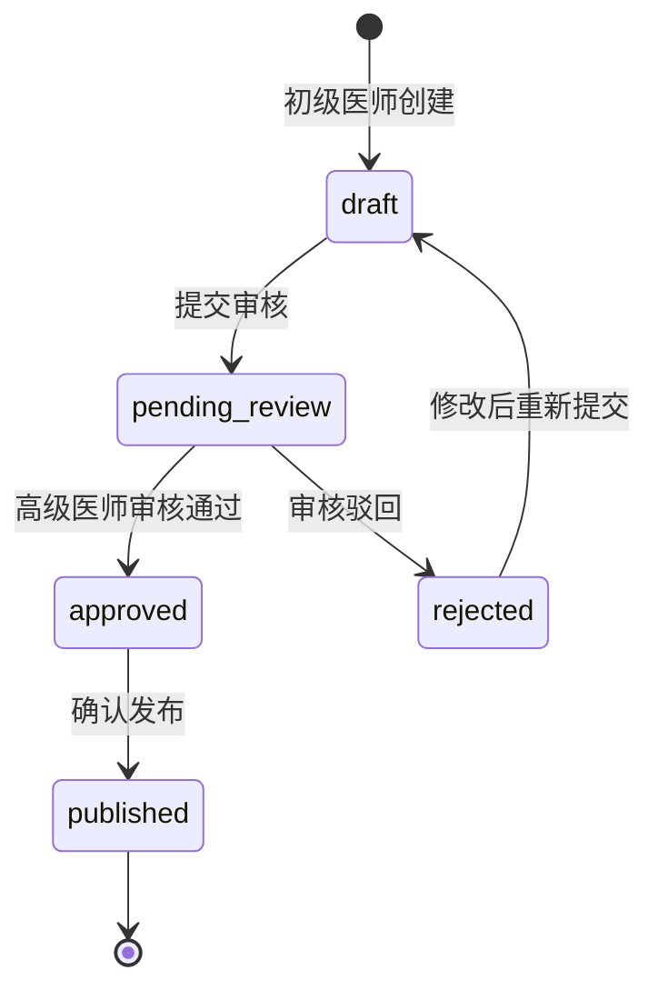

# 第四阶段：生态拓展

> **周期**: 9-16 周  
> **目标**: 高级功能扩展、移动端深度优化、长期架构演进  
> **前置条件**: 第三阶段核心功能和基础设施就位  
> **验收标准**: 产品功能完善，移动端体验优良，工程体系成熟

---

## 任务总览

### 高级功能

| 任务                 | 编号 | 预估工时 | 依赖  |
| :------------------- | :--: | :------: | :---: |
| 多模型切换           |  F4  |   12h    |  T6   |
| 患者风险画像         |  F9  |   10h    | F2/F8 |
| 电子签名             | F15  |   16h    |  F13  |
| 报告分享（限时链接） | F16  |    6h    |  S2   |
| 审核工作流           | F21  |   16h    |  F20  |
| 自定义报表           | F25  |   12h    |  F23  |
| 数据导出             | F26  |    6h    |  F25  |

### 移动端深度优化

| 任务       | 编号 | 预估工时 | 依赖 |
| :--------- | :--: | :------: | :--: |
| 底部导航栏 | U19  |    4h    |  无  |
| 手势操作   | U20  |    8h    |  无  |
| PWA 支持   | U21  |    6h    |  无  |
| 相机直拍   | U22  |    6h    |  无  |

### 长期架构

| 任务                 | 编号 | 预估工时 | 依赖 |
| :------------------- | :--: | :------: | :--: |
| 结构化日志           |  T3  |    6h    |  无  |
| API 版本控制         |  T4  |    4h    | T17  |
| 后端 TypeScript 迁移 |  T7  |   40h+   |  T1  |
| E2E 测试             | T14  |   16h    | T13  |
| 性能监控             | T18  |    8h    |  无  |

### 推迟/探索性研究

| 任务         | 编号 | 原因                                     |
| :----------- | :--: | :--------------------------------------- |
| AI 热力图    |  F3  | 通义千问 VL 不支持，需自建 CV 模型       |
| 本地 AI 推理 |  F7  | 工程量极大，医疗模型难以压缩到可接受大小 |
| 患者自助查询 | F12  | 需独立前端+合规审查，投入产出比低        |
| 国际化       | T12  | 无国际化需求，16 页面文本提取工作量巨大  |

**可执行任务合计**: ~176h（约 22 个工作日）

---

## 详细执行方案

### 1. F4 — 多模型切换

**现状**: `src/stores/modelStore.ts`（3927 字节）已有模型管理的骨架代码。

**执行步骤**:

1. **后端**: 新建 `server/config/ai-models.js`：

   ```javascript
   module.exports = {
     models: [
       {
         id: 'qwen-vl-max',
         name: '通义千问 VL-Max',
         provider: 'dashscope',
         endpoint: 'https://dashscope.aliyuncs.com/compatible-mode/v1',
         capabilities: ['cervix_analysis'],
         costPerCall: 0.05,
       },
       {
         id: 'qwen-vl-plus',
         name: '通义千问 VL-Plus',
         provider: 'dashscope',
         endpoint: 'https://dashscope.aliyuncs.com/compatible-mode/v1',
         capabilities: ['cervix_analysis'],
         costPerCall: 0.02,
       },
       // 未来可扩展更多模型
     ],
   };
   ```

2. **后端**: 修改 `server/services/qwenService.js`，支持根据 `modelId` 动态切换：
   - 统一抽象 `AIServiceInterface`
   - 不同模型使用不同的 API Key/Endpoint

3. **前端**: 完善 `modelStore.ts`：
   - 获取可用模型列表
   - 用户选择模型（在分析前选择或在设置中设置默认值）
   - 展示模型说明和消耗积分

4. **前端**: `UploadPage.vue` 添加模型选择器

**验收条件**:

- [ ] 用户可在上传前选择 AI 模型
- [ ] 不同模型返回的结果格式统一
- [ ] 模型切换对用户积分消耗不同

---

### 2. F9 — 患者风险画像

**风险评分算法**:

```javascript
// server/services/riskProfileService.js
function calculateRiskScore(patient) {
  let score = 0;
  const history = patient.analysisResults;

  // 因子1：高风险检测次数占比
  const highRiskRate = history.filter((r) => r.risk_level === 'high').length / history.length;
  score += highRiskRate * 40;

  // 因子2：最近一次检测的风险等级
  const latest = history[history.length - 1];
  if (latest.risk_level === 'high') score += 30;
  else if (latest.risk_level === 'medium') score += 15;

  // 因子3：风险趋势（上升/下降/稳定）
  const trend = calculateTrend(history);
  if (trend === 'rising') score += 20;
  else if (trend === 'stable') score += 10;

  // 因子4：距上次检测时间
  const daysSinceLastCheck = daysBetween(latest.created_at, new Date());
  if (daysSinceLastCheck > 180) score += 10; // 超过半年未检测

  return Math.min(100, Math.round(score));
}
```

**前端展示**:

- 患者详情页添加"风险画像"卡片
- 风险评分仪表盘（ECharts gauge）
- 风险因子分解展示
- 高危患者在列表中红色标记

**验收条件**:

- [ ] 每位患者有风险评分（0-100）
- [ ] 风险评分实时计算（基于历史数据）
- [ ] 高危患者（>60分）有醒目提醒

---

### 3. F15 — 电子签名

> [!CAUTION]
> 此功能涉及法律效力，正式环境需对接具备资质的 CA 机构。以下方案仅实现**数字签名图片嵌入**，不等同于合规的电子签名。

**简化实现方案**:

1. 医生在个人设置中上传手写签名图片或使用 Canvas 手写签名
2. 签名图片存储在 `server/uploads/signatures/{userId}.png`
3. 报告生成时（F13 的后端模板）在指定位置嵌入签名图片
4. 选填签名密码用于二次确认

**完整合规方案（远期）**:

- 对接第三方电子签名服务（如 e签宝、法大大）
- 使用 PKCS#7 标准数字证书签名 PDF
- 签名后 PDF 不可篡改

**验收条件**:

- [ ] 医生可上传/绘制签名
- [ ] 报告 PDF 中包含签名图片
- [ ] 签名前需输入密码确认

---

### 4. F16 — 报告分享（限时链接）

**执行步骤**:

1. 新建 `server/models/ShareLink.js`：

   ```javascript
   {
     token: { type: STRING(64), unique: true },  // 随机不可预测
     report_id: { type: INTEGER },
     created_by: { type: INTEGER },
     expires_at: { type: DATE },
     max_views: { type: INTEGER, defaultValue: 10 },
     view_count: { type: INTEGER, defaultValue: 0 }
   }
   ```

2. 新增接口：
   - `POST /api/reports/:id/share` — 生成分享链接（配置有效期和最大访问次数）
   - `GET /api/share/:token` — 公开访问（无需登录，校验 Token 有效性）

3. 前端：分享按钮 → 配置弹窗 → 生成链接/二维码（使用 `qrcode` 库）

**验收条件**:

- [ ] 生成的链接可直接打开报告（无需登录）
- [ ] 超过有效期后返回"链接已过期"
- [ ] 超过最大访问次数后返回"链接已失效"
- [ ] 可生成带品牌 LOGO 的二维码

---

### 5. F21 — 审核工作流

**状态机设计**:



**执行步骤**:

1. `Study` 模型新增 `review_status` 字段（`draft/pending_review/approved/rejected/published`）
2. 新增 `server/routes/review.js`：
   - `POST /api/studies/:id/submit-review` — 提交审核
   - `POST /api/studies/:id/approve` — 审核通过（需 senior/admin 权限）
   - `POST /api/studies/:id/reject` — 审核驳回（附理由）
3. 审核状态变更触发通知（F19）
4. 前端：病例详情页添加审核状态 Badge 和操作按钮

**验收条件**:

- [ ] 初级医师可提交审核
- [ ] 高级医师收到审核通知
- [ ] 审核驳回可附带理由
- [ ] 各角色只能执行权限范围内的操作

---

### 6. U19-U22 — 移动端深度优化

**U19 — 底部导航栏**:

```vue
<!-- MainLayout.vue — 移动端使用底部 Tab -->
<q-footer v-if="$q.screen.lt.md" class="bg-white">
  <q-tabs v-model="activeTab" class="text-primary">
    <q-tab name="dashboard" icon="dashboard" label="首页" />
    <q-tab name="patients" icon="people" label="患者" />
    <q-tab name="upload" icon="add_circle" label="上传" />
    <q-tab name="reports" icon="description" label="报告" />
    <q-tab name="profile" icon="person" label="我的" />
  </q-tabs>
</q-footer>
```

**U21 — PWA 支持**:

```typescript
// quasar.config.ts
pwa: {
  workboxPluginMode: 'GenerateSW',
  workboxOptions: {
    skipWaiting: true,
    clientsClaim: true
  },
  manifest: {
    name: 'CervixDetect AI',
    short_name: 'CervixAI',
    display: 'standalone',
    theme_color: '#1976d2',
    icons: [/* 各尺寸图标 */]
  }
}
```

**U22 — 相机直拍**:

```bash
npm install @capacitor/camera
npx cap sync
```

```typescript
import { Camera, CameraResultType } from '@capacitor/camera';
const photo = await Camera.getPhoto({
  resultType: CameraResultType.Base64,
  quality: 90,
});
```

**验收条件**:

- [ ] 移动端显示底部 Tab 栏（桌面端不变）
- [ ] PWA 可安装到桌面
- [ ] Capacitor 模式下可调用摄像头拍照上传

---

### 7. T3 — 结构化日志

```bash
cd server && npm install pino pino-pretty
```

```javascript
// server/utils/logger.js
const pino = require('pino');
const logger = pino({
  level: process.env.LOG_LEVEL || 'info',
  transport: process.env.NODE_ENV === 'development' ? { target: 'pino-pretty' } : undefined,
  redact: ['req.headers.authorization', 'body.password', 'body.id_card'],
});
module.exports = logger;
```

**迁移计划**:

1. 全局替换 `console.log` → `logger.info`
2. 全局替换 `console.error` → `logger.error`
3. 请求日志中间件自动记录（`pino-http`）
4. 敏感字段自动脱敏（`redact` 配置）

**验收条件**:

- [ ] 所有日志通过 pino 输出
- [ ] 生产环境输出 JSON 格式日志
- [ ] 敏感字段自动脱敏
- [ ] 支持日志级别动态调整

---

### 8. T4 — API 版本控制

```diff
// server/index.js
- app.use('/api', authRouter);
- app.use('/api/patients', patientsRouter);
+ // API v1
+ app.use('/api/v1', authRouter);
+ app.use('/api/v1/patients', patientsRouter);
+ // 向后兼容：/api/* 重定向到 /api/v1/*
+ app.use('/api', (req, res, next) => {
+   req.url = `/api/v1${req.url}`;
+   next();
+ });
```

**前端同步修改**: `apiClient.ts` 的 `baseURL` 改为 `/api/v1`

**验收条件**:

- [ ] 新路由 `/api/v1/*` 正常工作
- [ ] 旧路由 `/api/*` 自动重定向到 v1（兼容已部署的移动端）
- [ ] Swagger 文档更新为 v1 路径

---

### 9. T14 — E2E 测试

```bash
npm install --save-dev @playwright/test
npx playwright install
```

**核心用户流程覆盖**:

| 测试用例 | 描述                                     |
| :------- | :--------------------------------------- |
| 登录流程 | 输入邮箱密码 → 登录成功 → 跳转 Dashboard |
| 患者管理 | 创建患者 → 查看列表 → 查看详情           |
| 影像分析 | 上传影像 → 等待分析 → 查看结果           |
| 报告导出 | 查看分析结果 → 下载 PDF 报告             |
| 暗色模式 | 切换暗色 → 验证页面无异常样式            |

**验收条件**:

- [ ] 5 个核心流程测试全部通过
- [ ] CI/CD 中集成 E2E 测试
- [ ] 测试运行时间 < 5 分钟

---

## 探索性研究方向（不计入工期）

以下方向建议在前四阶段完成后开展调研，产出可行性报告后再决定是否进入开发：

### F3 — AI 热力图可解释性

**调研方向**:

- 评估自建宫颈病变检测 CV 模型的可行性（数据集、训练成本）
- 调研通义千问 VL 是否会推出视觉注意力输出功能
- 评估 LIME/SHAP 等模型无关解释方法在医疗影像场景的适用性

### F7 — 本地 AI 推理

**调研方向**:

- 评估 ONNX 量化后模型大小和精度损失
- TensorFlow.js WebGL 后端在不同设备上的推理速度
- Capacitor 原生桥接 ONNX Runtime Mobile 的可行性

### F12 — 患者自助查询

**调研方向**:

- 微信小程序 vs H5 的合规审查要求差异
- 患者身份验证方案（短信 + 身份证后四位）
- 数据权限最小化原则（患者仅可见脱敏报告）

---

## 全项目里程碑总结

| 阶段     |  周期   | 核心交付         | 关键指标                      |
| :------- | :-----: | :--------------- | :---------------------------- |
| 第一阶段 | 2-3 周  | 安全加固完成     | P0 漏洞归零                   |
| 第二阶段 | 4-5 周  | 核心体验升级     | 用户满意度提升，测试覆盖 >60% |
| 第三阶段 | 5-8 周  | 功能深化 + CI/CD | 协作、随访、审计功能上线      |
| 第四阶段 | 9-16 周 | 生态完善         | 移动端可用，工程体系成熟      |

> [!TIP]
> 建议每个阶段结束时进行回顾会议（Retrospective），评估：
>
> 1. 哪些任务完成了、哪些推迟了、为什么？
> 2. 时间估算准确率如何？
> 3. 下一阶段的范围是否需要调整？
