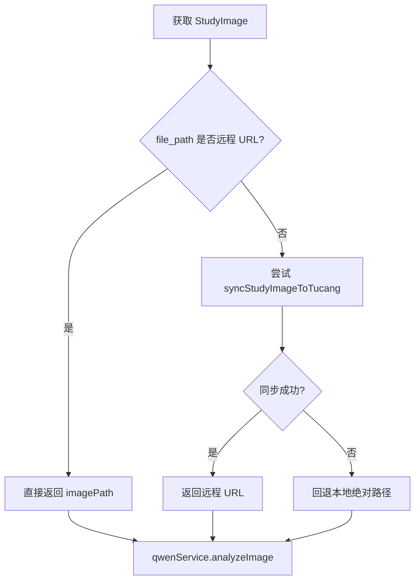

# AI分析API总览

> **本文档引用文件**
> - [analyze.js](file://server/routes/analyze.js)
> - [analysis-tasks.js](file://server/routes/analysis-tasks.js)
> - [studyImageStorage.service.js](file://server/services/studyImageStorage.service.js)
> - [qwenService.js](file://server/services/qwenService.js)

## 简介

当前 AI 分析链路已经演进为“双路径兼容”：

- 优先使用图仓远程 URL
- 图仓不可用时回退本地绝对路径
- `qwenService` 同时支持 HTTP URL 与本地文件 Base64 转换

## 核心接口

- `POST /api/analyze`
  - 上传单张图像并创建任务
  - 文件会先进入临时目录，再持久化为病例影像
- `POST /api/analysis-tasks`
  - 基于已有病例创建单任务
  - 触发分析前会解析主图或最新图
- `POST /api/analysis-tasks/batch`
  - 批量上传并创建任务
  - 支持部分成功

## 分析前准备流程



## 通义千问输入策略

当前 `qwenService` 的输入规则：

- 远程 URL：直接以 `image_url` 方式提交
- 本地文件：读取后转为 Base64 Data URL 再提交

```js
const imageDataUrl = isHttpUrl(imagePath) ? imagePath : await this.imageToBase64(imagePath);
```

## 接口行为说明

### POST /api/analyze

- 校验文件与患者字段
- 创建患者、病例、影像、任务
- 返回成功后异步触发分析
- 分析前会执行 `prepareStudyImageForAnalysis(...)`

### POST /api/analysis-tasks

- 基于现有病例触发单任务
- 优先选择主图，若没有主图则回退最新上传图
- 若没有可分析影像，任务会直接标记失败

### POST /api/analysis-tasks/batch

- 每张图片独立事务
- 单条失败不会阻断整个批次
- 批量结果可同时包含成功项与失败项

## 状态口径

- 允许状态：`PENDING`、`PROCESSING`、`SUCCESS`、`FAILED`
- 历史兼容状态会在查询或更新时做归一化处理

## 结果总结

- 文档不再沿用“仅本地文件转 Base64”的旧叙述
- AI 分析链路已具备远程 URL 优先、本地回退保底的稳定策略
