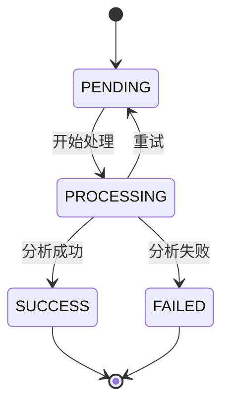
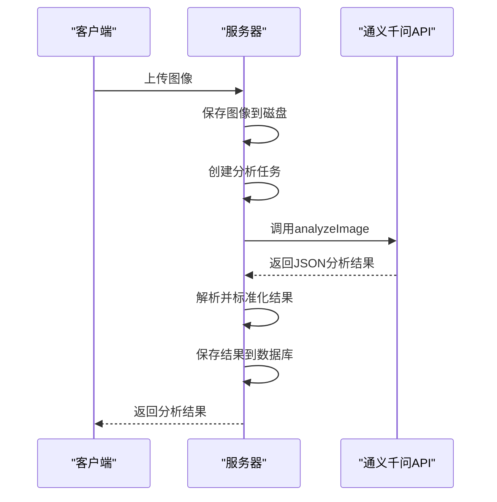
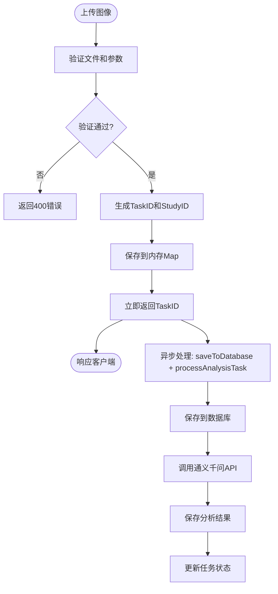

# AI分析API

> **本文档引用的文件**
> - [apiService.ts](file://src/services/apiService.ts)
> - [api.ts](file://src/services/api.ts)
> - [analyze.js](file://server/routes/analyze.js)
> - [analysis-tasks.js](file://server/routes/analysis-tasks.js)
> - [qwenService.js](file://server/services/qwenService.js)
> - [AnalysisTask.js](file://server/models/AnalysisTask.js)
> - [AnalysisResult.js](file://server/models/AnalysisResult.js)

## 目录
1. [简介](#简介)
2. [核心端点](#核心端点)
3. [分析任务状态机](#分析任务状态机)
4. [通义千问视觉大模型集成](#通义千问视觉大模型集成)
5. [异步处理流程](#异步处理流程)
6. [端点参考](#端点参考)

## 简介
本API文档详细描述了宫颈细胞学图像AI分析系统的核心功能。系统提供了一套完整的RESTful API，用于上传医学图像、创建分析任务、查询任务状态和获取分析结果。整个流程采用异步处理模式，确保了高并发场景下的系统稳定性和响应速度。后端通过集成通义千问视觉大模型，对上传的宫颈细胞学图像进行深度分析，生成专业的病理诊断报告。

**Section sources**
- [analyze.js](file://server/routes/analyze.js#L1-L378)
- [analysis-tasks.js](file://server/routes/analysis-tasks.js#L1-L405)

## 核心端点
系统提供了两套互补的API接口，分别用于处理图像上传和管理分析任务。

第一套接口（`/api/analyze`）专为单图上传和快速状态查询设计，简化了前端集成流程。第二套接口（`/api/analysis-tasks`）提供了单任务 CRUD 与批量上传创建任务能力，适用于需要精细控制任务生命周期和批次管理的场景。

```mermaid
graph TD
A[客户端] --> B[/api/analyze]
A --> C[/api/analysis-tasks]
B --> D[上传图像并创建任务]
B --> E[查询任务状态]
B --> F[根据studyId查询结果]
C --> G[创建分析任务]
C --> M[批量上传并创建任务]
C --> H[获取任务列表]
C --> I[获取任务详情]
C --> J[更新任务状态]
C --> K[保存分析结果]
C --> L[删除分析任务]
```

**Diagram sources**
- [analyze.js](file://server/routes/analyze.js#L48-L377)
- [analysis-tasks.js](file://server/routes/analysis-tasks.js#L9-L487)

## 分析任务状态机
分析任务在其生命周期中会经历一系列预定义的状态。这些状态构成了一个清晰的状态机，确保了任务处理的可预测性和可追踪性。



**Diagram sources**
- [AnalysisTask.js](file://server/models/AnalysisTask.js#L39-L42)
- [analyze.js](file://server/routes/analyze.js#L80-L81)

## 通义千问视觉大模型集成
系统通过`qwenService.js`服务与通义千问视觉大模型进行集成。该服务负责将本地图像文件转换为Base64编码的Data URL，并构建符合API要求的请求体。



**Diagram sources**
- [qwenService.js](file://server/services/qwenService.js#L85-L192)
- [analyze.js](file://server/routes/analyze.js#L265-L266)

## 异步处理流程
系统采用异步处理模式来优化用户体验和系统性能。当用户上传图像后，服务器会立即返回一个任务ID，而实际的分析工作则在后台线程中异步执行。



**Diagram sources**
- [analyze.js](file://server/routes/analyze.js#L108-L113)
- [analyze.js](file://server/routes/analyze.js#L239-L337)

## 端点参考

### 上传图像并创建分析任务
上传宫颈细胞学图像并创建一个新的分析任务。

**Section sources**
- [analyze.js](file://server/routes/analyze.js#L48-L121)
- [apiService.ts](file://src/services/apiService.ts#L93-L123)

| 属性 | 说明 |
| :--- | :--- |
| **HTTP方法** | `POST` |
| **URL路径** | `/api/analyze` |
| **请求头** | `Content-Type: multipart/form-data` |
| **请求参数** | 无（使用请求体） |
| **请求体** | `multipart/form-data`，包含`image`（文件）、`patientName`、`patientId`、`studyDate`、`modality`和可选的`description`字段。 |
| **请求体JSON Schema** | 不适用（非JSON格式） |
| **响应体JSON Schema** | `{ "success": true, "data": { "taskId": "string", "studyId": "string", "studyDbId": "number", "status": "string", "estimatedTime": "number" } }` |
| **可能的HTTP状态码** | `200` (成功), `400` (请求错误), `500` (服务器错误) |
| **错误信息** | `{ "success": false, "message": "string", "error": "string" }` |

### 查询任务状态
根据任务ID查询当前分析任务的最新状态。

**Section sources**
- [analyze.js](file://server/routes/analyze.js#L124-L155)
- [apiService.ts](file://src/services/apiService.ts#L128-L131)

| 属性 | 说明 |
| :--- | :--- |
| **HTTP方法** | `GET` |
| **URL路径** | `/api/analyze/:taskId` |
| **请求头** | 无特殊要求 |
| **请求参数** | `taskId` (路径参数) |
| **请求体** | 无 |
| **请求体JSON Schema** | 不适用 |
| **响应体JSON Schema** | `{ "success": true, "data": { "taskId": "string", "studyId": "string", "status": "'PENDING' | 'PROCESSING' | 'SUCCESS' | 'FAILED'", "progress": "number", "result?": { ... }, "error?": "string" } }` |
| **可能的HTTP状态码** | `200` (成功), `404` (任务不存在), `500` (服务器错误) |
| **错误信息** | `{ "success": false, "message": "string" }` |

### 根据studyId查询分析结果
根据病例ID查询完整的分析结果，包括诊断信息和患者数据。

**Section sources**
- [analyze.js](file://server/routes/analyze.js#L341-L375)
- [apiService.ts](file://src/services/apiService.ts#L136-L139)

| 属性 | 说明 |
| :--- | :--- |
| **HTTP方法** | `GET` |
| **URL路径** | `/api/analyze/study/:studyId` |
| **请求头** | 无特殊要求 |
| **请求参数** | `studyId` (路径参数) |
| **请求体** | 无 |
| **请求体JSON Schema** | 不适用 |
| **响应体JSON Schema** | `{ "success": true, "data": { "taskId": "string", "studyId": "string", "status": "...", "progress": "number", "studyInfo": { ... }, "result?": { ... }, "error?": "string", "createdAt": "string", "completedAt?": "string" } }` |
| **可能的HTTP状态码** | `200` (成功), `404` (未找到), `500` (服务器错误) |
| **错误信息** | `{ "success": false, "message": "string" }` |

### 创建分析任务
创建一个新的分析任务，通常用于管理后台或高级工作流。

**Section sources**
- [analysis-tasks.js](file://server/routes/analysis-tasks.js#L9-L80)
- [api.ts](file://src/services/api.ts#L243-L251)

| 属性 | 说明 |
| :--- | :--- |
| **HTTP方法** | `POST` |
| **URL路径** | `/api/analysis-tasks` |
| **请求头** | `Authorization: Bearer <token>`, `Content-Type: application/json` |
| **请求参数** | 无（使用请求体） |
| **请求体** | `{ "study_id": number, "model_name?": string, "model_version?": string, "priority?": string }` |
| **请求体JSON Schema** | `{ "study_id": { "type": "integer" }, "model_name": { "type": "string" }, "model_version": { "type": "string" }, "priority": { "type": "string", "enum": ["low", "normal", "high"] } }` |
| **响应体JSON Schema** | `{ "success": "boolean", "message": "string", "data": { "task": { ... } } }` |
| **可能的HTTP状态码** | `201` (创建成功), `400` (请求错误), `403` (无权限), `404` (资源不存在), `500` (服务器错误) |
| **错误信息** | `{ "success": false, "message": "string", "error?": "string" }` |

### 批量上传并创建分析任务
上传多张影像并批量创建分析任务，返回批次汇总与逐文件结果，支持“部分成功”。

**Section sources**
- [analysis-tasks.js](file://server/routes/analysis-tasks.js#L303-L487)
- [api.ts](file://src/services/api.ts#L460-L486)
- [openapi.yaml](file://server/docs/openapi.yaml#L1868-L1900)

| 属性 | 说明 |
| :--- | :--- |
| **HTTP方法** | `POST` |
| **URL路径** | `/api/analysis-tasks/batch` |
| **请求头** | `Authorization: Bearer <token>`, `Content-Type: multipart/form-data` |
| **请求参数** | 无（使用请求体） |
| **请求体** | `multipart/form-data`，包含 `images[]`（最多10张）、`patientName`、`patientId`、`studyDate`、`modality`，以及可选的 `description`、`priority`、`model_version` |
| **请求体JSON Schema** | 不适用（非JSON格式） |
| **响应体JSON Schema** | `{ "success": true, "data": { "batchId": "string", "summary": { "total": "number", "created": "number", "failed": "number" }, "items": [ { "index": "number", "originalFilename": "string", "studyDbId?": "number", "studyId?": "string", "imageId?": "number", "taskId?": "string", "status": "'PENDING'|'FAILED'", "error?": "string" } ] } }` |
| **可能的HTTP状态码** | `200` (完成，可部分成功), `400` (请求错误), `500` (服务器错误) |
| **错误信息** | `{ "success": false, "message": "string", "error?": "string" }` |

### 获取分析任务列表
获取符合条件的分析任务列表，支持分页和过滤。

**Section sources**
- [analysis-tasks.js](file://server/routes/analysis-tasks.js#L83-L144)
- [api.ts](file://src/services/api.ts#L253-L262)

| 属性 | 说明 |
| :--- | :--- |
| **HTTP方法** | `GET` |
| **URL路径** | `/api/analysis-tasks` |
| **请求头** | `Authorization: Bearer <token>` |
| **请求参数** | `page` (页码), `limit` (每页数量), `status` (任务状态), `study_id` (病例ID), `priority` (优先级) |
| **请求体** | 无 |
| **请求体JSON Schema** | 不适用 |
| **响应体JSON Schema** | `{ "success": "boolean", "data": { "tasks": [ { ... } ], "pagination": { "total": "number", "page": "number", "limit": "number", "pages": "number" } } }` |
| **可能的HTTP状态码** | `200` (成功), `500` (服务器错误) |
| **错误信息** | `{ "success": false, "message": "string", "error?": "string" }` |

### 获取分析任务详情
获取指定分析任务的详细信息，包括关联的病例和用户数据。

**Section sources**
- [analysis-tasks.js](file://server/routes/analysis-tasks.js#L148-L198)
- [api.ts](file://src/services/api.ts#L264-L267)

| 属性 | 说明 |
| :--- | :--- |
| **HTTP方法** | `GET` |
| **URL路径** | `/api/analysis-tasks/:id` |
| **请求头** | `Authorization: Bearer <token>` |
| **请求参数** | `id` (路径参数) |
| **请求体** | 无 |
| **请求体JSON Schema** | 不适用 |
| **响应体JSON Schema** | `{ "success": "boolean", "data": { "task": { ... } } }` |
| **可能的HTTP状态码** | `200` (成功), `403` (无权限), `404` (未找到), `500` (服务器错误) |
| **错误信息** | `{ "success": false, "message": "string", "error?": "string" }` |

### 更新任务状态
更新分析任务的状态和进度，通常由后台服务或定时任务调用。

**Section sources**
- [analysis-tasks.js](file://server/routes/analysis-tasks.js#L201-L263)
- [api.ts](file://src/services/api.ts#L269-L275)

| 属性 | 说明 |
| :--- | :--- |
| **HTTP方法** | `PUT` |
| **URL路径** | `/api/analysis-tasks/:id/status` |
| **请求头** | `Authorization: Bearer <token>`, `Content-Type: application/json` |
| **请求参数** | `id` (路径参数) |
| **请求体** | `{ "status?": string, "progress?": number, "error_message?": string }` |
| **请求体JSON Schema** | `{ "status": { "type": "string", "enum": ["pending", "running", "completed", "failed", "cancelled"] }, "progress": { "type": "integer", "minimum": 0, "maximum": 100 }, "error_message": { "type": "string" } }` |
| **响应体JSON Schema** | `{ "success": "boolean", "message": "string", "data": { "task": { ... } } }` |
| **可能的HTTP状态码** | `200` (成功), `403` (无权限), `404` (未找到), `500` (服务器错误) |
| **错误信息** | `{ "success": false, "message": "string", "error?": "string" }` |

### 保存分析结果
将AI模型的分析结果保存到数据库，并更新任务状态。

**Section sources**
- [analysis-tasks.js](file://server/routes/analysis-tasks.js#L266-L362)
- [api.ts](file://src/services/api.ts#L277-L280)

| 属性 | 说明 |
| :--- | :--- |
| **HTTP方法** | `POST` |
| **URL路径** | `/api/analysis-tasks/:id/result` |
| **请求头** | `Authorization: Bearer <token>`, `Content-Type: application/json` |
| **请求参数** | `id` (路径参数) |
| **请求体** | `{ "risk_level": string, "confidence_score": number, "primary_diagnosis?": string, "recommendations?": string[], "biomarkers?": object, "suspicious_areas?": string[], "notes?": string }` |
| **请求体JSON Schema** | `{ "risk_level": { "type": "string", "enum": ["low", "medium", "high", "critical"] }, "confidence_score": { "type": "number", "minimum": 0, "maximum": 1 } }` |
| **响应体JSON Schema** | `{ "success": "boolean", "message": "string", "data": { "result": { ... } } }` |
| **可能的HTTP状态码** | `201` (创建成功), `400` (请求错误), `403` (无权限), `404` (未找到), `500` (服务器错误) |
| **错误信息** | `{ "success": false, "message": "string", "error?": "string" }` |

### 删除分析任务
删除指定的分析任务，执行软删除操作。

**Section sources**
- [analysis-tasks.js](file://server/routes/analysis-tasks.js#L365-L404)
- [api.ts](file://src/services/api.ts#L282-L285)

| 属性 | 说明 |
| :--- | :--- |
| **HTTP方法** | `DELETE` |
| **URL路径** | `/api/analysis-tasks/:id` |
| **请求头** | `Authorization: Bearer <token>` |
| **请求参数** | `id` (路径参数) |
| **请求体** | 无 |
| **请求体JSON Schema** | 不适用 |
| **响应体JSON Schema** | `{ "success": "boolean", "message": "string" }` |
| **可能的HTTP状态码** | `200` (成功), `403` (无权限), `404` (未找到), `500` (服务器错误) |
| **错误信息** | `{ "success": false, "message": "string", "error?": "string" }` |
