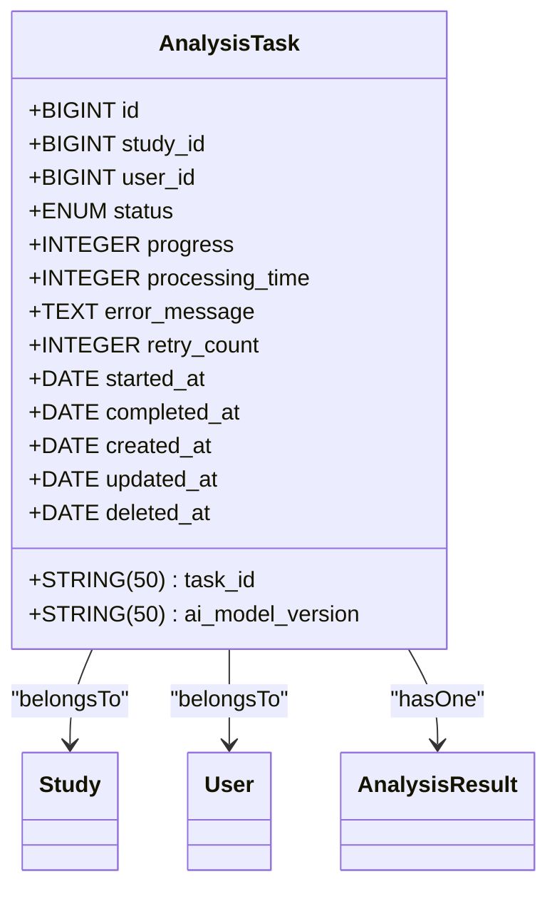
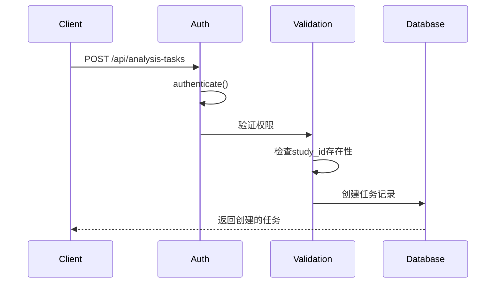

# AI分析任务API

> **本文档引用的文件**  
> - [analysis-tasks.js](file://server/routes/analysis-tasks.js)
> - [AnalysisTask.js](file://server/models/AnalysisTask.js)
> - [auth.js](file://server/middleware/auth.js)

## 目录
1. [简介](#简介)
2. [权限控制机制](#权限控制机制)
3. [分页查询功能](#分页查询功能)
4. [状态更新与时间戳处理](#状态更新与时间戳处理)
5. [软删除实现](#软删除实现)
6. [数据模型说明](#数据模型说明)
7. [API端点参考](#api端点参考)
8. [错误响应格式](#错误响应格式)

## 简介
AI分析任务API提供了一套完整的分析任务管理功能，支持创建、查询、更新和删除分析任务。该API专为宫颈癌AI检测系统设计，确保用户能够安全、高效地管理其医学影像分析任务。

**Section sources**
- [analysis-tasks.js](file://server/routes/analysis-tasks.js#L1-L405)

## 权限控制机制
本系统实现了严格的权限控制机制，确保数据安全和隐私保护：

- **非管理员用户**：只能操作自己创建的任务，包括创建、查看、更新状态和删除任务
- **管理员用户**：可以操作所有用户的任务
- **认证要求**：所有API端点都需要有效的JWT令牌进行身份验证
- **访问控制**：在每个操作前都会验证用户角色和任务归属关系

当用户尝试访问无权操作的资源时，系统将返回403状态码。

**Section sources**
- [analysis-tasks.js](file://server/routes/analysis-tasks.js#L34-L39)
- [analysis-tasks.js](file://server/routes/analysis-tasks.js#L97-L99)
- [analysis-tasks.js](file://server/routes/analysis-tasks.js#L179-L184)
- [auth.js](file://server/middleware/auth.js#L8-L65)

## 分页查询功能
获取分析任务列表的API支持分页查询，便于处理大量数据：

- **page**：页码，从1开始，默认为1
- **limit**：每页记录数，默认为10
- **响应包含**：总记录数、当前页码、每页数量和总页数

分页结果按创建时间倒序排列，确保最新的任务显示在最前面。

**Section sources**
- [analysis-tasks.js](file://server/routes/analysis-tasks.js#L88-L90)
- [analysis-tasks.js](file://server/routes/analysis-tasks.js#L122-L134)

## 状态更新与时间戳处理
系统在更新任务状态时会自动处理相关时间戳：

- **started_at**：当状态变更为"running"且尚未设置开始时间时，自动记录当前时间
- **completed_at**：当状态变更为"completed"、"failed"或"cancelled"时，自动记录完成时间

这种自动化处理确保了任务生命周期的时间数据准确无误。

**Section sources**
- [analysis-tasks.js](file://server/routes/analysis-tasks.js#L228-L232)

## 软删除实现
删除分析任务采用软删除机制：

- 调用`destroy()`方法而非硬删除
- 任务记录不会从数据库中永久移除
- 可以通过查询条件过滤已删除的记录
- 保留了数据完整性和审计追踪能力

**Section sources**
- [analysis-tasks.js](file://server/routes/analysis-tasks.js#L387-L388)

## 数据模型说明
### AnalysisTask数据模型
`AnalysisTask`模型定义了分析任务的核心属性和约束条件。



**Diagram sources**
- [AnalysisTask.js](file://server/models/AnalysisTask.js#L8-L78)

### 字段业务含义与约束
| 字段名 | 类型 | 是否必填 | 默认值 | 约束条件 | 业务含义 |
|-------|------|---------|-------|---------|---------|
| id | BIGINT | 是 | - | 主键，自增 | 数据库主键 |
| task_id | STRING(50) | 是 | - | 唯一索引 | 任务外部ID，自动生成 |
| study_id | BIGINT | 是 | - | 外键引用studies.id | 关联的病例ID |
| user_id | BIGINT | 是 | - | 外键引用users.id | 创建任务的用户ID |
| status | ENUM | 是 | 'PENDING' | PENDING, PROCESSING, SUCCESS, FAILED | 任务状态 |
| progress | INTEGER | 是 | 0 | 0-100 | 处理进度百分比 |
| ai_model_version | STRING(50) | 否 | null | - | 使用的AI模型版本 |
| processing_time | INTEGER | 否 | null | - | 处理耗时（毫秒） |
| error_message | TEXT | 否 | null | - | 错误信息 |
| retry_count | INTEGER | 是 | 0 | - | 重试次数 |
| started_at | DATE | 否 | null | - | 任务开始时间 |
| completed_at | DATE | 否 | null | - | 任务完成时间 |

**Section sources**
- [AnalysisTask.js](file://server/models/AnalysisTask.js#L8-L78)

## API端点参考
### 创建分析任务
创建新的AI分析任务。



**Diagram sources**
- [analysis-tasks.js](file://server/routes/analysis-tasks.js#L12-L80)

#### 请求信息
- **HTTP方法**: POST
- **URL路径**: /api/analysis-tasks
- **请求头**: 
  - Authorization: Bearer <token>
  - Content-Type: application/json

#### 请求参数
| 参数名 | 位置 | 类型 | 是否必填 | 描述 |
|-------|------|------|---------|------|
| study_id | body | integer | 是 | 病例ID |
| model_name | body | string | 否 | 模型名称 |
| model_version | body | string | 否 | 模型版本 |
| priority | body | string | 否 | 优先级，默认normal |

#### 请求体JSON Schema
```json
{
  "study_id": 123,
  "model_name": "cervix-detection-v2",
  "model_version": "2.1.0",
  "priority": "high"
}
```

#### 响应体JSON Schema
```json
{
  "success": true,
  "message": "分析任务创建成功",
  "data": {
    "task": {
      "id": 456,
      "task_id": "TASK1700000000abc123",
      "study_id": 123,
      "user_id": 789,
      "status": "PENDING",
      "progress": 0,
      "created_at": "2024-01-01T00:00:00.000Z",
      "updated_at": "2024-01-01T00:00:00.000Z"
    }
  }
}
```

#### HTTP状态码
| 状态码 | 说明 | 错误信息示例 |
|-------|------|------------|
| 201 | 创建成功 | - |
| 400 | 请求参数错误 | "病例ID为必填项" |
| 401 | 未认证 | "未提供认证令牌" |
| 403 | 无权操作 | "无权为该病例创建分析任务" |
| 404 | 资源不存在 | "病例不存在" |
| 500 | 服务器错误 | "创建分析任务失败" |

**Section sources**
- [analysis-tasks.js](file://server/routes/analysis-tasks.js#L12-L80)

### 获取分析任务列表
获取分析任务的分页列表。

#### 请求信息
- **HTTP方法**: GET
- **URL路径**: /api/analysis-tasks
- **请求头**: 
  - Authorization: Bearer <token>

#### 请求参数
| 参数名 | 位置 | 类型 | 是否必填 | 描述 |
|-------|------|------|---------|------|
| page | query | integer | 否 | 页码，默认1 |
| limit | query | integer | 否 | 每页数量，默认10 |
| status | query | string | 否 | 任务状态过滤 |
| study_id | query | integer | 否 | 病例ID过滤 |
| priority | query | string | 否 | 优先级过滤 |

#### 响应体JSON Schema
```json
{
  "success": true,
  "data": {
    "tasks": [
      {
        "id": 456,
        "task_id": "TASK1700000000abc123",
        "study_id": 123,
        "user_id": 789,
        "status": "PENDING",
        "progress": 0,
        "created_at": "2024-01-01T00:00:00.000Z",
        "updated_at": "2024-01-01T00:00:00.000Z"
      }
    ],
    "pagination": {
      "total": 1,
      "page": 1,
      "limit": 10,
      "pages": 1
    }
  }
}
```

#### HTTP状态码
| 状态码 | 说明 | 错误信息示例 |
|-------|------|------------|
| 200 | 查询成功 | - |
| 401 | 未认证 | "未提供认证令牌" |
| 500 | 服务器错误 | "获取分析任务列表失败" |

**Section sources**
- [analysis-tasks.js](file://server/routes/analysis-tasks.js#L86-L145)

### 获取分析任务详情
获取指定分析任务的详细信息。

#### 请求信息
- **HTTP方法**: GET
- **URL路径**: /api/analysis-tasks/:id
- **请求头**: 
  - Authorization: Bearer <token>

#### 路径参数
| 参数名 | 位置 | 类型 | 是否必填 | 描述 |
|-------|------|------|---------|------|
| id | path | integer | 是 | 任务ID |

#### 响应体JSON Schema
```json
{
  "success": true,
  "data": {
    "task": {
      "id": 456,
      "task_id": "TASK1700000000abc123",
      "study_id": 123,
      "user_id": 789,
      "status": "PENDING",
      "progress": 0,
      "created_at": "2024-01-01T00:00:00.000Z",
      "updated_at": "2024-01-01T00:00:00.000Z",
      "study": {
        "id": 123,
        "study_id": "STUDY001",
        "study_date": "2024-01-01",
        "study_type": "colposcopy"
      },
      "user": {
        "id": 789,
        "username": "doctor1",
        "real_name": "张医生"
      }
    }
  }
}
```

#### HTTP状态码
| 状态码 | 说明 | 错误信息示例 |
|-------|------|------------|
| 200 | 查询成功 | - |
| 401 | 未认证 | "未提供认证令牌" |
| 403 | 无权访问 | "无权访问该分析任务" |
| 404 | 任务不存在 | "分析任务不存在" |
| 500 | 服务器错误 | "获取分析任务详情失败" |

**Section sources**
- [analysis-tasks.js](file://server/routes/analysis-tasks.js#L151-L198)

### 更新任务状态
更新分析任务的状态和进度。

#### 请求信息
- **HTTP方法**: PUT
- **URL路径**: /api/analysis-tasks/:id/status
- **请求头**: 
  - Authorization: Bearer <token>
  - Content-Type: application/json

#### 路径参数
| 参数名 | 位置 | 类型 | 是否必填 | 描述 |
|-------|------|------|---------|------|
| id | path | integer | 是 | 任务ID |

#### 请求体JSON Schema
```json
{
  "status": "running",
  "progress": 50,
  "error_message": "处理中..."
}
```

#### 响应体JSON Schema
```json
{
  "success": true,
  "message": "任务状态更新成功",
  "data": {
    "task": {
      "id": 456,
      "task_id": "TASK1700000000abc123",
      "study_id": 123,
      "user_id": 789,
      "status": "running",
      "progress": 50,
      "started_at": "2024-01-01T00:00:00.000Z",
      "created_at": "2024-01-01T00:00:00.000Z",
      "updated_at": "2024-01-01T00:00:00.000Z"
    }
  }
}
```

#### HTTP状态码
| 状态码 | 说明 | 错误信息示例 |
|-------|------|------------|
| 200 | 更新成功 | - |
| 400 | 请求参数错误 | "状态更新参数错误" |
| 401 | 未认证 | "未提供认证令牌" |
| 403 | 无权操作 | "无权更新该任务" |
| 404 | 任务不存在 | "分析任务不存在" |
| 500 | 服务器错误 | "更新任务状态失败" |

**Section sources**
- [analysis-tasks.js](file://server/routes/analysis-tasks.js#L204-L263)

### 删除分析任务
删除指定的分析任务（软删除）。

#### 请求信息
- **HTTP方法**: DELETE
- **URL路径**: /api/analysis-tasks/:id
- **请求头**: 
  - Authorization: Bearer <token>

#### 路径参数
| 参数名 | 位置 | 类型 | 是否必填 | 描述 |
|-------|------|------|---------|------|
| id | path | integer | 是 | 任务ID |

#### 响应体JSON Schema
```json
{
  "success": true,
  "message": "任务已删除"
}
```

#### HTTP状态码
| 状态码 | 说明 | 错误信息示例 |
|-------|------|------------|
| 200 | 删除成功 | - |
| 401 | 未认证 | "未提供认证令牌" |
| 403 | 无权操作 | "无权删除该任务" |
| 404 | 任务不存在 | "分析任务不存在" |
| 500 | 服务器错误 | "删除任务失败" |

**Section sources**
- [analysis-tasks.js](file://server/routes/analysis-tasks.js#L368-L394)

## 错误响应格式
所有错误响应遵循统一的格式：

```json
{
  "success": false,
  "message": "错误描述信息",
  "error": "错误详情（仅在500错误时提供）"
}
```

| 字段 | 类型 | 说明 |
|------|------|------|
| success | boolean | 操作是否成功 |
| message | string | 用户友好的错误信息 |
| error | string | 技术性错误详情，仅在服务器内部错误时提供 |

**Section sources**
- [analysis-tasks.js](file://server/routes/analysis-tasks.js#L72-L78)
- [analysis-tasks.js](file://server/routes/analysis-tasks.js#L138-L143)
- [analysis-tasks.js](file://server/routes/analysis-tasks.js#L191-L196)
- [analysis-tasks.js](file://server/routes/analysis-tasks.js#L256-L261)
- [analysis-tasks.js](file://server/routes/analysis-tasks.js#L395-L400)