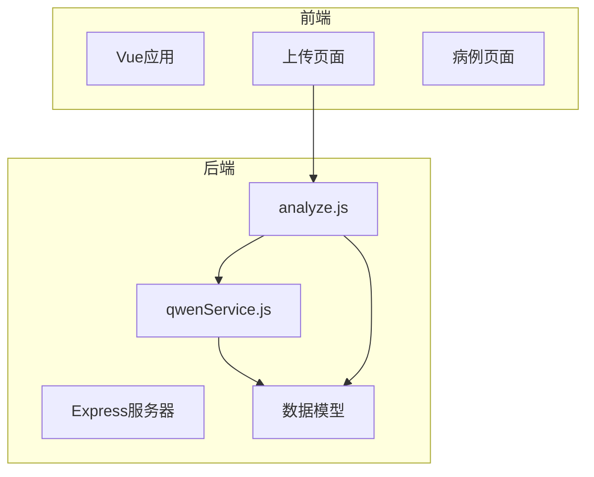
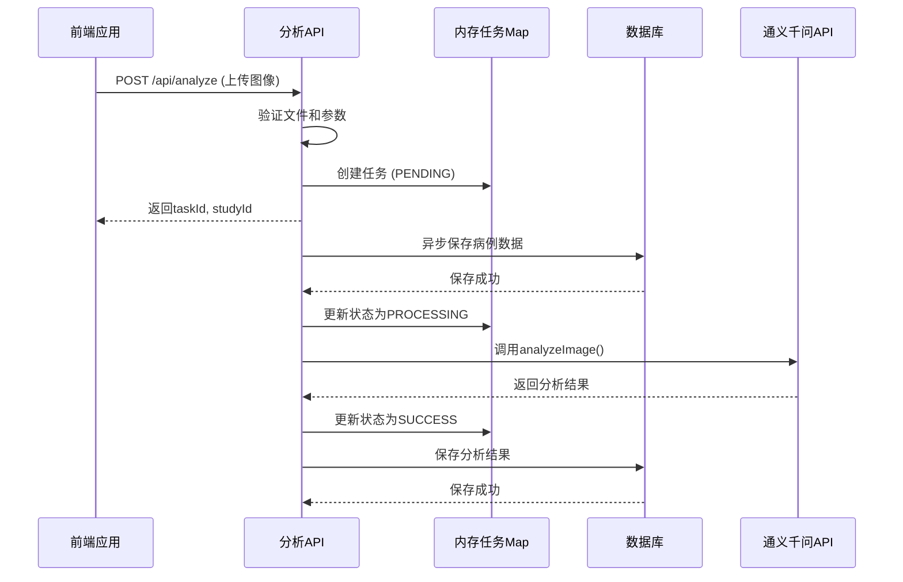
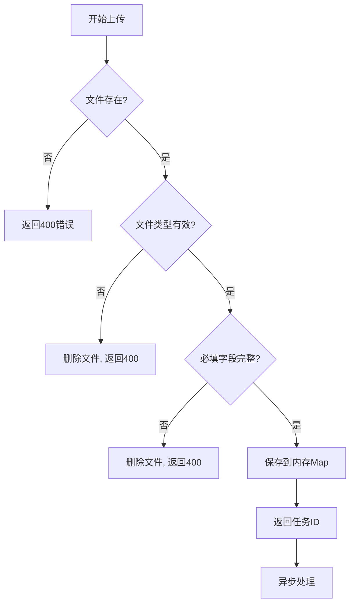
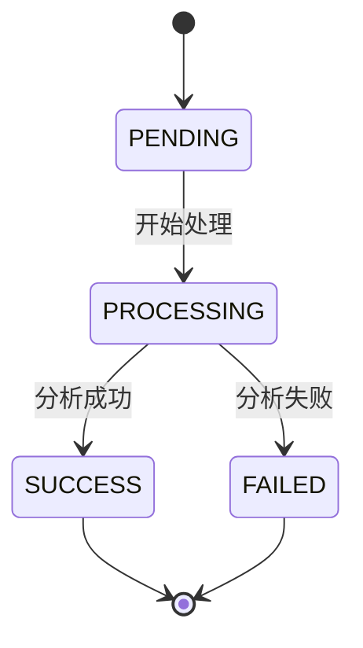
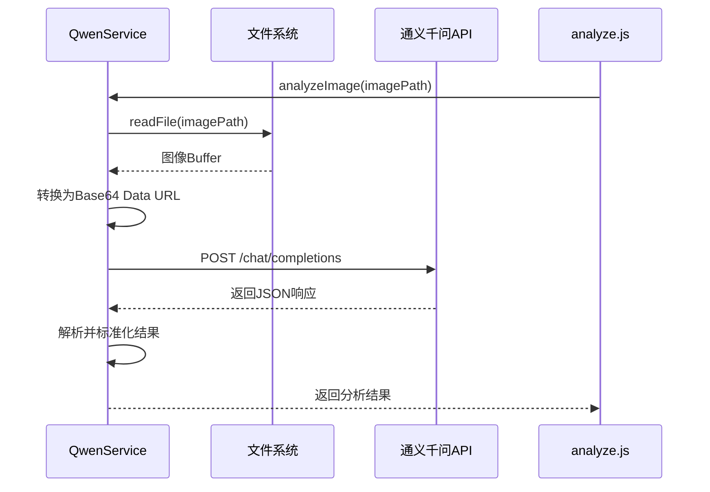
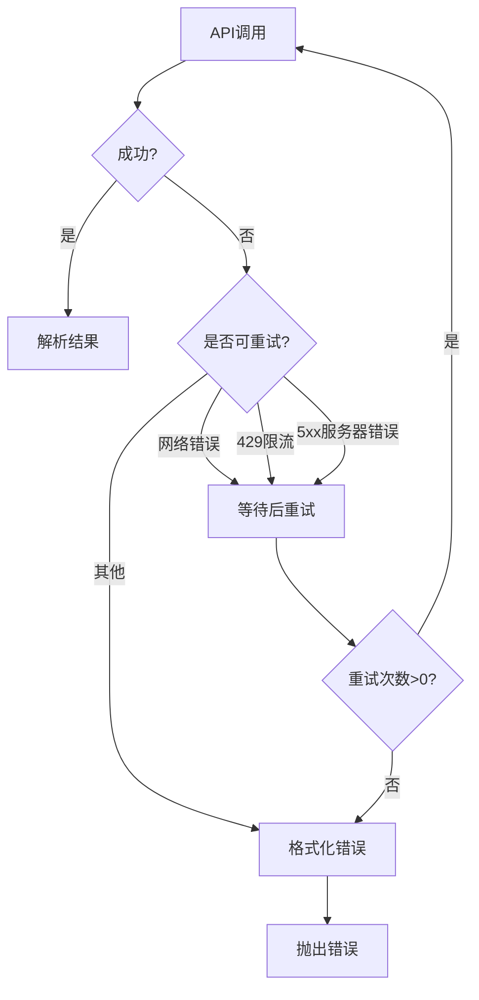
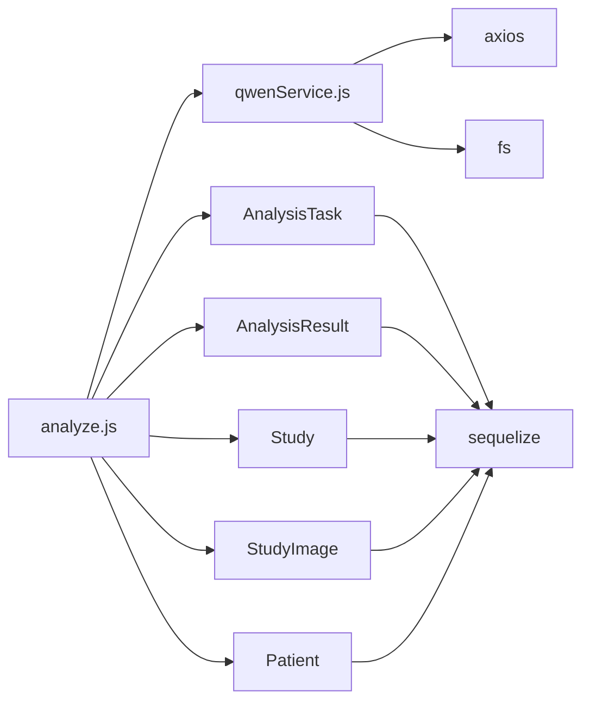

# AI分析结果API

> **本文档引用的文件**   
> - [analyze.js](file://server/routes/analyze.js)
> - [qwenService.js](file://server/services/qwenService.js)
> - [AnalysisTask.js](file://server/models/AnalysisTask.js)
> - [AnalysisResult.js](file://server/models/AnalysisResult.js)
> - [Study.js](file://server/models/Study.js)
> - [StudyImage.js](file://server/models/StudyImage.js)

## 目录
1. [简介](#简介)
2. [项目结构](#项目结构)
3. [核心组件](#核心组件)
4. [架构概述](#架构概述)
5. [详细组件分析](#详细组件分析)
6. [依赖分析](#依赖分析)
7. [性能考虑](#性能考虑)
8. [故障排除指南](#故障排除指南)
9. [结论](#结论)

## 简介
本文档详细记录了宫颈癌AI检测系统中的AI分析结果API，重点涵盖图像上传与分析任务创建、任务状态查询、基于studyId获取分析结果等核心端点。文档全面说明了文件上传处理机制、异步分析流程、任务状态机流转逻辑、内存与数据库协同工作机制，以及通义千问视觉大模型的集成调用过程。

## 项目结构
该项目采用前后端分离架构，后端基于Node.js/Express框架，前端使用Vue.js技术栈。后端服务位于`server/`目录下，包含配置、中间件、模型、路由、服务和工具等模块。AI分析相关的核心逻辑集中在`routes/analyze.js`中，视觉分析服务由`services/qwenService.js`提供。



**图示来源**
- [analyze.js](file://server/routes/analyze.js#L1-L378)
- [qwenService.js](file://server/services/qwenService.js#L1-L255)

**本节来源**
- [server/routes/analyze.js](file://server/routes/analyze.js)
- [server/services/qwenService.js](file://server/services/qwenService.js)

## 核心组件
核心组件包括分析任务路由处理器、通义千问视觉分析服务、分析任务和分析结果数据模型。系统通过`analyze.js`处理文件上传和任务创建，利用`qwenService.js`调用大模型进行图像分析，并通过Sequelize ORM与数据库中的`analysis_tasks`和`analysis_results`表进行数据持久化。

**本节来源**
- [analyze.js](file://server/routes/analyze.js#L1-L378)
- [qwenService.js](file://server/services/qwenService.js#L1-L255)
- [AnalysisTask.js](file://server/models/AnalysisTask.js#L1-L109)
- [AnalysisResult.js](file://server/models/AnalysisResult.js#L1-L127)

## 架构概述
系统采用异步任务处理架构，当用户上传宫颈细胞学图像后，API立即返回任务ID，随后在后台异步执行分析。该架构结合了内存存储（Map）用于快速状态查询和数据库用于持久化存储，确保了系统的响应性和数据可靠性。



**图示来源**
- [analyze.js](file://server/routes/analyze.js#L51-L375)
- [qwenService.js](file://server/services/qwenService.js#L85-L177)

## 详细组件分析

### 分析任务创建与处理
该组件负责处理图像上传、创建分析任务、调用AI模型和管理任务状态。采用multer中间件处理文件上传，对文件类型和大小进行严格验证。

#### 文件上传与验证


**图示来源**
- [analyze.js](file://server/routes/analyze.js#L51-L106)
- [analyze.js](file://server/routes/analyze.js#L13-L42)

#### 任务状态机
系统实现了完整的任务状态机，包含PENDING、PROCESSING、SUCCESS和FAILED四种状态，确保任务生命周期的清晰管理。



**图示来源**
- [analyze.js](file://server/routes/analyze.js#L80-L81)
- [analyze.js](file://server/routes/analyze.js#L249-L319)
- [AnalysisTask.js](file://server/models/AnalysisTask.js#L39-L42)

**本节来源**
- [analyze.js](file://server/routes/analyze.js#L1-L378)
- [AnalysisTask.js](file://server/models/AnalysisTask.js#L39-L42)

### 通义千问视觉服务
该服务封装了与通义千问API的交互逻辑，负责将本地图像转换为Base64编码并发送分析请求。

#### API调用流程


**图示来源**
- [qwenService.js](file://server/services/qwenService.js#L85-L177)
- [qwenService.js](file://server/services/qwenService.js#L60-L74)

#### 错误处理与重试机制


**图示来源**
- [qwenService.js](file://server/services/qwenService.js#L179-L187)
- [qwenService.js](file://server/services/qwenService.js#L199-L216)

**本节来源**
- [qwenService.js](file://server/services/qwenService.js#L1-L255)

### 数据模型与持久化
系统通过Sequelize定义了清晰的数据模型，确保分析任务和结果的持久化存储。

#### 数据模型关系
```mermaid
erDiagram
STUDY ||--o{ ANALYSIS_TASK : "1对1"
STUDY ||--o{ STUDY_IMAGE : "1对多"
ANALYSIS_TASK ||--o{ ANALYSIS_RESULT : "1对1"
ANALYSIS_RESULT }|--|| STUDY : "1对1"
STUDY {
string study_id PK
bigint patient_id FK
bigint user_id FK
date study_date
string study_type
enum status
}
ANALYSIS_TASK {
string task_id PK
bigint study_id FK
bigint user_id FK
enum status
int progress
}
ANALYSIS_RESULT {
bigint task_id PK FK
bigint study_id FK
string diagnosis
decimal confidence
enum risk_level
}
```

**图示来源**
- [Study.js](file://server/models/Study.js#L1-L131)
- [AnalysisTask.js](file://server/models/AnalysisTask.js#L1-L109)
- [AnalysisResult.js](file://server/models/AnalysisResult.js#L1-L127)
- [StudyImage.js](file://server/models/StudyImage.js#L1-L104)

**本节来源**
- [Study.js](file://server/models/Study.js#L1-L131)
- [AnalysisTask.js](file://server/models/AnalysisTask.js#L1-L109)
- [AnalysisResult.js](file://server/models/AnalysisResult.js#L1-L127)

## 依赖分析
系统各组件间存在明确的依赖关系。`analyze.js`路由依赖`qwenService.js`进行AI分析，同时依赖多个Sequelize模型进行数据持久化。`qwenService.js`依赖axios进行HTTP请求，依赖Node.js的fs模块进行文件操作。



**图示来源**
- [analyze.js](file://server/routes/analyze.js#L7-L8)
- [qwenService.js](file://server/services/qwenService.js#L2-L3)
- [AnalysisTask.js](file://server/models/AnalysisTask.js#L3-L4)

**本节来源**
- [analyze.js](file://server/routes/analyze.js#L1-L378)
- [qwenService.js](file://server/services/qwenService.js#L1-L255)

## 性能考虑
系统采用异步处理模式，避免了长时间的API请求阻塞。通过内存Map存储任务状态，实现了快速的状态查询响应。文件上传使用multer的磁盘存储，避免了内存溢出风险。通义千问API调用设置了60秒超时和重试机制，提高了服务的可靠性。

## 故障排除指南
常见问题包括文件上传失败、API调用超时和数据库连接错误。对于文件上传问题，需检查文件类型和大小限制；对于API调用问题，需验证QWEN_API_KEY环境变量；对于数据库问题，需确认数据库连接配置。

**本节来源**
- [analyze.js](file://server/routes/analyze.js#L31-L32)
- [analyze.js](file://server/routes/analyze.js#L40-L41)
- [qwenService.js](file://server/services/qwenService.js#L41-L43)
- [qwenService.js](file://server/services/qwenService.js#L246-L247)

## 结论
AI分析结果API实现了完整的宫颈细胞学图像分析流程，从文件上传到结果返回形成了闭环。系统架构合理，采用了异步处理、内存缓存和数据库持久化相结合的方式，确保了良好的用户体验和数据可靠性。通过与通义千问视觉大模型的集成，为宫颈癌筛查提供了智能化的解决方案。