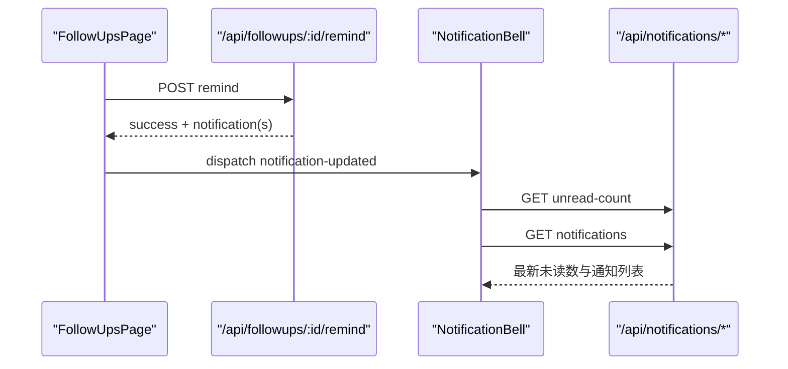

# API参考

> **本文档中引用的文件**   
> - [auth.js](file://server/routes/auth.js)
> - [sms-auth.js](file://server/routes/sms-auth.js)
> - [users.js](file://server/routes/users.js)
> - [studies.js](file://server/routes/studies.js)
> - [analysis-tasks.js](file://server/routes/analysis-tasks.js)
> - [analyze.js](file://server/routes/analyze.js)
> - [chat.js](file://server/routes/chat.js)
> - [reports.js](file://server/routes/reports.js)
> - [followups.js](file://server/routes/followups.js)
> - [notifications.js](file://server/routes/notifications.js)
> - [api.ts](file://src/services/api.ts)
> - [User.js](file://server/models/User.js)
> - [Study.js](file://server/models/Study.js)
> - [AnalysisTask.js](file://server/models/AnalysisTask.js)
> - [AnalysisResult.js](file://server/models/AnalysisResult.js)
> - [MedicalReport.js](file://server/models/MedicalReport.js)
> - [Patient.js](file://server/models/Patient.js)
> - [StudyImage.js](file://server/models/StudyImage.js)
> - [SmsCode.js](file://server/models/SmsCode.js)

## 目录
1. [认证API](#认证api)
2. [用户管理API](#用户管理api)
3. [病例管理API](#病例管理api)
4. [AI分析API](#ai分析api)
5. [AI对话API](#ai对话api)
6. [报告管理API](#报告管理api)
7. [随访与通知补充](#随访与通知补充)

## 认证API

### POST /api/auth/register
用户注册

**请求头**
- `Content-Type: application/json`

**请求体参数**
- `email` (string, 必填): 用户邮箱
- `password` (string, 必填): 用户密码（至少6位）
- `username` (string, 可选): 用户名
- `real_name` (string, 可选): 真实姓名
- `phone` (string, 可选): 手机号

**响应体JSON Schema**
```json
{
  "success": true,
  "message": "注册成功",
  "data": {
    "user": {
      "id": 1,
      "username": "user_123",
      "email": "user@example.com",
      "real_name": "张三",
      "role": "user",
      "status": "active"
    },
    "accessToken": "jwt_token_string",
    "refreshToken": "jwt_refresh_token_string"
  }
}
```

**HTTP状态码**
- `201 Created`: 注册成功
- `400 Bad Request`: 邮箱或密码为空，或密码长度不足6位，或邮箱格式不正确
- `409 Conflict`: 邮箱已被注册，或用户名已被使用
- `500 Internal Server Error`: 注册失败

**前端调用示例**
```typescript
const result = await authAPI.register({
  email: 'user@example.com',
  password: 'password123',
  real_name: '张三'
});
```

**Section sources**
- [auth.js](file://server/routes/auth.js#L17-L97)

### POST /api/auth/login
用户登录

**请求头**
- `Content-Type: application/json`

**请求体参数**
- `email` (string, 必填): 用户邮箱
- `password` (string, 必填): 用户密码

**响应体JSON Schema**
```json
{
  "success": true,
  "message": "登录成功",
  "data": {
    "user": {
      "id": 1,
      "username": "user_123",
      "email": "user@example.com",
      "real_name": "张三",
      "role": "user",
      "status": "active",
      "last_login_at": "2024-01-01T00:00:00Z"
    },
    "accessToken": "jwt_token_string",
    "refreshToken": "jwt_refresh_token_string"
  }
}
```

**HTTP状态码**
- `200 OK`: 登录成功
- `400 Bad Request`: 邮箱或密码为空
- `401 Unauthorized`: 邮箱或密码错误
- `403 Forbidden`: 账号未激活或已被禁用
- `500 Internal Server Error`: 登录失败

**前端调用示例**
```typescript
const result = await authAPI.login('user@example.com', 'password123');
```

**Section sources**
- [auth.js](file://server/routes/auth.js#L112-L180)

### POST /api/auth/refresh
刷新访问令牌

**请求头**
- `Content-Type: application/json`

**请求体参数**
- `refreshToken` (string, 必填): 刷新令牌

**响应体JSON Schema**
```json
{
  "success": true,
  "message": "令牌刷新成功",
  "data": {
    "accessToken": "new_jwt_token_string"
  }
}
```

**HTTP状态码**
- `200 OK`: 令牌刷新成功
- `400 Bad Request`: 未提供刷新令牌
- `401 Unauthorized`: 无效或已过期的刷新令牌，或令牌类型错误
- `401 Unauthorized`: 用户不存在或已被禁用
- `500 Internal Server Error`: 刷新令牌失败

**前端调用示例**
```typescript
const result = await authAPI.refreshToken('refresh_token_string');
```

**Section sources**
- [auth.js](file://server/routes/auth.js#L195-L242)

### GET /api/auth/me
获取当前用户信息

**请求头**
- `Authorization: Bearer <access_token>`

**响应体JSON Schema**
```json
{
  "success": true,
  "data": {
    "user": {
      "id": 1,
      "username": "user_123",
      "email": "user@example.com",
      "real_name": "张三",
      "phone": "13800138000",
      "role": "user",
      "status": "active",
      "created_at": "2024-01-01T00:00:00Z",
      "last_login_at": "2024-01-01T00:00:00Z"
    }
  }
}
```

**HTTP状态码**
- `200 OK`: 获取成功
- `401 Unauthorized`: 未授权（令牌无效）
- `500 Internal Server Error`: 获取失败

**前端调用示例**
```typescript
const result = await authAPI.getCurrentUser();
```

**Section sources**
- [auth.js](file://server/routes/auth.js#L277-L294)

### POST /api/auth/sms/send-code
发送短信验证码

**请求头**
- `Content-Type: application/json`

**请求体参数**
- `phone` (string, 必填): 手机号
- `type` (string, 可选): 验证码类型（login, register, reset_password），默认为login

**响应体JSON Schema**
```json
{
  "success": true,
  "message": "验证码已发送",
  "data": {
    "expiresIn": 300
  }
}
```

**HTTP状态码**
- `200 OK`: 验证码发送成功
- `400 Bad Request`: 手机号为空或格式不正确，或验证码类型不正确
- `409 Conflict`: 手机号已被注册（当type为register时）
- `404 Not Found`: 手机号未注册（当type为reset_password时）
- `429 Too Many Requests`: 发送过于频繁，或当日发送次数已达上限
- `500 Internal Server Error`: 发送验证码失败

**前端调用示例**
```typescript
const result = await authAPI.sendSmsCode('13800138000', 'login');
```

**Section sources**
- [sms-auth.js](file://server/routes/sms-auth.js#L26-L155)

### POST /api/auth/sms/login
短信验证码登录

**请求头**
- `Content-Type: application/json`

**请求体参数**
- `phone` (string, 必填): 手机号
- `code` (string, 必填): 验证码

**响应体JSON Schema**
```json
{
  "success": true,
  "message": "登录成功",
  "data": {
    "user": {
      "id": 1,
      "username": "user_123",
      "email": "user@example.com",
      "real_name": "张三",
      "phone": "13800138000",
      "role": "user",
      "status": "active",
      "last_login_at": "2024-01-01T00:00:00Z"
    },
    "accessToken": "jwt_token_string",
    "refreshToken": "jwt_refresh_token_string"
  }
}
```

**HTTP状态码**
- `200 OK`: 登录成功
- `400 Bad Request`: 手机号或验证码为空，或验证码错误或已过期
- `404 Not Found`: 手机号未注册
- `403 Forbidden`: 账号已被禁用
- `500 Internal Server Error`: 登录失败

**前端调用示例**
```typescript
const result = await authAPI.smsLogin('13800138000', '123456');
```

**Section sources**
- [sms-auth.js](file://server/routes/sms-auth.js#L170-L262)

### POST /api/auth/sms/register
短信验证码注册

**请求头**
- `Content-Type: application/json`

**请求体参数**
- `phone` (string, 必填): 手机号
- `code` (string, 必填): 验证码
- `username` (string, 可选): 用户名
- `real_name` (string, 可选): 真实姓名
- `email` (string, 可选): 邮箱

**响应体JSON Schema**
```json
{
  "success": true,
  "message": "注册成功",
  "data": {
    "user": {
      "id": 1,
      "username": "user_123",
      "email": "user@example.com",
      "real_name": "张三",
      "phone": "13800138000",
      "role": "user",
      "status": "active"
    },
    "accessToken": "jwt_token_string",
    "refreshToken": "jwt_refresh_token_string"
  }
}
```

**HTTP状态码**
- `201 Created`: 注册成功
- `400 Bad Request`: 手机号或验证码为空，或验证码错误或已过期，或邮箱格式不正确
- `409 Conflict`: 手机号已被注册，或用户名已被使用，或邮箱已被注册
- `500 Internal Server Error`: 注册失败

**前端调用示例**
```typescript
const result = await authAPI.smsRegister('13800138000', '123456', {
  username: 'user123',
  real_name: '张三'
});
```

**Section sources**
- [sms-auth.js](file://server/routes/sms-auth.js#L276-L395)

### POST /api/auth/sms/reset-password
通过短信验证码重置密码

**请求头**
- `Content-Type: application/json`

**请求体参数**
- `phone` (string, 必填): 手机号
- `code` (string, 必填): 验证码
- `newPassword` (string, 必填): 新密码（至少6位）

**响应体JSON Schema**
```json
{
  "success": true,
  "message": "密码重置成功"
}
```

**HTTP状态码**
- `200 OK`: 密码重置成功
- `400 Bad Request`: 手机号、验证码或新密码为空，或新密码长度不足6位
- `404 Not Found`: 手机号未注册
- `400 Bad Request`: 验证码错误或已过期
- `500 Internal Server Error`: 重置密码失败

**前端调用示例**
```typescript
const result = await authAPI.resetPassword('13800138000', '123456', 'newpassword123');
```

**Section sources**
- [sms-auth.js](file://server/routes/sms-auth.js#L410-L480)

## 用户管理API

### GET /api/users/me
获取当前用户信息

**请求头**
- `Authorization: Bearer <access_token>`

**响应体JSON Schema**
```json
{
  "success": true,
  "data": {
    "user": {
      "id": 1,
      "username": "user_123",
      "email": "user@example.com",
      "real_name": "张三",
      "phone": "13800138000",
      "role": "user",
      "status": "active",
      "created_at": "2024-01-01T00:00:00Z",
      "last_login_at": "2024-01-01T00:00:00Z",
      "avatar": {
        "id": 1,
        "user_id": 1,
        "original_url": "https://img1.tucang.cc/...",
        "large_url": "https://img1.tucang.cc/...",
        "medium_url": "https://img1.tucang.cc/...",
        "small_url": "https://img1.tucang.cc/...",
        "thumbnail_url": "https://img1.tucang.cc/...",
        "file_size": 102400
      }
    }
  }
}
```

**HTTP状态码**
- `200 OK`: 获取成功
- `401 Unauthorized`: 未授权（令牌无效）
- `500 Internal Server Error`: 获取失败

**前端调用示例**
```typescript
const result = await userAPI.getProfile();
```

**Section sources**
- [users.js](file://server/routes/users.js#L47-L63)

### PUT /api/users/me
更新当前用户信息

**请求头**
- `Authorization: Bearer <access_token>`
- `Content-Type: application/json`

**请求体参数**
- `real_name` (string, 可选): 真实姓名
- `phone` (string, 可选): 手机号

**响应体JSON Schema**
```json
{
  "success": true,
  "message": "更新成功",
  "data": {
    "user": {
      "id": 1,
      "username": "user_123",
      "email": "user@example.com",
      "real_name": "李四",
      "phone": "13800138001",
      "role": "user",
      "status": "active",
      "created_at": "2024-01-01T00:00:00Z",
      "last_login_at": "2024-01-01T00:00:00Z"
    }
  }
}
```

**HTTP状态码**
- `200 OK`: 更新成功
- `400 Bad Request`: 请求体格式错误
- `401 Unauthorized`: 未授权（令牌无效）
- `500 Internal Server Error`: 更新失败

**前端调用示例**
```typescript
const result = await userAPI.updateProfile({
  real_name: '李四',
  phone: '13800138001'
});
```

**Section sources**
- [users.js](file://server/routes/users.js#L78-L96)

### PUT /api/users/me/password
修改密码

**请求头**
- `Authorization: Bearer <access_token>`
- `Content-Type: application/json`

**请求体参数**
- `current_password` (string, 必填): 当前密码
- `new_password` (string, 必填): 新密码（至少6位）

**响应体JSON Schema**
```json
{
  "success": true,
  "message": "密码修改成功"
}
```

**HTTP状态码**
- `200 OK`: 密码修改成功
- `400 Bad Request`: 当前密码或新密码为空，或新密码长度不足6位
- `401 Unauthorized`: 当前密码错误
- `401 Unauthorized`: 未授权（令牌无效）
- `500 Internal Server Error`: 修改密码失败

**前端调用示例**
```typescript
const result = await userAPI.updatePassword({
  current_password: 'oldpassword123',
  new_password: 'newpassword123'
});
```

**Section sources**
- [users.js](file://server/routes/users.js#L111-L149)

### POST /api/users/me/avatar
上传头像

**请求头**
- `Authorization: Bearer <access_token>`

**请求体参数**
- `avatar` (file, 必填): 头像文件（JPEG, PNG, GIF, WebP格式，最大5MB）

**响应体JSON Schema**
```json
{
  "success": true,
  "message": "头像上传成功",
  "data": {
    "avatar": {
      "id": 1,
      "user_id": 1,
      "original_url": "https://img1.tucang.cc/...",
      "large_url": "https://img1.tucang.cc/...",
      "medium_url": "https://img1.tucang.cc/...",
      "small_url": "https://img1.tucang.cc/...",
      "thumbnail_url": "https://img1.tucang.cc/...",
      "file_size": 102400,
      "mime_type": "image/png",
      "width": 512,
      "height": 512
    }
  }
}
```

> 说明：当前实现使用图仓直传，`sharp` 仅用于读取元数据；多尺寸字段仍保留，但当前统一写入同一远程 URL。

**HTTP状态码**
- `200 OK`: 头像上传成功
- `400 Bad Request`: 未上传头像文件，或文件格式不支持
- `401 Unauthorized`: 未授权（令牌无效）
- `500 Internal Server Error`: 上传头像失败

**前端调用示例**
```typescript
const formData = new FormData();
formData.append('avatar', file);
const result = await userAPI.uploadAvatar(file);
```

**Section sources**
- [users.js](file://server/routes/users.js#L164-L221)

## 病例管理API

### POST /api/studies
创建病例

**请求头**
- `Authorization: Bearer <access_token>`
- `Content-Type: application/json`

**请求体参数**
- `patient_id` (number, 必填): 患者ID
- `study_date` (string, 必填): 检查日期（ISO 8601格式）
- `study_type` (string, 必填): 检查类型
- `description` (string, 可选): 描述
- `department` (string, 可选): 科室
- `doctor_name` (string, 可选): 医生姓名
- `clinical_diagnosis` (string, 可选): 临床诊断
- `symptoms` (string, 可选): 症状

**响应体JSON Schema**
```json
{
  "success": true,
  "message": "病例创建成功",
  "data": {
    "study": {
      "id": 1,
      "study_id": "S20240101000001",
      "patient_id": 1,
      "user_id": 1,
      "study_date": "2024-01-01T00:00:00Z",
      "study_type": "宫颈细胞学检查",
      "description": "常规检查",
      "department": "妇科",
      "doctor_name": "王医生",
      "clinical_diagnosis": "宫颈炎",
      "symptoms": "白带增多",
      "status": "pending",
      "priority": "normal",
      "uploaded_at": "2024-01-01T00:00:00Z",
      "created_at": "2024-01-01T00:00:00Z",
      "updated_at": "2024-01-01T00:00:00Z",
      "patient": {
        "id": 1,
        "patient_id": "P123456789",
        "name": "张三",
        "gender": "female",
        "birth_date": "1990-01-01"
      },
      "creator": {
        "id": 1,
        "username": "user_123",
        "real_name": "李四"
      }
    }
  }
}
```

**HTTP状态码**
- `201 Created`: 病例创建成功
- `400 Bad Request`: 患者ID、检查日期或检查类型为空
- `404 Not Found`: 患者不存在
- `403 Forbidden`: 无权为该患者创建病例
- `500 Internal Server Error`: 创建病例失败

**前端调用示例**
```typescript
const result = await studyAPI.createStudy({
  patient_id: 1,
  study_date: '2024-01-01',
  study_type: '宫颈细胞学检查'
});
```

**Section sources**
- [studies.js](file://server/routes/studies.js#L46-L117)

### POST /api/studies/:id/images
上传影像文件

**请求头**
- `Authorization: Bearer <access_token>`

**路径参数**
- `id` (number, 必填): 病例ID

**请求体参数**
- `images` (array of files, 必填): 影像文件（JPEG, PNG, TIFF, BMP格式，每个文件最大20MB，最多10个）

**响应体JSON Schema**
```json
{
  "success": true,
  "message": "成功上传 2 个影像文件",
  "data": {
    "images": [
      {
        "id": 1,
        "study_id": 1,
        "original_filename": "image1.jpg",
        "stored_filename": "0509ae4c6c3aaaf714c4684952e70a00",
        "file_path": "https://img1.tucang.cc/api/image/show/0509ae4c6c3aaaf714c4684952e70a00",
        "file_size": 102400,
        "mime_type": "image/jpeg",
        "file_format": "JPEG",
        "is_primary": true,
        "upload_status": "completed",
        "created_at": "2024-01-01T00:00:00Z"
      }
    ]
  }
}
```

> 说明：主事务会先完成本地持久化与数据库写入，随后在返回响应前尽量完成一次图仓同步；`file_path` 对外响应优先返回图床直链，图仓失败时才回退为本地相对路径。历史异常值（如 `https://uploads/...`）会在响应序列化阶段被纠正。

**HTTP状态码**
- `200 OK`: 影像上传成功
- `400 Bad Request`: 未上传影像文件
- `404 Not Found`: 病例不存在
- `403 Forbidden`: 无权上传影像
- `500 Internal Server Error`: 上传影像失败

**前端调用示例**
```typescript
const result = await studyAPI.uploadImages(1, [file1, file2]);
```

**Section sources**
- [studies.js](file://server/routes/studies.js#L132-L185)

### GET /api/studies
获取病例列表

**请求头**
- `Authorization: Bearer <access_token>`

**查询参数**
- `page` (number, 可选): 页码，默认1
- `limit` (number, 可选): 每页数量，默认10
- `patient_id` (number, 可选): 患者ID
- `status` (string, 可选): 状态（pending, uploaded, processing, completed, failed）
- `study_type` (string, 可选): 检查类型
- `search` (string, 可选): 搜索关键词

**响应体JSON Schema**
```json
{
  "success": true,
  "data": {
    "studies": [
      {
        "id": 1,
        "study_id": "S20240101000001",
        "patient_id": 1,
        "user_id": 1,
        "study_date": "2024-01-01T00:00:00Z",
        "study_type": "宫颈细胞学检查",
        "description": "常规检查",
        "department": "妇科",
        "doctor_name": "王医生",
        "clinical_diagnosis": "宫颈炎",
        "symptoms": "白带增多",
        "status": "pending",
        "priority": "normal",
        "uploaded_at": "2024-01-01T00:00:00Z",
        "created_at": "2024-01-01T00:00:00Z",
        "updated_at": "2024-01-01T00:00:00Z",
        "patient": {
          "id": 1,
          "patient_id": "P123456789",
          "name": "张三",
          "gender": "female",
          "birth_date": "1990-01-01"
        },
        "creator": {
          "id": 1,
          "username": "user_123",
          "real_name": "李四"
        },
        "images": [
          {
            "id": 1,
            "study_id": 1,
            "original_filename": "image1.jpg",
            "file_path": "https://img1.tucang.cc/api/image/show/0509ae4c6c3aaaf714c4684952e70a00",
            "created_at": "2024-01-01T00:00:00Z"
          }
        ]
      }
    ],
    "pagination": {
      "total": 1,
      "page": 1,
      "limit": 10,
      "pages": 1
    }
  }
}
```

**HTTP状态码**
- `200 OK`: 获取成功
- `401 Unauthorized`: 未授权（令牌无效）
- `500 Internal Server Error`: 获取失败

**前端调用示例**
```typescript
const result = await studyAPI.getStudies({
  page: 1,
  limit: 10,
  status: 'completed'
});
```

**Section sources**
- [studies.js](file://server/routes/studies.js#L208-L291)

### GET /api/studies/:id
获取病例详情

**请求头**
- `Authorization: Bearer <access_token>`

**路径参数**
- `id` (number, 必填): 病例ID

**响应体JSON Schema**
```json
{
  "success": true,
  "data": {
    "study": {
      "id": 1,
      "study_id": "S20240101000001",
      "patient_id": 1,
      "user_id": 1,
      "study_date": "2024-01-01T00:00:00Z",
      "study_type": "宫颈细胞学检查",
      "description": "常规检查",
      "department": "妇科",
      "doctor_name": "王医生",
      "clinical_diagnosis": "宫颈炎",
      "symptoms": "白带增多",
      "status": "pending",
      "priority": "normal",
      "uploaded_at": "2024-01-01T00:00:00Z",
      "created_at": "2024-01-01T00:00:00Z",
      "updated_at": "2024-01-01T00:00:00Z",
      "patient": {
        "id": 1,
        "patient_id": "P123456789",
        "name": "张三",
        "gender": "female",
        "birth_date": "1990-01-01",
        "phone": "13800138000",
        "address": "北京市朝阳区",
        "emergency_contact": "李四",
        "emergency_phone": "13800138001",
        "medical_history": "无",
        "allergies": "无",
        "created_by": 1,
        "created_at": "2024-01-01T00:00:00Z",
        "updated_at": "2024-01-01T00:00:00Z"
      },
      "creator": {
        "id": 1,
        "username": "user_123",
        "real_name": "李四",
        "email": "user@example.com",
        "role": "user",
        "status": "active",
        "created_at": "2024-01-01T00:00:00Z",
        "last_login_at": "2024-01-01T00:00:00Z"
      },
      "images": [
        {
          "id": 1,
          "study_id": 1,
          "original_filename": "image1.jpg",
          "stored_filename": "0509ae4c6c3aaaf714c4684952e70a00",
          "file_path": "https://img1.tucang.cc/api/image/show/0509ae4c6c3aaaf714c4684952e70a00",
          "file_size": 102400,
          "mime_type": "image/jpeg",
          "file_format": "JPEG",
          "is_primary": false,
          "upload_status": "completed",
          "created_at": "2024-01-01T00:00:00Z"
        }
      ],
      "analysis_tasks": [
        {
          "id": 1,
          "task_id": "TASK1234567890",
          "study_id": 1,
          "user_id": 1,
          "status": "PENDING",
          "progress": 0,
          "ai_model_version": "v1.0",
          "processing_time": null,
          "error_message": null,
          "retry_count": 0,
          "started_at": null,
          "completed_at": null,
          "created_at": "2024-01-01T00:00:00Z",
          "updated_at": "2024-01-01T00:00:00Z"
        }
      ]
    }
  }
}
```

**HTTP状态码**
- `200 OK`: 获取成功
- `404 Not Found`: 病例不存在
- `403 Forbidden`: 无权访问该病例
- `401 Unauthorized`: 未授权（令牌无效）
- `500 Internal Server Error`: 获取失败

**前端调用示例**
```typescript
const result = await studyAPI.getStudy(1);
```

**Section sources**
- [studies.js](file://server/routes/studies.js#L306-L348)

### PUT /api/studies/:id
更新病例信息

**请求头**
- `Authorization: Bearer <access_token>`
- `Content-Type: application/json`

**路径参数**
- `id` (number, 必填): 病例ID

**请求体参数**
- `study_date` (string, 可选): 检查日期
- `study_type` (string, 可选): 检查类型
- `description` (string, 可选): 描述
- `department` (string, 可选): 科室
- `doctor_name` (string, 可选): 医生姓名
- `clinical_diagnosis` (string, 可选): 临床诊断
- `symptoms` (string, 可选): 症状
- `status` (string, 可选): 状态

**响应体JSON Schema**
```json
{
  "success": true,
  "message": "更新成功",
  "data": {
    "study": {
      "id": 1,
      "study_id": "S20240101000001",
      "patient_id": 1,
      "user_id": 1,
      "study_date": "2024-01-02T00:00:00Z",
      "study_type": "阴道镜检查",
      "description": "复查",
      "department": "妇科",
      "doctor_name": "王医生",
      "clinical_diagnosis": "宫颈炎",
      "symptoms": "白带增多",
      "status": "uploaded",
      "priority": "normal",
      "uploaded_at": "2024-01-01T00:00:00Z",
      "created_at": "2024-01-01T00:00:00Z",
      "updated_at": "2024-01-02T00:00:00Z",
      "patient": {
        "id": 1,
        "patient_id": "P123456789",
        "name": "张三",
        "gender": "female",
        "birth_date": "1990-01-01"
      },
      "creator": {
        "id": 1,
        "username": "user_123",
        "real_name": "李四"
      }
    }
  }
}
```

**HTTP状态码**
- `200 OK`: 更新成功
- `404 Not Found`: 病例不存在
- `403 Forbidden`: 无权更新该病例
- `401 Unauthorized`: 未授权（令牌无效）
- `500 Internal Server Error`: 更新失败

**前端调用示例**
```typescript
const result = await studyAPI.updateStudy(1, {
  study_date: '2024-01-02',
  study_type: '阴道镜检查',
  status: 'uploaded'
});
```

**Section sources**
- [studies.js](file://server/routes/studies.js#L363-L423)

### DELETE /api/studies/:id
删除病例（软删除）

**请求头**
- `Authorization: Bearer <access_token>`

**路径参数**
- `id` (number, 必填): 病例ID

**响应体JSON Schema**
```json
{
  "success": true,
  "message": "病例已删除"
}
```

**HTTP状态码**
- `200 OK`: 删除成功
- `404 Not Found`: 病例不存在
- `403 Forbidden`: 无权删除该病例
- `401 Unauthorized`: 未授权（令牌无效）
- `500 Internal Server Error`: 删除失败

**前端调用示例**
```typescript
const result = await studyAPI.deleteStudy(1);
```

**Section sources**
- [studies.js](file://server/routes/studies.js#L438-L463)

### DELETE /api/studies/:id/images/:imageId
删除病例影像

**请求头**
- `Authorization: Bearer <access_token>`

**路径参数**
- `id` (number, 必填): 病例ID
- `imageId` (number, 必填): 影像ID

**响应体JSON Schema**
```json
{
  "success": true,
  "message": "影像已删除"
}
```

**HTTP状态码**
- `200 OK`: 删除成功
- `404 Not Found`: 病例或影像不存在
- `403 Forbidden`: 无权删除影像
- `401 Unauthorized`: 未授权（令牌无效）
- `500 Internal Server Error`: 删除失败

**前端调用示例**
```typescript
const result = await studyAPI.deleteImage(1, 1);
```

**Section sources**
- [studies.js](file://server/routes/studies.js#L478-L518)

## AI分析API

### POST /api/analysis-tasks
创建分析任务

**请求头**
- `Authorization: Bearer <access_token>`
- `Content-Type: application/json`

**请求体参数**
- `study_id` (number, 必填): 病例ID
- `model_name` (string, 可选): 模型名称
- `model_version` (string, 可选): 模型版本
- `priority` (string, 可选): 优先级（normal, urgent, emergency），默认normal

**响应体JSON Schema**
```json
{
  "success": true,
  "message": "分析任务创建成功",
  "data": {
    "task": {
      "id": 1,
      "task_id": "TASK1234567890",
      "study_id": 1,
      "user_id": 1,
      "model_name": "cervical-cancer-detection",
      "model_version": "v1.0",
      "priority": "normal",
      "status": "pending",
      "progress": 0,
      "created_at": "2024-01-01T00:00:00Z",
      "updated_at": "2024-01-01T00:00:00Z",
      "study": {
        "id": 1,
        "study_id": "S20240101000001",
        "study_date": "2024-01-01T00:00:00Z",
        "study_type": "宫颈细胞学检查"
      },
      "user": {
        "id": 1,
        "username": "user_123",
        "real_name": "李四"
      }
    }
  }
}
```

**HTTP状态码**
- `201 Created`: 分析任务创建成功
- `400 Bad Request`: 病例ID为空
- `404 Not Found`: 病例不存在
- `403 Forbidden`: 无权为该病例创建分析任务
- `500 Internal Server Error`: 创建分析任务失败

**前端调用示例**
```typescript
const result = await analysisTaskAPI.createTask({
  study_id: 1,
  model_name: 'cervical-cancer-detection',
  model_version: 'v1.0'
});
```

> 说明：分析触发前会优先通过 `prepareStudyImageForAnalysis(...)` 解析远程 URL；若图仓同步失败，则回退本地绝对路径继续分析。

**Section sources**
- [analysis-tasks.js](file://server/routes/analysis-tasks.js#L12-L71)

### GET /api/analysis-tasks
获取分析任务列表

**请求头**
- `Authorization: Bearer <access_token>`

**查询参数**
- `page` (number, 可选): 页码，默认1
- `limit` (number, 可选): 每页数量，默认10
- `status` (string, 可选): 状态（PENDING, PROCESSING, SUCCESS, FAILED）
- `study_id` (number, 可选): 病例ID
- `priority` (string, 可选): 优先级

**响应体JSON Schema**
```json
{
  "success": true,
  "data": {
    "tasks": [
      {
        "id": 1,
        "task_id": "TASK1234567890",
        "study_id": 1,
        "user_id": 1,
        "model_name": "cervical-cancer-detection",
        "model_version": "v1.0",
        "priority": "normal",
        "status": "pending",
        "progress": 0,
        "created_at": "2024-01-01T00:00:00Z",
        "updated_at": "2024-01-01T00:00:00Z",
        "study": {
          "id": 1,
          "study_id": "S20240101000001",
          "study_date": "2024-01-01T00:00:00Z",
          "study_type": "宫颈细胞学检查"
        },
        "user": {
          "id": 1,
          "username": "user_123",
          "real_name": "李四"
        },
        "result": null
      }
    ],
    "pagination": {
      "total": 1,
      "page": 1,
      "limit": 10,
      "pages": 1
    }
  }
}
```

**HTTP状态码**
- `200 OK`: 获取成功
- `401 Unauthorized`: 未授权（令牌无效）
- `500 Internal Server Error`: 获取失败

**前端调用示例**
```typescript
const result = await analysisTaskAPI.getTasks({
  page: 1,
  limit: 10,
  status: 'PENDING'
});
```

**Section sources**
- [analysis-tasks.js](file://server/routes/analysis-tasks.js#L86-L136)

### GET /api/analysis-tasks/:id
获取分析任务详情

**请求头**
- `Authorization: Bearer <access_token>`

**路径参数**
- `id` (number, 必填): 任务ID

**响应体JSON Schema**
```json
{
  "success": true,
  "data": {
    "task": {
      "id": 1,
      "task_id": "TASK1234567890",
      "study_id": 1,
      "user_id": 1,
      "model_name": "cervical-cancer-detection",
      "model_version": "v1.0",
      "priority": "normal",
      "status": "pending",
      "progress": 0,
      "created_at": "2024-01-01T00:00:00Z",
      "updated_at": "2024-01-01T00:00:00Z",
      "study": {
        "id": 1,
        "study_id": "S20240101000001",
        "patient_id": 1,
        "user_id": 1,
        "study_date": "2024-01-01T00:00:00Z",
        "study_type": "宫颈细胞学检查",
        "description": "常规检查",
        "department": "妇科",
        "doctor_name": "王医生",
        "clinical_diagnosis": "宫颈炎",
        "symptoms": "白带增多",
        "status": "pending",
        "priority": "normal",
        "uploaded_at": "2024-01-01T00:00:00Z",
        "created_at": "2024-01-01T00:00:00Z",
        "updated_at": "2024-01-01T00:00:00Z"
      },
      "user": {
        "id": 1,
        "username": "user_123",
        "real_name": "李四",
        "email": "user@example.com",
        "role": "user",
        "status": "active",
        "created_at": "2024-01-01T00:00:00Z",
        "last_login_at": "2024-01-01T00:00:00Z"
      },
      "result": null
    }
  }
}
```

**HTTP状态码**
- `200 OK`: 获取成功
- `404 Not Found`: 分析任务不存在
- `403 Forbidden`: 无权访问该分析任务
- `401 Unauthorized`: 未授权（令牌无效）
- `500 Internal Server Error`: 获取失败

**前端调用示例**
```typescript
const result = await analysisTaskAPI.getTask(1);
```

**Section sources**
- [analysis-tasks.js](file://server/routes/analysis-tasks.js#L151-L189)

### PUT /api/analysis-tasks/:id/status
更新任务状态和进度

**请求头**
- `Authorization: Bearer <access_token>`
- `Content-Type: application/json`

**路径参数**
- `id` (number, 必填): 任务ID

**请求体参数**
- `status` (string, 可选): 状态（PENDING, PROCESSING, SUCCESS, FAILED）
- `progress` (number, 可选): 进度（0-100）
- `error_message` (string, 可选): 错误信息

**响应体JSON Schema**
```json
{
  "success": true,
  "message": "任务状态更新成功",
  "data": {
    "task": {
      "id": 1,
      "task_id": "TASK1234567890",
      "study_id": 1,
      "user_id": 1,
      "status": "PROCESSING",
      "progress": 50,
      "started_at": "2024-01-01T00:00:00Z",
      "completed_at": null,
      "created_at": "2024-01-01T00:00:00Z",
      "updated_at": "2024-01-01T00:00:00Z",
      "study": {
        "id": 1,
        "study_id": "S20240101000001",
        "study_date": "2024-01-01T00:00:00Z",
        "study_type": "宫颈细胞学检查"
      }
    }
  }
}
```

**HTTP状态码**
- `200 OK`: 任务状态更新成功
- `404 Not Found`: 分析任务不存在
- `403 Forbidden`: 无权更新该任务
- `401 Unauthorized`: 未授权（令牌无效）
- `500 Internal Server Error`: 更新任务状态失败

**前端调用示例**
```typescript
const result = await analysisTaskAPI.updateTaskStatus(1, {
  status: 'PROCESSING',
  progress: 50
});
```

**Section sources**
- [analysis-tasks.js](file://server/routes/analysis-tasks.js#L204-L254)

### POST /api/analysis-tasks/:id/result
保存分析结果

**请求头**
- `Authorization: Bearer <access_token>`
- `Content-Type: application/json`

**路径参数**
- `id` (number, 必填): 任务ID

**请求体参数**
- `risk_level` (string, 必填): 风险等级（low, medium, high, critical）
- `confidence_score` (number, 必填): 置信度（0-1）
- `primary_diagnosis` (string, 可选): 主要诊断
- `recommendations` (array, 可选): 医疗建议
- `biomarkers` (object, 可选): 生物标志物
- `suspicious_areas` (array, 可选): 可疑区域
- `notes` (string, 可选): 备注

**响应体JSON Schema**
```json
{
  "success": true,
  "message": "分析结果保存成功",
  "data": {
    "result": {
      "id": 1,
      "task_id": 1,
      "study_id": 1,
      "diagnosis": "HSIL",
      "confidence": 0.95,
      "risk_level": "high",
      "recommendations": ["阴道镜检查", "活检"],
      "suspicious_areas": [
        {
          "x": 100,
          "y": 200,
          "width": 50,
          "height": 50,
          "confidence": 0.98
        }
      ],
      "biomarkers": {
        "HPV": "阳性",
        "p16": "阳性",
        "Ki67": "高表达"
      },
      "detailed_report": "详细报告内容",
      "heatmap_url": "/uploads/results/heatmap-1.jpg",
      "annotated_image_url": "/uploads/results/annotated-1.jpg",
      "raw_output": {
        "rawResponse": "原始输出"
      },
      "reviewed_by": null,
      "reviewed_at": null,
      "review_comments": null,
      "created_at": "2024-01-01T00:00:00Z",
      "updated_at": "2024-01-01T00:00:00Z"
    }
  }
}
```

**HTTP状态码**
- `201 Created`: 分析结果保存成功
- `400 Bad Request`: 风险等级或置信度为空
- `404 Not Found`: 分析任务不存在
- `403 Forbidden`: 无权保存该任务的结果
- `500 Internal Server Error`: 保存分析结果失败

**前端调用示例**
```typescript
const result = await analysisTaskAPI.saveResult(1, {
  risk_level: 'high',
  confidence_score: 0.95,
  primary_diagnosis: 'HSIL',
  recommendations: ['阴道镜检查', '活检']
});
```

**Section sources**
- [analysis-tasks.js](file://server/routes/analysis-tasks.js#L269-L352)

### POST /api/analyze
上传图像并创建分析任务

**请求头**
- `Content-Type: multipart/form-data`

**请求体参数**
- `image` (file, 必填): 图像文件（JPG, PNG, TIFF, BMP格式）
- `patientName` (string, 必填): 患者姓名
- `patientId` (string, 必填): 患者ID
- `studyDate` (string, 必填): 检查日期（YYYY-MM-DD）
- `modality` (string, 必填): 检查类型
- `description` (string, 可选): 描述

**响应体JSON Schema**
```json
{
  "success": true,
  "data": {
    "taskId": "task_1234567890",
    "studyId": "study_1234567890",
    "studyDbId": 123,
    "status": "PENDING",
    "estimatedTime": 30
  }
}
```

**HTTP状态码**
- `200 OK`: 任务创建成功
- `400 Bad Request`: 图像文件或必填字段缺失
- `500 Internal Server Error`: 任务创建失败

**前端调用示例**
```typescript
// 该接口不通过api.ts调用，而是直接通过axios调用
```

> 说明：单图分析上传会先写入安全临时目录并持久化为病例影像，提交事务后会尽量先完成一次图仓同步，再返回任务响应；后台任务分析前仍优先尝试图仓远程 URL，失败时自动回退本地路径。

**Section sources**
- [analyze.js](file://server/routes/analyze.js#L51-L106)

### GET /api/analyze/:taskId
查询任务状态

**请求头**
- 无

**路径参数**
- `taskId` (string, 必填): 任务ID

**响应体JSON Schema**
```json
{
  "success": true,
  "data": {
    "taskId": "task_1234567890",
    "studyId": "study_1234567890",
    "status": "SUCCESS",
    "progress": 100,
    "result": {
      "diagnosis": "HSIL",
      "confidence": 0.95,
      "recommendations": ["阴道镜检查", "活检"],
      "suspiciousAreas": [
        {
          "x": 100,
          "y": 200,
          "width": 50,
          "height": 50,
          "confidence": 0.98
        }
      ],
      "biomarkers": {
        "HPV": "阳性",
        "p16": "阳性",
        "Ki67": "高表达"
      },
      "detailedReport": "详细报告内容"
    }
  }
}
```

**HTTP状态码**
- `200 OK`: 查询成功
- `404 Not Found`: 任务不存在

**前端调用示例**
```typescript
// 该接口不通过api.ts调用，而是直接通过axios调用
```

**Section sources**
- [analyze.js](file://server/routes/analyze.js#L127-L154)

### GET /api/analyze/study/:studyId
根据studyId查询分析结果

**请求头**
- 无

**路径参数**
- `studyId` (string, 必填): 病例ID

**响应体JSON Schema**
```json
{
  "success": true,
  "data": {
    "taskId": "task_1234567890",
    "studyId": "study_1234567890",
    "status": "SUCCESS",
    "progress": 100,
    "studyInfo": {
      "patientName": "张三",
      "patientId": "P123456789",
      "studyDate": "2024-01-01",
      "modality": "宫颈细胞学检查",
      "description": "常规检查",
      "imageUrl": "https://img1.tucang.cc/api/image/show/0509ae4c6c3aaaf714c4684952e70a00"
    },
    "result": {
      "diagnosis": "HSIL",
      "confidence": 0.95,
      "recommendations": ["阴道镜检查", "活检"],
      "suspiciousAreas": [
        {
          "x": 100,
          "y": 200,
          "width": 50,
          "height": 50,
          "confidence": 0.98
        }
      ],
      "biomarkers": {
        "HPV": "阳性",
        "p16": "阳性",
        "Ki67": "高表达"
      },
      "detailedReport": "详细报告内容"
    },
    "createdAt": "2024-01-01T00:00:00Z",
    "completedAt": "2024-01-01T00:00:30Z"
  }
}
```

**HTTP状态码**
- `200 OK`: 查询成功
- `404 Not Found`: 未找到该病例的分析任务

**前端调用示例**
```typescript
// 该接口不通过api.ts调用，而是直接通过axios调用
```

**Section sources**
- [analyze.js](file://server/routes/analyze.js#L344-L374)

## AI对话API

### POST /api/chat
基于病例上下文进行 AI 追问对话（SSE 流式响应）。

**请求头**
- `Content-Type: application/json`
- `Authorization: Bearer <access_token>`（可选）

**请求体参数**
- `studyId` (number, 可选): 病例ID，用于加载分析结果上下文
- `message` (string, 必填): 用户提问内容
- `history` (array, 可选): 历史消息数组，元素结构为 `{ role, content }`
- `enableThinking` (boolean, 可选): 是否启用深度思考模式，默认 `true`

**SSE分片格式**

```json
{"type":"reasoning","content":"..."}
{"type":"content","content":"..."}
{"type":"error","content":"..."}
```

流结束标记：`data: [DONE]`

**HTTP状态码**
- `200 OK`: 成功建立SSE流并返回分片
- `400 Bad Request`: 消息为空或参数格式不正确
- `500 Internal Server Error`: 对话服务异常

**前端调用示例**
```typescript
// 通过 fetch + ReadableStream 消费 SSE（见 src/services/chatService.ts）
```

**Section sources**
- [chat.js](file://server/routes/chat.js#L90-L252)

## 报告管理API

### POST /api/reports
创建医疗报告

**请求头**
- `Authorization: Bearer <access_token>`
- `Content-Type: application/json`

**请求体参数**
- `study_id` (number, 必填): 病例ID
- `report_type` (string, 必填): 报告类型（preliminary, final, supplementary）
- `content` (string, 可选): 报告内容
- `doctor_name` (string, 可选): 医生姓名
- `doctor_title` (string, 可选): 医生职称

**响应体JSON Schema**
```json
{
  "success": true,
  "message": "报告创建成功",
  "data": {
    "report": {
      "id": 1,
      "report_id": "R20240101000001",
      "study_id": 1,
      "analysis_result_id": 1,
      "patient_id": 1,
      "report_type": "preliminary",
      "report_title": "宫颈细胞学检查报告",
      "file_path": "/uploads/reports/report-1.pdf",
      "file_size": 102400,
      "page_count": 2,
      "template_version": "v1.0",
      "generated_by": 1,
      "signed_by": null,
      "signed_at": null,
      "status": "draft",
      "download_count": 0,
      "last_downloaded_at": null,
      "created_at": "2024-01-01T00:00:00Z",
      "updated_at": "2024-01-01T00:00:00Z",
      "study": {
        "id": 1,
        "study_id": "S20240101000001",
        "study_date": "2024-01-01T00:00:00Z",
        "study_type": "宫颈细胞学检查",
        "patient": {
          "id": 1,
          "patient_id": "P123456789",
          "name": "张三",
          "gender": "female"
        }
      }
    }
  }
}
```

**HTTP状态码**
- `201 Created`: 报告创建成功
- `400 Bad Request`: 病例ID或报告类型为空
- `404 Not Found`: 病例不存在
- `403 Forbidden`: 无权为该病例创建报告
- `500 Internal Server Error`: 创建报告失败

**前端调用示例**
```typescript
const result = await reportAPI.createReport({
  study_id: 1,
  report_type: 'preliminary',
  content: '报告内容',
  doctor_name: '王医生'
});
```

**Section sources**
- [reports.js](file://server/routes/reports.js#L14-L75)

### POST /api/reports/generate/:studyId
自动生成报告（基于分析结果）

**请求头**
- `Authorization: Bearer <access_token>`

**路径参数**
- `studyId` (number, 必填): 病例ID

**响应体JSON Schema**
```json
{
  "success": true,
  "message": "报告生成成功",
  "data": {
    "report": {
      "id": 1,
      "report_id": "R20240101000001",
      "study_id": 1,
      "analysis_result_id": 1,
      "patient_id": 1,
      "report_type": "ai_analysis",
      "report_title": "AI分析报告",
      "file_path": "/uploads/reports/report-1.pdf",
      "file_size": 102400,
      "page_count": 2,
      "template_version": "v1.0",
      "generated_by": 1,
      "signed_by": null,
      "signed_at": null,
      "status": "draft",
      "download_count": 0,
      "last_downloaded_at": null,
      "created_at": "2024-01-01T00:00:00Z",
      "updated_at": "2024-01-01T00:00:00Z",
      "study": {
        "id": 1,
        "study_id": "S20240101000001",
        "study_date": "2024-01-01T00:00:00Z",
        "study_type": "宫颈细胞学检查",
        "patient": {
          "id": 1,
          "patient_id": "P123456789",
          "name": "张三",
          "gender": "female"
        }
      }
    }
  }
}
```

**HTTP状态码**
- `201 Created`: 报告生成成功
- `404 Not Found`: 病例不存在
- `403 Forbidden`: 无权为该病例生成报告
- `400 Bad Request`: 未找到该病例的分析结果
- `500 Internal Server Error`: 生成报告失败

**前端调用示例**
```typescript
const result = await reportAPI.generateReport(1);
```

**Section sources**
- [reports.js](file://server/routes/reports.js#L90-L192)

### GET /api/reports
获取报告列表

**请求头**
- `Authorization: Bearer <access_token>`

**查询参数**
- `page` (number, 可选): 页码，默认1
- `limit` (number, 可选): 每页数量，默认10
- `study_id` (number, 可选): 病例ID
- `report_type` (string, 可选): 报告类型
- `status` (string, 可选): 状态

**响应体JSON Schema**
```json
{
  "success": true,
  "data": {
    "reports": [
      {
        "id": 1,
        "report_id": "R20240101000001",
        "study_id": 1,
        "analysis_result_id": 1,
        "patient_id": 1,
        "report_type": "preliminary",
        "report_title": "宫颈细胞学检查报告",
        "file_path": "/uploads/reports/report-1.pdf",
        "file_size": 102400,
        "page_count": 2,
        "template_version": "v1.0",
        "generated_by": 1,
        "signed_by": null,
        "signed_at": null,
        "status": "draft",
        "download_count": 0,
        "last_downloaded_at": null,
        "created_at": "2024-01-01T00:00:00Z",
        "updated_at": "2024-01-01T00:00:00Z",
        "study": {
          "id": 1,
          "study_id": "S20240101000001",
          "study_date": "2024-01-01T00:00:00Z",
          "study_type": "宫颈细胞学检查",
          "patient": {
            "id": 1,
            "patient_id": "P123456789",
            "name": "张三",
            "gender": "female"
          }
        }
      }
    ],
    "pagination": {
      "total": 1,
      "page": 1,
      "limit": 10,
      "pages": 1
    }
  }
}
```

**HTTP状态码**
- `200 OK`: 获取成功
- `401 Unauthorized`: 未授权（令牌无效）
- `500 Internal Server Error`: 获取失败

**前端调用示例**
```typescript
const result = await reportAPI.getReports({
  page: 1,
  limit: 10,
  status: 'draft'
});
```

**Section sources**
- [reports.js](file://server/routes/reports.js#L207-L254)

### GET /api/reports/:id
获取报告详情

**请求头**
- `Authorization: Bearer <access_token>`

**路径参数**
- `id` (number, 必填): 报告ID

**响应体JSON Schema**
```json
{
  "success": true,
  "data": {
    "report": {
      "id": 1,
      "report_id": "R20240101000001",
      "study_id": 1,
      "analysis_result_id": 1,
      "patient_id": 1,
      "report_type": "preliminary",
      "report_title": "宫颈细胞学检查报告",
      "file_path": "/uploads/reports/report-1.pdf",
      "file_size": 102400,
      "page_count": 2,
      "template_version": "v1.0",
      "generated_by": 1,
      "signed_by": null,
      "signed_at": null,
      "status": "draft",
      "download_count": 0,
      "last_downloaded_at": null,
      "created_at": "2024-01-01T00:00:00Z",
      "updated_at": "2024-01-01T00:00:00Z",
      "study": {
        "id": 1,
        "study_id": "S20240101000001",
        "study_date": "2024-01-01T00:00:00Z",
        "study_type": "宫颈细胞学检查",
        "patient": {
          "id": 1,
          "patient_id": "P123456789",
          "name": "张三",
          "gender": "female"
        }
      }
    }
  }
}
```

**HTTP状态码**
- `200 OK`: 获取成功
- `404 Not Found`: 报告不存在
- `403 Forbidden`: 无权访问该报告
- `401 Unauthorized`: 未授权（令牌无效）
- `500 Internal Server Error`: 获取失败

**前端调用示例**
```typescript
const result = await reportAPI.getReport(1);
```

**Section sources**
- [reports.js](file://server/routes/reports.js#L269-L304)

### PUT /api/reports/:id
更新报告

**请求头**
- `Authorization: Bearer <access_token>`
- `Content-Type: application/json`

**路径参数**
- `id` (number, 必填): 报告ID

**请求体参数**
- `content` (string, 可选): 报告内容
- `doctor_name` (string, 可选): 医生姓名
- `doctor_title` (string, 可选): 医生职称
- `status` (string, 可选): 状态（draft, pending_review, approved, rejected）

**响应体JSON Schema**
```json
{
  "success": true,
  "message": "报告更新成功",
  "data": {
    "report": {
      "id": 1,
      "report_id": "R20240101000001",
      "study_id": 1,
      "analysis_result_id": 1,
      "patient_id": 1,
      "report_type": "preliminary",
      "report_title": "宫颈细胞学检查报告",
      "file_path": "/uploads/reports/report-1.pdf",
      "file_size": 102400,
      "page_count": 2,
      "template_version": "v1.0",
      "generated_by": 1,
      "signed_by": null,
      "signed_at": null,
      "status": "finalized",
      "download_count": 0,
      "last_downloaded_at": null,
      "created_at": "2024-01-01T00:00:00Z",
      "updated_at": "2024-01-01T00:00:00Z",
      "study": {
        "id": 1,
        "study_id": "S20240101000001",
        "study_date": "2024-01-01T00:00:00Z",
        "study_type": "宫颈细胞学检查",
        "patient": {
          "id": 1,
          "patient_id": "P123456789",
          "name": "张三",
          "gender": "female"
        }
      }
    }
  }
}
```

**HTTP状态码**
- `200 OK`: 报告更新成功
- `404 Not Found`: 报告不存在
- `403 Forbidden`: 无权更新该报告
- `401 Unauthorized`: 未授权（令牌无效）
- `500 Internal Server Error`: 更新报告失败

**前端调用示例**
```typescript
const result = await reportAPI.updateReport(1, {
  content: '更新后的报告内容',
  status: 'finalized'
});
```

**Section sources**
- [reports.js](file://server/routes/reports.js#L319-L372)

### GET /api/reports/:id/download
下载报告PDF

**请求头**
- `Authorization: Bearer <access_token>`

**路径参数**
- `id` (number, 必填): 报告ID

**响应**
- `Content-Type: application/pdf`
- `Content-Disposition: attachment; filename="R20240101000001.pdf"`

**HTTP状态码**
- `200 OK`: 下载成功
- `404 Not Found`: 报告不存在，或报告PDF未生成
- `403 Forbidden`: 无权下载该报告
- `401 Unauthorized`: 未授权（令牌无效）
- `500 Internal Server Error`: 下载失败

**前端调用示例**
```typescript
const pdfBlob = await reportAPI.downloadReport(1);
// 处理PDF Blob
```

**Section sources**
- [reports.js](file://server/routes/reports.js#L387-L428)

### DELETE /api/reports/:id
删除报告

**请求头**
- `Authorization: Bearer <access_token>`

**路径参数**
- `id` (number, 必填): 报告ID

**响应体JSON Schema**
```json
{
  "success": true,
  "message": "报告已删除"
}
```

**HTTP状态码**
- `200 OK`: 删除成功
- `404 Not Found`: 报告不存在
- `403 Forbidden`: 无权删除该报告
- `401 Unauthorized`: 未授权（令牌无效）
- `500 Internal Server Error`: 删除报告失败

**前端调用示例**
```typescript
const result = await reportAPI.deleteReport(1);
```

**Section sources**
- [reports.js](file://server/routes/reports.js#L443-L476)

## 随访与通知补充

本节补充本轮前端重构直接依赖的随访提醒与站内通知接口口径，重点覆盖 `FollowUpsPage.vue` 的“立即提醒”和顶栏通知中心的通知刷新链路。

### POST /api/followups/:id/remind
立即发送站内提醒

**请求头**
- `Authorization: Bearer <access_token>`

**路径参数**
- `id` (number, 必填): 随访计划 ID

**行为说明**
- 服务端会对以下接收人做去重后批量投递：
  - `assigned_doctor_id`
  - `created_by`
  - 当前操作者 `req.user.id`
- 因此当前页面点击“立即发送提醒”的用户，也能立即在自己的通知中心看到新提醒。

**响应体JSON Schema**
```json
{
  "success": true,
  "message": "站内提醒已发送",
  "data": {
    "notification": {
      "id": 101,
      "user_id": 12,
      "type": "followup_due",
      "title": "复查提醒",
      "content": "患者【张三】随访计划（FU-20260312-001）今日到期，计划复查日期：2026-03-12。",
      "related_type": "followup",
      "related_id": 88,
      "is_read": false
    },
    "notifications": [
      {
        "id": 101,
        "user_id": 12,
        "type": "followup_due"
      }
    ]
  }
}
```

**HTTP状态码**
- `200 OK`: 提醒发送成功
- `400 Bad Request`: 随访计划未配置可接收提醒的用户
- `404 Not Found`: 随访计划不存在
- `401 Unauthorized`: 未授权（令牌无效）
- `500 Internal Server Error`: 手动发送提醒失败

**前端调用示例**
```typescript
await followUpAPI.remindNow(item.id);
window.dispatchEvent(new Event('notification-updated'));
```

**Section sources**
- [followups.js](file://server/routes/followups.js#L606-L654)
- [api.ts](file://src/services/api.ts#L809-L814)

### 通知中心接口

顶栏通知中心当前通过 `useNotifications.ts` 统一消费以下接口：

| 方法 | 路径 | 说明 |
| :--- | :--- | :--- |
| `GET` | `/api/notifications` | 获取当前用户通知列表 |
| `GET` | `/api/notifications/unread-count` | 获取未读数量 |
| `PATCH` | `/api/notifications/:id/read` | 标记单条通知为已读 |
| `PATCH` | `/api/notifications/read-all` | 全部标记为已读 |



**Section sources**
- [notifications.js](file://server/routes/notifications.js#L54-L196)
- [api.ts](file://src/services/api.ts#L1078-L1108)
