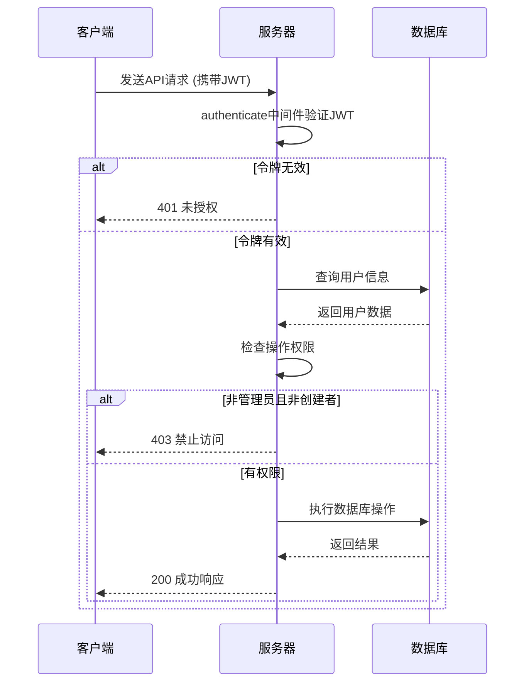
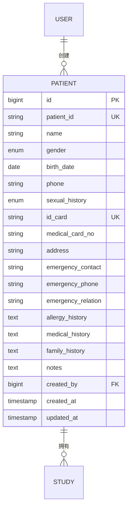
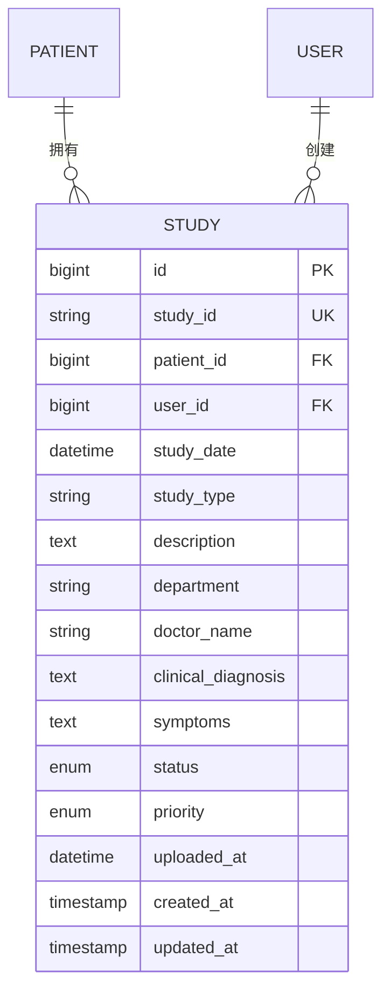

# 患者管理API

> **本文档引用的文件**   
> - [patients.js](file://server/routes/patients.js)
> - [Patient.js](file://server/models/Patient.js)
> - [Study.js](file://server/models/Study.js)
> - [auth.js](file://server/middleware/auth.js)
> - [api.ts](file://src/services/api.ts)

## 目录

1. [简介](#简介)
2. [权限控制逻辑](#权限控制逻辑)
3. [API端点详情](#api端点详情)
4. [数据模型](#数据模型)

## 简介

本API文档详细描述了患者管理系统的各项功能，包括创建、查询、更新、删除患者信息以及获取患者相关病例的功能。系统实现了严格的权限控制，确保非管理员用户只能操作自己创建的患者数据。

**Section sources**

- [patients.js](file://server/routes/patients.js#L1-L358)

## 权限控制逻辑

系统通过JWT认证和角色权限控制来保护患者数据。所有API端点都需要有效的JWT令牌进行访问。权限控制规则如下：

- **管理员用户**（role = 'admin'）：可以访问所有患者数据
- **普通用户**：只能访问自己创建的患者数据，通过`created_by`字段与用户ID进行匹配验证

权限验证在`auth.js`中间件中实现，每个请求都会验证用户身份和角色。



**Diagram sources**

- [auth.js](file://server/middleware/auth.js#L8-L64)
- [patients.js](file://server/routes/patients.js#L103-L105)

## API端点详情

### 创建患者

创建新的患者记录。

**HTTP方法**: `POST`  
**URL路径**: `/api/patients`  
**请求头**:

- `Authorization: Bearer <JWT令牌>`
- `Content-Type: application/json`

**请求体 (JSON Schema)**:

```json
{
  "name": "string",
  "gender": "male|female|other",
  "birth_date": "string (date)",
  "phone": "string",
  "sexual_history": "none|regular|irregular|multiple_partners|early_sexual_activity|other",
  "id_card": "string",
  "medical_card_no": "string",
  "address": "string",
  "emergency_contact": "string",
  "emergency_phone": "string",
  "emergency_relation": "string",
  "allergy_history": "string",
  "medical_history": "string",
  "family_history": "string",
  "notes": "string"
}
```

**响应体 (JSON Schema)**:

```json
{
  "success": "boolean",
  "message": "string",
  "data": {
    "patient": {
      "id": "number",
      "patient_id": "string",
      "name": "string",
      "gender": "string",
      "birth_date": "string",
      "phone": "string",
      "sexual_history": "string",
      "id_card": "string",
      "medical_card_no": "string",
      "address": "string",
      "emergency_contact": "string",
      "emergency_phone": "string",
      "emergency_relation": "string",
      "allergy_history": "string",
      "medical_history": "string",
      "family_history": "string",
      "notes": "string",
      "created_by": "number",
      "created_at": "string",
      "updated_at": "string"
    }
  }
}
```

**可能的HTTP状态码及错误信息**:

- `201 Created`: 患者创建成功
- `400 Bad Request`:
  - 姓名和性别为必填项
- `401 Unauthorized`:
  - 未提供认证令牌
  - 无效或已过期的令牌
- `409 Conflict`:
  - 该身份证号已存在
- `500 Internal Server Error`:
  - 创建患者失败

**Section sources**

- [patients.js](file://server/routes/patients.js#L13-L74)

### 获取患者列表

获取患者列表，支持分页、搜索和筛选。

**HTTP方法**: `GET`  
**URL路径**: `/api/patients`  
**请求头**:

- `Authorization: Bearer <JWT令牌>`

**请求参数**:

- `page` (可选, 默认1): 页码
- `limit` (可选, 默认10): 每页数量
- `search` (可选): 搜索关键词（匹配患者ID、姓名、电话、身份证号）
- `gender` (可选): 性别筛选

**响应体 (JSON Schema)**:

```json
{
  "success": "boolean",
  "data": {
    "patients": [
      {
        "id": "number",
        "patient_id": "string",
        "name": "string",
        "gender": "string",
        "birth_date": "string",
        "phone": "string",
        "sexual_history": "string",
        "id_card": "string",
        "medical_card_no": "string",
        "address": "string",
        "emergency_contact": "string",
        "emergency_phone": "string",
        "emergency_relation": "string",
        "allergy_history": "string",
        "medical_history": "string",
        "family_history": "string",
        "notes": "string",
        "created_by": "number",
        "created_at": "string",
        "updated_at": "string",
        "creator": {
          "id": "number",
          "username": "string",
          "real_name": "string"
        }
      }
    ],
    "pagination": {
      "total": "number",
      "page": "number",
      "limit": "number",
      "pages": "number"
    }
  }
}
```

**可能的HTTP状态码及错误信息**:

- `200 OK`: 获取患者列表成功
- `401 Unauthorized`:
  - 未提供认证令牌
  - 无效或已过期的令牌
- `500 Internal Server Error`:
  - 获取患者列表失败

**Section sources**

- [patients.js](file://server/routes/patients.js#L81-L140)

### 获取患者详情

获取指定患者的具体信息。

**HTTP方法**: `GET`  
**URL路径**: `/api/patients/:id`  
**请求头**:

- `Authorization: Bearer <JWT令牌>`

**路径参数**:

- `id`: 患者ID

**响应体 (JSON Schema)**:

```json
{
  "success": "boolean",
  "data": {
    "patient": {
      "id": "number",
      "patient_id": "string",
      "name": "string",
      "gender": "string",
      "birth_date": "string",
      "phone": "string",
      "sexual_history": "string",
      "id_card": "string",
      "medical_card_no": "string",
      "address": "string",
      "emergency_contact": "string",
      "emergency_phone": "string",
      "emergency_relation": "string",
      "allergy_history": "string",
      "medical_history": "string",
      "family_history": "string",
      "notes": "string",
      "created_by": "number",
      "created_at": "string",
      "updated_at": "string",
      "creator": {
        "id": "number",
        "username": "string",
        "real_name": "string"
      }
    }
  }
}
```

**可能的HTTP状态码及错误信息**:

- `200 OK`: 获取患者详情成功
- `401 Unauthorized`:
  - 未提供认证令牌
  - 无效或已过期的令牌
- `403 Forbidden`:
  - 无权访问该患者信息
- `404 Not Found`:
  - 患者不存在
- `500 Internal Server Error`:
  - 获取患者详情失败

**Section sources**

- [patients.js](file://server/routes/patients.js#L147-L185)

### 更新患者信息

更新指定患者的信息。

**HTTP方法**: `PUT`  
**URL路径**: `/api/patients/:id`  
**请求头**:

- `Authorization: Bearer <JWT令牌>`
- `Content-Type: application/json`

**路径参数**:

- `id`: 患者ID

**请求体 (JSON Schema)**:

```json
{
  "name": "string",
  "gender": "male|female|other",
  "birth_date": "string (date)",
  "phone": "string",
  "sexual_history": "none|regular|irregular|multiple_partners|early_sexual_activity|other",
  "id_card": "string",
  "medical_card_no": "string",
  "address": "string",
  "emergency_contact": "string",
  "emergency_phone": "string",
  "emergency_relation": "string",
  "allergy_history": "string",
  "medical_history": "string",
  "family_history": "string",
  "notes": "string"
}
```

**响应体 (JSON Schema)**:

```json
{
  "success": "boolean",
  "message": "string",
  "data": {
    "patient": {
      "id": "number",
      "patient_id": "string",
      "name": "string",
      "gender": "string",
      "birth_date": "string",
      "phone": "string",
      "sexual_history": "string",
      "id_card": "string",
      "medical_card_no": "string",
      "address": "string",
      "emergency_contact": "string",
      "emergency_phone": "string",
      "emergency_relation": "string",
      "allergy_history": "string",
      "medical_history": "string",
      "family_history": "string",
      "notes": "string",
      "created_by": "number",
      "created_at": "string",
      "updated_at": "string",
      "creator": {
        "id": "number",
        "username": "string",
        "real_name": "string"
      }
    }
  }
}
```

**可能的HTTP状态码及错误信息**:

- `200 OK`: 更新成功
- `400 Bad Request`:
  - 患者ID参数无效
- `401 Unauthorized`:
  - 未提供认证令牌
  - 无效或已过期的令牌
- `403 Forbidden`:
  - 无权更新该患者信息
- `404 Not Found`:
  - 患者不存在
- `409 Conflict`:
  - 该身份证号已存在
- `500 Internal Server Error`:
  - 更新患者信息失败

**Section sources**

- [patients.js](file://server/routes/patients.js#L192-L271)

### 删除患者

删除指定患者（软删除）。

**HTTP方法**: `DELETE`  
**URL路径**: `/api/patients/:id`  
**请求头**:

- `Authorization: Bearer <JWT令牌>`

**路径参数**:

- `id`: 患者ID

**响应体 (JSON Schema)**:

```json
{
  "success": "boolean",
  "message": "string"
}
```

**可能的HTTP状态码及错误信息**:

- `200 OK`: 患者已删除
- `401 Unauthorized`:
  - 未提供认证令牌
  - 无效或已过期的令牌
- `403 Forbidden`:
  - 无权删除该患者
- `404 Not Found`:
  - 患者不存在
- `500 Internal Server Error`:
  - 删除患者失败

**Section sources**

- [patients.js](file://server/routes/patients.js#L278-L311)

### 获取患者所有病例

获取指定患者的所有病例记录。

**HTTP方法**: `GET`  
**URL路径**: `/api/patients/:id/studies`  
**请求头**:

- `Authorization: Bearer <JWT令牌>`

**路径参数**:

- `id`: 患者ID

**响应体 (JSON Schema)**:

```json
{
  "success": "boolean",
  "data": {
    "studies": [
      {
        "id": "number",
        "study_id": "string",
        "patient_id": "number",
        "user_id": "number",
        "study_date": "string",
        "study_type": "string",
        "description": "string",
        "department": "string",
        "doctor_name": "string",
        "clinical_diagnosis": "string",
        "symptoms": "string",
        "status": "string",
        "priority": "string",
        "uploaded_at": "string",
        "created_at": "string",
        "updated_at": "string"
      }
    ]
  }
}
```

**可能的HTTP状态码及错误信息**:

- `200 OK`: 获取患者病例成功
- `401 Unauthorized`:
  - 未提供认证令牌
  - 无效或已过期的令牌
- `403 Forbidden`:
  - 无权访问该患者信息
- `404 Not Found`:
  - 患者不存在
- `500 Internal Server Error`:
  - 获取患者病例失败

**Section sources**

- [patients.js](file://server/routes/patients.js#L318-L354)

## 数据模型

### 患者模型 (Patient)

患者实体的数据结构定义。



**字段说明**:

- `id`: 主键，自增
- `patient_id`: 患者唯一标识，自动生成，格式为P+时间戳+随机数
- `name`: 姓名，必填
- `gender`: 性别，枚举值(male, female, other)，必填
- `birth_date`: 出生日期
- `phone`: 电话号码
- `sexual_history`: 性生活史，枚举值(none, regular, irregular, multiple_partners, early_sexual_activity, other)
- `id_card`: 身份证号，加密存储
- `medical_card_no`: 医保卡号
- `address`: 地址
- `emergency_contact`: 紧急联系人
- `emergency_phone`: 紧急联系电话
- `emergency_relation`: 紧急联系人关系
- `allergy_history`: 过敏史
- `medical_history`: 病史
- `family_history`: 家族病史
- `notes`: 备注
- `created_by`: 创建者用户ID，外键关联users表

**Diagram sources**

- [Patient.js](file://server/models/Patient.js#L5-L102)

### 病例模型 (Study)

病例实体的数据结构定义，与患者存在关联关系。



**字段说明**:

- `id`: 主键，自增
- `study_id`: 病例唯一标识，自动生成
- `patient_id`: 关联的患者ID，外键
- `user_id`: 创建者用户ID，外键
- `study_date`: 检查日期，必填
- `study_type`: 检查类型，必填
- `status`: 状态(pending, uploaded, processing, completed, failed)
- `priority`: 优先级(normal, urgent, emergency)

**Diagram sources**

- [Study.js](file://server/models/Study.js#L5-L130)
