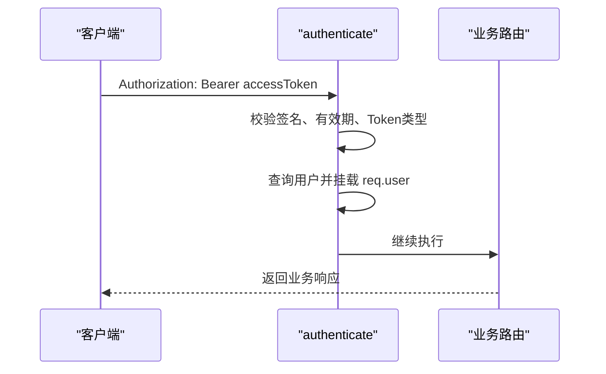
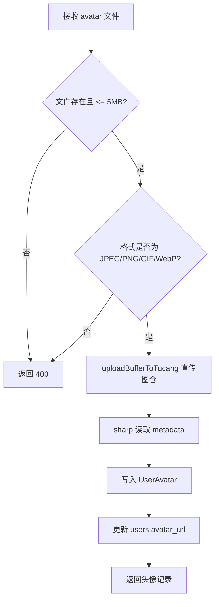

# 用户管理API

> **本文档引用文件**
> - [users.js](file://server/routes/users.js)
> - [auth.js](file://server/middleware/auth.js)
> - [User.js](file://server/models/User.js)
> - [UserAvatar.js](file://server/models/UserAvatar.js)

## 更新摘要

- 头像上传链路已切换为图仓直传，`sharp` 当前仅用于读取元数据
- `UserAvatar` 多尺寸字段仍保留，但当前实现统一写入同一远程 URL
- 用户资料接口返回的 `avatar_url` 现在以远程 URL 为主，不再默认指向本地多尺寸文件

## 目录

1. [简介](#简介)
2. [权限验证机制](#权限验证机制)
3. [头像上传处理逻辑](#头像上传处理逻辑)
4. [核心接口](#核心接口)

## 简介

本文档描述当前用户管理相关接口的真实行为，重点覆盖当前用户资料读写、邮箱安全链路与头像上传。文档已按最新代码口径调整，不再沿用旧版“本地裁切多套头像资源”的表述。

## 权限验证机制

系统使用基于 JWT 的访问控制：



**Section sources**
- [auth.js](file://server/middleware/auth.js#L7-L88)

## 头像上传处理逻辑

当前头像上传流程如下：



### 处理规则

- 支持格式：JPEG、PNG、GIF、WebP
- 文件大小限制：5MB
- 上传方式：内存缓冲区直传图仓
- 元数据：使用 `sharp` 读取 `width`、`height`、`mime_type`
- 多尺寸字段：`large_url`、`medium_url`、`small_url`、`thumbnail_url` 当前统一写入同一远程 URL

**Section sources**
- [users.js](file://server/routes/users.js#L382-L427)
- [UserAvatar.js](file://server/models/UserAvatar.js#L1-L66)

## 核心接口

### GET /api/users/me

获取当前用户资料与头像集合。

```json
{
  "success": true,
  "data": {
    "user": {
      "id": 1,
      "username": "user_123",
      "email": "user@example.com",
      "avatar_url": "https://img1.tucang.cc/...",
      "avatars": [
        {
          "original_url": "https://img1.tucang.cc/...",
          "large_url": "https://img1.tucang.cc/...",
          "medium_url": "https://img1.tucang.cc/...",
          "small_url": "https://img1.tucang.cc/...",
          "thumbnail_url": "https://img1.tucang.cc/..."
        }
      ]
    }
  }
}
```

### PUT /api/users/me

- 支持更新：`real_name`、`phone`
- 若请求体包含 `email` 且与当前邮箱不同，会返回冲突错误，要求走邮箱验证码校验链路

### POST /api/users/me/email/send-code

- 用于发送更换邮箱验证码
- 包含 60 秒发送频率限制与每日次数限制

### POST /api/users/me/email/confirm

- 校验 `new_email + code`
- 验证成功后原子更新用户邮箱

### POST /api/users/me/avatar

上传头像并返回头像记录。

```json
{
  "success": true,
  "message": "头像上传成功",
  "data": {
    "avatar": {
      "id": 1,
      "user_id": 1,
      "original_url": "https://img1.tucang.cc/...",
      "large_url": "https://img1.tucang.cc/...",
      "medium_url": "https://img1.tucang.cc/...",
      "small_url": "https://img1.tucang.cc/...",
      "thumbnail_url": "https://img1.tucang.cc/...",
      "file_size": 102400,
      "mime_type": "image/png",
      "width": 512,
      "height": 512,
      "is_current": true
    }
  }
}
```

### 错误状态

- `400 Bad Request`：文件缺失、格式不支持、大小超限、参数非法
- `401 Unauthorized`：未授权
- `409 Conflict`：邮箱变更未走验证码链路或邮箱已被占用
- `500 Internal Server Error`：图仓上传或数据库写入失败

## 调用示例

```typescript
const result = await userAPI.uploadAvatar(file);
```

```typescript
await userAPI.sendChangeEmailCode({ new_email: 'next@example.com' });
await userAPI.confirmChangeEmail({ new_email: 'next@example.com', code: '123456' });
```

## 结果说明

- 当前实现已经不再生成本地多尺寸头像文件
- 多尺寸字段仍被保留，以兼容既有模型和前端读取方式
- 若后续切换为真正多尺寸远程资源，接口字段结构可保持不变
