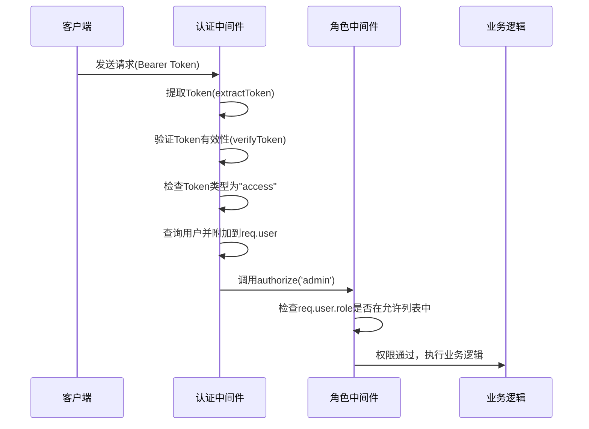
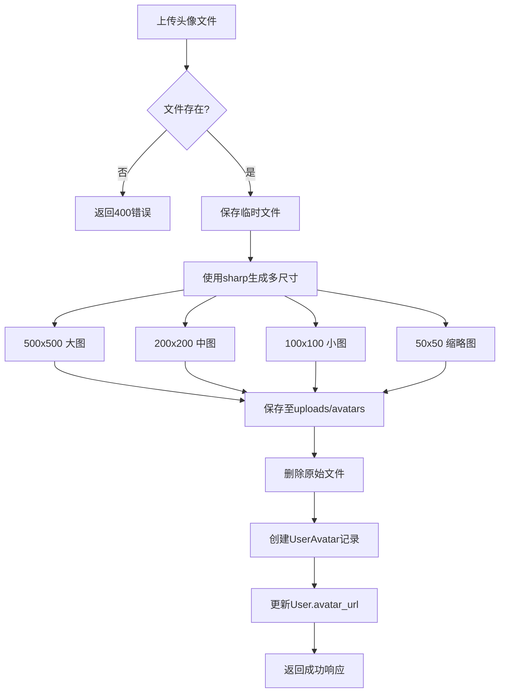

# 用户管理API

<cite>
**本文档引用文件**  
- [users.js](file://server/routes/users.js)
- [auth.js](file://server/middleware/auth.js)
- [User.js](file://server/models/User.js)
- [UserAvatar.js](file://server/models/UserAvatar.js)
- [jwt.js](file://server/utils/jwt.js)
</cite>

## 目录
1. [简介](#简介)
2. [权限验证机制](#权限验证机制)
3. [头像上传处理逻辑](#头像上传处理逻辑)
4. [普通用户端点](#普通用户端点)
   - [获取当前用户信息](#获取当前用户信息)
   - [更新当前用户信息](#更新当前用户信息)
   - [修改密码](#修改密码)
   - [上传头像](#上传头像)
5. [管理员端点](#管理员端点)
   - [获取用户列表](#获取用户列表)
   - [获取指定用户信息](#获取指定用户信息)
   - [更新用户信息](#更新用户信息)
   - [删除用户](#删除用户)

## 简介
本API文档详细描述了系统中用户管理相关的所有端点，包括普通用户可访问的个人信息操作接口和管理员专用的用户管理接口。所有接口均需通过JWT认证，并根据角色进行权限控制。

## 权限验证机制
系统采用基于JWT的双层权限验证机制：



**Diagram sources**
- [auth.js](file://server/middleware/auth.js#L7-L88)
- [jwt.js](file://server/utils/jwt.js#L40-L60)

**Section sources**
- [auth.js](file://server/middleware/auth.js#L7-L88)
- [jwt.js](file://server/utils/jwt.js#L40-L60)

### 认证流程
1. 请求头必须包含 `Authorization: Bearer <token>`
2. 验证Token签名和有效期
3. 检查Token类型必须为"access"
4. 查询数据库获取用户信息（排除password_hash）
5. 验证用户状态为"active"
6. 将用户对象附加到 `req.user`

### 角色授权
- `authenticate`：基础认证，所有登录用户可用
- `authorize('admin')`：仅允许admin角色访问

## 头像上传处理逻辑
系统支持头像上传并自动生成多尺寸版本，确保在不同场景下的显示效果。



**Diagram sources**
- [users.js](file://server/routes/users.js#L164-L221)
- [UserAvatar.js](file://server/models/UserAvatar.js#L4-L70)

**Section sources**
- [users.js](file://server/routes/users.js#L164-L221)

### 处理规则
- 支持格式：JPEG、PNG、GIF、WebP
- 文件大小限制：5MB
- 生成尺寸：
  - large：500×500
  - medium：200×200（用户表avatar_url字段值）
  - small：100×100
  - thumbnail：50×50
- 所有图片转换为JPG格式存储
- 原始文件上传后立即删除

## 普通用户端点

### 获取当前用户信息
获取当前登录用户的基本信息。

**HTTP方法**  
GET

**URL路径**  
`/api/users/me`

**请求头**  
- `Authorization: Bearer <access_token>` （必需）

**请求参数**  
无

**请求体**  
无

**响应体JSON Schema**
```json
{
  "success": true,
  "data": {
    "user": {
      "id": 1,
      "username": "user_123",
      "email": "user@example.com",
      "real_name": "张三",
      "phone": "13800138000",
      "avatar_url": "/uploads/avatars/avatar-123-medium.jpg",
      "role": "user",
      "status": "active",
      "last_login_at": "2024-01-01T00:00:00Z",
      "created_at": "2024-01-01T00:00:00Z",
      "updated_at": "2024-01-01T00:00:00Z"
    }
  }
}
```

**可能的HTTP状态码**
- `200 OK`：获取成功
- `401 Unauthorized`：未提供令牌、令牌无效或已过期
- `500 Internal Server Error`：服务器内部错误

**错误信息示例**
```json
{
  "success": false,
  "message": "获取用户信息失败"
}
```

**Section sources**
- [users.js](file://server/routes/users.js#L47-L72)

### 更新当前用户信息
更新当前登录用户的基本信息。

**HTTP方法**  
PUT

**URL路径**  
`/api/users/me`

**请求头**  
- `Authorization: Bearer <access_token>` （必需）
- `Content-Type: application/json` （必需）

**请求参数**  
无

**请求体JSON Schema**
```json
{
  "real_name": "string",
  "phone": "string"
}
```

**字段说明**
- `real_name`：真实姓名，字符串类型
- `phone`：手机号码，字符串类型
- 所有字段均为可选，只更新提供的字段

**响应体JSON Schema**
```json
{
  "success": true,
  "message": "更新成功",
  "data": {
    "user": {
      "id": 1,
      "username": "user_123",
      "email": "user@example.com",
      "real_name": "张三",
      "phone": "13800138000",
      "avatar_url": "/uploads/avatars/avatar-123-medium.jpg",
      "role": "user",
      "status": "active",
      "created_at": "2024-01-01T00:00:00Z",
      "updated_at": "2024-01-02T00:00:00Z"
    }
  }
}
```

**可能的HTTP状态码**
- `200 OK`：更新成功
- `401 Unauthorized`：未提供令牌、令牌无效或已过期
- `500 Internal Server Error`：服务器内部错误

**错误信息示例**
```json
{
  "success": false,
  "message": "更新用户信息失败"
}
```

**Section sources**
- [users.js](file://server/routes/users.js#L78-L105)

### 修改密码
修改当前登录用户的密码。

**HTTP方法**  
PUT

**URL路径**  
`/api/users/me/password`

**请求头**  
- `Authorization: Bearer <access_token>` （必需）
- `Content-Type: application/json` （必需）

**请求参数**  
无

**请求体JSON Schema**
```json
{
  "current_password": "string",
  "new_password": "string"
}
```

**字段说明**
- `current_password`：当前密码，必需，字符串类型
- `new_password`：新密码，必需，字符串类型，长度至少6位

**响应体JSON Schema**
```json
{
  "success": true,
  "message": "密码修改成功"
}
```

**可能的HTTP状态码**
- `200 OK`：修改成功
- `400 Bad Request`：缺少必填字段或新密码长度不足
- `401 Unauthorized`：当前密码错误
- `500 Internal Server Error`：服务器内部错误

**错误信息示例**
```json
{
  "success": false,
  "message": "当前密码错误"
}
```

**Section sources**
- [users.js](file://server/routes/users.js#L111-L157)

### 上传头像
上传当前用户的头像图片。

**HTTP方法**  
POST

**URL路径**  
`/api/users/me/avatar`

**请求头**  
- `Authorization: Bearer <access_token>` （必需）
- `Content-Type: multipart/form-data` （必需）

**请求参数**  
- `avatar`：文件字段，包含要上传的图片文件

**请求体**  
multipart/form-data 格式，包含avatar文件字段

**响应体JSON Schema**
```json
{
  "success": true,
  "message": "头像上传成功",
  "data": {
    "avatar": {
      "id": 1,
      "user_id": 1,
      "original_url": "/uploads/avatars/avatar-123-large.jpg",
      "thumbnail_url": "/uploads/avatars/avatar-123-thumbnail.jpg",
      "medium_url": "/uploads/avatars/avatar-123-medium.jpg",
      "file_size": 123456,
      "mime_type": "image/jpeg",
      "width": 500,
      "height": 500,
      "is_current": true,
      "created_at": "2024-01-01T00:00:00Z"
    }
  }
}
```

**可能的HTTP状态码**
- `200 OK`：上传成功
- `400 Bad Request`：未上传文件或文件类型不支持
- `401 Unauthorized`：未提供令牌、令牌无效或已过期
- `500 Internal Server Error`：服务器内部错误

**错误信息示例**
```json
{
  "success": false,
  "message": "只支持 JPEG, PNG, GIF, WebP 格式的图片"
}
```

**Section sources**
- [users.js](file://server/routes/users.js#L164-L233)

## 管理员端点

### 获取用户列表
获取系统中所有用户的信息列表，支持分页和筛选。

**HTTP方法**  
GET

**URL路径**  
`/api/users`

**请求头**  
- `Authorization: Bearer <access_token>` （必需）

**请求参数**
- `page`：页码，整数，默认1
- `limit`：每页数量，整数，默认10
- `role`：角色筛选，字符串，可选值：admin、doctor、user
- `status`：状态筛选，字符串，可选值：active、disabled
- `search`：搜索关键字，字符串，在用户名、邮箱、真实姓名中模糊匹配

**请求体**  
无

**响应体JSON Schema**
```json
{
  "success": true,
  "data": {
    "users": [
      {
        "id": 1,
        "username": "admin_123",
        "email": "admin@example.com",
        "real_name": "李四",
        "phone": "13800138001",
        "avatar_url": "/uploads/avatars/avatar-456-medium.jpg",
        "role": "admin",
        "status": "active",
        "created_at": "2024-01-01T00:00:00Z",
        "updated_at": "2024-01-01T00:00:00Z"
      }
    ],
    "pagination": {
      "total": 1,
      "page": 1,
      "limit": 10,
      "pages": 1
    }
  }
}
```

**可能的HTTP状态码**
- `200 OK`：获取成功
- `401 Unauthorized`：未提供令牌、令牌无效或已过期
- `403 Forbidden`：权限不足（非管理员）
- `500 Internal Server Error`：服务器内部错误

**错误信息示例**
```json
{
  "success": false,
  "message": "获取用户列表失败"
}
```

**Section sources**
- [users.js](file://server/routes/users.js#L240-L283)

### 获取指定用户信息
获取指定ID用户的信息。

**HTTP方法**  
GET

**URL路径**  
`/api/users/:id`

**请求头**  
- `Authorization: Bearer <access_token>` （必需）

**路径参数**
- `id`：用户ID，整数

**请求体**  
无

**响应体JSON Schema**
```json
{
  "success": true,
  "data": {
    "user": {
      "id": 1,
      "username": "user_123",
      "email": "user@example.com",
      "real_name": "张三",
      "phone": "13800138000",
      "avatar_url": "/uploads/avatars/avatar-123-medium.jpg",
      "role": "user",
      "status": "active",
      "created_at": "2024-01-01T00:00:00Z",
      "updated_at": "2024-01-01T00:00:00Z"
    }
  }
}
```

**可能的HTTP状态码**
- `200 OK`：获取成功
- `401 Unauthorized`：未提供令牌、令牌无效或已过期
- `403 Forbidden`：权限不足（非管理员）
- `404 Not Found`：用户不存在
- `500 Internal Server Error`：服务器内部错误

**错误信息示例**
```json
{
  "success": false,
  "message": "用户不存在"
}
```

**Section sources**
- [users.js](file://server/routes/users.js#L290-L321)

### 更新用户信息
更新指定ID用户的信息。

**HTTP方法**  
PUT

**URL路径**  
`/api/users/:id`

**请求头**  
- `Authorization: Bearer <access_token>` （必需）
- `Content-Type: application/json` （必需）

**路径参数**
- `id`：用户ID，整数

**请求体JSON Schema**
```json
{
  "real_name": "string",
  "phone": "string",
  "role": "string",
  "status": "string"
}
```

**字段说明**
- `real_name`：真实姓名，字符串类型
- `phone`：手机号码，字符串类型
- `role`：角色，字符串类型，可选值：admin、doctor、user
- `status`：状态，字符串类型，可选值：active、disabled
- 所有字段均为可选，只更新提供的字段

**响应体JSON Schema**
```json
{
  "success": true,
  "message": "更新成功",
  "data": {
    "user": {
      "id": 1,
      "username": "user_123",
      "email": "user@example.com",
      "real_name": "张三",
      "phone": "13800138000",
      "avatar_url": "/uploads/avatars/avatar-123-medium.jpg",
      "role": "user",
      "status": "active",
      "created_at": "2024-01-01T00:00:00Z",
      "updated_at": "2024-01-02T00:00:00Z"
    }
  }
}
```

**可能的HTTP状态码**
- `200 OK`：更新成功
- `401 Unauthorized`：未提供令牌、令牌无效或已过期
- `403 Forbidden`：权限不足（非管理员）
- `404 Not Found`：用户不存在
- `500 Internal Server Error`：服务器内部错误

**错误信息示例**
```json
{
  "success": false,
  "message": "更新用户信息失败"
}
```

**Section sources**
- [users.js](file://server/routes/users.js#L328-L365)

### 删除用户
删除指定ID的用户（软删除）。

**HTTP方法**  
DELETE

**URL路径**  
`/api/users/:id`

**请求头**  
- `Authorization: Bearer <access_token>` （必需）

**路径参数**
- `id`：用户ID，整数

**请求体**  
无

**响应体JSON Schema**
```json
{
  "success": true,
  "message": "用户已删除"
}
```

**可能的HTTP状态码**
- `200 OK`：删除成功
- `400 Bad Request`：尝试删除自己
- `401 Unauthorized`：未提供令牌、令牌无效或已过期
- `403 Forbidden`：权限不足（非管理员）
- `404 Not Found`：用户不存在
- `500 Internal Server Error`：服务器内部错误

**错误信息示例**
```json
{
  "success": false,
  "message": "不能删除自己"
}
```

**Section sources**
- [users.js](file://server/routes/users.js#L372-L405)