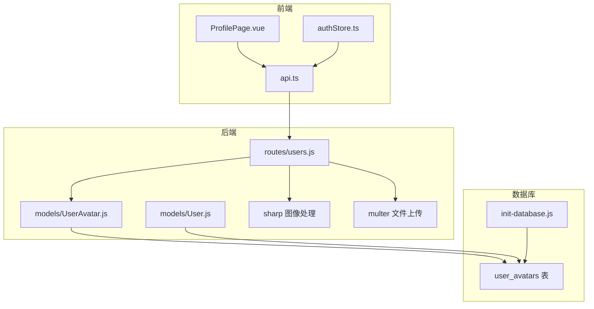
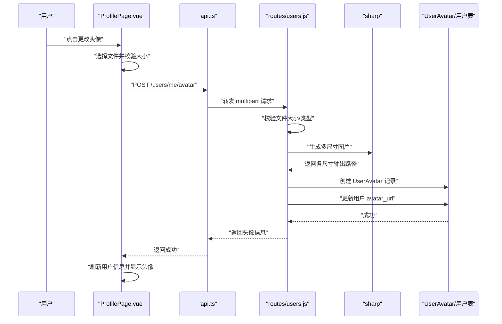
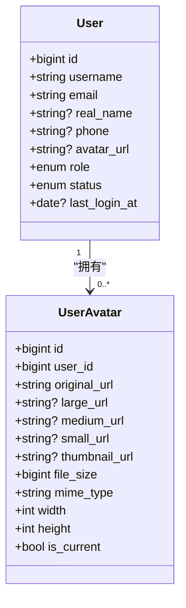
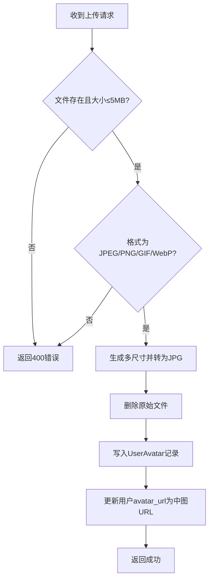
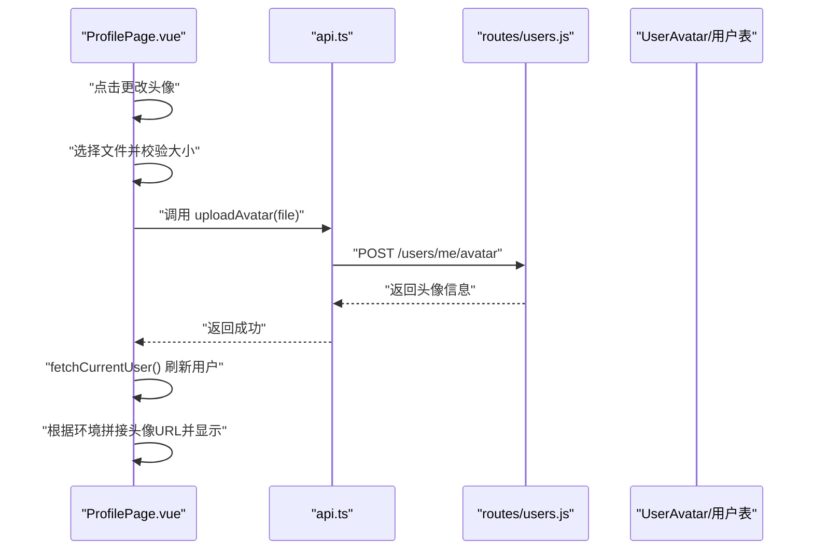
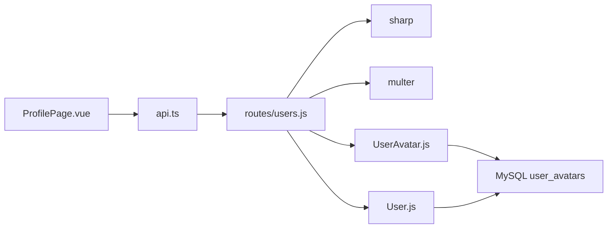

# 用户头像多尺寸

<cite>
**本文引用的文件**
- [server/models/UserAvatar.js](file://server/models/UserAvatar.js)
- [server/models/User.js](file://server/models/User.js)
- [server/routes/users.js](file://server/routes/users.js)
- [src/pages/ProfilePage.vue](file://src/pages/ProfilePage.vue)
- [src/services/api.ts](file://src/services/api.ts)
- [src/stores/authStore.ts](file://src/stores/authStore.ts)
- [server/scripts/init-database.js](file://server/scripts/init-database.js)
- [wiki/API参考/用户管理API.md](file://wiki/API参考/用户管理API.md)
- [wiki/数据库设计/表结构/用户头像表 (user_avatars).md](file://wiki/数据库设计/表结构/用户头像表 (user_avatars).md)
</cite>

## 目录
1. [简介](#简介)
2. [项目结构](#项目结构)
3. [核心组件](#核心组件)
4. [架构概览](#架构概览)
5. [详细组件分析](#详细组件分析)
6. [依赖分析](#依赖分析)
7. [性能考虑](#性能考虑)
8. [故障排除指南](#故障排除指南)
9. [结论](#结论)

## 简介
本文件系统性阐述“用户头像多尺寸”功能的设计与实现，覆盖后端模型与路由、前端展示与交互、数据库结构演进与兼容策略，以及跨端运行时的头像 URL 处理方式。该功能通过一次上传生成多尺寸版本，按需选择合适尺寸，兼顾加载性能与显示质量。

## 项目结构
- 后端
  - 模型：用户头像模型与用户模型
  - 路由：用户头像上传与查询
  - 工具：sharp 图像处理、multer 文件上传
- 前端
  - 页面：个人资料页负责头像上传与展示
  - 服务：封装上传与获取用户信息的 API
  - 状态：Pinia store 存储用户信息与令牌
- 数据库
  - 初始化脚本：自动创建表并补全 user_avatars 字段
  - 文档：字段定义与流程说明

图表来源
- [server/routes/users.js](file://server/routes/users.js#L1-L240)
- [server/models/UserAvatar.js](file://server/models/UserAvatar.js#L1-L82)
- [server/models/User.js](file://server/models/User.js#L1-L109)
- [src/pages/ProfilePage.vue](file://src/pages/ProfilePage.vue#L1-L549)
- [src/services/api.ts](file://src/services/api.ts#L120-L160)
- [src/stores/authStore.ts](file://src/stores/authStore.ts#L160-L219)
- [server/scripts/init-database.js](file://server/scripts/init-database.js#L43-L110)

章节来源
- [server/routes/users.js](file://server/routes/users.js#L1-L240)
- [server/models/UserAvatar.js](file://server/models/UserAvatar.js#L1-L82)
- [server/models/User.js](file://server/models/User.js#L1-L109)
- [src/pages/ProfilePage.vue](file://src/pages/ProfilePage.vue#L1-L549)
- [src/services/api.ts](file://src/services/api.ts#L120-L160)
- [src/stores/authStore.ts](file://src/stores/authStore.ts#L160-L219)
- [server/scripts/init-database.js](file://server/scripts/init-database.js#L43-L110)

## 核心组件
- 后端模型
  - UserAvatar：记录头像多尺寸 URL、文件元数据与当前有效标记
  - User：维护用户基础信息与当前头像 URL 字段
- 后端路由
  - 上传头像：校验文件、生成多尺寸、写入数据库、更新用户头像 URL
  - 获取当前用户：包含头像集合（按 is_current 排序）
- 前端页面
  - ProfilePage：展示头像、触发上传、处理本地 URL 拼接
- 服务与状态
  - api.ts：封装上传与获取用户信息
  - authStore.ts：持久化用户信息，便于刷新后读取

章节来源
- [server/models/UserAvatar.js](file://server/models/UserAvatar.js#L1-L82)
- [server/models/User.js](file://server/models/User.js#L1-L109)
- [server/routes/users.js](file://server/routes/users.js#L160-L233)
- [src/pages/ProfilePage.vue](file://src/pages/ProfilePage.vue#L310-L474)
- [src/services/api.ts](file://src/services/api.ts#L120-L160)
- [src/stores/authStore.ts](file://src/stores/authStore.ts#L160-L219)

## 架构概览
用户上传头像的端到端流程如下：

图表来源
- [server/routes/users.js](file://server/routes/users.js#L160-L233)
- [src/pages/ProfilePage.vue](file://src/pages/ProfilePage.vue#L429-L474)
- [src/services/api.ts](file://src/services/api.ts#L140-L160)

章节来源
- [server/routes/users.js](file://server/routes/users.js#L160-L233)
- [src/pages/ProfilePage.vue](file://src/pages/ProfilePage.vue#L429-L474)
- [src/services/api.ts](file://src/services/api.ts#L140-L160)

## 详细组件分析

### 后端模型：UserAvatar 与 User
- UserAvatar 字段要点
  - 多尺寸 URL：large_url、medium_url、small_url、thumbnail_url
  - 元数据：file_size、mime_type、width、height
  - 状态：is_current（默认 true），用于原子更新与查询筛选
  - 索引：user_id、(user_id, is_current)
- User 字段要点
  - avatar_url：指向当前头像的 URL（通常为 medium 尺寸）

图表来源
- [server/models/User.js](file://server/models/User.js#L1-L109)
- [server/models/UserAvatar.js](file://server/models/UserAvatar.js#L1-L82)

章节来源
- [server/models/User.js](file://server/models/User.js#L1-L109)
- [server/models/UserAvatar.js](file://server/models/UserAvatar.js#L1-L82)

### 后端路由：头像上传与更新
- 上传接口
  - 路径：POST /api/users/me/avatar
  - 功能：校验文件、生成多尺寸（500x500、200x200、100x100、50x50）、删除原始文件、写入 UserAvatar、更新用户 avatar_url
  - 返回：包含头像记录
- 获取当前用户
  - 路径：GET /api/users/me
  - 功能：包含 avatars 关联（按 is_current 排序）
- 错误处理
  - 文件缺失、格式不支持、大小超限、处理异常均返回友好错误

图表来源
- [server/routes/users.js](file://server/routes/users.js#L160-L233)

章节来源
- [server/routes/users.js](file://server/routes/users.js#L160-L233)

### 前端页面：头像展示与上传
- 展示
  - 使用 q-avatar 组件渲染头像
  - 若用户 avatar_url 为相对路径，在开发环境自动拼接 http://localhost:3000
- 上传
  - 触发 input[type=file]，限制大小≤5MB
  - 调用 userAPI.uploadAvatar，成功后刷新用户信息并提示

图表来源
- [src/pages/ProfilePage.vue](file://src/pages/ProfilePage.vue#L429-L474)
- [src/services/api.ts](file://src/services/api.ts#L140-L160)
- [server/routes/users.js](file://server/routes/users.js#L160-L233)

章节来源
- [src/pages/ProfilePage.vue](file://src/pages/ProfilePage.vue#L310-L474)
- [src/services/api.ts](file://src/services/api.ts#L140-L160)

### 数据库与脚本：结构演进与兼容
- 初始化脚本
  - 同步所有表结构
  - 检测并为 user_avatars 表补充 large_url、small_url 字段
- 文档说明
  - 字段定义、生成规则、索引与约束
  - 头像上传处理流程与规则

章节来源
- [server/scripts/init-database.js](file://server/scripts/init-database.js#L43-L110)
- [wiki/数据库设计/表结构/用户头像表 (user_avatars).md](file://wiki/数据库设计/表结构/用户头像表 (user_avatars).md#L1-L180)
- [wiki/API参考/用户管理API.md](file://wiki/API参考/用户管理API.md#L69-L128)

## 依赖分析
- 组件耦合
  - ProfilePage.vue 依赖 api.ts 的 userAPI.uploadAvatar
  - api.ts 依赖 axios 与本地存储的令牌
  - routes/users.js 依赖 multer、sharp、UserAvatar 模型
  - UserAvatar 模型依赖 User 模型（外键 user_id）
- 外部依赖
  - sharp：图像缩放与编码
  - multer：文件上传与过滤
  - MySQL：存储头像元数据与用户信息

图表来源
- [src/pages/ProfilePage.vue](file://src/pages/ProfilePage.vue#L429-L474)
- [src/services/api.ts](file://src/services/api.ts#L140-L160)
- [server/routes/users.js](file://server/routes/users.js#L1-L240)
- [server/models/UserAvatar.js](file://server/models/UserAvatar.js#L1-L82)
- [server/models/User.js](file://server/models/User.js#L1-L109)

章节来源
- [src/pages/ProfilePage.vue](file://src/pages/ProfilePage.vue#L429-L474)
- [src/services/api.ts](file://src/services/api.ts#L140-L160)
- [server/routes/users.js](file://server/routes/users.js#L1-L240)
- [server/models/UserAvatar.js](file://server/models/UserAvatar.js#L1-L82)
- [server/models/User.js](file://server/models/User.js#L1-L109)

## 性能考虑
- 图片尺寸与质量
  - 生成多尺寸：500x500（large）、200x200（medium）、100x100（small）、50x50（thumbnail）
  - 统一转为 JPG，质量 90，减少体积与格式差异
- 加载策略
  - medium 尺寸作为用户头像主图，兼顾清晰度与体积
  - 在不同场景可选择 small/thumbnail 以提升首屏速度
- 存储与清理
  - 上传完成后删除原始文件，避免磁盘冗余
  - 通过 is_current 标记实现原子更新，避免并发问题
- 前端渲染
  - 使用 object-fit: cover 确保头像裁剪一致
  - 开发环境自动拼接本地地址，避免跨域与路径问题

[本节为通用指导，不直接分析具体文件]

## 故障排除指南
- 常见错误与定位
  - 上传失败：检查文件大小与格式限制、后端日志、磁盘权限
  - 头像不显示：确认 avatar_url 是否为完整 URL；开发环境需拼接 http://localhost:3000
  - 数据库字段缺失：执行初始化脚本，确保 large_url、small_url 字段存在
- 建议排查步骤
  - 前端：确认上传成功回调与用户信息刷新
  - 后端：查看上传接口日志与 sharp 处理结果
  - 数据库：核对 user_avatars 记录与用户表 avatar_url 是否一致

章节来源
- [server/routes/users.js](file://server/routes/users.js#L160-L233)
- [src/pages/ProfilePage.vue](file://src/pages/ProfilePage.vue#L310-L360)
- [server/scripts/init-database.js](file://server/scripts/init-database.js#L54-L86)

## 结论
“用户头像多尺寸”功能通过后端一次性生成多尺寸图片、统一存储与原子更新策略，结合前端灵活的 URL 处理与渲染优化，实现了高可用、高性能的头像管理方案。初始化脚本保障了数据库结构的兼容性，文档与 API 参考明确了处理规则与边界条件，适合在医疗类应用中稳定使用。