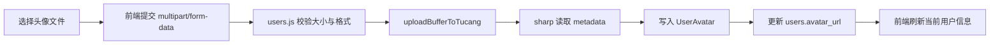

# 用户头像多尺寸说明

> 文件名沿用历史命名，但当前实现已经演进为“图仓单 URL + 多尺寸字段兼容”。

## 引用文件

- [server/routes/users.js](file://server/routes/users.js)
- [server/models/UserAvatar.js](file://server/models/UserAvatar.js)
- [src/pages/ProfilePage.vue](file://src/pages/ProfilePage.vue)

## 一、当前实现摘要

- 上传文件先进入内存，不落本地头像目录
- 使用 `uploadBufferToTucang(...)` 上传图仓
- 使用 `sharp` 读取元数据，不执行多尺寸裁切和本地输出
- `UserAvatar` 的多尺寸字段仍然保留，但当前统一写入同一远程 URL

## 二、为什么标题仍保留“多尺寸”

- 数据库结构仍然包含 `large_url`、`medium_url`、`small_url`、`thumbnail_url`
- 前端与历史接口响应仍依赖这些字段存在
- 当前方案通过“同一 URL 复用”保持兼容，不破坏既有响应结构

## 三、上传流程



## 四、字段口径

| 字段 | 当前含义 |
| :--- | :--- |
| `original_url` | 图仓原始地址 |
| `large_url` | 与 `original_url` 相同 |
| `medium_url` | 与 `original_url` 相同 |
| `small_url` | 与 `original_url` 相同 |
| `thumbnail_url` | 与 `original_url` 相同 |
| `file_size` | 原始文件大小 |
| `mime_type` | 上传 MIME 类型 |
| `width` / `height` | 原图元数据 |

## 五、前端使用建议

- 优先使用 `user.avatar_url`
- 若需要展示头像记录详情，可读取 `avatars[0]`
- 不要再假设返回值一定是本地头像路径

## 六、调用示例

```typescript
const result = await userAPI.uploadAvatar(file);
const avatarUrl = result.data.avatar.medium_url || result.data.avatar.original_url;
```

## 七、结论

- “多尺寸字段”目前属于兼容层，不代表后端正在生成多套图片资源
- 当前真实实现以图仓远程 URL 为主
- 后续如接入真实多尺寸远程资源，可在不改接口字段的前提下平滑升级
