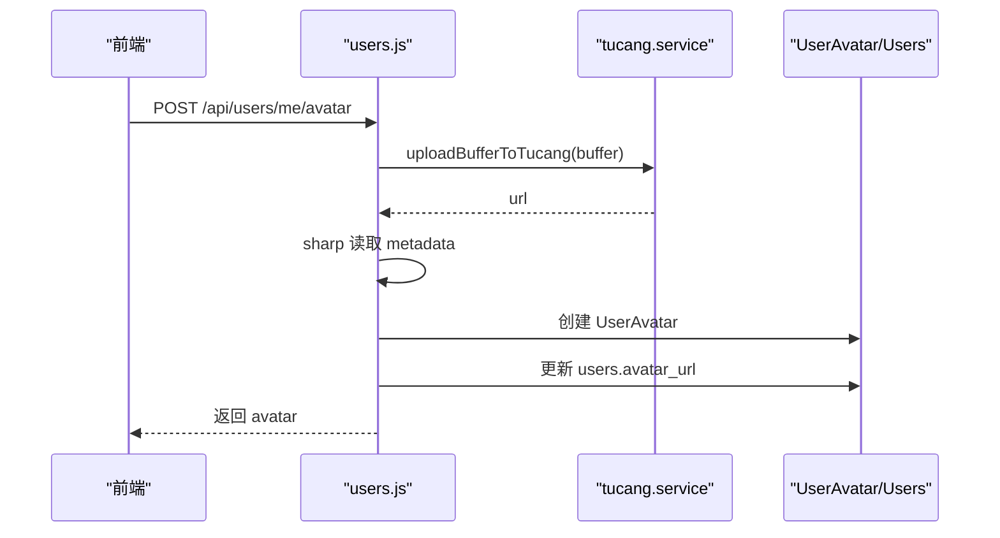

# 用户管理API详解

> 本页与《用户管理API》保持同一实现口径，作为专题页补充当前头像上传与邮箱安全的实现细节。

## 引用文件

- [users.js](file://server/routes/users.js)
- [UserAvatar.js](file://server/models/UserAvatar.js)
- [User.js](file://server/models/User.js)

## 一、头像上传现状

- 上传中间件使用 `multer.memoryStorage()`
- 图像内容通过 `uploadBufferToTucang(...)` 直接上传图仓
- `sharp` 当前仅负责读取元数据，不生成本地多尺寸文件
- `UserAvatar` 的多尺寸字段当前统一写入同一远程 URL
- `users.avatar_url` 会被更新为图仓返回地址



## 二、邮箱安全链路

### 2.1 更新资料接口约束

- `PUT /api/users/me` 可更新 `real_name`、`phone`
- 若提交的新邮箱与当前邮箱不同，会直接返回冲突错误，防止绕过验证码校验

### 2.2 更换邮箱接口

- `POST /api/users/me/email/send-code`
  - 校验邮箱格式
  - 校验唯一性
  - 执行 60 秒频率限制
  - 执行每日次数上限限制
- `POST /api/users/me/email/confirm`
  - 校验验证码
  - 成功后更新用户邮箱

## 三、响应字段说明

### 头像记录字段

| 字段 | 说明 |
| :--- | :--- |
| `original_url` | 图仓原始访问地址 |
| `large_url` | 当前与 `original_url` 相同 |
| `medium_url` | 当前与 `original_url` 相同 |
| `small_url` | 当前与 `original_url` 相同 |
| `thumbnail_url` | 当前与 `original_url` 相同 |
| `width` / `height` | 由 `sharp(...).metadata()` 读取 |
| `mime_type` | 原始上传 MIME |

## 四、兼容性说明

- 文档仍保留“多尺寸字段”描述，是因为数据库模型未移除这些字段
- 当前实现是“单一远程 URL + 多字段复用”
- 前端若只读取 `avatar_url`，可直接使用，不需要自行拼接本地地址

## 五、示例

```json
{
  "success": true,
  "data": {
    "avatar": {
      "original_url": "https://img1.tucang.cc/...",
      "large_url": "https://img1.tucang.cc/...",
      "medium_url": "https://img1.tucang.cc/...",
      "small_url": "https://img1.tucang.cc/...",
      "thumbnail_url": "https://img1.tucang.cc/..."
    }
  }
}
```
