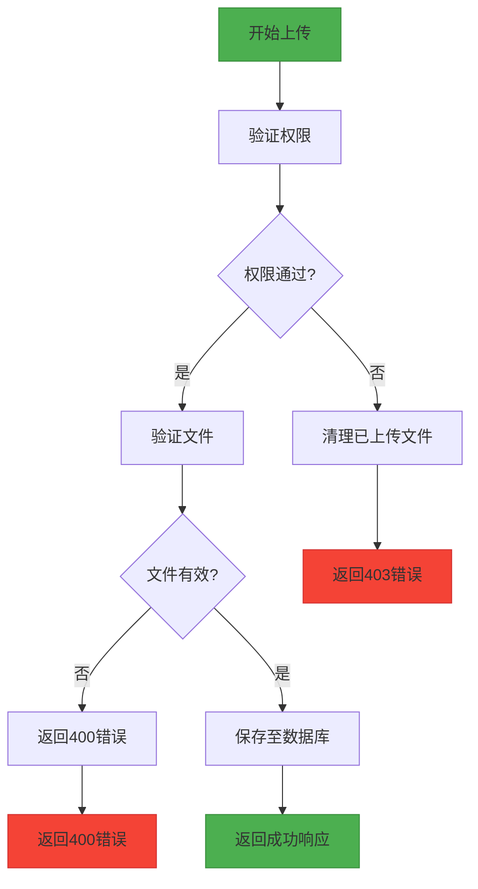
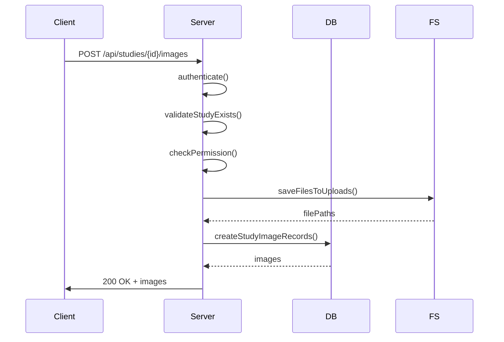
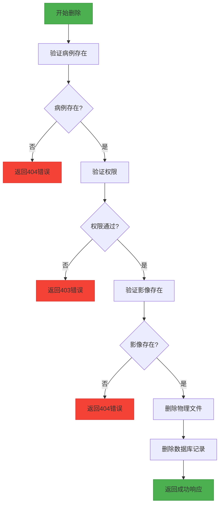
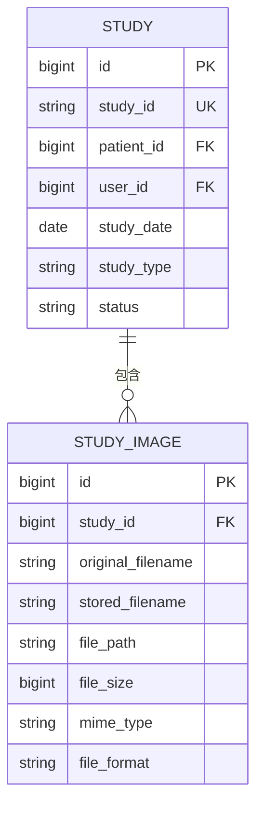

# 影像管理API

> **Referenced Files in This Document**  
> - [studies.js](file://server/routes/studies.js)
> - [StudyImage.js](file://server/models/StudyImage.js)
> - [Study.js](file://server/models/Study.js)
> - [auth.js](file://server/middleware/auth.js)

## 目录
1. [简介](#简介)
2. [核心组件](#核心组件)
3. [上传影像](#上传影像)
4. [删除影像](#删除影像)
5. [关联关系](#关联关系)

## 简介
本API参考文档详细说明了宫颈癌AI检测系统中病例相关影像文件的上传与删除操作。文档重点阐述了影像上传过程中的Multer中间件配置、权限验证、文件清理回滚机制以及数据库记录同步流程，并详细描述了影像删除端点的原子性操作。

## 核心组件

**Section sources**
- [studies.js](file://server/routes/studies.js#L1-L530)
- [auth.js](file://server/middleware/auth.js#L1-L125)

## 上传影像

### Multer中间件配置
系统使用Multer中间件处理影像文件上传，配置了严格的文件限制和存储策略。



**Diagram sources**
- [studies.js](file://server/routes/studies.js#L12-L40)

#### 存储配置
服务器端存储路径生成策略如下：
- **存储目录**: `../uploads/studies`
- **文件名生成**: 使用时间戳和随机数生成唯一文件名，格式为 `study-{timestamp}-{random}.{extension}`
- **目录创建**: 如果上传目录不存在，系统会自动创建并确保递归创建父目录

#### 上传限制
上传操作遵循以下限制规则：
- **文件大小**: 单个文件最大20MB
- **文件格式**: 仅支持JPEG、PNG、TIFF、BMP格式
- **批量上传**: 最多支持一次上传10个文件

**Section sources**
- [studies.js](file://server/routes/studies.js#L12-L40)

### 权限验证
上传操作前会进行严格的权限验证：
1. 用户必须通过JWT令牌认证
2. 非管理员用户只能上传到自己创建的病例
3. 如果权限验证失败，系统会自动清理已上传的临时文件

### 文件清理回滚机制
系统实现了完善的文件清理回滚机制，确保在各种错误情况下不会留下孤立的文件：
- **病例不存在**: 如果指定的病例ID不存在，立即删除已上传的文件
- **权限不足**: 如果用户无权上传到该病例，删除已上传的文件
- **上传失败**: 在捕获到任何异常时，遍历并删除所有已上传的文件

### 数据库记录同步
上传成功后，系统会将影像信息同步到数据库：
- **文件路径**: 存储为 `/uploads/studies/{filename}`
- **原始文件名**: 保留原始文件名以便追溯
- **文件大小**: 记录文件字节大小
- **MIME类型**: 记录文件的MIME类型
- **格式信息**: 记录文件格式（默认为JPEG）



**Diagram sources**
- [studies.js](file://server/routes/studies.js#L132-L202)
- [StudyImage.js](file://server/models/StudyImage.js#L1-L104)

## 删除影像

### 影像归属验证
删除操作前会进行严格的验证流程：
1. 验证病例是否存在
2. 验证用户权限（非管理员只能删除自己创建的病例）
3. 验证影像是否存在且属于指定病例

### 原子性操作
删除操作采用原子性设计，确保文件系统和数据库状态一致：
- **物理删除**: 从文件系统中删除影像文件
- **数据库软删除**: 从数据库中删除影像记录
- **事务保证**: 两个操作按顺序执行，确保数据一致性



**Diagram sources**
- [studies.js](file://server/routes/studies.js#L478-L527)

**Section sources**
- [studies.js](file://server/routes/studies.js#L478-L527)

## 关联关系

### 模型关系
影像管理涉及两个核心模型的关联关系：



**Diagram sources**
- [Study.js](file://server/models/Study.js#L1-L131)
- [StudyImage.js](file://server/models/StudyImage.js#L1-L104)

### 请求示例
#### 上传影像
```http
POST /api/studies/123/images HTTP/1.1
Content-Type: multipart/form-data; boundary=----WebKitFormBoundary7MA4YWxkTrZu0gW
Authorization: Bearer <JWT_TOKEN>

------WebKitFormBoundary7MA4YWxkTrZu0gW
Content-Disposition: form-data; name="images"; filename="image1.jpg"
Content-Type: image/jpeg

<二进制文件数据>
------WebKitFormBoundary7MA4YWxkTrZu0gW--
```

#### 错误响应
- **413 Payload Too Large**: 文件超过20MB限制
- **400 Unsupported Media Type**: 文件格式不被支持
- **404 Not Found**: 病例或影像不存在
- **403 Forbidden**: 用户无权执行操作

**Section sources**
- [studies.js](file://server/routes/studies.js#L132-L202)
- [studies.js](file://server/routes/studies.js#L478-L527)