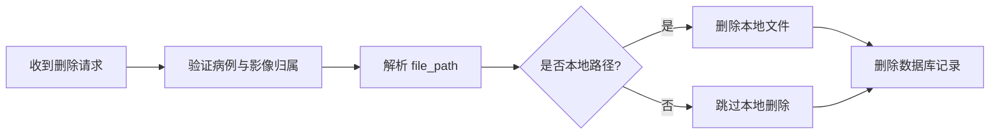

# 影像管理API

> **本文档引用文件**
> - [studies.js](file://server/routes/studies.js)
> - [studyImageStorage.service.js](file://server/services/studyImageStorage.service.js)
> - [StudyImage.js](file://server/models/StudyImage.js)

## 简介

本文档说明当前病例影像上传、同步与删除的真实行为。当前实现的关键特征是：

- 上传时使用内存缓冲区接收文件
- 先本地持久化到 `server/uploads/studies`
- 提交事务后异步同步图仓
- 同步失败时保留本地路径，不影响主响应

## 上传影像

### POST /api/studies/:id/images

- 文件格式：JPEG、PNG、TIFF、BMP
- 单文件最大：20MB
- 单次最多：10 张
- 需要登录，且非管理员只能上传到自己的病例

```mermaid
flowchart TD
  A[接收 images[]] --> B[校验病例与权限]
  B --> C[persistStudyImage 本地持久化]
  C --> D[写入 StudyImage]
  D --> E[提交事务]
  E --> F[异步 syncStudyImageToTucang]
  F --> G{同步成功?}
  G -->|是| H[file_path 更新为远程 URL]
  G -->|否| I[保留本地路径并记录警告]
```

### 响应口径

- `file_path` 可能是：
  - 本地相对路径，如 `/uploads/studies/...`
  - 图仓远程 URL，如 `https://img1.tucang.cc/...`
- `upload_status` 默认先写入 `pending`
- 图仓同步成功后会更新为 `completed`

```json
{
  "success": true,
  "message": "成功上传 2 个影像文件",
  "data": {
    "images": [
      {
        "original_filename": "image1.jpg",
        "stored_filename": "study-1741512345-123456789-image1.jpg",
        "file_path": "https://img1.tucang.cc/...",
        "upload_status": "completed"
      }
    ]
  }
}
```

## 删除影像

删除接口会优先尝试删除本地文件；若 `file_path` 已是远程 URL，则不会误删非本地资源。



## 存储服务职责

`studyImageStorage.service.js` 当前负责：

- `persistStudyImage(...)`
- `syncStudyImageToTucang(...)`
- `prepareStudyImageForAnalysis(...)`
- `serializeStudyImageForResponse(...)`
- `removeStudyImageFile(...)`

## 兼容性说明

- 文档不再假设上传成功后一定立即得到远程 URL
- 分析和列表接口都必须兼容“本地路径 / 远程 URL”双形态
