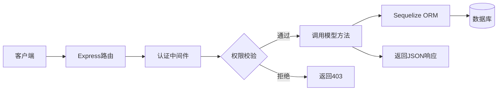
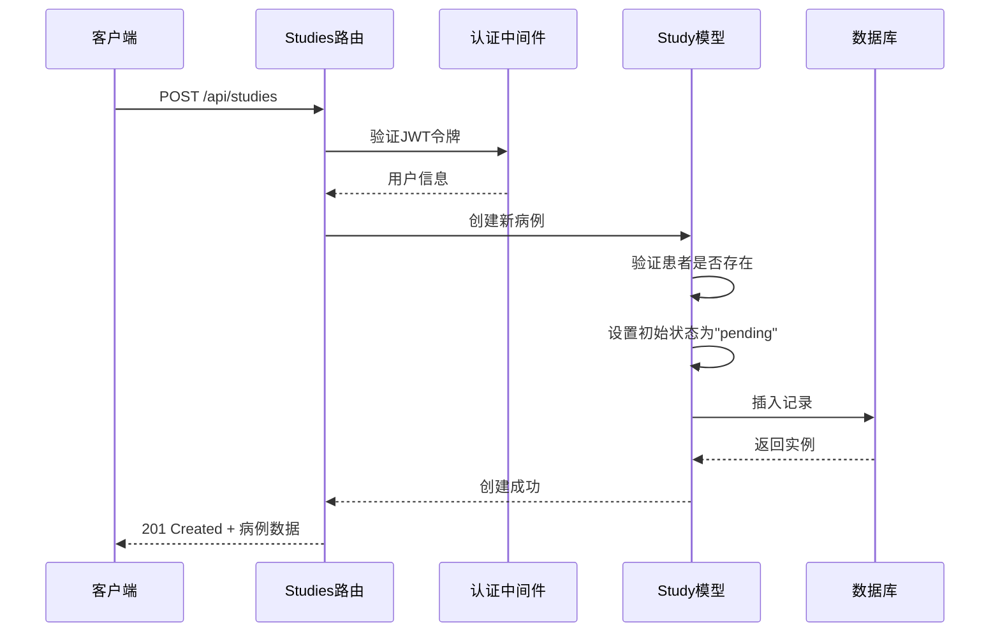
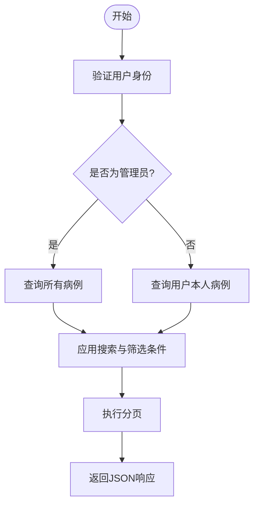
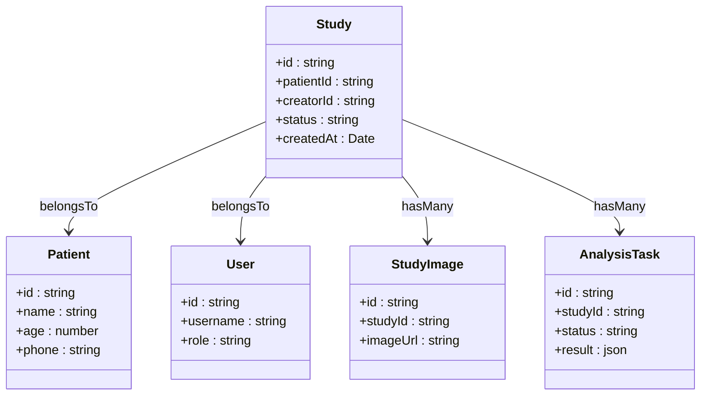
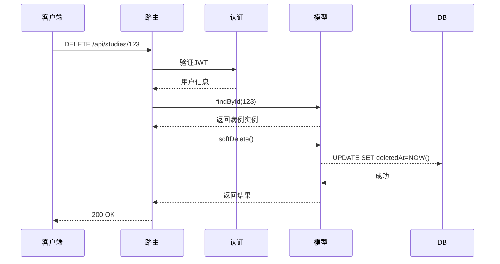
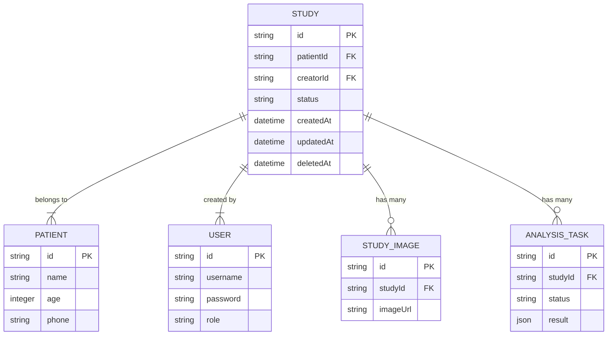

# 病例管理API

<cite>
**本文档中引用的文件**  
- [studies.js](file://server/routes/studies.js)
- [Study.js](file://server/models/Study.js)
- [Patient.js](file://server/models/Patient.js)
- [AnalysisTask.js](file://server/models/AnalysisTask.js)
- [StudyImage.js](file://server/models/StudyImage.js)
- [User.js](file://server/models/User.js)
- [auth.js](file://server/middleware/auth.js)
- [index.js](file://server/models/index.js)
</cite>

## 目录
1. [简介](#简介)
2. [项目结构](#项目结构)
3. [核心组件](#核心组件)
4. [架构概述](#架构概述)
5. [详细组件分析](#详细组件分析)
6. [依赖分析](#依赖分析)
7. [性能考虑](#性能考虑)
8. [故障排除指南](#故障排除指南)
9. [结论](#结论)

## 简介
本API文档详细描述了CervixDetectAI系统中病例管理模块的核心功能，涵盖病例的创建、查询、更新和删除操作。系统通过RESTful接口实现对病例（Study）的全生命周期管理，支持患者关联验证、权限控制、级联数据加载、软删除等关键业务逻辑。API设计遵循标准HTTP语义，结合JWT身份认证机制，确保数据安全与访问控制。

## 项目结构
系统采用前后端分离架构，后端基于Node.js + Express + Sequelize实现，前端使用Vue 3 + Quasar构建。服务端路由、模型、中间件分层清晰，便于维护与扩展。

```mermaid
graph TB
subgraph "Server"
routes[路由目录] --> models[模型目录]
routes --> middleware[中间件]
models --> sequelize[Sequelize ORM]
middleware --> jwt[JWT认证]
end
subgraph "Client"
pages[页面组件] --> stores[状态管理]
stores --> api[API服务]
api --> server[后端API]
end
Client < --> Server
```

**Diagram sources**  
- [server/routes/studies.js](file://server/routes/studies.js#L1-L100)
- [server/models/Study.js](file://server/models/Study.js#L1-L50)

**Section sources**  
- [server/routes/studies.js](file://server/routes/studies.js#L1-L100)
- [server/models/Study.js](file://server/models/Study.js#L1-L50)

## 核心组件
核心功能由`studies.js`路由文件与`Study.js`模型文件共同实现。路由层负责请求处理与响应，模型层定义数据结构与业务逻辑。权限控制通过`auth.js`中间件实现，确保只有授权用户可访问敏感操作。

**Section sources**  
- [server/routes/studies.js](file://server/routes/studies.js#L10-L200)
- [server/models/Study.js](file://server/models/Study.js#L5-L80)
- [server/middleware/auth.js](file://server/middleware/auth.js#L5-L40)

## 架构概述
系统采用典型的MVC模式，Express路由接收HTTP请求，调用模型方法处理业务逻辑，通过Sequelize与数据库交互。JWT用于用户身份认证，权限判断基于用户角色（普通用户/管理员）动态控制数据访问范围。



**Diagram sources**  
- [server/routes/studies.js](file://server/routes/studies.js#L1-L20)
- [server/middleware/auth.js](file://server/middleware/auth.js#L1-L15)

## 详细组件分析

### 病例创建 (POST /api/studies)
处理新病例的创建请求，包含患者关联验证、权限控制与状态初始化。

#### 请求流程


**Diagram sources**  
- [server/routes/studies.js](file://server/routes/studies.js#L25-L60)
- [server/models/Study.js](file://server/models/Study.js#L30-L70)

**Section sources**  
- [server/routes/studies.js](file://server/routes/studies.js#L20-L70)
- [server/models/Study.js](file://server/models/Study.js#L20-L80)

### 病例列表查询 (GET /api/studies)
支持分页、搜索与多条件筛选，管理员可查看所有数据，普通用户仅限本人创建的病例。

#### 数据过滤逻辑


**Diagram sources**  
- [server/routes/studies.js](file://server/routes/studies.js#L75-L110)
- [server/models/Study.js](file://server/models/Study.js#L85-L100)

**Section sources**  
- [server/routes/studies.js](file://server/routes/studies.js#L70-L120)

### 病例详情获取 (GET /api/studies/:id)
加载指定病例的完整信息，包括患者、创建者、影像文件和分析任务等关联数据。

#### 级联数据加载


**Diagram sources**  
- [server/models/Study.js](file://server/models/Study.js#L15-L40)
- [server/models/Patient.js](file://server/models/Patient.js#L5-L20)
- [server/models/StudyImage.js](file://server/models/StudyImage.js#L5-L15)
- [server/models/AnalysisTask.js](file://server/models/AnalysisTask.js#L5-L20)

**Section sources**  
- [server/routes/studies.js](file://server/routes/studies.js#L125-L150)

### 病例更新 (PUT /api/studies/:id)
支持字段部分更新，仅修改请求中提供的字段，保留其他原有值。

**Section sources**  
- [server/routes/studies.js](file://server/routes/studies.js#L155-L180)

### 病例删除 (DELETE /api/studies/:id)
实现软删除机制，将`deletedAt`字段设置为当前时间戳，而非物理删除记录。

#### 删除流程


**Diagram sources**  
- [server/routes/studies.js](file://server/routes/studies.js#L185-L210)
- [server/models/Study.js](file://server/models/Study.js#L105-L115)

**Section sources**  
- [server/routes/studies.js](file://server/routes/studies.js#L180-L215)

## 依赖分析
系统依赖Sequelize ORM进行数据库操作，通过外键约束维护数据完整性。各模型间通过关联定义（belongsTo, hasMany）建立关系，确保级联查询与数据一致性。



**Diagram sources**  
- [server/models/Study.js](file://server/models/Study.js#L15-L40)
- [server/models/Patient.js](file://server/models/Patient.js#L5-L20)
- [server/models/User.js](file://server/models/User.js#L5-L25)
- [server/models/StudyImage.js](file://server/models/StudyImage.js#L5-L15)
- [server/models/AnalysisTask.js](file://server/models/AnalysisTask.js#L5-L20)

**Section sources**  
- [server/models/index.js](file://server/models/index.js#L10-L50)

## 性能考虑
- 使用Sequelize的`include`选项进行关联查询，减少数据库往返次数
- 对常用查询字段（如`patientId`, `creatorId`, `status`）建立数据库索引
- 分页查询限制单页返回数量，避免内存溢出
- JWT令牌包含用户角色信息，避免每次请求都查询数据库获取权限

## 故障排除指南
常见问题包括权限不足、患者不存在、病例ID无效等。建议检查：
- JWT令牌是否有效且未过期
- 请求用户是否有权操作目标资源
- 关联的患者ID是否存在于数据库中
- 软删除的病例在常规查询中不可见

**Section sources**  
- [server/middleware/auth.js](file://server/middleware/auth.js#L20-L50)
- [server/routes/studies.js](file://server/routes/studies.js#L50-L60)

## 结论
该API设计合理，功能完整，具备良好的安全性与可扩展性。通过清晰的权限控制与数据关联机制，满足了病例管理的核心业务需求。建议后续增加操作日志记录与更细粒度的权限控制。