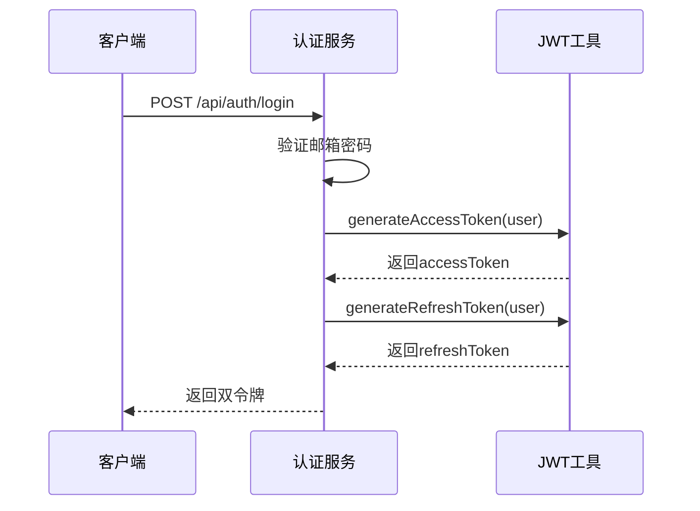

# 邮箱认证API

> **本文档引用文件**  
> - [auth.js](file://server/routes/auth.js)
> - [auth.js](file://server/middleware/auth.js)
> - [User.js](file://server/models/User.js)
> - [jwt.js](file://server/utils/jwt.js)
> - [apiService.ts](file://src/services/apiService.ts)

## 目录
1. [简介](#简介)
2. [核心端点说明](#核心端点说明)
3. [用户注册机制详解](#用户注册机制详解)
4. [登录与账号状态检查](#登录与账号状态检查)
5. [JWT双令牌机制](#jwt双令牌机制)
6. [获取当前用户信息流程](#获取当前用户信息流程)
7. [前端调用示例与安全策略](#前端调用示例与安全策略)
8. [错误码汇总](#错误码汇总)

## 简介
本API文档详细描述了基于JWT的邮箱认证系统，涵盖用户注册、登录、令牌刷新、登出及获取当前用户信息等核心功能。系统采用双令牌机制（accessToken + refreshToken），结合Sequelize ORM与bcrypt密码加密，确保用户身份验证的安全性与可靠性。

## 核心端点说明

### 注册 (/api/auth/register)
- **HTTP方法**: POST
- **请求体结构**:
  ```json
  {
    "username": "可选用户名",
    "email": "必填邮箱",
    "password": "必填密码（至少6位）",
    "real_name": "真实姓名（可选）",
    "phone": "手机号（可选）"
  }
  ```
- **成功响应**:
  - 状态码: 201 Created
  - 响应体包含用户信息、accessToken和refreshToken
- **失败状态码**:
  - 400: 参数缺失或格式错误
  - 409: 邮箱或用户名已存在

### 登录 (/api/auth/login)
- **HTTP方法**: POST
- **请求体结构**:
  ```json
  {
    "email": "用户邮箱",
    "password": "用户密码"
  }
  ```
- **成功响应**:
  - 状态码: 200 OK
  - 返回用户信息及双令牌
- **失败状态码**:
  - 400: 缺少必要字段
  - 401: 邮箱或密码错误
  - 403: 账号未激活或被禁用

### 刷新令牌 (/api/auth/refresh)
- **HTTP方法**: POST
- **请求体结构**:
  ```json
  {
    "refreshToken": "有效的刷新令牌"
  }
  ```
- **成功响应**:
  - 状态码: 200 OK
  - 返回新的accessToken
- **失败状态码**:
  - 400: 未提供refreshToken
  - 401: 令牌无效、过期或类型错误

### 登出 (/api/auth/logout)
- **HTTP方法**: POST
- **认证要求**: 需携带有效的accessToken
- **说明**: 客户端负责清除本地存储的token，服务端不维护黑名单
- **响应**: 仅记录登出行为，无实际token失效操作

### 获取当前用户信息 (/api/auth/me)
- **HTTP方法**: GET
- **认证要求**: 需携带有效的accessToken
- **成功响应**:
  - 状态码: 200 OK
  - 返回当前认证用户完整信息（不含密码哈希）
- **失败状态码**:
  - 401: 未提供或无效令牌
  - 500: 服务器内部错误

## 用户注册机制详解

### 邮箱唯一性校验
在注册过程中，系统通过`User.findOne({ where: { email } })`查询数据库，确保邮箱地址的唯一性。若已存在相同邮箱的用户，则返回409冲突状态码。

### 密码加密机制 (beforeSave hook)
用户密码在保存前通过bcrypt进行哈希加密：
- 使用`beforeSave`钩子自动处理密码加密
- 仅当`password_hash`字段被修改且未以`$2`开头（bcrypt标识）时执行加密
- 加密强度为10轮salt生成

**Section sources**
- [User.js](file://server/models/User.js#L100-L106)
- [auth.js](file://server/routes/auth.js#L67-L75)

## 登录与账号状态检查

### 登录流程
1. 根据邮箱查找用户
2. 使用`validatePassword`实例方法比对密码
3. 检查账号状态（active/inactive/suspended）
4. 更新最后登录时间
5. 生成并返回双令牌

### 账号状态逻辑
- `active`: 正常可用，允许登录
- `inactive`: 未激活状态，禁止登录（返回403）
- `suspended`: 已禁用状态，禁止登录（返回403）

**Section sources**
- [auth.js](file://server/routes/auth.js#L124-L158)
- [User.js](file://server/models/User.js#L48-L52)

## JWT双令牌机制

### 令牌生成逻辑
| 令牌类型 | 有效时间 | 包含信息 | 用途 |
|--------|--------|--------|------|
| accessToken | 1小时（可配置） | userId, username, email, role, type='access' | 每次请求的身份验证 |
| refreshToken | 7天（可配置） | userId, type='refresh' | 在accessToken过期后获取新令牌 |

### 令牌管理函数
- `generateAccessToken(user)`: 创建短期访问令牌
- `generateRefreshToken(user)`: 创建长期刷新令牌
- `verifyToken(token)`: 验证令牌有效性并返回解码结果
- `extractToken(req)`: 从Authorization头提取Bearer令牌



**Diagram sources**
- [jwt.js](file://server/utils/jwt.js#L12-L38)
- [auth.js](file://server/routes/auth.js#L78-L80)

## 获取当前用户信息流程

### authenticate中间件工作流程
1. 从请求头提取Bearer令牌
2. 验证令牌有效性及类型（必须为'access'）
3. 根据解码后的userId查询用户
4. 排除`password_hash`字段返回用户数据
5. 将用户对象挂载到`req.user`
6. 执行后续路由处理

### /auth/me端点实现
- 使用`authenticate`中间件保护路由
- 直接从`req.user`读取已挂载的用户信息
- 返回标准化的用户数据结构

```mermaid
sequenceDiagram
participant Client as 客户端
participant Middleware as authenticate中间件
participant DB as 数据库
Client->>Middleware : GET /api/auth/me
Middleware->>Middleware : extractToken(req)
Middleware->>Middleware : verifyToken(token)
Middleware->>DB : User.findByPk(decoded.userId)
DB-->>Middleware : 返回用户排除password_hash
Middleware->>Middleware : req.user = user
Middleware->>Client : 调用路由处理器
Client<<--Client : 返回用户信息
```

**Diagram sources**
- [auth.js](file://server/middleware/auth.js#L8-L58)
- [auth.js](file://server/routes/auth.js#L277-L294)

## 前端调用示例与安全策略

### 安全传输与存储策略
- **传输安全**: 所有认证请求必须通过HTTPS
- **存储安全**:
  - `accessToken`: 存储于内存或临时状态管理中，避免持久化
  - `refreshToken`: 可存储于HttpOnly Cookie或安全的本地存储中
- **令牌使用**: 每次请求将accessToken放入Authorization头

### 前端API调用模式
虽然`apiService.ts`主要包含图像上传相关接口，但其axios实例配置体现了统一的安全实践：
- 基础URL通过环境变量注入
- 请求/响应拦截器用于日志记录
- 统一的错误处理机制

**Section sources**
- [apiService.ts](file://src/services/apiService.ts#L1-L39)
- [jwt.js](file://server/utils/jwt.js#L54-L60)

## 错误码汇总

| HTTP状态码 | 错误类型 | 说明 |
|----------|--------|------|
| 400 | Bad Request | 参数缺失或格式错误 |
| 401 | Unauthorized | 令牌缺失、无效或认证失败 |
| 403 | Forbidden | 权限不足或账号状态异常 |
| 409 | Conflict | 资源冲突（如邮箱已注册） |
| 500 | Internal Server Error | 服务器内部错误 |

**Section sources**
- [auth.js](file://server/routes/auth.js#L23-L34)
- [auth.js](file://server/middleware/auth.js#L13-L25)