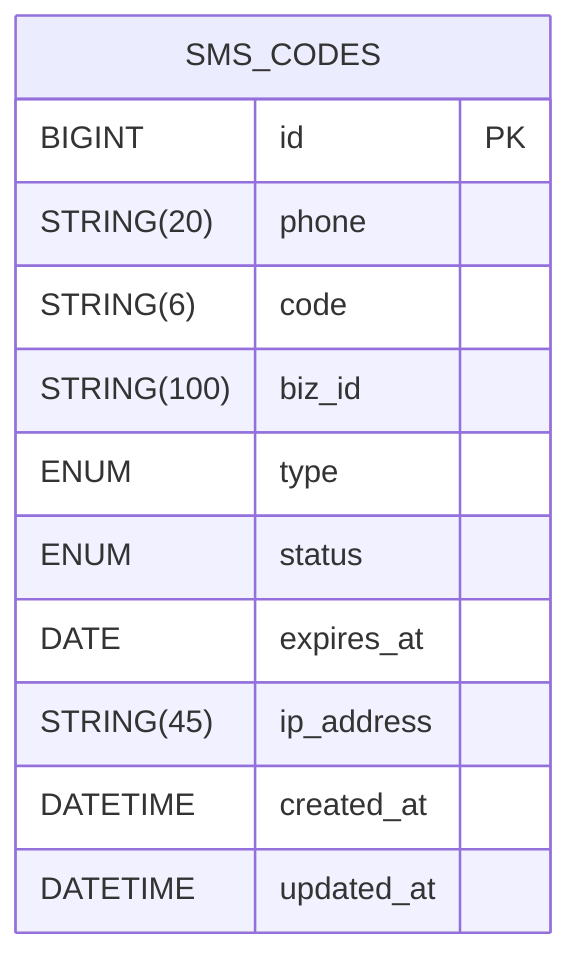
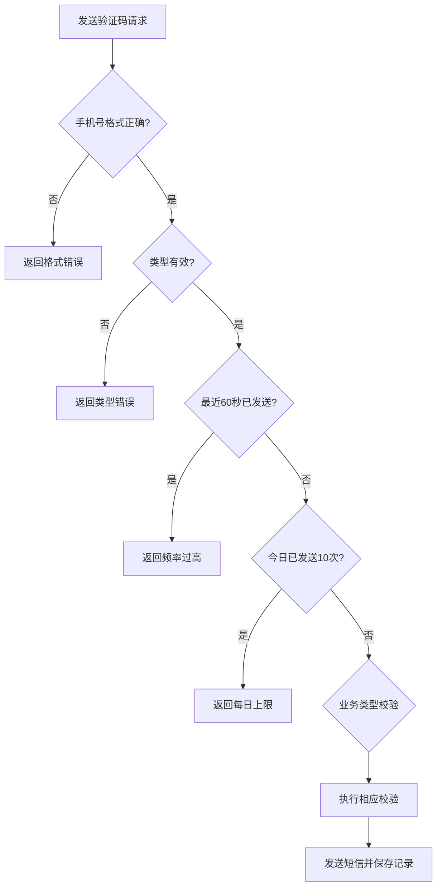
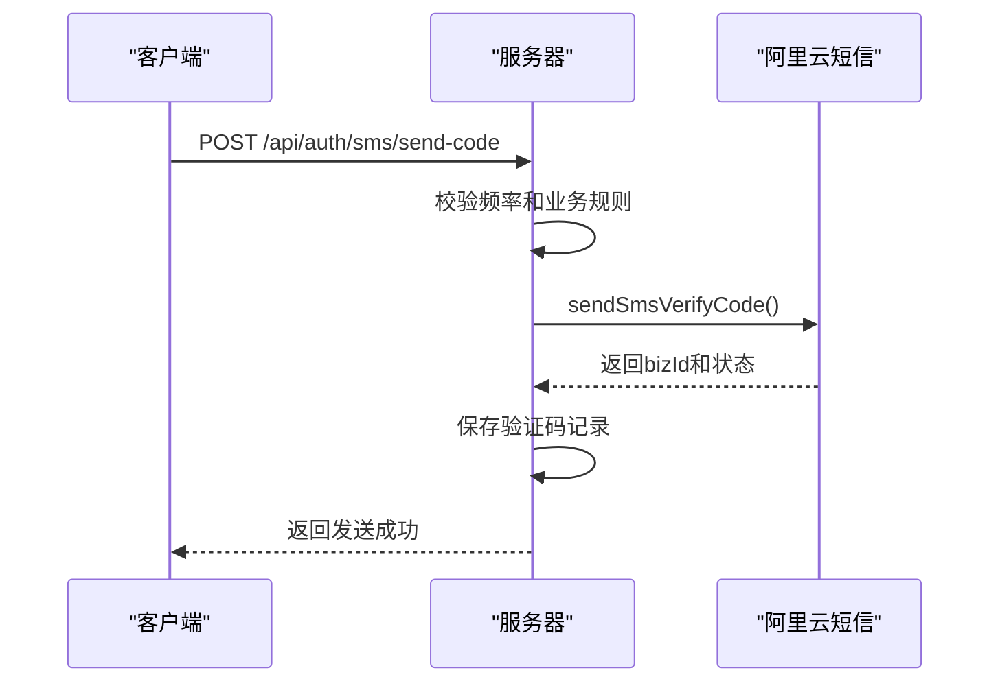
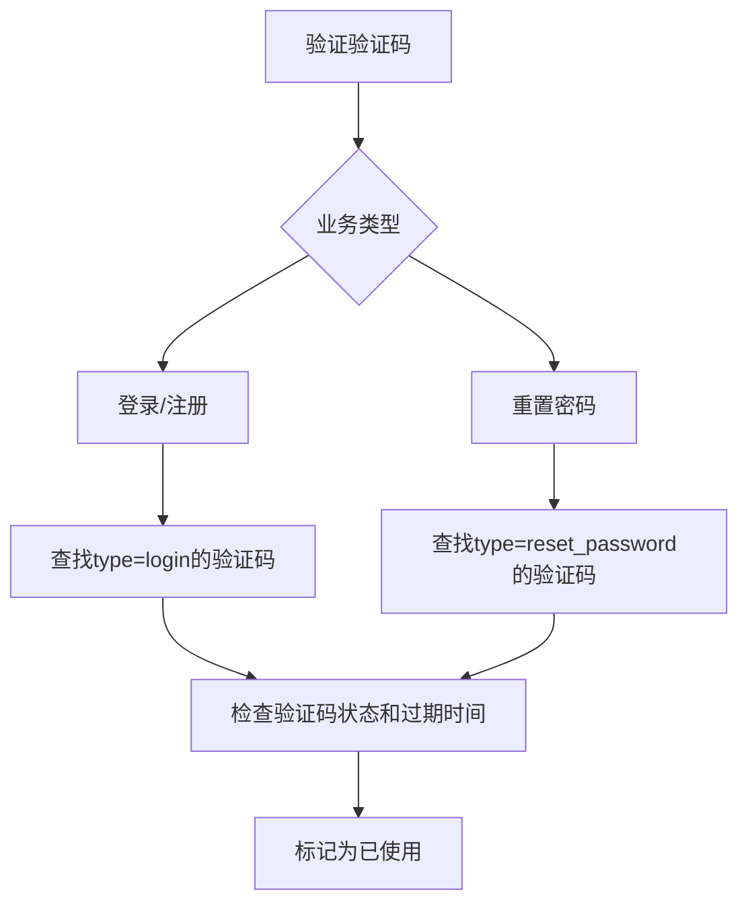

# 短信认证API

<cite>
**Referenced Files in This Document**   
- [sms-auth.js](file://server/routes/sms-auth.js)
- [SmsCode.js](file://server/models/SmsCode.js)
- [sms.service.js](file://server/services/sms.service.js)
- [.env](file://server/.env)
- [User.js](file://server/models/User.js)
- [jwt.js](file://server/utils/jwt.js)
- [api.ts](file://src/services/api.ts)
- [authStore.ts](file://src/stores/authStore.ts)
- [LoginPage.vue](file://src/pages/LoginPage.vue)
</cite>

## 目录
1. [简介](#简介)
2. [核心端点](#核心端点)
3. [验证码模型](#验证码模型)
4. [频率控制策略](#频率控制策略)
5. [短信服务集成](#短信服务集成)
6. [业务逻辑流程](#业务逻辑流程)
7. [请求/响应示例](#请求响应示例)
8. [前端集成](#前端集成)

## 简介
本API文档详细描述了基于短信验证码的用户认证系统，支持发送验证码、短信登录、短信注册和重置密码四大核心功能。系统通过阿里云短信服务实现验证码的发送，并结合数据库持久化存储验证码记录，确保认证过程的安全性和可靠性。整个流程遵循RESTful设计原则，提供清晰的错误码和响应结构，便于客户端集成和用户体验优化。

**Section sources**
- [sms-auth.js](file://server/routes/sms-auth.js#L1-L492)

## 核心端点

### 发送验证码 (/api/auth/sms/send-code)
该端点用于向指定手机号发送短信验证码。根据业务类型（登录、注册、重置密码）执行不同的前置校验逻辑，并应用频率控制策略。

### 短信登录 (/api/auth/sms/login)
实现基于短信验证码的用户登录功能。系统验证验证码的有效性后，为已注册用户生成JWT访问令牌和刷新令牌。

### 短信注册 (/api/auth/sms/register)
提供短信验证码注册功能。对于新用户，系统将创建账户并生成临时邮箱和随机密码，同时返回认证令牌。

### 重置密码 (/api/auth/sms/reset-password)
允许用户通过短信验证码重置密码。在验证验证码后，系统更新用户的密码哈希值。

**Section sources**
- [sms-auth.js](file://server/routes/sms-auth.js#L22-L490)

## 验证码模型

### SmsCode 数据模型
`SmsCode` 模型用于持久化存储所有短信验证码记录，包含以下关键字段：

| 字段名 | 类型 | 说明 |
|--------|------|------|
| phone | STRING(20) | 接收验证码的手机号 |
| code | STRING(6) | 6位数字验证码 |
| biz_id | STRING(100) | 阿里云短信业务ID，用于追踪短信发送状态 |
| type | ENUM | 验证码类型：login, register, reset_password |
| status | ENUM | 状态：pending(待使用), used(已使用), expired(已过期) |
| expires_at | DATE | 验证码过期时间 |
| ip_address | STRING(45) | 请求来源IP地址 |



**Diagram sources **
- [SmsCode.js](file://server/models/SmsCode.js#L4-L70)

**Section sources**
- [SmsCode.js](file://server/models/SmsCode.js#L4-L70)

## 频率控制策略

系统实施多层频率控制策略，防止滥用和恶意攻击：

### 常量配置
```javascript
// 验证码有效期（分钟）
const CODE_EXPIRE_MINUTES = 5;

// 同一手机号发送间隔（秒）
const SEND_INTERVAL_SECONDS = 60;

// 每日同一手机号最大发送次数
const MAX_DAILY_SEND_COUNT = 10;
```

### 控制逻辑
1. **发送间隔控制**：检查最近60秒内是否已发送过验证码
2. **每日上限控制**：统计当天发送次数，限制最多10次
3. **业务类型校验**：
   - 注册：检查手机号是否已存在
   - 重置密码：检查手机号是否已注册
   - 登录：不检查手机号存在性，支持登录/注册通用流程



**Diagram sources **
- [sms-auth.js](file://server/routes/sms-auth.js#L53-L92)

**Section sources**
- [sms-auth.js](file://server/routes/sms-auth.js#L15-L20)

## 短信服务集成

### 阿里云短信服务配置
系统通过环境变量配置阿里云短信服务参数：

```env
# 阿里云短信服务配置
ALIYUN_ACCESS_KEY_ID=LTAI5tLyMFsuzE9hpGijaz9K
ALIYUN_ACCESS_KEY_SECRET=XqnPIZ36pux2MPLqxHqaG7NY5lJlIt
ALIYUN_SMS_SIGN_NAME=速通互联验证码
ALIYUN_SMS_TEMPLATE_CODE=100001
```

### 验证码发送流程
1. 系统自动生成6位数字验证码
2. 调用阿里云API发送短信，包含验证码和有效期参数
3. 接收阿里云返回的`bizId`（业务ID）用于后续追踪
4. 将验证码、`bizId`和元数据保存到数据库



**Diagram sources **
- [sms.service.js](file://server/services/sms.service.js#L48-L112)
- [.env](file://server/.env#L29-L33)

**Section sources**
- [sms.service.js](file://server/services/sms.service.js#L48-L112)
- [.env](file://server/.env#L29-L33)

## 业务逻辑流程

### 短信注册特殊处理
当用户通过短信注册时，系统会应用以下特殊逻辑：

1. **临时邮箱生成**：若未提供邮箱，则生成格式为 `${phone}@temp.local` 的临时邮箱
2. **随机密码处理**：使用bcrypt哈希算法生成随机密码，确保账户安全
3. **自动登录**：注册成功后立即返回JWT令牌，实现无缝登录体验

```javascript
// 短信注册时的用户创建逻辑
const user = await User.create({
  username: username || `user_${phone}`,
  email: email || `${phone}@temp.local`, // 临时邮箱
  password_hash: await require('bcrypt').hash(Math.random().toString(36), 10), // 随机密码
  phone,
  role: 'user',
  status: 'active'
});
```

### 不同业务类型的验证码验证
系统根据业务类型采用差异化的验证码验证逻辑：

| 业务类型 | 验证码类型 | 用户存在性检查 | 备注 |
|---------|-----------|---------------|------|
| 登录 | login | 必须存在 | 检查账号状态 |
| 注册 | login | 必须不存在 | 与登录共用类型 |
| 重置密码 | reset_password | 必须存在 | 允许修改密码 |



**Section sources**
- [sms-auth.js](file://server/routes/sms-auth.js#L362-L364)
- [User.js](file://server/models/User.js#L88-L91)

## 请求/响应示例

### 发送验证码请求
```json
POST /api/auth/sms/send-code
{
  "phone": "13800138000",
  "type": "login"
}
```

### 发送验证码响应
```json
{
  "success": true,
  "message": "验证码已发送",
  "data": {
    "expiresIn": 300
  }
}
```

### 短信登录请求
```json
POST /api/auth/sms/login
{
  "phone": "13800138000",
  "code": "123456"
}
```

### 短信登录响应
```json
{
  "success": true,
  "message": "登录成功",
  "data": {
    "user": {
      "id": 1,
      "username": "user_13800138000",
      "email": "13800138000@temp.local",
      "phone": "13800138000",
      "role": "user"
    },
    "accessToken": "eyJhbGciOiJIUzI1NiIs...",
    "refreshToken": "eyJhbGciOiJIUzI1NiIs..."
  }
}
```

**Section sources**
- [sms-auth.js](file://server/routes/sms-auth.js#L149-L155)
- [sms-auth.js](file://server/routes/sms-auth.js#L244-L260)

## 前端集成

### API调用封装
前端通过`api.ts`文件封装了所有短信认证相关的API调用：

```typescript
// 短信验证相关接口
export const authAPI = {
  async sendSmsCode(phone: string, type: 'login' | 'register' | 'reset_password' = 'login') {
    const { data } = await apiClient.post('/auth/sms/send-code', { phone, type });
    return data;
  },

  async smsLogin(phone: string, code: string) {
    const { data } = await apiClient.post('/auth/sms/login', { phone, code });
    return data;
  },

  async smsRegister(
    phone: string,
    code: string,
    userData?: { username?: string; real_name?: string; email?: string },
  ) {
    const { data } = await apiClient.post('/auth/sms/register', { phone, code, ...userData });
    return data;
  },
};
```

### 状态管理
使用Pinia进行状态管理，`authStore.ts`处理认证状态的持久化：

```typescript
// 短信登录
async smsLogin(phone: string, code: string) {
  this.isAuthenticating = true;
  try {
    const response = await authAPI.smsLogin(phone, code);
    
    if (response.success) {
      this.token = response.data.accessToken;
      this.refreshToken = response.data.refreshToken;
      this.user = response.data.user;
      this.isAuthenticated = true;
      
      // 持久化到localStorage
      localStorage.setItem('accessToken', response.data.accessToken);
      localStorage.setItem('refreshToken', response.data.refreshToken);
      localStorage.setItem('user', JSON.stringify(response.data.user));
      
      return { success: true };
    }
  } catch (error: any) {
    return { success: false, error: error.response?.data?.message || '短信登录失败' };
  } finally {
    this.isAuthenticating = false;
  }
}
```

### 登录页面实现
`LoginPage.vue`实现了短信登录/注册的UI和交互逻辑，包括倒计时、格式验证和自动注册功能。

```mermaid
flowchart TD
A[用户输入手机号] --> B{手机号格式正确?}
B --> |否| C[显示格式错误]
B --> |是| D[显示获取验证码按钮]
D --> E[用户点击获取验证码]
E --> F[调用sendSmsCode]
F --> G{发送成功?}
G --> |否| H[显示发送失败]
G --> |是| I[启动60秒倒计时]
I --> J[用户输入验证码]
J --> K[点击登录/注册]
K --> L[调用smsLogin]
L --> M{登录成功?}
M --> |否| N{提示"未注册"?}
N --> |是| O[自动调用smsRegister]
N --> |否| P[显示登录失败]
O --> Q{注册成功?}
Q --> |是| R[跳转到应用]
Q --> |否| S[显示注册失败]
```

**Diagram sources **
- [api.ts](file://src/services/api.ts#L98-L116)
- [authStore.ts](file://src/stores/authStore.ts#L98-L156)
- [LoginPage.vue](file://src/pages/LoginPage.vue#L185-L329)

**Section sources**
- [api.ts](file://src/services/api.ts#L98-L121)
- [authStore.ts](file://src/stores/authStore.ts#L98-L156)
- [LoginPage.vue](file://src/pages/LoginPage.vue#L185-L329)