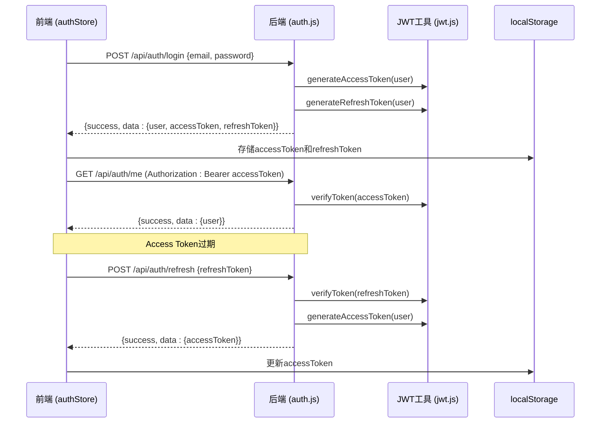
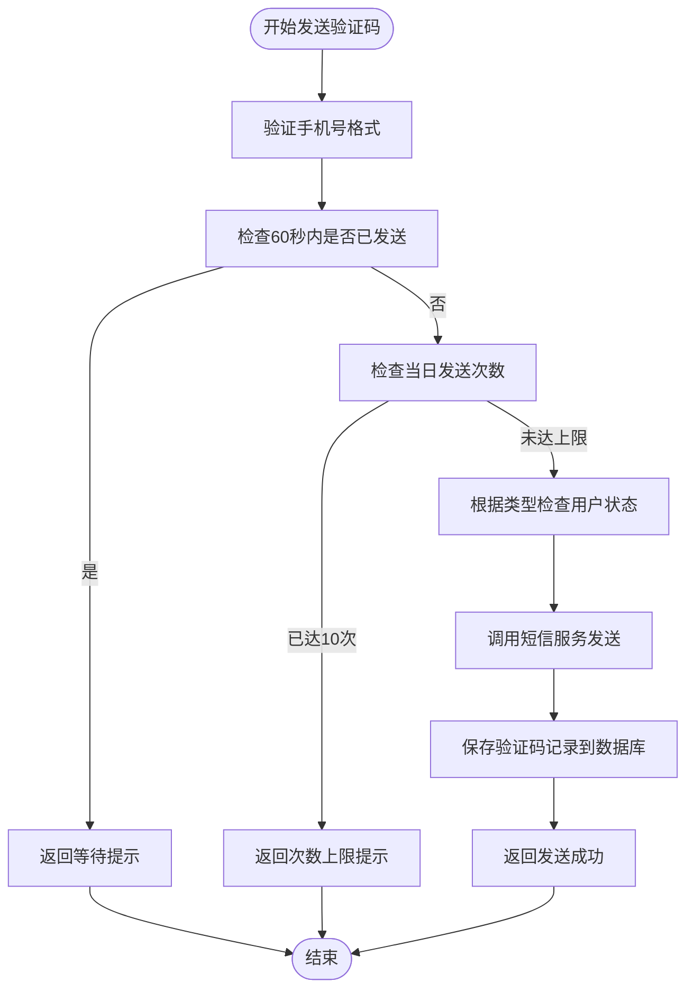

# 认证API

<cite>
**本文档引用文件**   
- [auth.js](file://server/routes/auth.js)
- [sms-auth.js](file://server/routes/sms-auth.js)
- [jwt.js](file://server/utils/jwt.js)
- [authStore.ts](file://src/stores/authStore.ts)
- [api.ts](file://src/services/api.ts)
- [auth.js](file://server/middleware/auth.js)
- [SmsCode.js](file://server/models/SmsCode.js)
</cite>

## 目录
1. [简介](#简介)
2. [JWT双令牌机制](#jwt双令牌机制)
3. [短信验证码频率限制](#短信验证码频率限制)
4. [邮箱/手机号注册](#邮箱手机号注册)
5. [邮箱/手机号登录](#邮箱手机号登录)
6. [JWT令牌刷新](#jwt令牌刷新)
7. [用户登出](#用户登出)
8. [获取当前用户信息](#获取当前用户信息)
9. [发送短信验证码](#发送短信验证码)
10. [短信登录](#短信登录)
11. [短信注册](#短信注册)
12. [通过短信重置密码](#通过短信重置密码)

## 简介
本API文档详细描述了CervixDetectAI系统的认证功能，涵盖基于邮箱/手机号的注册与登录、JWT双令牌认证机制、以及完整的短信验证码功能。系统通过`/api/auth`前缀的端点提供所有认证服务，包括注册、登录、令牌刷新、登出和用户信息获取。同时，通过`/api/auth/sms`前缀的端点提供短信验证码的发送、登录、注册和密码重置功能。所有敏感操作均受JWT令牌保护，前端通过`Authorization: Bearer <token>`头进行认证。

**Section sources**
- [auth.js](file://server/routes/auth.js#L1-L306)
- [sms-auth.js](file://server/routes/sms-auth.js#L1-L492)
- [api.ts](file://src/services/api.ts#L66-L121)

## JWT双令牌机制
系统采用JWT双令牌（Access Token和Refresh Token）机制来平衡安全性和用户体验。Access Token有效期较短（默认1小时），用于访问受保护的API资源。Refresh Token有效期较长（默认7天），仅用于获取新的Access Token，不用于API调用。当Access Token过期时，前端会自动使用Refresh Token向`/api/auth/refresh`端点请求新的Access Token，从而实现无感刷新，避免用户频繁重新登录。



**Diagram sources **
- [auth.js](file://server/routes/auth.js#L112-L242)
- [jwt.js](file://server/utils/jwt.js#L12-L48)
- [authStore.ts](file://src/stores/authStore.ts#L48-L62)

## 短信验证码频率限制
为防止短信服务被滥用，系统对短信验证码的发送实施了严格的频率限制策略：
- **发送间隔**：同一手机号60秒内只能发送一次验证码。
- **每日上限**：同一手机号每天最多可发送10次验证码。
- **类型区分**：支持`login`、`register`、`reset_password`三种验证码类型，分别用于登录、注册和重置密码。



**Diagram sources **
- [sms-auth.js](file://server/routes/sms-auth.js#L26-L92)
- [SmsCode.js](file://server/models/SmsCode.js#L1-L73)

## 邮箱/手机号注册
用于创建新用户账户。

**HTTP方法**: `POST`
**URL路径**: `/api/auth/register`

**请求头**
- `Content-Type: application/json`

**请求参数**
- 无URL参数。

**请求体 (JSON Schema)**
```json
{
  "email": "string, 必填, 邮箱地址",
  "password": "string, 必填, 密码 (至少6位)",
  "real_name": "string, 可选, 真实姓名",
  "phone": "string, 可选, 手机号"
}
```

**响应体 (JSON Schema)**
```json
{
  "success": "boolean",
  "message": "string",
  "data": {
    "user": {
      "id": "number",
      "username": "string",
      "email": "string",
      "real_name": "string",
      "role": "string",
      "status": "string"
    },
    "accessToken": "string",
    "refreshToken": "string"
  }
}
```

**可能的HTTP状态码及错误信息**
- `201 Created`: 注册成功。
- `400 Bad Request`: 请求参数错误（如邮箱/密码为空、密码过短、邮箱格式错误）。
- `409 Conflict`: 邮箱或用户名已被注册。
- `500 Internal Server Error`: 服务器内部错误。

**前端调用示例**
```typescript
const response = await authAPI.register({
  email: 'user@example.com',
  password: 'password123',
  real_name: '张三'
});
```

**Section sources**
- [auth.js](file://server/routes/auth.js#L17-L106)
- [api.ts](file://src/services/api.ts#L73-L80)

## 邮箱/手机号登录
用于用户使用邮箱和密码登录。

**HTTP方法**: `POST`
**URL路径**: `/api/auth/login`

**请求头**
- `Content-Type: application/json`

**请求参数**
- 无URL参数。

**请求体 (JSON Schema)**
```json
{
  "email": "string, 必填, 邮箱地址",
  "password": "string, 必填, 密码"
}
```

**响应体 (JSON Schema)**
```json
{
  "success": "boolean",
  "message": "string",
  "data": {
    "user": {
      "id": "number",
      "username": "string",
      "email": "string",
      "real_name": "string",
      "role": "string",
      "status": "string",
      "last_login_at": "string"
    },
    "accessToken": "string",
    "refreshToken": "string"
  }
}
```

**可能的HTTP状态码及错误信息**
- `200 OK`: 登录成功。
- `400 Bad Request`: 邮箱或密码为空。
- `401 Unauthorized`: 邮箱或密码错误。
- `403 Forbidden`: 账号未激活或已被禁用。
- `500 Internal Server Error`: 服务器内部错误。

**前端调用示例**
```typescript
const response = await authAPI.login('user@example.com', 'password123');
```

**Section sources**
- [auth.js](file://server/routes/auth.js#L112-L189)
- [api.ts](file://src/services/api.ts#L68-L70)

## JWT令牌刷新
用于使用Refresh Token获取新的Access Token。

**HTTP方法**: `POST`
**URL路径**: `/api/auth/refresh`

**请求头**
- `Content-Type: application/json`

**请求参数**
- 无URL参数。

**请求体 (JSON Schema)**
```json
{
  "refreshToken": "string, 必填, 刷新令牌"
}
```

**响应体 (JSON Schema)**
```json
{
  "success": "boolean",
  "message": "string",
  "data": {
    "accessToken": "string"
  }
}
```

**可能的HTTP状态码及错误信息**
- `200 OK`: 令牌刷新成功。
- `400 Bad Request`: 未提供刷新令牌。
- `401 Unauthorized`: 刷新令牌无效、已过期或类型错误。
- `500 Internal Server Error`: 服务器内部错误。

**前端调用示例**
```typescript
const response = await authAPI.refreshToken('your-refresh-token');
```

**Section sources**
- [auth.js](file://server/routes/auth.js#L195-L249)
- [api.ts](file://src/services/api.ts#L93-L95)
- [authStore.ts](file://src/stores/authStore.ts#L48-L58)

## 用户登出
用于用户登出系统。

**HTTP方法**: `POST`
**URL路径**: `/api/auth/logout`

**请求头**
- `Authorization: Bearer <accessToken>`
- `Content-Type: application/json`

**请求参数**
- 无URL参数。

**请求体 (JSON Schema)**
- 无请求体。

**响应体 (JSON Schema)**
```json
{
  "success": "boolean",
  "message": "string"
}
```

**可能的HTTP状态码及错误信息**
- `200 OK`: 登出成功。
- `401 Unauthorized`: 未提供或提供了无效的Access Token。
- `500 Internal Server Error`: 服务器内部错误。

**前端调用示例**
```typescript
const response = await authAPI.logout();
// 前端还需手动清除本地存储的token
```

**Section sources**
- [auth.js](file://server/routes/auth.js#L256-L271)
- [api.ts](file://src/services/api.ts#L83-L85)
- [authStore.ts](file://src/stores/authStore.ts#L158-L166)

## 获取当前用户信息
用于获取当前已认证用户的信息。

**HTTP方法**: `GET`
**URL路径**: `/api/auth/me`

**请求头**
- `Authorization: Bearer <accessToken>`

**请求参数**
- 无URL参数。

**请求体 (JSON Schema)**
- 无请求体。

**响应体 (JSON Schema)**
```json
{
  "success": "boolean",
  "data": {
    "user": {
      "id": "number",
      "username": "string",
      "email": "string",
      "real_name": "string",
      "phone": "string",
      "role": "string",
      "status": "string",
      "created_at": "string",
      "last_login_at": "string"
    }
  }
}
```

**可能的HTTP状态码及错误信息**
- `200 OK`: 获取信息成功。
- `401 Unauthorized`: 未提供或提供了无效的Access Token。
- `500 Internal Server Error`: 服务器内部错误。

**前端调用示例**
```typescript
const response = await authAPI.getCurrentUser();
```

**Section sources**
- [auth.js](file://server/routes/auth.js#L277-L303)
- [api.ts](file://src/services/api.ts#L88-L90)

## 发送短信验证码
用于向指定手机号发送短信验证码。

**HTTP方法**: `POST`
**URL路径**: `/api/auth/sms/send-code`

**请求头**
- `Content-Type: application/json`

**请求参数**
- 无URL参数。

**请求体 (JSON Schema)**
```json
{
  "phone": "string, 必填, 手机号",
  "type": "string, 可选, 验证码类型 ('login', 'register', 'reset_password'), 默认为 'login'"
}
```

**响应体 (JSON Schema)**
```json
{
  "success": "boolean",
  "message": "string",
  "data": {
    "expiresIn": "number, 验证码有效期（秒）"
  }
}
```

**可能的HTTP状态码及错误信息**
- `200 OK`: 验证码发送成功。
- `400 Bad Request`: 手机号为空或格式错误，验证码类型不正确。
- `429 Too Many Requests`: 发送过于频繁或当日发送次数已达上限。
- `409 Conflict`: 该手机号已被注册（当`type=register`时）。
- `404 Not Found`: 该手机号未注册（当`type=reset_password`时）。
- `500 Internal Server Error`: 服务器内部错误。

**前端调用示例**
```typescript
const response = await authAPI.sendSmsCode('13800138000', 'login');
```

**Section sources**
- [sms-auth.js](file://server/routes/sms-auth.js#L26-L163)
- [api.ts](file://src/services/api.ts#L99-L101)

## 短信登录
用于用户使用手机号和短信验证码登录。

**HTTP方法**: `POST`
**URL路径**: `/api/auth/sms/login`

**请求头**
- `Content-Type: application/json`

**请求参数**
- 无URL参数。

**请求体 (JSON Schema)**
```json
{
  "phone": "string, 必填, 手机号",
  "code": "string, 必填, 验证码"
}
```

**响应体 (JSON Schema)**
```json
{
  "success": "boolean",
  "message": "string",
  "data": {
    "user": {
      "id": "number",
      "username": "string",
      "email": "string",
      "real_name": "string",
      "phone": "string",
      "role": "string",
      "status": "string",
      "last_login_at": "string"
    },
    "accessToken": "string",
    "refreshToken": "string"
  }
}
```

**可能的HTTP状态码及错误信息**
- `200 OK`: 登录成功。
- `400 Bad Request`: 手机号或验证码为空、格式错误，或验证码错误/已过期。
- `404 Not Found`: 该手机号未注册。
- `403 Forbidden`: 账号已被禁用。
- `500 Internal Server Error`: 服务器内部错误。

**前端调用示例**
```typescript
const response = await authAPI.smsLogin('13800138000', '123456');
```

**Section sources**
- [sms-auth.js](file://server/routes/sms-auth.js#L170-L270)
- [api.ts](file://src/services/api.ts#L104-L106)

## 短信注册
用于用户使用手机号和短信验证码注册新账户。

**HTTP方法**: `POST`
**URL路径**: `/api/auth/sms/register`

**请求头**
- `Content-Type: application/json`

**请求参数**
- 无URL参数。

**请求体 (JSON Schema)**
```json
{
  "phone": "string, 必填, 手机号",
  "code": "string, 必填, 验证码",
  "username": "string, 可选, 用户名",
  "real_name": "string, 可选, 真实姓名",
  "email": "string, 可选, 邮箱"
}
```

**响应体 (JSON Schema)**
```json
{
  "success": "boolean",
  "message": "string",
  "data": {
    "user": {
      "id": "number",
      "username": "string",
      "email": "string",
      "real_name": "string",
      "phone": "string",
      "role": "string",
      "status": "string"
    },
    "accessToken": "string",
    "refreshToken": "string"
  }
}
```

**可能的HTTP状态码及错误信息**
- `201 Created`: 注册成功。
- `400 Bad Request`: 手机号或验证码为空、格式错误，或验证码错误/已过期。
- `409 Conflict`: 该手机号或邮箱已被注册。
- `500 Internal Server Error`: 服务器内部错误。

**前端调用示例**
```typescript
const response = await authAPI.smsRegister('13800138000', '123456', {
  real_name: '李四',
  email: 'lisi@example.com'
});
```

**Section sources**
- [sms-auth.js](file://server/routes/sms-auth.js#L276-L404)
- [api.ts](file://src/services/api.ts#L109-L115)

## 通过短信重置密码
用于用户通过短信验证码重置密码。

**HTTP方法**: `POST`
**URL路径**: `/api/auth/sms/reset-password`

**请求头**
- `Content-Type: application/json`

**请求参数**
- 无URL参数。

**请求体 (JSON Schema)**
```json
{
  "phone": "string, 必填, 手机号",
  "code": "string, 必填, 验证码",
  "newPassword": "string, 必填, 新密码 (至少6位)"
}
```

**响应体 (JSON Schema)**
```json
{
  "success": "boolean",
  "message": "string"
}
```

**可能的HTTP状态码及错误信息**
- `200 OK`: 密码重置成功。
- `400 Bad Request`: 手机号、验证码或新密码为空、格式错误，或密码过短。
- `404 Not Found`: 该手机号未注册。
- `500 Internal Server Error`: 服务器内部错误。

**前端调用示例**
```typescript
const response = await authAPI.resetPassword('13800138000', '123456', 'newpassword123');
```

**Section sources**
- [sms-auth.js](file://server/routes/sms-auth.js#L410-L489)
- [api.ts](file://src/services/api.ts#L118-L120)