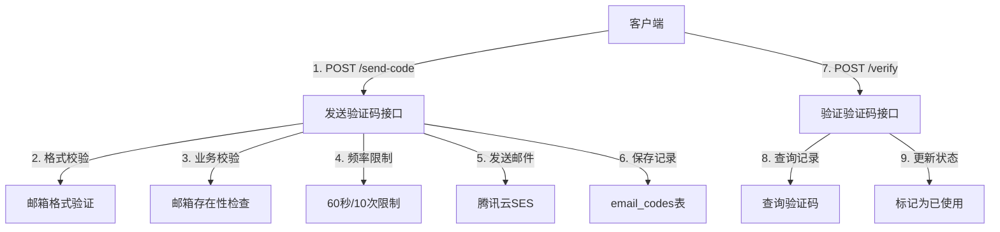
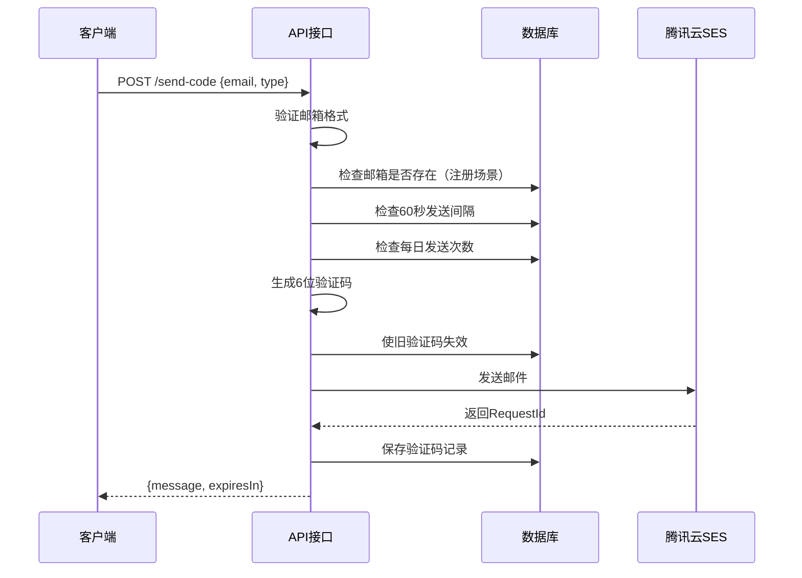
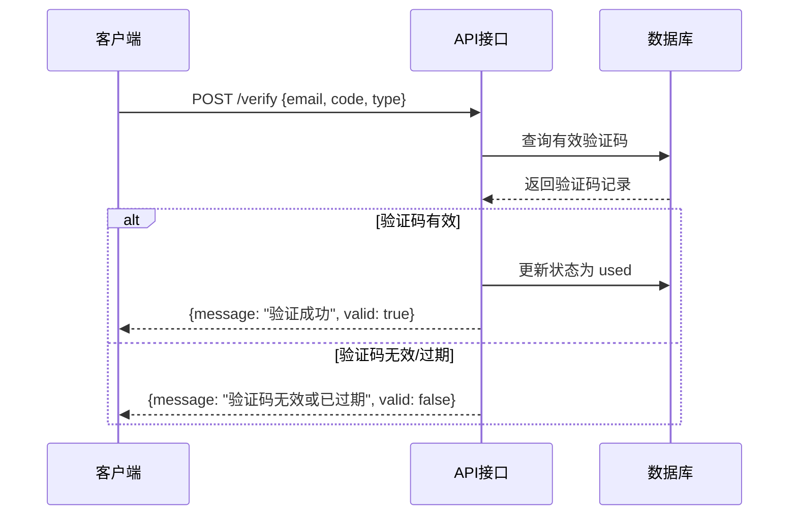

# 邮箱验证码 API

<cite>
**本文档引用文件**
- [email-auth.js](../../server/routes/email-auth.js)
- [email.service.js](../../server/services/email.service.js)
- [EmailCode.js](../../server/models/EmailCode.js)
</cite>

## 目录
1. [API 概述](#api-概述)
2. [发送验证码](#发送验证码)
3. [验证验证码](#验证验证码)
4. [错误码说明](#错误码说明)
5. [频率限制](#频率限制)

## API 概述

邮箱验证码 API 提供邮箱验证码发送和验证功能，基于腾讯云 SES 邮件推送服务。所有端点的基础路径为 `/api/auth/email`。



**Diagram sources**
- [email-auth.js](../../server/routes/email-auth.js#L16-L125)

---

## 发送验证码

### 端点

```
POST /api/auth/email/send-code
```

### 请求参数

| 参数名 | 类型 | 必填 | 默认值 | 说明 |
|--------|------|------|--------|------|
| `email` | `string` | 是 | - | 收件人邮箱地址 |
| `type` | `string` | 否 | `register` | 验证码类型：`register`（注册）、`reset_password`（重置密码） |

### 请求示例

```json
{
  "email": "user@example.com",
  "type": "register"
}
```

### 响应格式

#### 成功响应 (200 OK)

```json
{
  "success": true,
  "message": "验证码已发送到您的邮箱",
  "data": {
    "expiresIn": 300
  }
}
```

| 字段 | 类型 | 说明 |
|------|------|------|
| `success` | `boolean` | 请求是否成功 |
| `message` | `string` | 提示消息 |
| `data.expiresIn` | `number` | 验证码有效期（秒），固定为 300（5分钟） |

#### 错误响应

```json
{
  "success": false,
  "message": "错误描述"
}
```

| HTTP 状态码 | 响应体 | 说明 |
|------------|--------|------|
| 400 Bad Request | `{"success": false, "message": "邮箱地址不能为空"}` | 未提供邮箱地址 |
| 400 Bad Request | `{"success": false, "message": "邮箱格式不正确"}` | 邮箱格式无效 |
| 400 Bad Request | `{"success": false, "message": "验证码类型不正确"}` | 类型非 `register` 或 `reset_password` |
| 400 Bad Request | `{"success": false, "message": "该邮箱已被注册"}` | 注册时邮箱已存在 |
| 400 Bad Request | `{"success": false, "message": "该邮箱未注册"}` | 重置密码时邮箱不存在 |
| 429 Too Many Requests | `{"success": false, "message": "发送过于频繁，请30秒后再试", "remainingSeconds": 30}` | 60秒发送间隔限制 |
| 429 Too Many Requests | `{"success": false, "message": "今日发送次数已达上限（10次）", "dailyLimit": 10}` | 每日发送上限 |
| 500 Internal Server Error | `{"success": false, "message": "邮件模板未配置或审核未通过"}` | 腾讯云模板 ID 无效 |
| 500 Internal Server Error | `{"success": false, "message": "发送验证码失败，请稍后重试"}` | 服务器内部错误 |

**Section sources**
- [email-auth.js](../../server/routes/email-auth.js#L16-L125)

### 处理流程

1. **参数验证**：检查 `email` 和 `type` 参数是否存在
2. **邮箱格式校验**：调用 `emailService.validateEmail()` 验证格式
3. **业务逻辑校验**：
   - 注册类型：检查邮箱是否已被注册
   - 重置密码类型：检查邮箱是否已存在
4. **频率限制检查**：
   - 60 秒发送间隔：检查最近 60 秒内是否已发送
   - 每日发送上限：统计今日发送次数是否达到 10 次
5. **生成验证码**：调用 `emailService.generateCode()` 生成 6 位数字
6. **发送邮件**：调用腾讯云 SES API 发送验证码邮件
7. **保存记录**：将验证码信息保存到 `email_codes` 表
8. **返回成功**：返回有效期提示



**Diagram sources**
- [email-auth.js](../../server/routes/email-auth.js#L16-L125)

---

## 验证验证码

### 端点

```
POST /api/auth/email/verify
```

> **注意**：此接口为内部接口，供其他服务（如注册、重置密码）调用验证，不建议前端直接调用。

### 请求参数

| 参数名 | 类型 | 必填 | 默认值 | 说明 |
|--------|------|------|--------|------|
| `email` | `string` | 是 | - | 邮箱地址 |
| `code` | `string` | 是 | - | 6 位验证码 |
| `type` | `string` | 否 | `register` | 验证码类型 |

### 请求示例

```json
{
  "email": "user@example.com",
  "code": "123456",
  "type": "register"
}
```

### 响应格式

#### 成功响应 (200 OK)

```json
{
  "success": true,
  "message": "验证成功",
  "data": {
    "valid": true
  }
}
```

#### 错误响应

```json
{
  "success": false,
  "message": "验证码无效或已过期",
  "data": {
    "valid": false
  }
}
```

| HTTP 状态码 | 响应体 | 说明 |
|------------|--------|------|
| 400 Bad Request | `{"success": false, "message": "邮箱和验证码不能为空"}` | 参数缺失 |
| 400 Bad Request | `{"success": false, "message": "验证码无效或已过期", "data": {"valid": false}}` | 验证码错误、已使用或已过期 |
| 500 Internal Server Error | `{"success": false, "message": "验证失败，请稍后重试"}` | 服务器内部错误 |

**Section sources**
- [email-auth.js](../../server/routes/email-auth.js#L127-L161)

### 验证逻辑

系统查询 `email_codes` 表，找到满足以下所有条件的验证码记录：

1. 邮箱地址匹配
2. 验证码匹配
3. 类型匹配（`register` 或 `reset_password`）
4. 状态为 `pending`（未使用）
5. 未过期（`expires_at` > 当前时间）

验证通过后，将验证码状态更新为 `used`。



**Section sources**
- [email-auth.js](../../server/routes/email-auth.js#L127-L161)

---

## 错误码说明

### 业务错误码

| 错误场景 | HTTP 状态码 | 错误消息 |
|---------|------------|----------|
| 邮箱地址为空 | 400 | `邮箱地址不能为空` |
| 邮箱格式错误 | 400 | `邮箱格式不正确` |
| 验证码类型错误 | 400 | `验证码类型不正确` |
| 邮箱已注册 | 400 | `该邮箱已被注册` |
| 邮箱未注册 | 400 | `该邮箱未注册` |
| 发送过于频繁 | 429 | `发送过于频繁，请XX秒后再试` |
| 达到每日上限 | 429 | `今日发送次数已达上限（10次）` |
| 验证码无效 | 400 | `验证码无效或已过期` |

### 腾讯云错误码映射

| 腾讯云错误码 | 用户提示 | 说明 |
|------------|----------|------|
| `FailedOperation.InvalidTemplateID` | 邮件模板未配置或审核未通过 | 模板 ID 无效或待审核 |
| `FailedOperation.FrequencyLimit` | 发送过于频繁，请稍后再试 | 短时间内发送过多邮件 |
| `FailedOperation.ExceedSendLimit` | 超出今日发送上限 | 每日发送次数达到限制 |
| `FailedOperation.EmailAddrInBlacklist` | 邮箱地址在黑名单中 | 收件邮箱被系统拉黑 |
| `AuthFailure` | 密钥认证失败 | SecretId/SecretKey 无效 |
| `FailedOperation.NotAuthenticatedSender` | 发信地址未认证 | 发信地址未在腾讯云配置 |

**Section sources**
- [email-auth.js](../../server/routes/email-auth.js#L102-L104)

---

## 频率限制

### 60 秒发送间隔

同一邮箱地址在 60 秒内只能发送一次验证码。

**实现逻辑**：
```javascript
const oneMinuteAgo = new Date(Date.now() - 60 * 1000);
const recentCode = await EmailCode.findOne({
  where: {
    email,
    created_at: { [Op.gte]: oneMinuteAgo },
  },
});
```

**响应示例**：
```json
{
  "success": false,
  "message": "发送过于频繁，请30秒后再试",
  "remainingSeconds": 30
}
```

**Section sources**
- [email-auth.js](../../server/routes/email-auth.js#L50-L67)

### 每日发送上限

同一邮箱地址每天最多发送 10 次验证码。

**实现逻辑**：
```javascript
const todayStart = new Date();
todayStart.setHours(0, 0, 0, 0);

const todayCount = await EmailCode.count({
  where: {
    email,
    created_at: { [Op.gte]: todayStart },
  },
});
```

**响应示例**：
```json
{
  "success": false,
  "message": "今日发送次数已达上限（10次）",
  "dailyLimit": 10
}
```

**Section sources**
- [email-auth.js](../../server/routes/email-auth.js#L69-L87)

---

## 集成示例

### 前端集成（Vue 3）

```typescript
import { authAPI } from '@/services/api';

// 发送验证码
async function sendEmailCode(email: string) {
  try {
    const response = await authAPI.sendEmailCode(email, 'register');
    console.log(response.message); // "验证码已发送到您的邮箱"
    console.log(`有效期: ${response.expiresIn}秒`); // 300秒
  } catch (error) {
    if (error.response?.status === 429) {
      console.error(error.response.data.message);
    }
  }
}

// 注册时提交验证码
async function register(email: string, emailCode: string, password: string) {
  try {
    const response = await authAPI.register({
      email,
      emailCode,  // 验证码
      password,
    });
    console.log('注册成功');
  } catch (error) {
    console.error('注册失败:', error.response?.data?.message);
  }
}
```

**Section sources**
- [email-auth.js](../../server/routes/email-auth.js#L16-L125)

---

## 相关文档

- [邮箱认证服务](../../后端架构/业务逻辑层/邮箱认证服务.md) - 邮件发送服务实现
- [邮箱认证服务集成](../../后端架构/外部集成/邮箱认证服务集成.md) - 腾讯云 SES 集成方案
- [邮箱验证码表 (email_codes)](../../数据库设计/表结构/邮箱验证码表%20(email_codes).md) - 数据表设计
