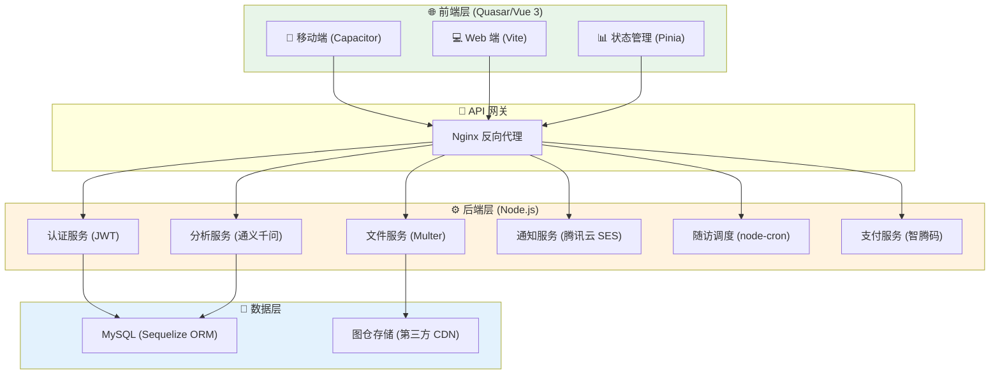

# CervixDetectAI Wiki

欢迎来到 **CervixDetectAI 项目 Wiki**。
本主页面向混合受众（开发 / 运维 / 产品），采用“快速开始 → 角色分流 → 专题深入”的导航方式。

> 建议优先使用侧边栏分类导航（`_Sidebar`）浏览完整内容。

## 3 步快速开始

1. **了解系统全貌**：[[系统概述]]
2. **完成环境部署**：[[安装与部署]]
3. **进入日常开发**：[[开发指南]]

---

## 按角色进入

### 开发者
- [[前端架构|前端架构]]
- [[后端架构|后端架构]]
- [[API参考|API参考]]
- [[认证API详解|认证API详解]]
- [[AI分析API总览|AI分析API总览]]

### 运维
- [[安装与部署]]
- [[安全考虑|安全考虑]]
- [[数据库设计|数据库设计]]

### 产品
- [[系统概述]]
- [[技术栈]]
- [[更新日志|更新日志]]

---

## 系统架构概览

## 核心专题地图

- [[项目目录结构|项目目录结构]]
- [[前端架构|前端架构]]
- [[后端架构|后端架构]]
- [[API参考|API参考]]
- [[数据库设计|数据库设计]]
- [[安全考虑|安全考虑]]
- [[患者与病例管理]]
- [[订阅与支付系统]]

---

## 最近更新

- [[更新日志总览|更新日志]]
- [[2026-05-17 报告文件接入 EdgeOne Blob|2026-05-17-报告文件接入EdgeOne-Blob]]
- [[2026-04-30 PDF报告专业化与历史趋势增强|2026-04-30-PDF报告专业化与历史趋势增强]]
- [[2026-04-14 系统监控与数据导入功能增强|2026-04-14-系统监控与数据导入功能增强]]
- [[2026-03-26 新版智腾码支付接入与自动跳转|2026-03-26-新版智腾码支付接入与自动跳转]]
- [[2026-03-21 前端 UI 细节打磨与无障碍增强|2026-03-21-前端UI细节打磨与无障碍增强]]
- [[2026-03-20 分析任务队列化重构|2026-03-20-分析任务队列化重构]]
- [[2026-03-12 分析任务稳定性修复|2026-03-12-分析任务稳定性修复]]
- [[2026-03-12 前端渐进重构与通知链路收口|2026-03-12-前端渐进重构与通知链路收口]]
- [[2026-03-11 套餐订阅与 AI 偏好页拆分|2026-03-11-套餐订阅与AI偏好页拆分]]
- [[2026-03-09 认证页软著预览与对话框主题优化|2026-03-09-认证页软著预览与对话框主题优化]]
- [[2026-03-03 影像存储链路重构与图仓集成|2026-03-03-影像存储链路重构与图仓集成]]
- [[2026-03-01 患者洞察完善与全站视觉统一|2026-03-01-患者洞察完善与全站视觉统一]]
- [[2026-02-28 认证页UI重塑与注册流程重构|2026-02-28-认证页UI重塑与注册流程重构]]
- [[2026-02-23 邮件场景扩展与邮箱安全UI重构|2026-02-23-邮件场景扩展与邮箱安全UI重构]]
- [[2026-02-23 随访管理与站内通知及UI优化|2026-02-23-随访管理与站内通知及UI优化]]
- [[2026-02-23 批量上传与批量任务创建|2026-02-23-批量上传与批量任务创建]]
- [[2026-02-22 AI聊天面板四次迭代|2026-02-22-AI聊天面板四次迭代]]
- [[2026-01-26 UI优化与代码重构|2026-01-26-UI优化与代码重构]]
- [[2026-01-26 阿里云AI验证码集成|2026-01-26-阿里云AI验证码集成]]

---

## 维护约定

- 新增一级专题时，请同步更新本页与 `_Sidebar.md`。
- 角色入口保持精简（每个角色优先保留 3 个高频入口）。
- 重大变更优先在 [[更新日志|更新日志]] 留痕。
