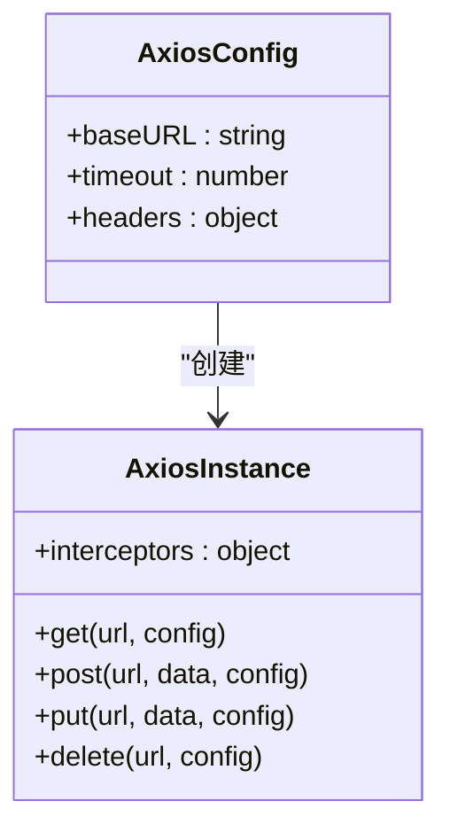
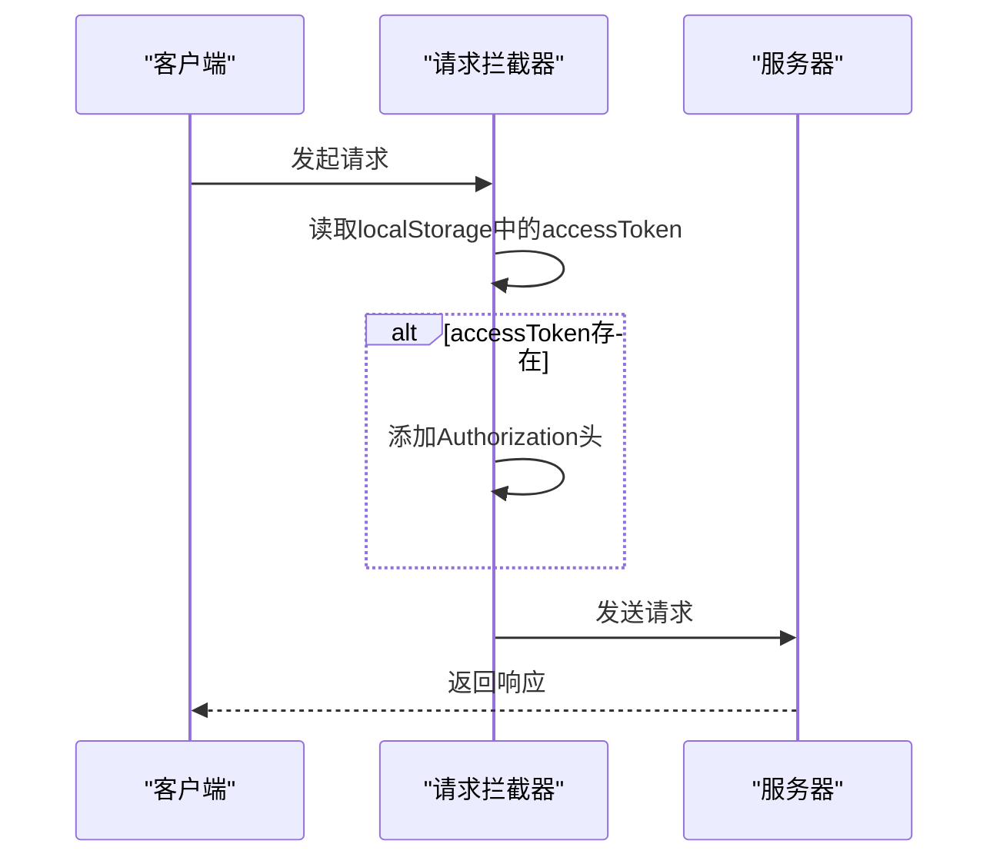
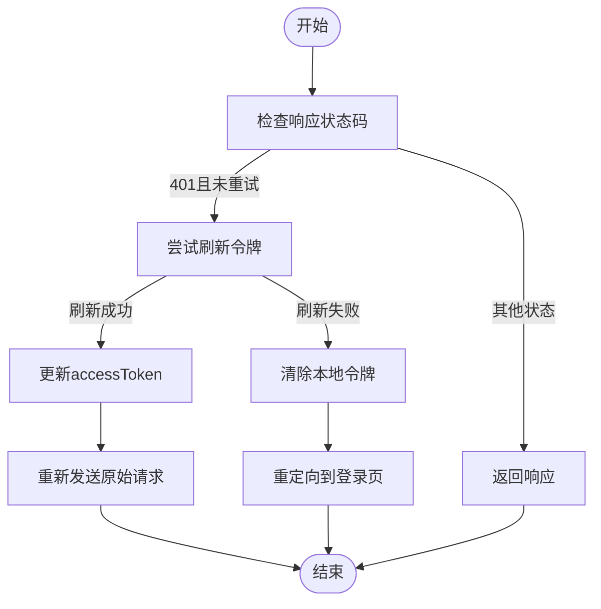
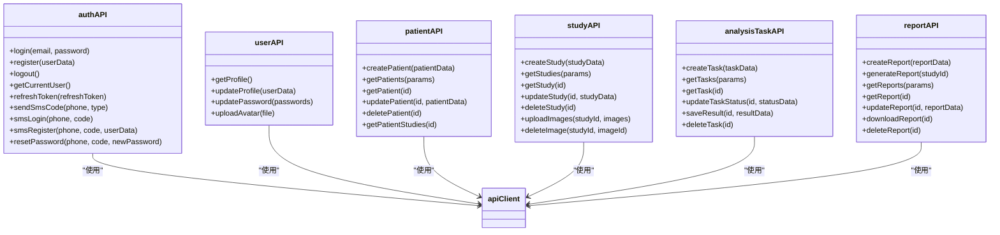
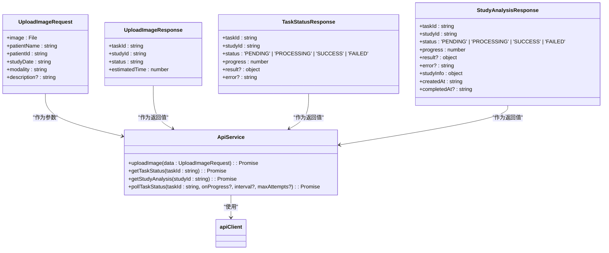
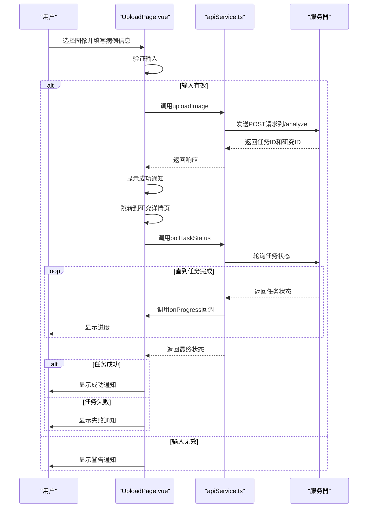
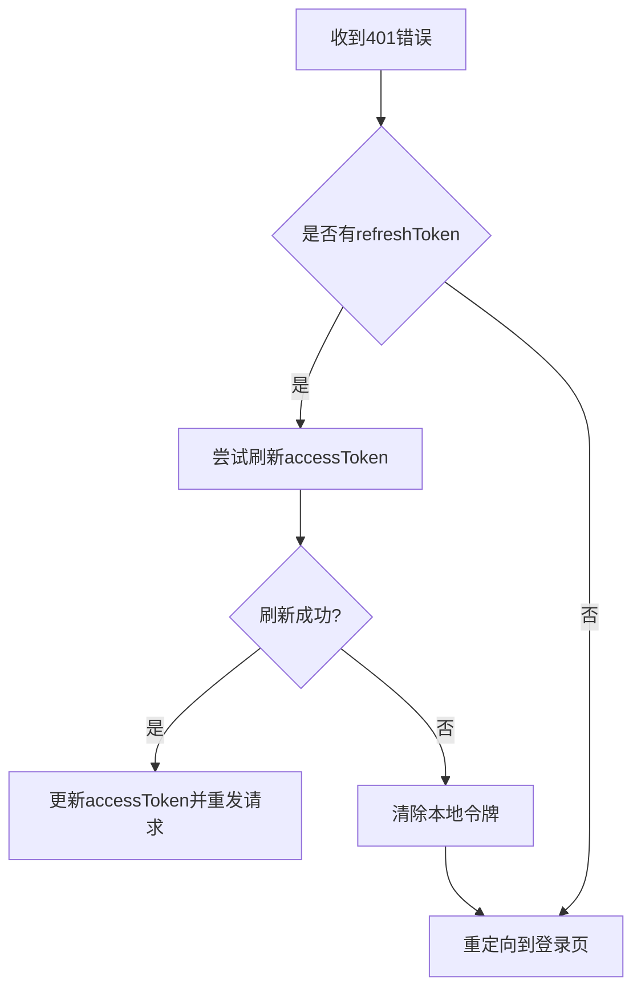
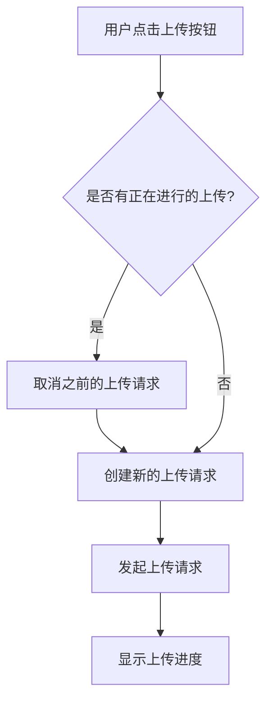

# API集成

> **本文档引用的文件**
>
> - [axios.ts](file://src/boot/axios.ts)
> - [api.ts](file://src/services/api.ts)
> - [apiService.ts](file://src/services/apiService.ts)
> - [authStore.ts](file://src/stores/authStore.ts)
> - [UploadPage.vue](file://src/pages/UploadPage.vue)
> - [LoginPage.vue](file://src/pages/LoginPage.vue)
> - [quasar.config.ts](file://quasar.config.ts) - _新增开发服务器代理配置_

## 目录

1. [项目概述](#项目概述)
2. [HTTP客户端配置](#http客户端配置)
3. [API端点组织](#api端点组织)
4. [业务服务抽象](#业务服务抽象)
5. [调用示例](#调用示例)
6. [错误处理策略](#错误处理策略)
7. [请求取消与防重复提交](#请求取消与防重复提交)
8. [与后端RESTful API的契约一致性](#与后端restful-api的契约一致性)

## 项目概述

CervixDetectAI是一个基于Vue 3和Quasar框架构建的前端应用，旨在提供一个AI驱动的宫颈癌筛查系统。该系统通过集成后端RESTful API，实现了用户认证、病例管理、AI分析和报告生成等核心功能。本技术文档详细说明了前端API集成的实现细节，包括基于axios的HTTP客户端配置、API端点的组织方式、业务服务的抽象逻辑以及最佳实践。

**Section sources**

- [axios.ts](file://src/boot/axios.ts)
- [api.ts](file://src/services/api.ts)
- [apiService.ts](file://src/services/apiService.ts)

## HTTP客户端配置

前端应用使用axios作为HTTP客户端库，通过`src/boot/axios.ts`文件进行全局配置。该配置文件创建了一个axios实例，并将其挂载到Vue应用的全局属性上，以便在任何Vue组件中通过`this.$api`访问。



**Diagram sources**

- [axios.ts](file://src/boot/axios.ts#L17-L23)

### 基础URL设置

基础URL通过环境变量`VITE_API_BASE_URL`进行配置，如果环境变量未设置，则默认使用`http://localhost:3000/api`。这种配置方式使得应用可以在不同的环境中灵活切换后端API地址。

```typescript
const api = axios.create({
  baseURL: import.meta.env.VITE_API_BASE_URL || 'http://localhost:3000/api',
  timeout: 30000,
  headers: {
    'Content-Type': 'application/json',
  },
});
```

### 开发服务器API代理配置

在`quasar.config.ts`中新增了开发服务器的API代理配置，解决了本地开发时的跨域问题。该配置将所有以`/api`开头的请求代理到后端服务器`http://localhost:3000`，并支持WebSocket代理。

```typescript
devServer: {
  open: true,
  proxy: {
    // 代理 API 请求到后端服务器
    '/api': {
      target: 'http://localhost:3000',
      changeOrigin: true,
      ws: true,
    },
  },
},
```

此配置的关键参数说明：

- `target`: 指定代理的目标服务器地址
- `changeOrigin`: 设置为`true`以改变请求头中的origin字段，避免CORS问题
- `ws`: 设置为`true`以支持WebSocket连接代理

**Section sources**

- [quasar.config.ts](file://quasar.config.ts#L81-L91) - _新增开发服务器代理配置_

### 请求/响应拦截器

请求拦截器用于在每个请求中自动注入JWT令牌。它从`localStorage`中读取`accessToken`，如果存在，则将其添加到请求头的`Authorization`字段中。



**Diagram sources**

- [api.ts](file://src/services/api.ts#L18-L28)

响应拦截器负责统一处理错误，特别是401未授权错误。当检测到401错误时，拦截器会尝试使用`refreshToken`刷新访问令牌。如果刷新成功，则重新发送原始请求；如果刷新失败，则清除本地存储的令牌并重定向到登录页面。



**Diagram sources**

- [api.ts](file://src/services/api.ts#L31-L63)

**Section sources**

- [axios.ts](file://src/boot/axios.ts#L17-L37)
- [api.ts](file://src/services/api.ts#L17-L63)

## API端点组织

API端点在`src/services/api.ts`文件中被组织成多个模块，每个模块对应一个特定的业务功能。这种组织方式使得代码结构清晰，易于维护。



**Diagram sources**

- [api.ts](file://src/services/api.ts#L66-L334)

### 认证模块

认证模块提供了用户登录、注册、登出、获取当前用户信息、刷新令牌等功能。此外，还支持短信验证码登录、注册和重置密码。

```typescript
export const authAPI = {
  async login(email: string, password: string) {
    const { data } = await apiClient.post('/auth/login', { email, password });
    return data;
  },

  async register(userData: {
    email: string;
    password: string;
    real_name?: string;
    phone?: string;
  }) {
    const { data } = await apiClient.post('/auth/register', userData);
    return data;
  },

  // ... 其他方法
};
```

### 用户模块

用户模块提供了获取和更新用户个人资料、修改密码、上传头像等功能。

```typescript
export const userAPI = {
  async getProfile() {
    const { data } = await apiClient.get('/users/me');
    return data;
  },

  async updateProfile(userData: { real_name?: string; phone?: string }) {
    const { data } = await apiClient.put('/users/me', userData);
    return data;
  },

  // ... 其他方法
};
```

### 患者模块

患者模块提供了创建、获取、更新、删除患者以及获取患者相关病例的功能。

```typescript
export const patientAPI = {
  async createPatient(patientData: {
    name: string;
    gender: 'male' | 'female' | 'other';
    birth_date?: string;
    phone?: string;
    id_card?: string;
    address?: string;
    emergency_contact?: string;
    emergency_phone?: string;
    emergency_relation?: string; // 新增字段
    medical_card_no?: string; // 新增字段
    medical_history?: string;
    sexual_history?:
      | 'none'
      | 'regular'
      | 'irregular'
      | 'multiple_partners'
      | 'early_sexual_activity'
      | 'other'; // 新增字段
    allergies?: string;
    allergy_history?: string; // 新增字段
    family_history?: string; // 新增字段
    notes?: string; // 新增字段
  }) {
    const { data } = await apiClient.post('/patients', patientData);
    return data;
  },

  async getPatients(params?: { page?: number; limit?: number; search?: string; gender?: string }) {
    const { data } = await apiClient.get('/patients', { params });
    return data;
  },

  // ... 其他方法
};
```

### 研究模块

研究模块提供了创建、获取、更新、删除研究以及上传和删除图像的功能。

```typescript
export const studyAPI = {
  async createStudy(studyData: any) {
    const { data } = await apiClient.post('/studies', studyData);
    return data;
  },

  async uploadImages(studyId: number, images: File[]) {
    const formData = new FormData();
    images.forEach((image) => {
      formData.append('images', image);
    });
    const { data } = await apiClient.post(`/studies/${studyId}/images`, formData, {
      headers: { 'Content-Type': 'multipart/form-data' },
    });
    return data;
  },

  // ... 其他方法
};
```

### 分析任务模块

分析任务模块提供了创建、获取、更新、删除分析任务以及保存结果的功能。

```typescript
export const analysisTaskAPI = {
  async createTask(taskData: {
    study_id: number;
    model_name?: string;
    model_version?: string;
    priority?: string;
  }) {
    const { data } = await apiClient.post('/analysis-tasks', taskData);
    return data;
  },

  async saveResult(id: number, resultData: any) {
    const { data } = await apiClient.post(`/analysis-tasks/${id}/result`, resultData);
    return data;
  },

  // ... 其他方法
};
```

### 报告模块

报告模块提供了创建、获取、更新、删除报告以及下载PDF报告的功能。

```typescript
export const reportAPI = {
  async createReport(reportData: any) {
    const { data } = await apiClient.post('/reports', reportData);
    return data;
  },

  async downloadReport(id: number) {
    const response = await apiClient.get(`/reports/${id}/download`, {
      responseType: 'blob',
    });
    return response.data;
  },

  // ... 其他方法
};
```

**Section sources**

- [api.ts](file://src/services/api.ts#L66-L334)

## 业务服务抽象

业务服务在`src/services/apiService.ts`文件中被抽象成独立的函数，这些函数封装了具体的业务逻辑，使得在页面组件中调用API更加简洁和安全。



**Diagram sources**

- [apiService.ts](file://src/services/apiService.ts#L41-L55)
- [apiService.ts](file://src/services/apiService.ts#L92-L122)
- [apiService.ts](file://src/services/apiService.ts#L128-L131)
- [apiService.ts](file://src/services/apiService.ts#L136-L139)
- [apiService.ts](file://src/services/apiService.ts#L148-L189)

### 上传图像并创建分析任务

`uploadImage`函数封装了上传图像并创建分析任务的逻辑。它接收一个包含图像文件和病例信息的对象，将其转换为`FormData`格式，并发送到`/analyze`端点。

```typescript
export async function uploadImage(data: UploadImageRequest): Promise<UploadImageResponse> {
  const formData = new FormData();
  formData.append('image', data.image);
  formData.append('patientName', data.patientName);
  formData.append('patientId', data.patientId);
  formData.append('studyDate', data.studyDate);
  formData.append('modality', data.modality);
  if (data.description) {
    formData.append('description', data.description);
  }

  const response = await apiClient.post<UploadImageResponse>('/analyze', formData, {
    headers: {
      'Content-Type': 'multipart/form-data',
    },
  });
  return response.data;
}
```

### 查询任务状态

`getTaskStatus`函数用于查询指定任务的当前状态。它接收一个任务ID，并返回任务的详细信息。

```typescript
export async function getTaskStatus(taskId: string): Promise<TaskStatusResponse> {
  const response = await apiClient.get<TaskStatusResponse>(`/analyze/${taskId}`);
  return response.data;
}
```

### 根据研究ID查询分析结果

`getStudyAnalysis`函数用于根据研究ID查询分析结果。它接收一个研究ID，并返回包含分析结果的详细信息。

```typescript
export async function getStudyAnalysis(studyId: string): Promise<StudyAnalysisResponse> {
  const response = await apiClient.get<StudyAnalysisResponse>(`/analyze/study/${studyId}`);
  return response.data;
}
```

### 轮询任务状态直到完成

`pollTaskStatus`函数用于轮询任务状态，直到任务完成或超时。它接收一个任务ID、一个可选的进度回调函数、轮询间隔和最大尝试次数。

```typescript
export async function pollTaskStatus(
  taskId: string,
  onProgress?: (status: TaskStatusResponse) => void,
  interval = 2000,
  maxAttempts = 150, // 5分钟
): Promise<TaskStatusResponse> {
  let attempts = 0;

  return new Promise((resolve, reject) => {
    const poll = async () => {
      try {
        attempts++;
        const status = await getTaskStatus(taskId);

        if (onProgress) {
          onProgress(status);
        }

        if (status.status === 'SUCCESS' || status.status === 'FAILED') {
          resolve(status);
          return;
        }

        if (attempts >= maxAttempts) {
          reject(new Error('分析超时，请稍后重试'));
          return;
        }

        setTimeout(() => {
          void poll();
        }, interval);
      } catch (error) {
        reject(error instanceof Error ? error : new Error(String(error)));
      }
    };

    void poll();
  });
}
```

**Section sources**

- [apiService.ts](file://src/services/apiService.ts#L41-L197)

## 调用示例

在页面组件中，可以通过导入相应的API服务函数来发起请求。以下是一个在`UploadPage.vue`中上传图像并分析的示例。



**Diagram sources**

- [UploadPage.vue](file://src/pages/UploadPage.vue#L330-L480)

```typescript
import { uploadImage } from 'src/services/apiService';

const uploadAndAnalyze = async () => {
  if (!selectedFile.value) {
    $q.notify({
      type: 'warning',
      message: '请先选择图像文件',
      position: 'top',
    });
    return;
  }

  if (
    !studyInfo.value.patientName ||
    !studyInfo.value.patientId ||
    !studyInfo.value.modality ||
    !studyInfo.value.studyDate
  ) {
    $q.notify({
      type: 'warning',
      message: '请填写所有必填字段',
      position: 'top',
    });
    return;
  }

  uploading.value = true;

  try {
    const response = await uploadImage({
      image: selectedFile.value,
      patientName: studyInfo.value.patientName,
      patientId: studyInfo.value.patientId,
      studyDate: studyInfo.value.studyDate,
      modality: studyInfo.value.modality,
      description: studyInfo.value.description,
    });

    $q.notify({
      type: 'positive',
      message: `✅ 病例上传成功！AI分析已启动，预计${response.estimatedTime}秒完成`,
      position: 'top',
      timeout: 4000,
      icon: 'check_circle',
      actions: [
        {
          label: '查看详情',
          color: 'white',
          handler: () => {
            void router.push(`/app/studies/${response.studyId}`);
          },
        },
      ],
    });

    void router.push(`/app/studies/${response.studyId}`);

    analysisStore
      .pollTaskStatus(response.taskId)
      .then((task) => {
        if (task.status === 'SUCCESS') {
          $q.notify({
            type: 'positive',
            message: '🎉 AI分析完成！请查看分析结果',
            position: 'top',
            timeout: 5000,
            actions: [
              {
                label: '查看结果',
                color: 'white',
                handler: () => {
                  window.location.reload();
                },
              },
            ],
          });
        } else if (task.status === 'FAILED') {
          $q.notify({
            type: 'negative',
            message: `❌ 分析失败: ${task.error || '未知错误'}`,
            position: 'top',
            timeout: 5000,
          });
        }
      })
      .catch((error) => {
        $q.notify({
          type: 'warning',
          message: '轮询任务状态失败，请刷新页面查看结果',
          position: 'top',
        });
      });
  } catch (error) {
    let errorMessage = '上传失败，请重试';
    if (error instanceof Error) {
      if (error.message.includes('Network Error') || error.message.includes('timeout')) {
        errorMessage = '❌ 无法连接到后端服务，请确保后端已启动（运行: cd server && bun start）';
      } else {
        errorMessage = `❌ 上传失败: ${error.message}`;
      }
    }

    $q.notify({
      type: 'negative',
      message: errorMessage,
      position: 'top',
      timeout: 8000,
      icon: 'error',
      actions: [
        {
          label: '关闭',
          color: 'white',
        },
      ],
    });
  } finally {
    uploading.value = false;
  }
};
```

**Section sources**

- [UploadPage.vue](file://src/pages/UploadPage.vue#L261-L482)

## 错误处理策略

前端应用采用了多层次的错误处理策略，确保用户能够获得清晰的反馈，并且应用能够优雅地处理各种异常情况。

### 401自动登出

当后端返回401未授权错误时，响应拦截器会自动尝试刷新访问令牌。如果刷新失败，则清除本地存储的令牌并重定向到登录页面。



**Diagram sources**

- [api.ts](file://src/services/api.ts#L38-L58)

### 网络错误和超时处理

在调用API时，通过try-catch块捕获可能的网络错误和超时错误，并向用户显示友好的错误消息。

```typescript
try {
  const response = await uploadImage({
    // ... 参数
  });
  // 处理成功响应
} catch (error) {
  let errorMessage = '上传失败，请重试';
  if (error instanceof Error) {
    if (error.message.includes('Network Error') || error.message.includes('timeout')) {
      errorMessage = '❌ 无法连接到后端服务，请确保后端已启动（运行: cd server && bun start）';
    } else {
      errorMessage = `❌ 上传失败: ${error.message}`;
    }
  }

  $q.notify({
    type: 'negative',
    message: errorMessage,
    position: 'top',
    timeout: 8000,
    icon: 'error',
    actions: [
      {
        label: '关闭',
        color: 'white',
      },
    ],
  });
}
```

**Section sources**

- [UploadPage.vue](file://src/pages/UploadPage.vue#L453-L477)

## 请求取消与防重复提交

为了防止用户重复提交请求，可以在发起请求前检查是否已经有正在进行的请求，并在必要时取消之前的请求。



虽然当前代码中没有显式实现请求取消，但可以通过axios的CancelToken或AbortController来实现。防重复提交则通过在`uploadAndAnalyze`函数中设置`uploading.value = true`来实现，确保在上传过程中按钮处于禁用状态。

**Section sources**

- [UploadPage.vue](file://src/pages/UploadPage.vue#L278)
- [UploadPage.vue](file://src/pages/UploadPage.vue#L379)

## 与后端RESTful API的契约一致性

前端API集成严格遵循与后端RESTful API的契约，确保请求和响应的格式一致。后端API的端点和方法在`README.md`文件中有详细说明。

### 认证接口 (`/api/auth`)

- `POST /register` - 邮箱注册
- `POST /login` - 邮箱登录
- `POST /refresh` - 刷新Token
- `POST /logout` - 登出
- `GET /me` - 获取当前用户信息

### 短信认证接口 (`/api/auth/sms`)

- `POST /send-code` - 发送短信验证码
- `POST /login` - 短信验证码登录
- `POST /register` - 短信验证码注册
- `POST /reset-password` - 短信验证码重置密码

### 病例管理接口 (`/api/studies`)

- `GET /` - 获取病例列表
- `POST /` - 创建新病例
- `GET /:id` - 获取病例详情
- `PUT /:id` - 更新病例信息
- `DELETE /:id` - 删除病例

### AI分析接口 (`/api/analysis`)

- `POST /analyze` - 开始AI分析
- `GET /tasks` - 获取分析任务列表
- `GET /tasks/:id` - 获取任务详情

### 报告接口 (`/api/reports`)

- `GET /` - 获取报告列表
- `GET /:id` - 获取报告详情
- `GET /:id/download` - 下载PDF报告

**Section sources**

- [README.md](file://README.md#L418-L454)
