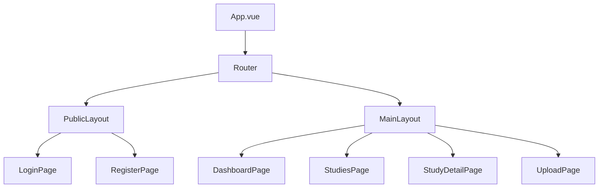
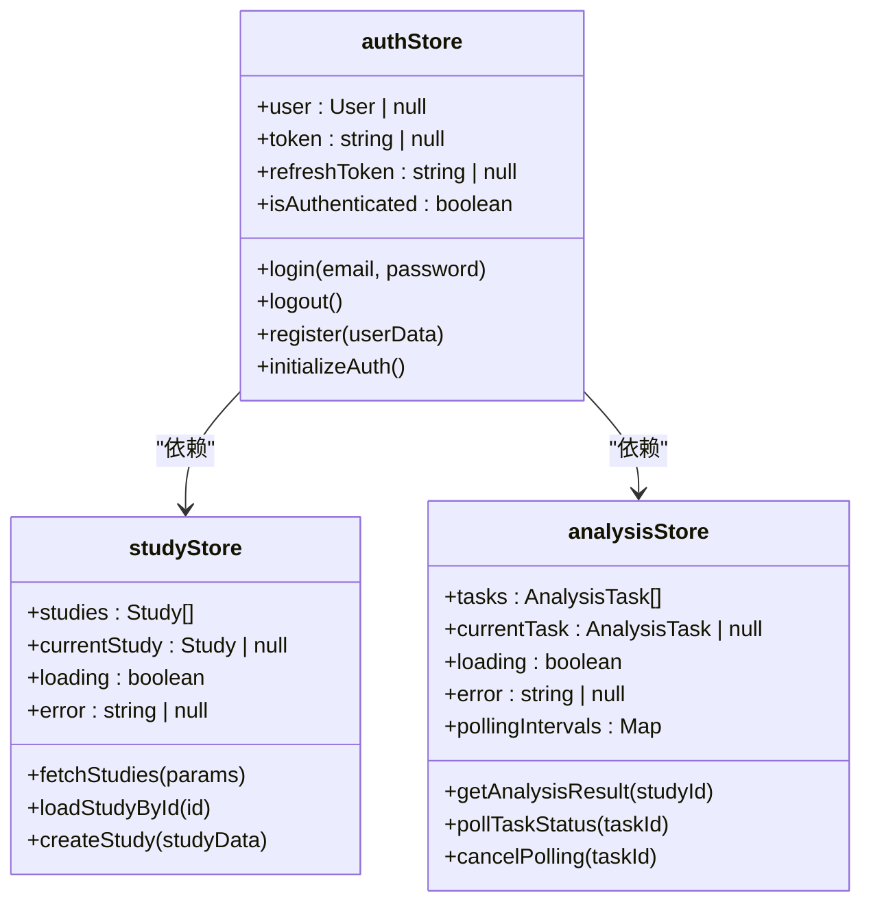
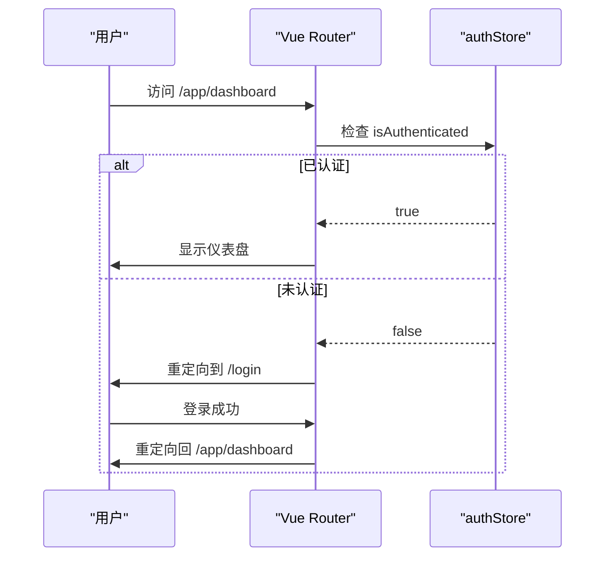
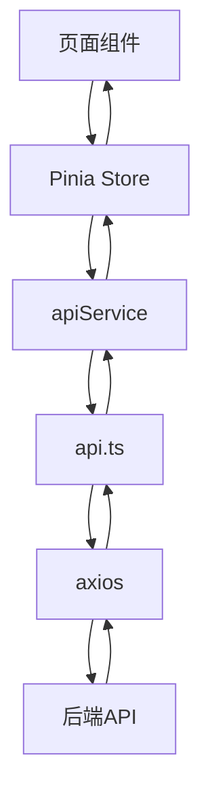

# 前端架构

<cite>
**本文档引用的文件**
- [MainLayout.vue](file://src/layouts/MainLayout.vue)
- [PublicLayout.vue](file://src/layouts/PublicLayout.vue)
- [App.vue](file://src/App.vue)
- [routes.ts](file://src/router/routes.ts)
- [index.ts](file://src/router/index.ts)
- [authStore.ts](file://src/stores/authStore.ts)
- [studyStore.ts](file://src/stores/studyStore.ts)
- [analysisStore.ts](file://src/stores/analysisStore.ts)
- [axios.ts](file://src/boot/axios.ts)
- [api.ts](file://src/services/api.ts)
- [apiService.ts](file://src/services/apiService.ts)
</cite>

## 目录
1. [项目结构](#项目结构)
2. [组件架构](#组件架构)
3. [状态管理](#状态管理)
4. [路由系统](#路由系统)
5. [API集成](#api集成)
6. [最佳实践](#最佳实践)

## 项目结构

CervixDetectAI前端项目采用基于Vue 3和Quasar框架的现代化架构，遵循清晰的模块化组织方式。项目源码位于`src`目录下，主要分为以下几个核心部分：

- **boot/**：Quasar启动配置文件，用于初始化全局依赖（如axios）
- **components/**：可复用的公共UI组件
- **layouts/**：页面布局组件，定义应用的整体结构
- **pages/**：页面级组件，对应不同的路由视图
- **router/**：Vue Router配置，管理应用的导航逻辑
- **services/**：API服务层，封装HTTP请求和业务服务
- **stores/**：Pinia状态管理模块，集中管理应用状态

该结构支持MVVM模式，实现了视图、视图模型和数据模型的清晰分离。

**Section sources**
- [README.md](file://README.md#L281-L351)

## 组件架构

CervixDetectAI采用基于布局组件和页面组件的层次化组件架构，实现了UI结构的复用性和可维护性。

### 布局组件

系统包含两种主要布局组件：

- **MainLayout.vue**：主应用布局，包含顶部导航栏、侧边栏和内容区域。适用于已认证用户的页面，提供全局导航、用户信息和通知功能。
- **PublicLayout.vue**：公共页面布局，极简设计，仅包含页面容器。适用于登录、注册等无需导航的公共页面。

MainLayout通过`EssentialLink`组件动态渲染导航菜单，并利用Pinia的`authStore`获取用户信息以显示个性化内容。

### 页面组件

页面组件位于`pages/`目录下，每个组件对应一个特定的功能模块：

- **LoginPage/RegisterPage**：用户认证相关页面
- **DashboardPage/StudiesPage**：核心功能页面
- **StudyDetailPage/UploadPage**：病例管理与分析页面
- **ReportsPage/SettingsPage**：报告与配置页面

所有页面组件通过`router-view`在布局组件中渲染，形成完整的用户界面。

**Diagram sources**
- [MainLayout.vue](file://src/layouts/MainLayout.vue)
- [PublicLayout.vue](file://src/layouts/PublicLayout.vue)
- [App.vue](file://src/App.vue)

**Section sources**
- [MainLayout.vue](file://src/layouts/MainLayout.vue)
- [PublicLayout.vue](file://src/layouts/PublicLayout.vue)

## 状态管理

系统采用Pinia作为状态管理解决方案，实现了响应式状态的集中管理和跨组件共享。在`stores/`目录下定义了多个专用store模块。

### authStore

`authStore.ts`管理用户认证状态，包含以下核心状态：

- `user`：当前登录用户信息
- `token`：访问令牌
- `refreshToken`：刷新令牌
- `isAuthenticated`：认证状态标志

该store提供了`login`、`logout`、`register`等操作方法，并在初始化时从localStorage恢复认证状态，确保页面刷新后用户会话的持续性。

### studyStore

`studyStore.ts`管理病例数据状态，包含：

- `studies`：病例列表
- `currentStudy`：当前选中的病例
- `loading`和`error`：加载状态和错误信息

通过`fetchStudies`、`createStudy`等actions与后端API交互，实现病例数据的获取和更新。

### analysisStore

`analysisStore.ts`管理AI分析任务状态，包含：

- `tasks`：分析任务列表
- `currentTask`：当前任务
- `pollingIntervals`：轮询定时器集合

提供`getAnalysisResult`和`pollTaskStatus`等方法，支持对分析任务的轮询监控和结果获取。

**Diagram sources**
- [authStore.ts](file://src/stores/authStore.ts)
- [studyStore.ts](file://src/stores/studyStore.ts)
- [analysisStore.ts](file://src/stores/analysisStore.ts)

**Section sources**
- [authStore.ts](file://src/stores/authStore.ts)
- [studyStore.ts](file://src/stores/studyStore.ts)
- [analysisStore.ts](file://src/stores/analysisStore.ts)

## 路由系统

前端路由系统基于Vue Router构建，实现了客户端导航和路由守卫机制。

### 路由配置

`routes.ts`文件定义了应用的路由映射：

- 根路径`/`使用`PublicLayout`，包含登录、注册等公共页面
- `/app`路径使用`MainLayout`，包含所有需要认证的功能页面
- 动态路由`/app/studies/:id`用于显示特定病例详情

路由配置采用懒加载方式，通过`import()`函数按需加载组件，优化应用性能。

### 导航守卫

`index.ts`中的全局前置守卫`beforeEach`实现了认证保护：

- 检查路由的`meta.requiresAuth`元字段
- 若需要认证且用户未登录，则重定向到登录页
- 保存原始目标路径，以便登录后重定向回来

这种机制确保了受保护页面的安全访问，同时提供了良好的用户体验。

**Diagram sources**
- [routes.ts](file://src/router/routes.ts)
- [index.ts](file://src/router/index.ts)

**Section sources**
- [routes.ts](file://src/router/routes.ts)
- [index.ts](file://src/router/index.ts)

## API集成

系统通过axios实现了与后端API的集成，采用分层架构确保代码的可维护性。

### axios配置

`boot/axios.ts`文件配置了axios实例：

- 设置基础URL和超时时间
- 将实例挂载到Vue应用的全局属性`$api`
- 支持在组件中通过`this.$api`直接访问

### API服务层

`services/`目录包含两个关键文件：

- **api.ts**：基于axios拦截器的API封装，自动处理JWT令牌的添加和刷新
- **apiService.ts**：业务服务抽象，提供`uploadImage`、`getStudyAnalysis`等高层业务方法

api.ts中的响应拦截器实现了自动令牌刷新机制：当收到401错误时，尝试使用刷新令牌获取新访问令牌，并重试原始请求。

### 服务抽象

apiService.ts提供了更高级别的服务接口，如`pollTaskStatus`函数实现了对分析任务的轮询监控，简化了前端对异步任务的处理。

**Diagram sources**
- [axios.ts](file://src/boot/axios.ts)
- [api.ts](file://src/services/api.ts)
- [apiService.ts](file://src/services/apiService.ts)

**Section sources**
- [axios.ts](file://src/boot/axios.ts)
- [api.ts](file://src/services/api.ts)
- [apiService.ts](file://src/services/apiService.ts)

## 最佳实践

### 组件通信

采用Pinia作为单一状态源，避免了复杂的组件间通信。页面组件通过组合式API的`useStore`函数访问store，实现数据的响应式更新。

### 状态持久化

在`authStore`中实现状态持久化：
- 登录成功后将令牌和用户信息存储到localStorage
- 应用初始化时从localStorage恢复认证状态
- 登出时清除所有持久化数据

### HTTP请求处理

- 使用axios拦截器统一处理认证和错误
- 实现自动令牌刷新机制，提升用户体验
- 在apiService中封装业务逻辑，提供清晰的API接口
- 使用TypeScript定义接口类型，确保类型安全

这些最佳实践确保了前端架构的健壮性、可维护性和良好的用户体验。

**Section sources**
- [authStore.ts](file://src/stores/authStore.ts)
- [api.ts](file://src/services/api.ts)
- [apiService.ts](file://src/services/apiService.ts)
- [App.vue](file://src/App.vue)