# 状态管理

> **本文档引用文件**   
> - [authStore.ts](file://src/stores/authStore.ts)
> - [studyStore.ts](file://src/stores/studyStore.ts)
> - [analysisStore.ts](file://src/stores/analysisStore.ts)
> - [modelStore.ts](file://src/stores/modelStore.ts)
> - [index.ts](file://src/stores/index.ts)
> - [apiService.ts](file://src/services/apiService.ts)
> - [LoginPage.vue](file://src/pages/LoginPage.vue)
> - [UploadPage.vue](file://src/pages/UploadPage.vue)
> - [App.vue](file://src/App.vue)

## 目录
1. [引言](#引言)
2. [核心状态模块设计](#核心状态模块设计)
3. [状态定义与模块化组织](#状态定义与模块化组织)
4. [状态持久化与初始化](#状态持久化与初始化)
5. [跨组件状态共享机制](#跨组件状态共享机制)
6. [登录流程状态管理](#登录流程状态管理)
7. [图像上传分析流程](#图像上传分析流程)
8. [错误处理策略](#错误处理策略)
9. [异步状态更新最佳实践](#异步状态更新最佳实践)
10. [状态不一致问题调试方法](#状态不一致问题调试方法)

## 引言

CervixDetectAI项目采用Pinia作为Vue 3应用的状态管理解决方案，通过模块化store设计实现用户认证、病例数据、AI分析任务和AI模型信息的集中管理。本文档深入分析authStore、studyStore、analysisStore和modelStore的设计原理与实际应用，详细说明状态定义、actions、getters的实现逻辑，展示跨组件状态共享与持久化机制，并结合登录流程和图像上传分析流程演示状态变更的完整生命周期。

**Section sources**
- [authStore.ts](file://src/stores/authStore.ts#L1-L175)
- [studyStore.ts](file://src/stores/studyStore.ts#L1-L267)
- [analysisStore.ts](file://src/stores/analysisStore.ts#L1-L194)
- [modelStore.ts](file://src/stores/modelStore.ts#L1-L144)

## 核心状态模块设计

CervixDetectAI项目通过四个核心Pinia store实现关键功能的状态管理：

- **authStore**：负责用户认证状态管理，包括用户信息、认证令牌、登录状态等
- **studyStore**：管理病例数据，包括病例列表、当前病例、上传状态等
- **analysisStore**：处理AI分析任务状态，包括任务轮询、进度跟踪、结果获取
- **modelStore**：管理AI模型信息，包括模型列表、当前模型、预测结果等

这些store通过模块化设计实现了关注点分离，每个store专注于特定领域的状态管理，同时通过统一的API接口与其他组件进行交互。

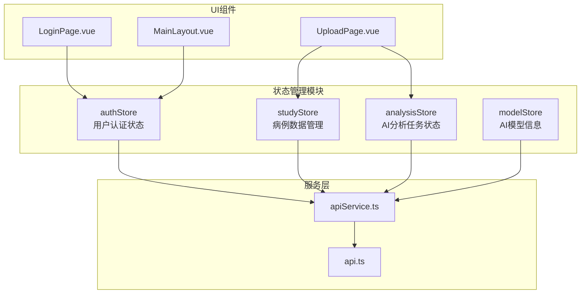

**Diagram sources**
- [authStore.ts](file://src/stores/authStore.ts#L1-L175)
- [studyStore.ts](file://src/stores/studyStore.ts#L1-L267)
- [analysisStore.ts](file://src/stores/analysisStore.ts#L1-L194)
- [modelStore.ts](file://src/stores/modelStore.ts#L1-L144)
- [LoginPage.vue](file://src/pages/LoginPage.vue#L1-L331)
- [UploadPage.vue](file://src/pages/UploadPage.vue#L1-L483)
- [MainLayout.vue](file://src/layouts/MainLayout.vue#L1-L211)
- [apiService.ts](file://src/services/apiService.ts#L1-L198)
- [api.ts](file://src/services/api.ts#L1-L335)

## 状态定义与模块化组织

### authStore状态定义

authStore定义了用户认证相关的状态，包括用户信息、认证令牌、认证状态等：

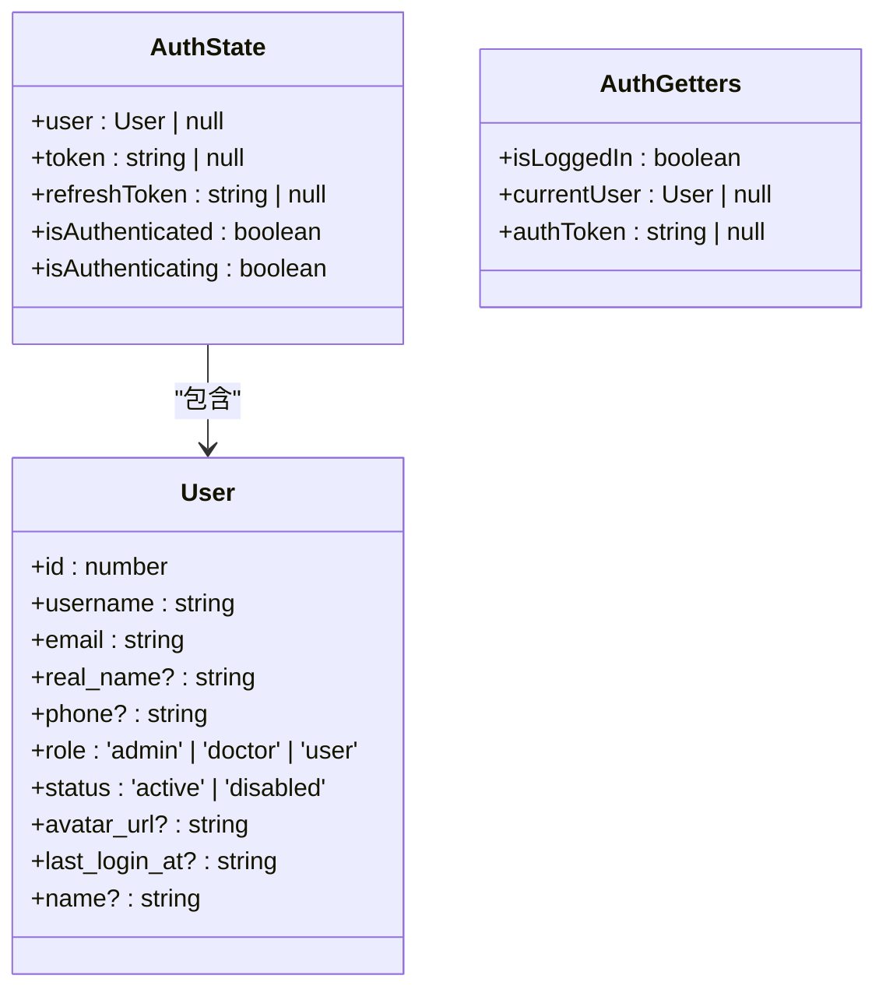

**Diagram sources**
- [authStore.ts](file://src/stores/authStore.ts#L5-L27)

### studyStore状态定义

studyStore管理病例数据，包括病例列表、当前病例、加载状态等：

```mermaid
classDiagram
class Study {
+id : number
+study_id : string
+patient_id : number
+patientName : string
+patientId : string
+studyDate : string
+status : 'pending' | 'completed' | 'processing' | 'failed'
+study_type : string
+modality : string
+bodyPart : string
+description? : string
+imageUrl? : string
+images? : Array<{ id : number; file_path : string; original_filename : string }>
+analysisResult? : AnalysisResult
+uploadedAt : string
+created_at : string
+taskId? : number
}
class StudyState {
+studies : Study[]
+currentStudy : Study | null
+loading : boolean
+error : string | null
}
class StudyGetters {
+allStudies : Study[]
+getStudyById(id : string) : Study | null
+completedStudies : Study[]
+processingStudies : Study[]
+recentStudies : Study[]
}
StudyState --> Study : "包含"
```

**Diagram sources**
- [studyStore.ts](file://src/stores/studyStore.ts#L7-L32)

### analysisStore状态定义

analysisStore处理AI分析任务的状态管理，包括任务列表、当前任务、轮询机制等：

```mermaid
classDiagram
class AnalysisResult {
+diagnosis : string
+confidence : number
+recommendations : string[]
+suspiciousAreas? : string[]
+biomarkers? : { HPV : string; p16 : string; Ki67 : string }
+detailedReport? : string
}
class AnalysisTask {
+id : string
+studyId : string
+status : 'PENDING' | 'PROCESSING' | 'SUCCESS' | 'FAILED'
+progress : number
+result? : AnalysisResult
+error? : string
+createdAt : string
+completedAt? : string
}
class AnalysisState {
+tasks : AnalysisTask[]
+currentTask : AnalysisTask | null
+loading : boolean
+error : string | null
+pollingIntervals : Map<string, NodeJS.Timeout>
}
class AnalysisGetters {
+getTaskByStudyId(studyId : string) : AnalysisTask | null
+getActiveTasks : AnalysisTask[]
+getCompletedTasks : AnalysisTask[]
}
AnalysisState --> AnalysisTask : "包含"
AnalysisTask --> AnalysisResult : "包含"
```

**Diagram sources**
- [analysisStore.ts](file://src/stores/analysisStore.ts#L5-L34)

### modelStore状态定义

modelStore管理AI模型信息，包括模型列表、当前模型、预测结果等：

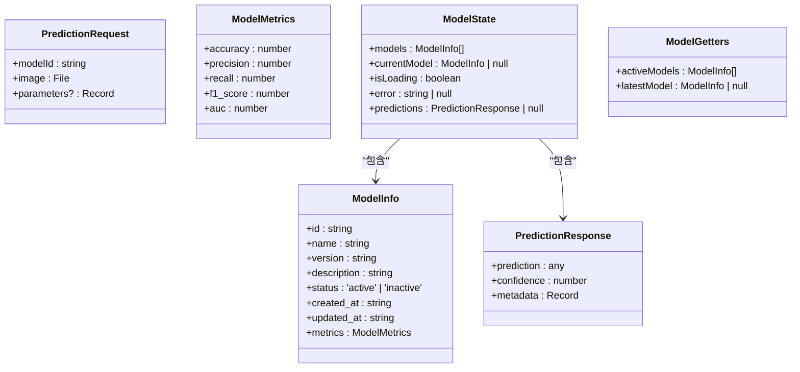

**Diagram sources**
- [modelStore.ts](file://src/stores/modelStore.ts#L1-L14)

## 状态持久化与初始化

### localStorage持久化机制

CervixDetectAI项目通过localStorage实现状态持久化，确保用户刷新页面后仍能保持登录状态和相关数据：

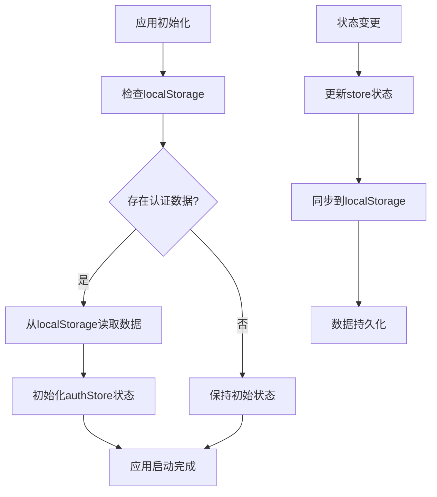

**Diagram sources**
- [authStore.ts](file://src/stores/authStore.ts#L138-L149)
- [App.vue](file://src/App.vue#L12-L14)

### 状态初始化流程

应用启动时通过initializeAuth方法从localStorage初始化认证状态：

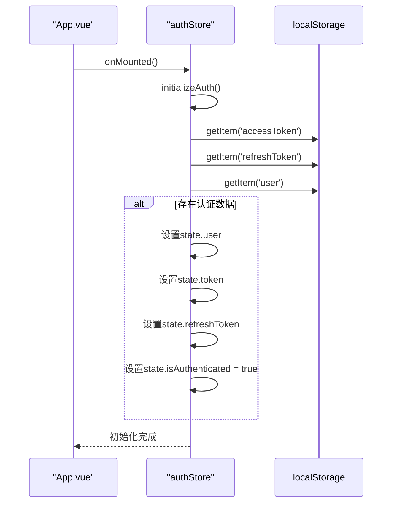

**Diagram sources**
- [App.vue](file://src/App.vue#L12-L14)
- [authStore.ts](file://src/stores/authStore.ts#L138-L149)

## 跨组件状态共享机制

### 组件间状态共享示例

通过Pinia store实现跨组件状态共享，避免了复杂的prop传递和事件发射：

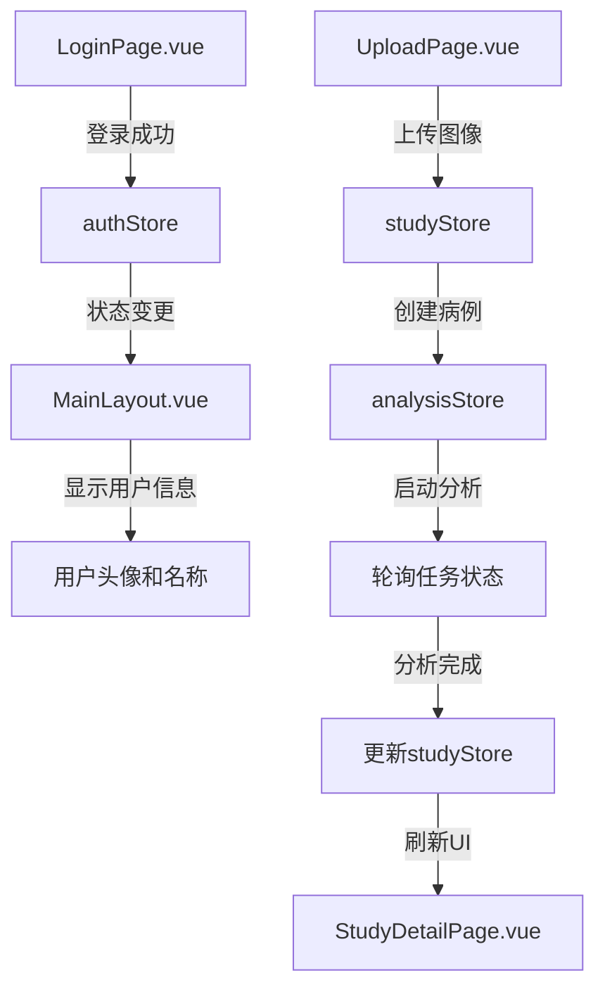

**Diagram sources**
- [LoginPage.vue](file://src/pages/LoginPage.vue#L244-L255)
- [MainLayout.vue](file://src/layouts/MainLayout.vue#L114-L127)
- [UploadPage.vue](file://src/pages/UploadPage.vue#L330-L407)
- [studyStore.ts](file://src/stores/studyStore.ts#L142-L196)
- [analysisStore.ts](file://src/stores/analysisStore.ts#L48-L152)

### 状态同步机制

当分析任务完成时，通过store间的状态同步更新相关数据：

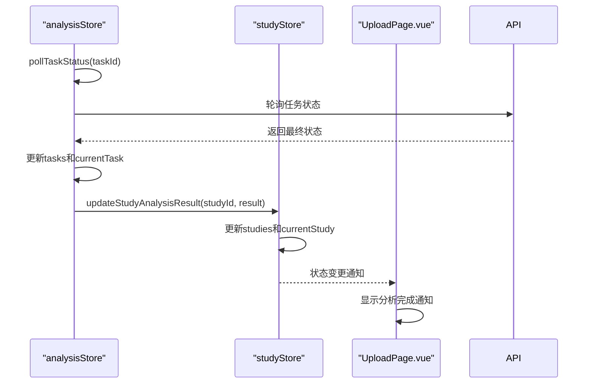

**Diagram sources**
- [analysisStore.ts](file://src/stores/analysisStore.ts#L98-L152)
- [studyStore.ts](file://src/stores/studyStore.ts#L231-L248)
- [UploadPage.vue](file://src/pages/UploadPage.vue#L408-L444)

## 登录流程状态管理

### 邮箱登录流程

邮箱登录流程涉及authStore的状态变更和API交互：

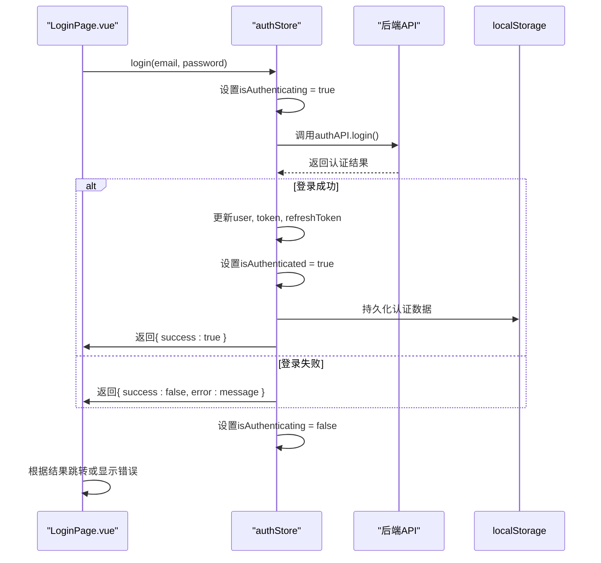

**Diagram sources**
- [LoginPage.vue](file://src/pages/LoginPage.vue#L244-L263)
- [authStore.ts](file://src/stores/authStore.ts#L75-L80)

### 短信验证码登录流程

短信验证码登录流程支持自动注册新用户：

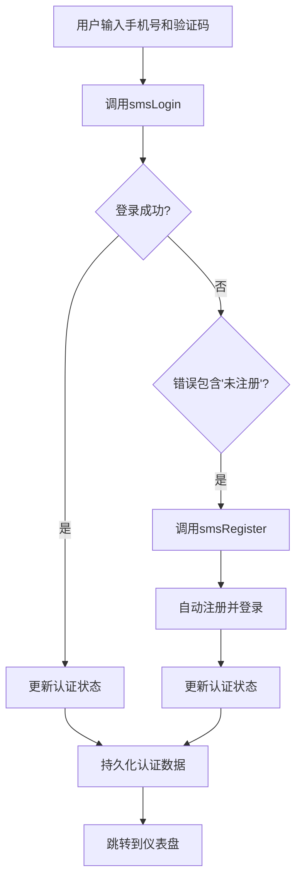

**Diagram sources**
- [LoginPage.vue](file://src/pages/LoginPage.vue#L274-L317)
- [authStore.ts](file://src/stores/authStore.ts#L95-L112)

## 图像上传分析流程

### 完整上传分析流程

从图像上传到AI分析完成的完整流程：

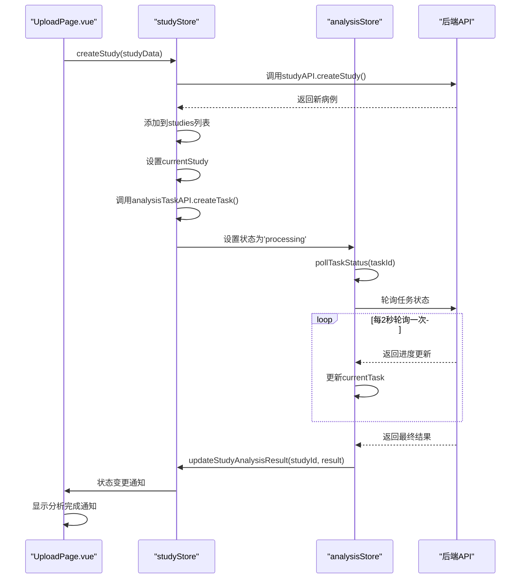

**Diagram sources**
- [UploadPage.vue](file://src/pages/UploadPage.vue#L330-L444)
- [studyStore.ts](file://src/stores/studyStore.ts#L142-L196)
- [analysisStore.ts](file://src/stores/analysisStore.ts#L48-L152)

### 状态变更生命周期

图像上传分析过程中的状态变更生命周期：

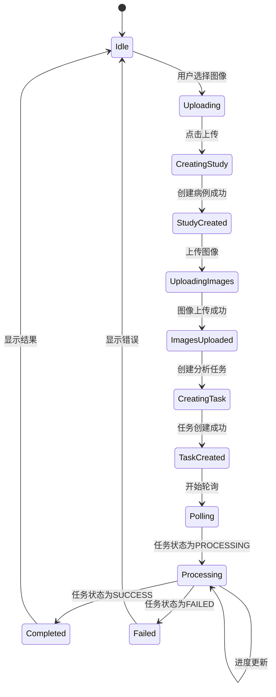

**Diagram sources**
- [UploadPage.vue](file://src/pages/UploadPage.vue#L330-L480)
- [studyStore.ts](file://src/stores/studyStore.ts#L142-L203)
- [analysisStore.ts](file://src/stores/analysisStore.ts#L48-L152)

## 错误处理策略

### 统一错误处理模式

各store采用统一的错误处理模式，确保用户体验一致性：

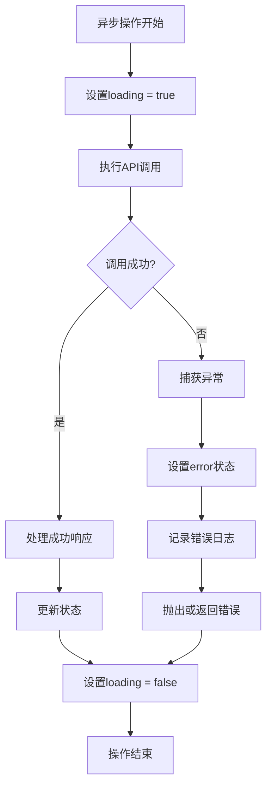

**Diagram sources**
- [authStore.ts](file://src/stores/authStore.ts#L53-L73)
- [studyStore.ts](file://src/stores/studyStore.ts#L57-L97)
- [analysisStore.ts](file://src/stores/analysisStore.ts#L62-L92)

### 具体错误处理实现

不同store的错误处理具体实现：

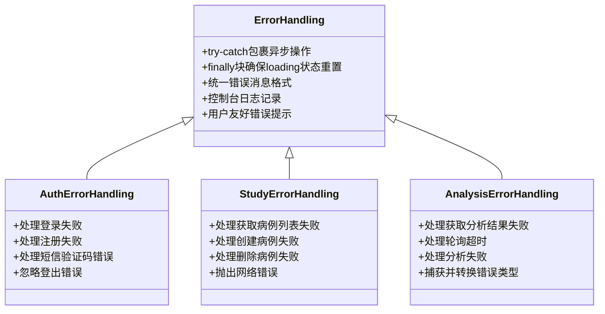

**Diagram sources**
- [authStore.ts](file://src/stores/authStore.ts#L67-L70)
- [studyStore.ts](file://src/stores/studyStore.ts#L90-L97)
- [analysisStore.ts](file://src/stores/analysisStore.ts#L87-L92)

## 异步状态更新最佳实践

### 异步操作状态管理

异步操作的状态管理遵循最佳实践：

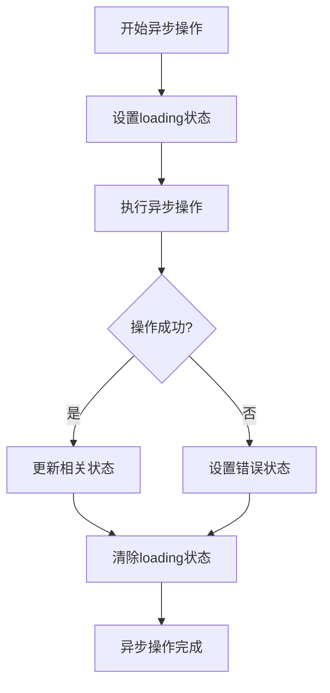

**Diagram sources**
- [authStore.ts](file://src/stores/authStore.ts#L53-L73)
- [studyStore.ts](file://src/stores/studyStore.ts#L57-L97)
- [analysisStore.ts](file://src/stores/analysisStore.ts#L62-L92)

### 轮询机制实现

analysisStore中的轮询机制实现：

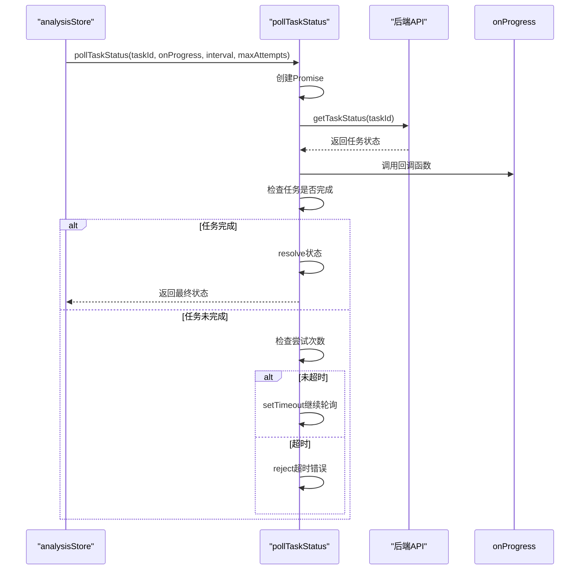

**Diagram sources**
- [analysisStore.ts](file://src/stores/analysisStore.ts#L98-L152)
- [apiService.ts](file://src/services/apiService.ts#L148-L189)

## 状态不一致问题调试方法

### 常见状态不一致问题

常见的状态不一致问题及其原因：

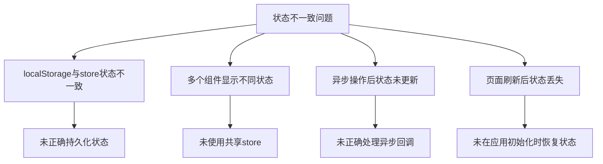

**Diagram sources**
- [authStore.ts](file://src/stores/authStore.ts#L138-L149)
- [App.vue](file://src/App.vue#L12-L14)

### 调试方法与工具

推荐的调试方法和工具：

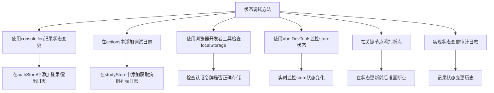

**Diagram sources**
- [authStore.ts](file://src/stores/authStore.ts#L53-L73)
- [studyStore.ts](file://src/stores/studyStore.ts#L56-L97)
- [analysisStore.ts](file://src/stores/analysisStore.ts#L61-L92)