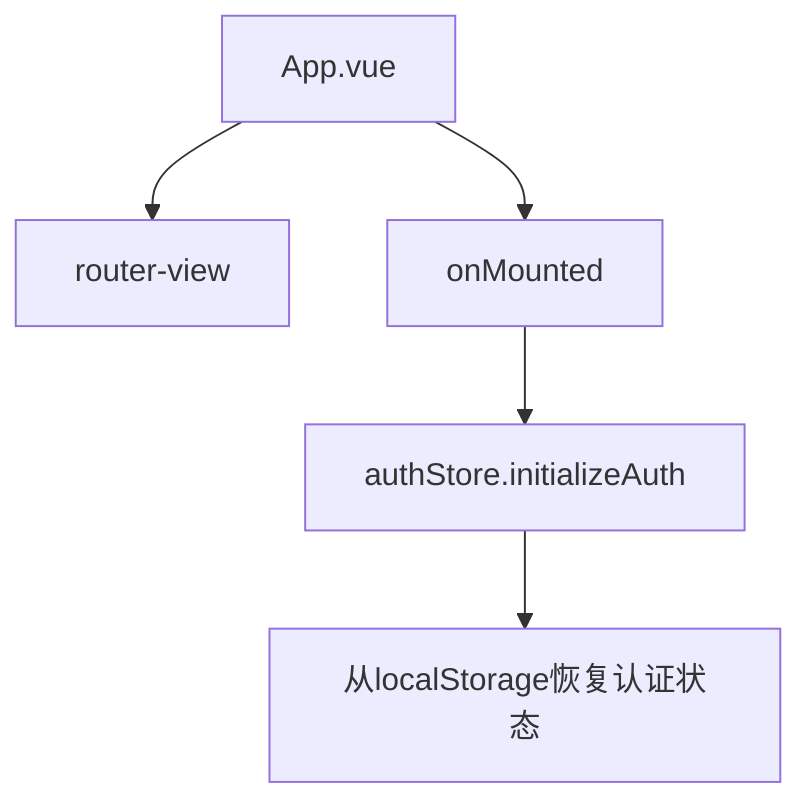
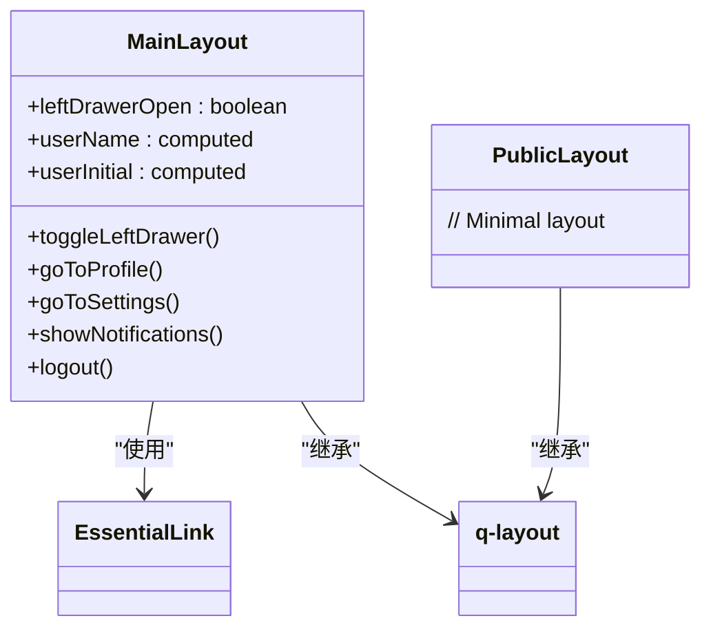
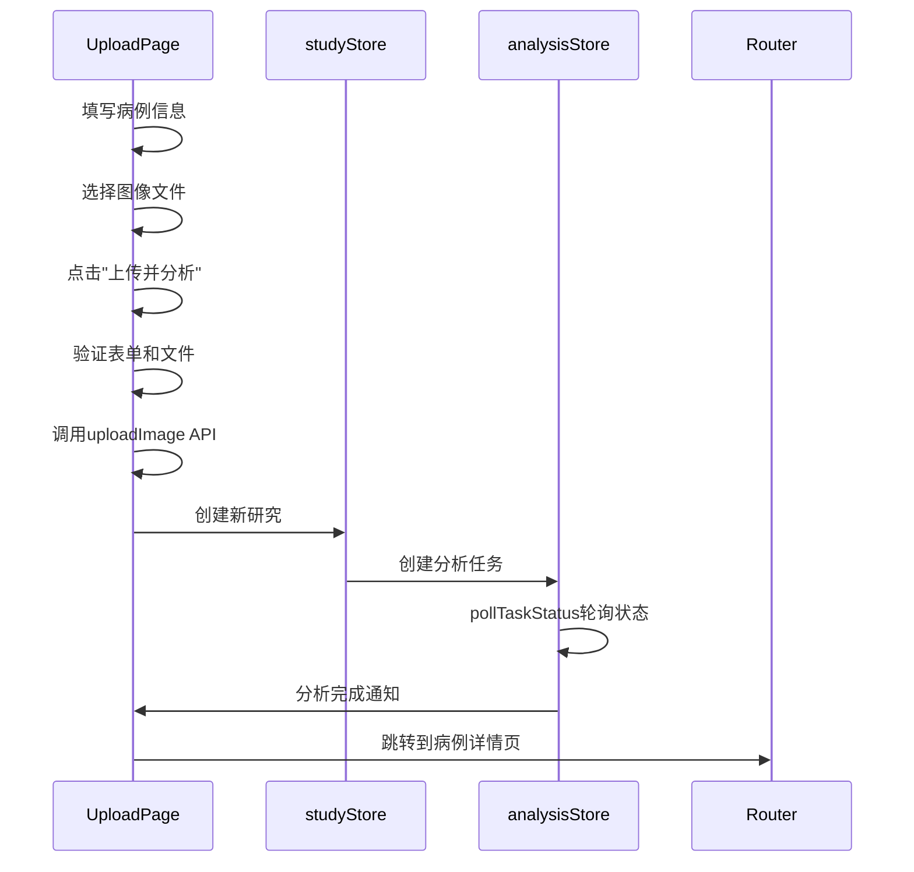
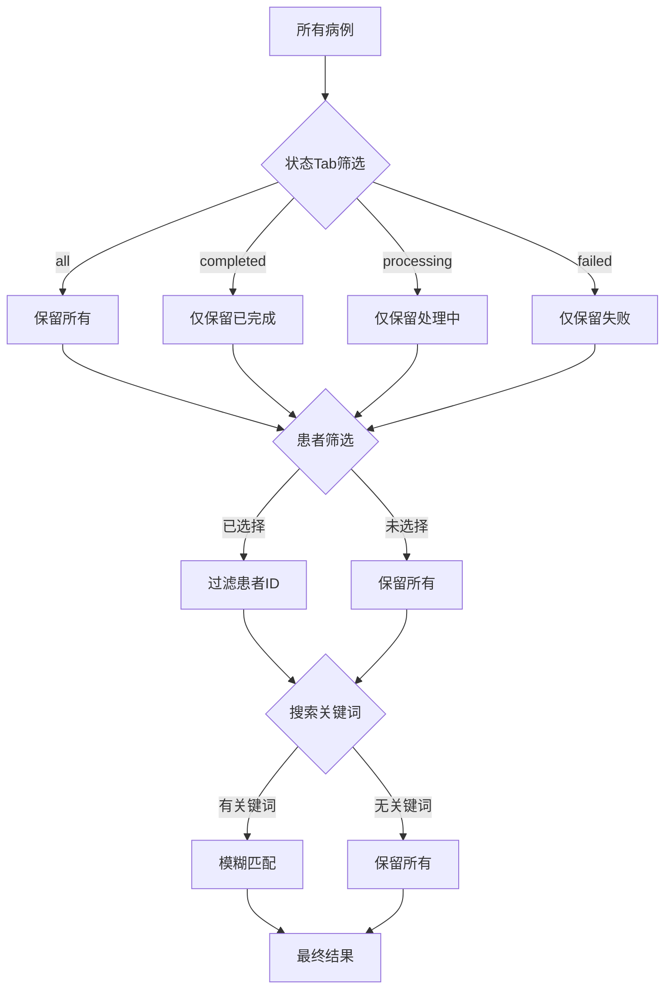
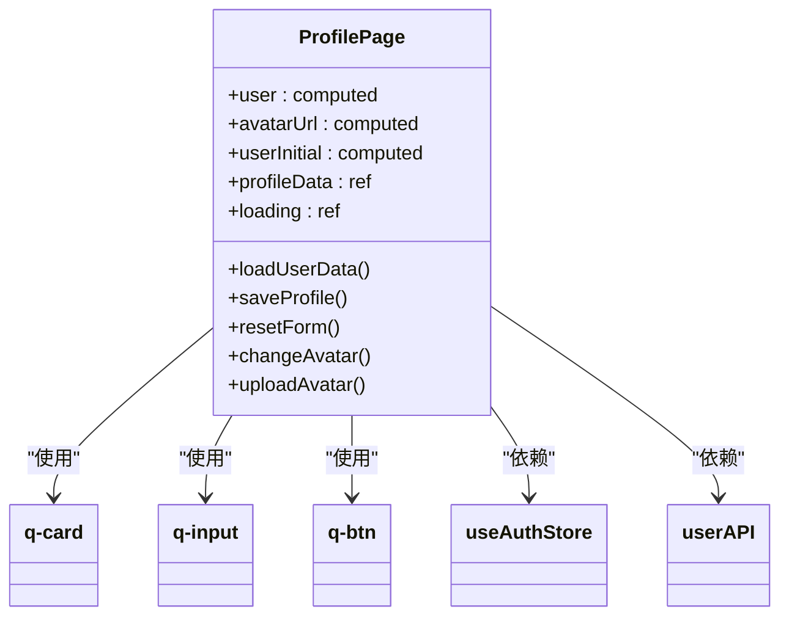
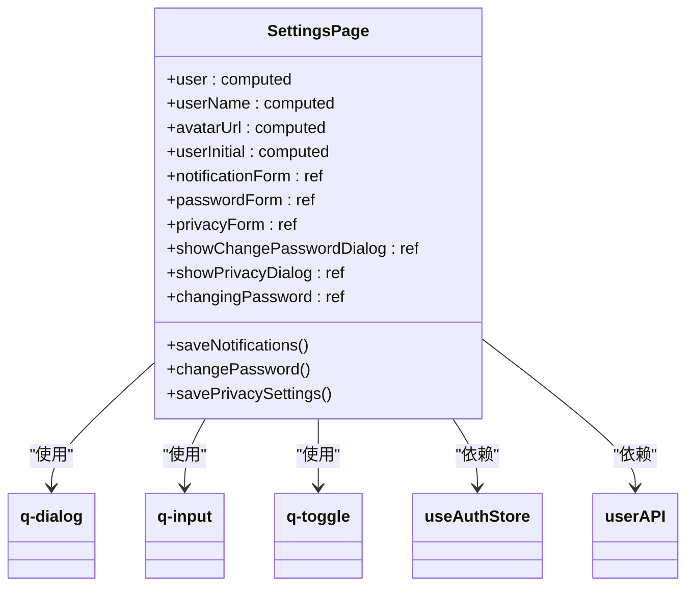
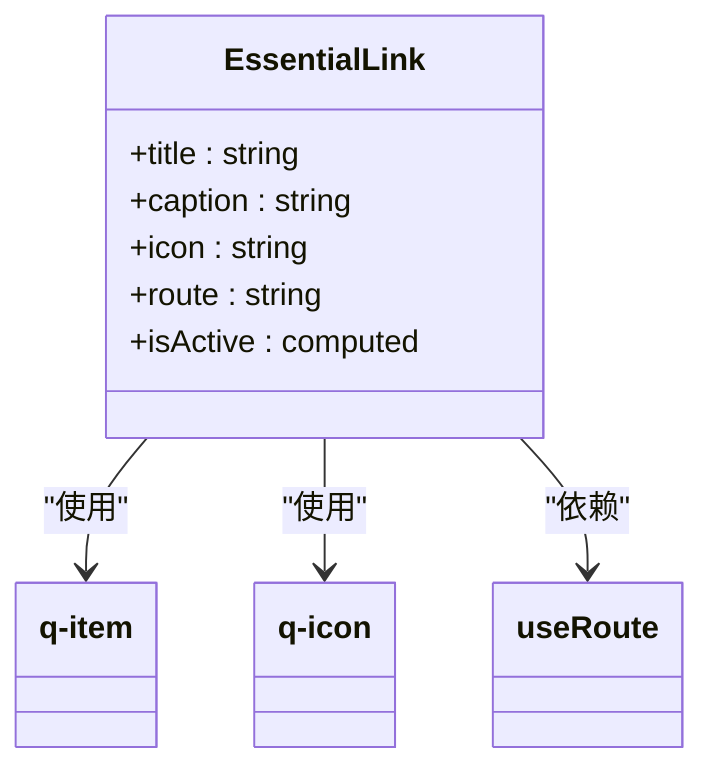
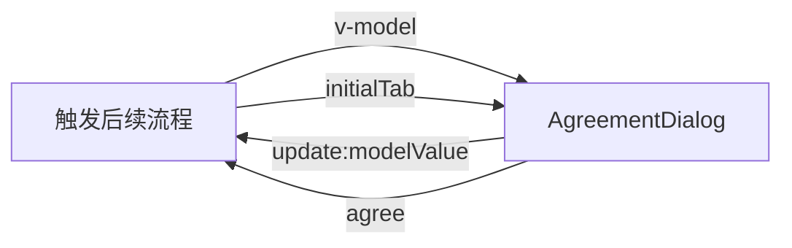
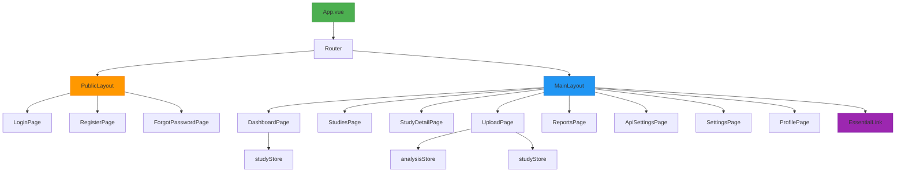

# 组件架构

> **本文档引用的文件**
> - [App.vue](file://src/App.vue)
> - [MainLayout.vue](file://src/layouts/MainLayout.vue)
> - [PublicLayout.vue](file://src/layouts/PublicLayout.vue)
> - [DashboardPage.vue](file://src/pages/DashboardPage.vue)
> - [UploadPage.vue](file://src/pages/UploadPage.vue)
> - [EssentialLink.vue](file://src/components/EssentialLink.vue)
> - [routes.ts](file://src/router/routes.ts)
> - [authStore.ts](file://src/stores/authStore.ts)
> - [studyStore.ts](file://src/stores/studyStore.ts)
> - [ProfilePage.vue](file://src/pages/ProfilePage.vue) - *已重构，采用现代化表单布局*
> - [SettingsPage.vue](file://src/pages/SettingsPage.vue) - *增强密码更改对话框功能*
> - [api.ts](file://src/services/api.ts) - *包含用户资料和密码更新API*

## 目录

1. [项目结构概览](#项目结构概览)
2. [根组件App.vue](#根组件appvue)
3. [布局组件设计](#布局组件设计)
4. [页面组件分析](#页面组件分析)
5. [基础UI组件封装](#基础ui组件封装)
6. [组件通信机制](#组件通信机制)
7. [响应式设计实现](#响应式设计实现)
8. [组件嵌套关系图示](#组件嵌套关系图示)

## 项目结构概览

CervixDetectAI前端采用基于Vue 3的MVVM模式，结合Quasar框架构建现代化的单页应用。项目结构清晰地划分为组件、布局、页面、路由、状态管理等核心模块，实现了关注点分离和代码复用。

**Section sources**

- [App.vue](file://src/App.vue)
- [MainLayout.vue](file://src/layouts/MainLayout.vue)
- [PublicLayout.vue](file://src/layouts/PublicLayout.vue)

## 根组件App.vue

根组件App.vue作为整个应用的入口点，采用极简设计，仅包含一个`<router-view />`占位符。其主要职责是初始化应用级别的状态，特别是用户认证状态。通过`onMounted`生命周期钩子，调用`authStore.initializeAuth()`方法从localStorage恢复用户会话，确保用户刷新页面后仍保持登录状态。



**Diagram sources**

- [App.vue](file://src/App.vue#L1-L16)
- [authStore.ts](file://src/stores/authStore.ts#L19-L217)

**Section sources**

- [App.vue](file://src/App.vue#L1-L16)
- [authStore.ts](file://src/stores/authStore.ts#L19-L217)

## 布局组件设计

项目定义了两种布局组件：MainLayout.vue和PublicLayout.vue，分别服务于已认证用户和公共访问场景。

### MainLayout.vue

MainLayout.vue为应用主布局，包含顶部导航栏、左侧侧边栏和主要内容区域。其设计意图是为已登录用户提供完整的应用功能导航。

- **顶部导航栏**：显示应用Logo、应用名称，并包含用户头像、通知和退出登录等用户相关操作。
- **左侧侧边栏**：通过`EssentialLink`组件动态渲染导航链接，分为"主功能"和"分析功能"两个部分。
- **主要内容区域**：使用`<router-view />`渲染当前路由对应的页面组件。

该布局利用Quasar的`q-layout`、`q-header`、`q-drawer`等组件实现响应式设计，确保在不同屏幕尺寸下均有良好的用户体验。

### PublicLayout.vue

PublicLayout.vue为公共布局，设计意图是为登录、注册等公共页面提供简洁的界面。该布局仅包含一个`<q-layout>`和`<router-view />`，没有侧边栏和复杂的头部，确保用户在认证流程中不受干扰。



**Diagram sources**

- [MainLayout.vue](file://src/layouts/MainLayout.vue#L1-L211)
- [PublicLayout.vue](file://src/layouts/PublicLayout.vue#L1-L16)

**Section sources**

- [MainLayout.vue](file://src/layouts/MainLayout.vue#L1-L211)
- [PublicLayout.vue](file://src/layouts/PublicLayout.vue#L1-L16)

## 页面组件分析

页面组件位于`src/pages`目录下，代表应用中的各个功能页面。

### DashboardPage.vue

仪表盘页面是用户登录后的默认首页，提供系统概览和快捷操作。其结构包含：

- **欢迎横幅**：显示欢迎信息和新分析按钮。
- **统计卡片**：展示研究总数、已完成、处理中等关键指标。
- **近期研究表格**：列出最近的病例，支持状态着色和查看详情操作。
- **快捷操作列表**：提供上传新研究、查看所有研究等常用功能的快速入口。

该组件通过`useStudyStore`获取研究数据，并在`onMounted`钩子中调用`fetchStudies`方法加载数据，体现了MVVM模式下的数据驱动视图更新。

### UploadPage.vue

上传页面负责处理新病例的创建和图像上传。该页面已经进行了用户体验优化，特别是日期选择器的改进。

**结构组成**：

- **左栏**：文件上传区域，使用Quasar的`q-uploader`组件处理文件选择和预览。
- **右栏**：病例信息表单，包含患者姓名、ID、描述、检查方式、检查日期等字段。

**日期选择器改进：**

- **中文本地化**：通过 `dateLocale` 配置实现中文星期和月份显示

  ```typescript
  const dateLocale = {
    days: ['星期日', '星期一', '星期二', '星期三', '星期四', '星期五', '星期六'],
    daysShort: ['周日', '周一', '周二', '周三', '周四', '周五', '周六'],
    months: ['1月', '2月', '3月', '4月', '5月', '6月', '7月', '8月', '9月', '10月', '11月', '12月'],
    monthsShort: [
      '1月',
      '2月',
      '3月',
      '4月',
      '5月',
      '6月',
      '7月',
      '8月',
      '9月',
      '10月',
      '11月',
      '12月',
    ],
  };
  ```

- **快速选择**：添加 `today-btn` 属性，用户可一键选择今天日期

- **弹窗确认**：日期选择器底部增加“取消”和“确定”按钮，提供更明确的操作反馈

  ```vue
  <div class="row items-center justify-end q-gutter-sm">
    <q-btn label="取消" color="primary" flat v-close-popup />
    <q-btn label="确定" color="primary" flat v-close-popup />
  </div>
  ```

- **日期格式**：使用 `mask="YYYY-MM-DD"` 统一日期格式，便于数据处理

**上传流程**：
该组件通过`studyInfo`响应式对象管理表单数据，并在`uploadAndAnalyze`方法中处理文件上传和分析任务创建的完整流程，包括错误处理和用户通知。



**Diagram sources**

- [DashboardPage.vue](file://src/pages/DashboardPage.vue#L1-L260)
- [UploadPage.vue](file://src/pages/UploadPage.vue#L1-L483)
- [studyStore.ts](file://src/stores/studyStore.ts#L26-L265)

**Section sources**

- [DashboardPage.vue](file://src/pages/DashboardPage.vue#L1-L260)
- [UploadPage.vue](file://src/pages/UploadPage.vue#L1-L483)

### StudiesPage.vue

病例管理页面是系统的核心功能之一，提供了全面的病例数据查看、筛选和管理功能。该页面已经进行了重大优化，引入了多维度的数据筛选功能。

**主要功能更新：**

- **Tab切换筛选**：通过 `q-tabs` 组件实现状态分类：
  - 全部病例：显示所有病例
  - 已完成：仅显示 status='completed' 的病例，带有绿色badge显示数量
  - 处理中：仅显示 status='processing' 的病例，带有橙色badge显示数量
  - 失败：仅显示 status='failed' 的病例，带有红色badge显示数量

- **患者筛选功能**：新增 `q-select` 下拉选择器，可根据患者姓名过滤病例
  - 自动从所有病例中提取唯一患者列表
  - 支持 `clearable` 清空按钮快速移除筛选
  - 配合图标 `person` 提升用户体验

- **多维度搜索**：增强的 `q-input` 搜索框
  - 支持患者姓名模糊搜索
  - 支持患者ID精确匹配
  - 支持检查方式（modality）搜索
  - 防抖动设置（debounce=300ms）优化性能

- **智能计数器**：各状态病例的实时统计显示
  - `completedCount`: 已完成病例数量
  - `processingCount`: 处理中病例数量
  - `failedCount`: 失败病例数量

该组件通过 `filteredStudies` 计算属性实现了多条件组合筛选：

1. 首先根据Tab状态过滤
2. 然后根据选定的患者ID过滤
3. 最后应用搜索关键词过滤



**Diagram sources**

- [StudiesPage.vue](file://src/pages/StudiesPage.vue#L218-L244)

**Section sources**

- [StudiesPage.vue](file://src/pages/StudiesPage.vue#L1-L373)

### ProfilePage.vue

ProfilePage.vue已被完全重构，采用了现代化的表单布局设计，显著提升了用户体验和功能完整性。

**主要更新内容：**

- **现代化表单布局**：采用响应式网格系统，将个人资料分为左右两栏。左侧为用户概览卡片，右侧为详细信息编辑表单。
- **带图标的输入框**：所有输入字段均配备语义化图标（如姓名`badge`、邮箱`email`、电话`phone`、地址`location_on`），提升界面直观性。
- **加载状态与错误处理**：在`saveProfile`方法中实现`loading`状态，防止重复提交；通过`$q.notify`提供成功、警告和错误通知。
- **头像上传功能**：新增`changeAvatar`方法，通过原生`input[type="file"]`触发文件选择对话框，支持JPEG、PNG、GIF、WebP格式，并限制文件大小不超过5MB。
- **数据验证**：在上传前检查文件大小，在保存资料时通过API响应处理错误。

该组件通过`useAuthStore`获取用户信息，并利用`userAPI.updateProfile`和`userAPI.uploadAvatar` API实现数据持久化。



**Diagram sources**

- [ProfilePage.vue](file://src/pages/ProfilePage.vue#L1-L549)
- [api.ts](file://src/services/api.ts#L125-L148)
- [authStore.ts](file://src/stores/authStore.ts#L20-L219)

**Section sources**

- [ProfilePage.vue](file://src/pages/ProfilePage.vue#L1-L549)
- [api.ts](file://src/services/api.ts#L125-L148)
- [authStore.ts](file://src/stores/authStore.ts#L20-L219)

### SettingsPage.vue

SettingsPage.vue增强了密码更改功能，提升了安全性和用户体验。

**主要更新内容：**

- **密码更改对话框**：通过`q-dialog`组件实现模态对话框，包含当前密码、新密码和确认新密码三个输入字段。
- **客户端验证**：在`changePassword`方法中实现全面的客户端验证，包括：
  - 检查所有字段是否填写
  - 验证新密码与确认密码是否匹配
  - 确保新密码长度至少6位
- **异步提交**：实现`changingPassword`加载状态，防止重复提交，并通过`userAPI.updatePassword` API异步更新密码。
- **用户反馈**：使用`$q.notify`提供各种操作结果的即时反馈。

该组件还包含通知偏好设置和隐私设置，通过`q-toggle`组件管理用户的各类偏好。



**Diagram sources**

- [SettingsPage.vue](file://src/pages/SettingsPage.vue#L1-L357)
- [api.ts](file://src/services/api.ts#L125-L139)
- [authStore.ts](file://src/stores/authStore.ts#L20-L219)

**Section sources**

- [SettingsPage.vue](file://src/pages/SettingsPage.vue#L1-L357)
- [api.ts](file://src/services/api.ts#L125-L139)
- [authStore.ts](file://src/stores/authStore.ts#L20-L219)

## 基础UI组件封装

### EssentialLink.vue

`EssentialLink.vue`是一个基础UI组件，用于封装导航链接的通用样式和行为。该组件通过props接收`title`、`caption`、`icon`和`route`等属性，实现了高度的可复用性。

其核心功能包括：

- **响应式激活状态**：通过`isActive`计算属性判断当前链接是否处于激活状态，实现导航高亮。
- **图标支持**：可选的`icon`属性用于显示导航图标。
- **标题和副标题**：支持主标题和副标题的显示，增强信息传达。

该组件的封装方式体现了Vue组件设计的最佳实践：单一职责、属性驱动、可复用性强。



**Diagram sources**

- [EssentialLink.vue](file://src/components/EssentialLink.vue#L1-L43)

**Section sources**

- [EssentialLink.vue](file://src/components/EssentialLink.vue#L1-L43)

### AliCaptcha.vue

`AliCaptcha.vue` 封装了阿里云 ESA AI 验证码服务，位于 `src/components/common` 目录。它实现了验证码脚本的动态加载、实例生命周期管理以及与后端验证接口的对接。

**核心功能：**

- **动态脚本加载**：仅在组件激活时动态加载阿里云 SDK，避免影响首屏加载速度，并包含防重复加载机制。
- **多场景支持**：通过 `sceneId` prop 支持不同的验证场景（如登录、注册、密码重置）。
- **完整状态管理**：内置 loading、error 状态，支持重试机制和加载中动画。

**接口定义：**

```typescript
// Props
interface Props {
  visible?: boolean;    // 是否显示/激活验证码
  instanceId?: string;  // 实例ID，用于区分页面上多个验证码
  sceneId?: string;     // 业务场景ID
}

// Events
emit('success', token: string) // 验证成功，返回验签 token
emit('fail', error: string)    // 验证失败
emit('ready')                  // SDK 加载完成
```

### AgreementDialog.vue

`AgreementDialog.vue` 是一个功能完善的法律条款展示组件，集成了用户协议和隐私政策，支持响应式布局。

**设计特点：**

- **响应式模态框**：
  - 桌面端：固定 700px 宽度的居中对话框。
  - 移动端：自动切换为全屏模式，提供原生应用般的阅读体验。
- **双模态支持**：
  - **强制同意模式**：仅显示"我已阅读并同意"按钮，常用于注册流程。
  - **查看模式**：显示"关闭"按钮，用于仅查看协议内容。
- **内容组织**：使用 `q-tabs` 和 `q-tab-panels` 组织长篇幅的法律文本，内置滚动区域。

**核心交互：**

```typescript
// Props
interface Props {
  modelValue: boolean;                  // v-model 控制显示
  initialTab?: 'agreement' | 'privacy'; // 初始显示的标签页
  showAgreeButton?: boolean;            // 是否显示同意按钮（false则显示关闭按钮）
}
```



## 组件通信机制

CervixDetectAI前端采用多种机制实现组件间的通信：

### 父子组件通信（Props/Emits）

- **Props**：父组件通过props向子组件传递数据。例如，`MainLayout.vue`将导航链接数据通过`v-bind="link"`传递给`EssentialLink.vue`。
- **Emits**：子组件通过emits向父组件发送事件。虽然在当前分析的组件中未直接体现，但这是Vue组件通信的标准方式。

### 状态管理（Pinia Store）

项目采用Pinia进行全局状态管理，实现了跨组件的状态共享：

- **authStore**：管理用户认证状态，包括用户信息、令牌和认证状态。
- **studyStore**：管理病例数据，包括所有病例、当前病例和加载状态。
- **analysisStore**：管理AI分析任务状态。

通过`useStore`组合式函数，任何组件都可以访问和修改全局状态，避免了复杂的props层层传递。

### 路由参数传递

通过Vue Router的`params`和`props`机制，实现页面间的参数传递。例如，`StudyDetailPage.vue`通过`props: true`接收路由参数中的`id`。

**Section sources**

- [MainLayout.vue](file://src/layouts/MainLayout.vue#L84-L90)
- [routes.ts](file://src/router/routes.ts#L31-L35)
- [authStore.ts](file://src/stores/authStore.ts#L19-L217)
- [studyStore.ts](file://src/stores/studyStore.ts#L26-L265)

## 响应式设计实现

CervixDetectAI前端的响应式设计主要通过Quasar框架实现：

### 布局系统

Quasar提供了强大的响应式布局系统，通过`row`、`col`等类名和`q-col-gutter`等属性，实现灵活的网格布局。例如，在`DashboardPage.vue`中使用`div class="row q-col-gutter-md"`创建响应式网格。

### 断点系统

Quasar内置了基于CSS媒体查询的断点系统（xs, sm, md, lg, xl），允许开发者针对不同屏幕尺寸应用不同的样式。例如，`col-lg-8 col-md-12`表示在大屏幕上占8列，在中等屏幕上占12列。

### 组件响应式

Quasar组件本身具有响应式特性，如`q-drawer`在小屏幕上自动变为抽屉式导航，`q-uploader`在不同尺寸下调整布局等。

**Section sources**

- [quasar.config.ts](file://quasar.config.ts#L1-L218)
- [DashboardPage.vue](file://src/pages/DashboardPage.vue#L3-L198)
- [UploadPage.vue](file://src/pages/UploadPage.vue#L14-L257)

## 组件嵌套关系图示



**Diagram sources**

- [App.vue](file://src/App.vue#L1-L16)
- [routes.ts](file://src/router/routes.ts#L3-L72)
- [MainLayout.vue](file://src/layouts/MainLayout.vue#L1-L211)
- [PublicLayout.vue](file://src/layouts/PublicLayout.vue#L1-L16)

**Section sources**

- [App.vue](file://src/App.vue#L1-L16)
- [routes.ts](file://src/router/routes.ts#L3-L72)
- [MainLayout.vue](file://src/layouts/MainLayout.vue#L1-L211)
- [PublicLayout.vue](file://src/layouts/PublicLayout.vue#L1-L16)
