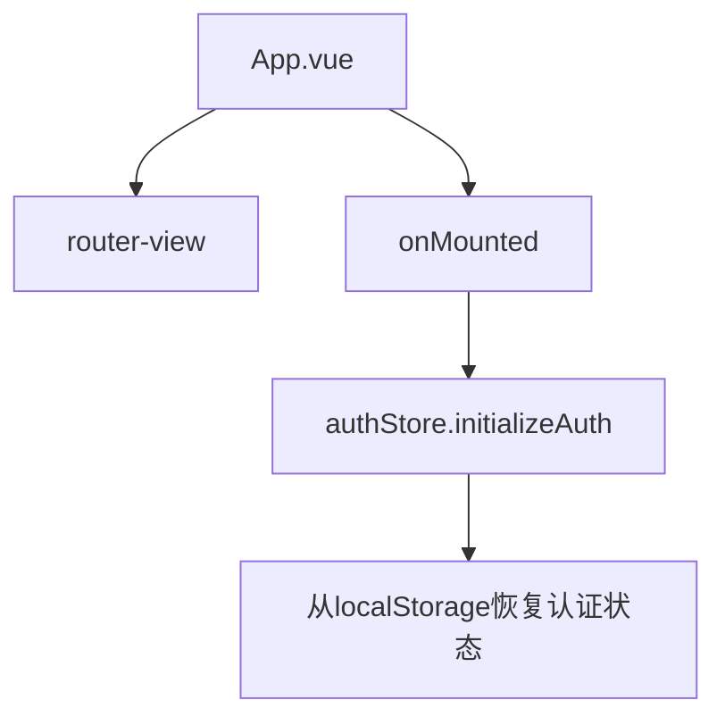
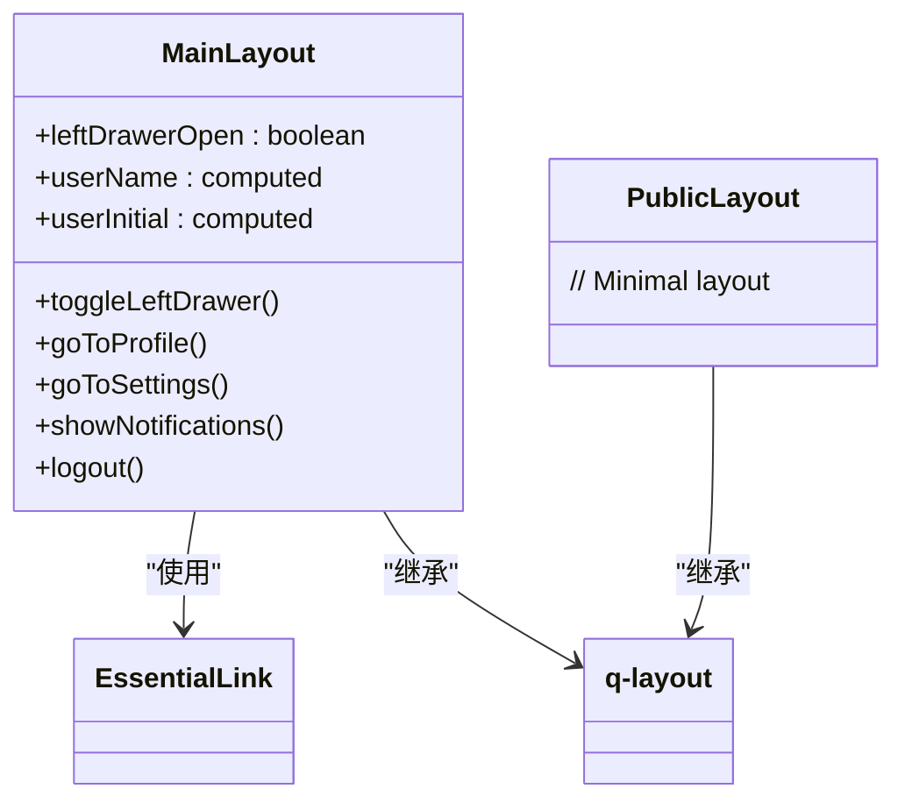
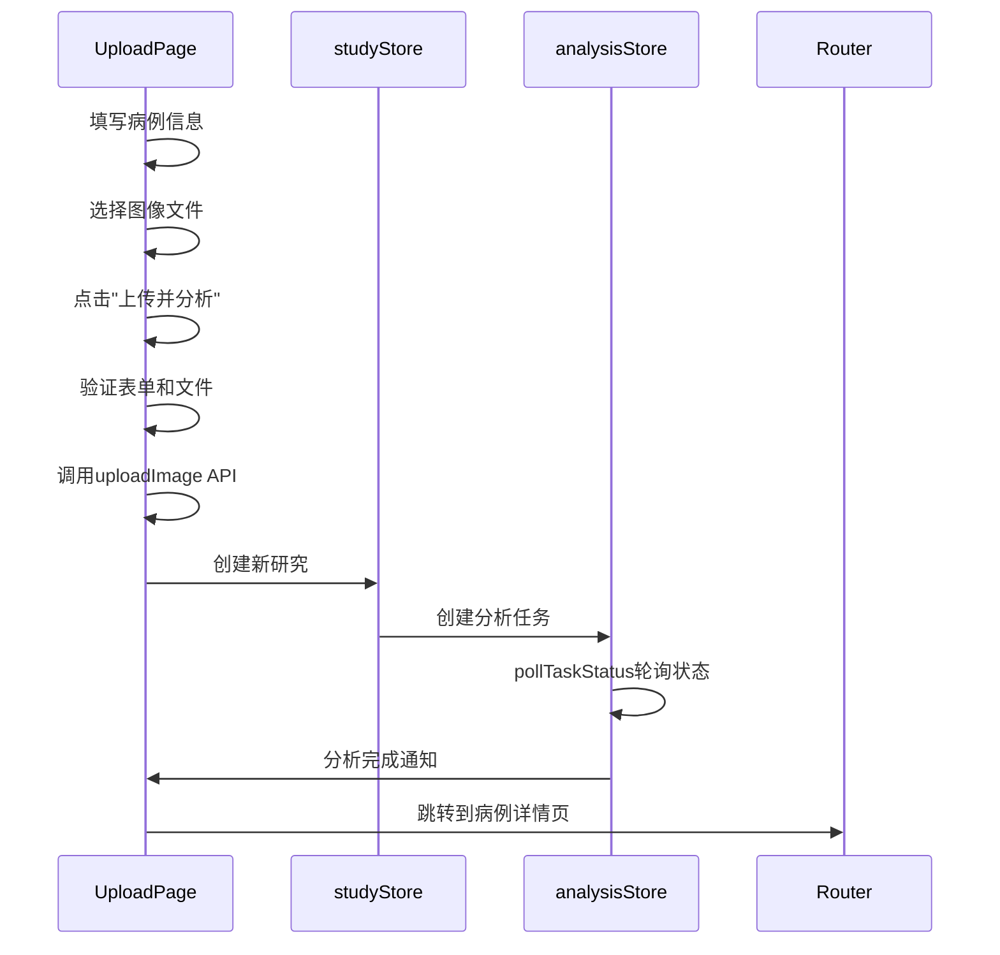
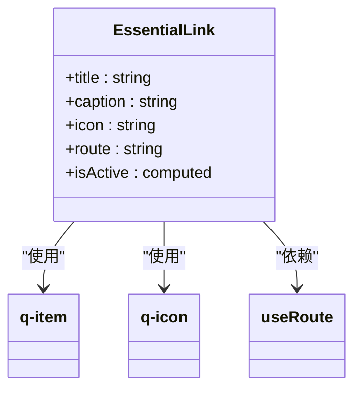
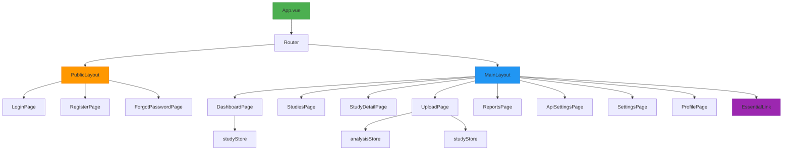

# 组件架构

<cite>
**本文档引用的文件**
- [App.vue](file://src/App.vue)
- [MainLayout.vue](file://src/layouts/MainLayout.vue)
- [PublicLayout.vue](file://src/layouts/PublicLayout.vue)
- [DashboardPage.vue](file://src/pages/DashboardPage.vue)
- [UploadPage.vue](file://src/pages/UploadPage.vue)
- [EssentialLink.vue](file://src/components/EssentialLink.vue)
- [routes.ts](file://src/router/routes.ts)
- [authStore.ts](file://src/stores/authStore.ts)
- [studyStore.ts](file://src/stores/studyStore.ts)
</cite>

## 目录
1. [项目结构概览](#项目结构概览)
2. [根组件App.vue](#根组件appvue)
3. [布局组件设计](#布局组件设计)
4. [页面组件分析](#页面组件分析)
5. [基础UI组件封装](#基础ui组件封装)
6. [组件通信机制](#组件通信机制)
7. [响应式设计实现](#响应式设计实现)
8. [组件嵌套关系图示](#组件嵌套关系图示)

## 项目结构概览

CervixDetectAI前端采用基于Vue 3的MVVM模式，结合Quasar框架构建现代化的单页应用。项目结构清晰地划分为组件、布局、页面、路由、状态管理等核心模块，实现了关注点分离和代码复用。

**Section sources**
- [App.vue](file://src/App.vue)
- [MainLayout.vue](file://src/layouts/MainLayout.vue)
- [PublicLayout.vue](file://src/layouts/PublicLayout.vue)

## 根组件App.vue

根组件App.vue作为整个应用的入口点，采用极简设计，仅包含一个`<router-view />`占位符。其主要职责是初始化应用级别的状态，特别是用户认证状态。通过`onMounted`生命周期钩子，调用`authStore.initializeAuth()`方法从localStorage恢复用户会话，确保用户刷新页面后仍保持登录状态。

**Diagram sources**
- [App.vue](file://src/App.vue#L1-L16)
- [authStore.ts](file://src/stores/authStore.ts#L19-L217)

**Section sources**
- [App.vue](file://src/App.vue#L1-L16)
- [authStore.ts](file://src/stores/authStore.ts#L19-L217)

## 布局组件设计

项目定义了两种布局组件：MainLayout.vue和PublicLayout.vue，分别服务于已认证用户和公共访问场景。

### MainLayout.vue

MainLayout.vue为应用主布局，包含顶部导航栏、左侧侧边栏和主要内容区域。其设计意图是为已登录用户提供完整的应用功能导航。

- **顶部导航栏**：显示应用Logo、应用名称，并包含用户头像、通知和退出登录等用户相关操作。
- **左侧侧边栏**：通过`EssentialLink`组件动态渲染导航链接，分为"主功能"和"分析功能"两个部分。
- **主要内容区域**：使用`<router-view />`渲染当前路由对应的页面组件。

该布局利用Quasar的`q-layout`、`q-header`、`q-drawer`等组件实现响应式设计，确保在不同屏幕尺寸下均有良好的用户体验。

### PublicLayout.vue

PublicLayout.vue为公共布局，设计意图是为登录、注册等公共页面提供简洁的界面。该布局仅包含一个`<q-layout>`和`<router-view />`，没有侧边栏和复杂的头部，确保用户在认证流程中不受干扰。

**Diagram sources**
- [MainLayout.vue](file://src/layouts/MainLayout.vue#L1-L211)
- [PublicLayout.vue](file://src/layouts/PublicLayout.vue#L1-L16)

**Section sources**
- [MainLayout.vue](file://src/layouts/MainLayout.vue#L1-L211)
- [PublicLayout.vue](file://src/layouts/PublicLayout.vue#L1-L16)

## 页面组件分析

页面组件位于`src/pages`目录下，代表应用中的各个功能页面。

### DashboardPage.vue

仪表盘页面是用户登录后的默认首页，提供系统概览和快捷操作。其结构包含：
- **欢迎横幅**：显示欢迎信息和新分析按钮。
- **统计卡片**：展示研究总数、已完成、处理中等关键指标。
- **近期研究表格**：列出最近的病例，支持状态着色和查看详情操作。
- **快捷操作列表**：提供上传新研究、查看所有研究等常用功能的快速入口。

该组件通过`useStudyStore`获取研究数据，并在`onMounted`钩子中调用`fetchStudies`方法加载数据，体现了MVVM模式下的数据驱动视图更新。

### UploadPage.vue

上传页面负责处理新病例的创建和图像上传。其结构分为左右两栏：
- **左栏**：文件上传区域，使用Quasar的`q-uploader`组件处理文件选择和预览。
- **右栏**：病例信息表单，包含患者姓名、ID、描述、检查方式、检查日期等字段。

该组件通过`studyInfo`响应式对象管理表单数据，并在`uploadAndAnalyze`方法中处理文件上传和分析任务创建的完整流程，包括错误处理和用户通知。

**Diagram sources**
- [DashboardPage.vue](file://src/pages/DashboardPage.vue#L1-L260)
- [UploadPage.vue](file://src/pages/UploadPage.vue#L1-L483)
- [studyStore.ts](file://src/stores/studyStore.ts#L26-L265)

**Section sources**
- [DashboardPage.vue](file://src/pages/DashboardPage.vue#L1-L260)
- [UploadPage.vue](file://src/pages/UploadPage.vue#L1-L483)

## 基础UI组件封装

### EssentialLink.vue

`EssentialLink.vue`是一个基础UI组件，用于封装导航链接的通用样式和行为。该组件通过props接收`title`、`caption`、`icon`和`route`等属性，实现了高度的可复用性。

其核心功能包括：
- **响应式激活状态**：通过`isActive`计算属性判断当前链接是否处于激活状态，实现导航高亮。
- **图标支持**：可选的`icon`属性用于显示导航图标。
- **标题和副标题**：支持主标题和副标题的显示，增强信息传达。

该组件的封装方式体现了Vue组件设计的最佳实践：单一职责、属性驱动、可复用性强。

**Diagram sources**
- [EssentialLink.vue](file://src/components/EssentialLink.vue#L1-L43)

**Section sources**
- [EssentialLink.vue](file://src/components/EssentialLink.vue#L1-L43)

## 组件通信机制

CervixDetectAI前端采用多种机制实现组件间的通信：

### 父子组件通信（Props/Emits）

- **Props**：父组件通过props向子组件传递数据。例如，`MainLayout.vue`将导航链接数据通过`v-bind="link"`传递给`EssentialLink.vue`。
- **Emits**：子组件通过emits向父组件发送事件。虽然在当前分析的组件中未直接体现，但这是Vue组件通信的标准方式。

### 状态管理（Pinia Store）

项目采用Pinia进行全局状态管理，实现了跨组件的状态共享：
- **authStore**：管理用户认证状态，包括用户信息、令牌和认证状态。
- **studyStore**：管理病例数据，包括所有病例、当前病例和加载状态。
- **analysisStore**：管理AI分析任务状态。

通过`useStore`组合式函数，任何组件都可以访问和修改全局状态，避免了复杂的props层层传递。

### 路由参数传递

通过Vue Router的`params`和`props`机制，实现页面间的参数传递。例如，`StudyDetailPage.vue`通过`props: true`接收路由参数中的`id`。

**Section sources**
- [MainLayout.vue](file://src/layouts/MainLayout.vue#L84-L90)
- [routes.ts](file://src/router/routes.ts#L31-L35)
- [authStore.ts](file://src/stores/authStore.ts#L19-L217)
- [studyStore.ts](file://src/stores/studyStore.ts#L26-L265)

## 响应式设计实现

CervixDetectAI前端的响应式设计主要通过Quasar框架实现：

### 布局系统

Quasar提供了强大的响应式布局系统，通过`row`、`col`等类名和`q-col-gutter`等属性，实现灵活的网格布局。例如，在`DashboardPage.vue`中使用`div class="row q-col-gutter-md"`创建响应式网格。

### 断点系统

Quasar内置了基于CSS媒体查询的断点系统（xs, sm, md, lg, xl），允许开发者针对不同屏幕尺寸应用不同的样式。例如，`col-lg-8 col-md-12`表示在大屏幕上占8列，在中等屏幕上占12列。

### 组件响应式

Quasar组件本身具有响应式特性，如`q-drawer`在小屏幕上自动变为抽屉式导航，`q-uploader`在不同尺寸下调整布局等。

**Section sources**
- [quasar.config.ts](file://quasar.config.ts#L1-L218)
- [DashboardPage.vue](file://src/pages/DashboardPage.vue#L3-L198)
- [UploadPage.vue](file://src/pages/UploadPage.vue#L14-L257)

## 组件嵌套关系图示

**Diagram sources**
- [App.vue](file://src/App.vue#L1-L16)
- [routes.ts](file://src/router/routes.ts#L3-L72)
- [MainLayout.vue](file://src/layouts/MainLayout.vue#L1-L211)
- [PublicLayout.vue](file://src/layouts/PublicLayout.vue#L1-L16)

**Section sources**
- [App.vue](file://src/App.vue#L1-L16)
- [routes.ts](file://src/router/routes.ts#L3-L72)
- [MainLayout.vue](file://src/layouts/MainLayout.vue#L1-L211)
- [PublicLayout.vue](file://src/layouts/PublicLayout.vue#L1-L16)