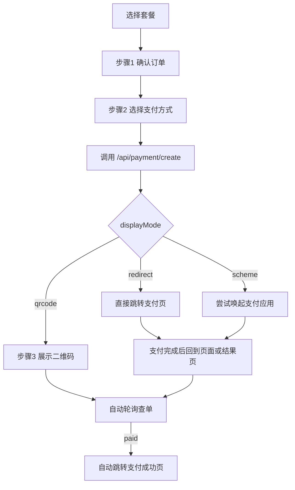

# 订阅与支付功能

> **本文档引用的文件**
> - [ApiSettingsPage.vue](file://src/pages/ApiSettingsPage.vue)
> - [useSubscriptionPlans.ts](file://src/composables/useSubscriptionPlans.ts)
> - [PaymentResultPage.vue](file://src/pages/PaymentResultPage.vue)
> - [api.ts](file://src/services/api.ts)
> - [storage.ts](file://src/utils/storage.ts)

## 目录

1. [功能概述](#功能概述)
2. [套餐展示与支付入口](#套餐展示与支付入口)
3. [真实支付流程](#真实支付流程)
4. [自动跳转与状态恢复](#自动跳转与状态恢复)
5. [用户体验与异常处理](#用户体验与异常处理)

## 功能概述

`ApiSettingsPage.vue` 当前承担套餐订阅、真实支付发起、支付等待态展示与支付结果承接四类职责。与早期“前端演示支付成功”不同，本轮已经接回真实支付链路：

- `alipay / wxpay`：调用后端 `/api/payment/create`，由后端向智腾码支付下单
- `bank`：继续保留为本地演示支付，不接第三方网关
- 支付完成后：自动跳转到公开支付结果页 `#/payment/result?out_trade_no=...`

## 套餐展示与支付入口

页面依旧保留套餐 Hero、档位对比、权益说明与支付步骤器，但支付动作已从本地模拟切换为后端真实下单。

### 支付方式

| 支付方式 | 行为 |
|---------|------|
| 支付宝 | 真实下单，可能返回二维码、支付页地址或唤起链接 |
| 微信支付 | 真实下单，可能返回二维码、支付页地址或唤起链接 |
| 银行卡支付 | 演示模式，前端直接模拟成功 |

### 下单入口

```ts
const response = await paymentAPI.createOrder(
  currentPaymentOffer.value.code,
  selectedPaymentMethod.value,
  {
    device: detectClientDevice(),
  },
);
```

当前前端传递的是**订阅页实际展示的套餐编码**，而不是旧版 `monthly/yearly/package-10` 这一组有限枚举。

## 真实支付流程



### 第 3 步支付承接层

步骤器的第 3 步已经不再是“固定成功页”，而是一个真实的支付承接层，会按网关返回值展示不同 UI：

- `displayMode = redirect`
  - 自动跳转支付页
  - 返回页面后继续自动查单
- `displayMode = scheme`
  - 尝试唤起支付应用
  - 若用户返回页面，继续自动查单
- `displayMode = qrcode`
  - 在当前弹窗展示二维码
  - 文案根据所选支付方式动态变化
  - 支付完成后自动跳转成功页

### 支付文案已按支付方式动态化

二维码场景下，标题与提示文案会根据 `selectedPaymentMethod` 自动切换：

- 支付宝：`支付宝扫码支付 / 请使用支付宝扫一扫`
- 微信：`微信扫码支付 / 请使用微信扫一扫`
- 其他：中性文案 `扫码支付`

## 自动跳转与状态恢复

本轮重点不是“手动刷新”，而是尽量让支付确认自动完成。

### 自动确认机制

前端在以下场景都会自动查单：

1. 拿到支付地址后立即首查一次
2. 二维码场景定时轮询
3. 跳转支付页场景定时轮询
4. 页面重新获得焦点时立即补查
5. 页面重新变为可见时立即补查

### 会话级待支付状态恢复

为了避免用户支付后返回页面时丢失上下文，前端会把待支付订单临时保存到 `sessionStorage`：

```ts
setItem(
  STORAGE_KEYS.PENDING_PAYMENT_STATE,
  {
    payment,
    paymentMethod: selectedPaymentMethod.value,
    paymentInfo: paymentInfo.value,
    createdAt: Date.now(),
  },
  'session',
);
```

返回页面后如果检测到仍有未过期的待支付状态，会自动恢复到步骤 3 并继续查单。

### 自动跳转成功页

一旦轮询确认订单已支付，会立即：

1. 刷新账号订阅状态
2. 弹出“支付成功”通知
3. 自动跳转到 `PaymentResultPage.vue`

对应结果页负责：

- 展示订单号、支付时间、获得权益
- 继续公开查单，保证回跳场景下能确认最终状态
- 提供“返回控制台 / 返回订阅页”入口

## 用户体验与异常处理

### 当前已优化的体验点

- 支付步骤器第 3 步文案与图标按真实状态动态变化
- 二维码文案不再把支付宝误写成“微信扫一扫”
- 支付链接支持复制，便于跨设备继续支付
- 页面重新聚焦后会主动补查，不再完全依赖手动刷新

### 当前特殊兼容说明

后端支付服务对智腾码支付做了一层白名单兼容：

- 若 `notify_url` 因白名单未配置被拒绝
- 后端会自动降级为“仅保留 `return_url` 重新下单”
- 因此支付流程仍可继续走通，但异步通知链路要等支付平台完全放白后才会恢复

### 用户可见结果

在白名单未完全就绪的阶段，用户的可见流程仍然是：

1. 下单成功
2. 获取支付地址
3. 完成支付
4. 自动进入支付成功页
5. 在成功页返回订阅页或控制台

## 总结

本轮订阅与支付功能的前端变化可以概括为：

1. **从演示流切换到真实支付流**
2. **第 3 步从“成功展示”升级为“支付承接层”**
3. **自动查单与自动跳转替代手动刷新**
4. **支付文案与实际支付方式保持一致**
5. **结果页成为支付完成后的统一承接终点**
