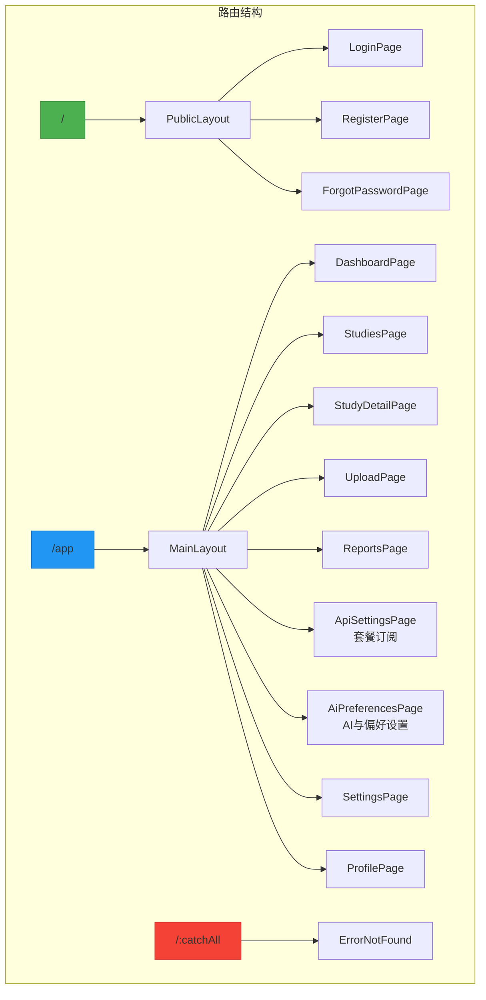
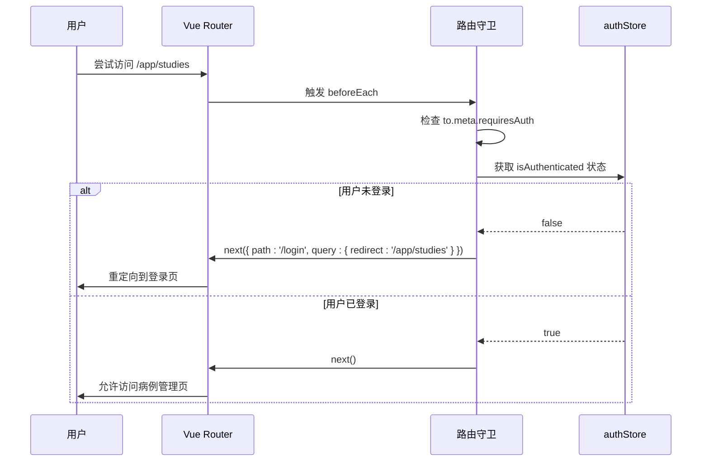

# 路由系统

> **Referenced Files in This Document**   
> - [routes.ts](file://src/router/routes.ts)
> - [index.ts](file://src/router/index.ts)
> - [authStore.ts](file://src/stores/authStore.ts)
> - [StudyDetailPage.vue](file://src/pages/StudyDetailPage.vue)

## 目录
1. [路由配置结构](#路由配置结构)
2. [路由守卫与权限控制](#路由守卫与权限控制)
3. [动态路由参数](#动态路由参数)
4. [路由懒加载与性能优化](#路由懒加载与性能优化)
5. [路由元信息应用](#路由元信息应用)
6. [常见路由错误排查](#常见路由错误排查)

## 路由配置结构

CervixDetectAI的前端路由系统基于Vue Router构建，采用模块化设计，将路由配置分离至`routes.ts`文件中。整个系统分为三大类路由：公共路由、受保护路由和通配符路由。

公共路由定义在根路径`/`下，使用`PublicLayout.vue`作为布局组件，包含登录、注册、忘记密码等无需认证即可访问的页面。这些路由通过`children`数组进行组织，路径分别为`/`、`/login`、`/register`和`/forgot-password`，分别对应`LoginPage.vue`、`RegisterPage.vue`和`ForgotPasswordPage.vue`。

受保护路由定义在`/app`路径下，使用`MainLayout.vue`作为主布局组件，所有需要用户登录后才能访问的功能页面均位于此路径下。该路由通过设置`meta: { requiresAuth: true }`来标记其受保护状态，触发全局路由守卫进行权限验证。其子路由包括仪表盘（`/app`）、病例管理（`/app/studies`）、上传（`/app/upload`）、报告（`/app/reports`）、套餐订阅（`/app/models`）、AI与偏好设置（`/app/ai-preferences`）、通用设置（`/app/settings`）和个人资料（`/app/profile`）等核心功能页面。

最后，系统定义了一个通配符路由`/:catchAll(.*)*`，用于捕获所有未匹配的路径，并将其重定向到`ErrorNotFound.vue`页面，确保用户不会因输入错误URL而看到空白页面。



**Diagram sources**
- [routes.ts](file://src/router/routes.ts#L1-L92)

**Section sources**
- [routes.ts](file://src/router/routes.ts#L1-L92)

## 路由守卫与权限控制

路由守卫是CervixDetectAI前端安全的核心机制，其实现位于`index.ts`文件中。系统采用全局前置守卫`Router.beforeEach`来拦截所有路由跳转，结合`authStore.ts`中的状态管理实现权限控制。

当用户尝试访问一个路由时，守卫会检查该路由的`meta.requiresAuth`字段。如果该字段为`true`，则表示此路由需要用户认证。守卫会立即从`authStore`中获取`isAuthenticated`状态。如果用户未登录（`isAuthenticated`为`false`），守卫会调用`next()`方法，并传入一个重定向对象，将用户导航至`/login`页面，同时在查询参数`redirect`中保存用户原本想要访问的完整路径。用户登录成功后，系统可以根据此参数将用户重定向回最初的目标页面，提升用户体验。

如果用户已登录，则守卫会直接调用`next()`，允许用户正常访问目标页面。对于公共路由（如登录页），由于其`meta.requiresAuth`为`undefined`或`false`，守卫会直接放行，不进行任何检查。

`authStore`通过`localStorage`持久化存储用户的认证令牌（`accessToken`）和用户信息。`initializeAuth`方法在应用启动时被调用，负责从`localStorage`中读取数据并恢复`authStore`的状态，确保用户刷新页面后仍保持登录状态。



**Diagram sources**
- [index.ts](file://src/router/index.ts#L38-L58)
- [authStore.ts](file://src/stores/authStore.ts#L20-L218)

**Section sources**
- [index.ts](file://src/router/index.ts#L38-L58)
- [authStore.ts](file://src/stores/authStore.ts#L20-L218)

## 动态路由参数

动态路由参数在CervixDetectAI中被用于实现病例详情页的个性化访问。在`routes.ts`文件中，`/app/studies/:id`路由定义了一个名为`id`的动态参数。这意味着当用户访问`/app/studies/123`或`/app/studies/456`时，`123`和`456`都会被捕获为`id`参数的值。

`StudyDetailPage.vue`组件通过`props: true`选项接收此参数。在组件内部，使用`useRoute()`组合式API来访问路由对象，并通过`route.params.id`获取当前的`id`值。该值随后被用作`loadStudyById`方法的参数，以从后端API或`studyStore`中加载对应ID的病例数据。

这种设计模式使得系统能够为每个唯一的病例ID生成一个唯一的URL，支持直接分享特定病例的链接。同时，它也简化了组件的逻辑，因为组件不再需要关心如何从URL中解析ID，而是可以直接使用`props`接收。

```mermaid
flowchart TD
A[用户访问 /app/studies/789] --> B[Vue Router 匹配 /app/studies/:id]
B --> C[提取参数 id = '789']
C --> D[实例化 StudyDetailPage.vue]
D --> E[通过 props 传递 id]
E --> F[组件使用 id 调用 loadStudyById(789)]
F --> G[从 API 或 store 加载病例数据]
G --> H[渲染病例详情]
```

**Diagram sources**
- [routes.ts](file://src/router/routes.ts#L31-L35)
- [StudyDetailPage.vue](file://src/pages/StudyDetailPage.vue#L269-L270)

**Section sources**
- [routes.ts](file://src/router/routes.ts#L31-L35)
- [StudyDetailPage.vue](file://src/pages/StudyDetailPage.vue#L248-L502)

## 路由懒加载与性能优化

为了优化应用的初始加载性能，CervixDetectAI的路由系统全面采用了路由懒加载（Lazy Loading）技术。在`routes.ts`文件中，所有页面组件的导入都使用了动态`import()`语法，例如`component: () => import('pages/LoginPage.vue')`。

这种语法指示Webpack将每个页面组件打包成独立的代码块（chunk）。当应用首次加载时，只会下载和执行`index.ts`和`routes.ts`等核心文件，而各个页面组件的代码块则被延迟加载。只有当用户实际导航到某个特定路由时，对应的代码块才会被异步下载并执行。

这一策略显著减少了应用的初始包体积，加快了首页的加载速度。例如，新用户访问登录页时，无需下载庞大的病例管理、套餐订阅或 AI 偏好设置相关的代码，从而实现了按需加载，提升了用户体验。

**Section sources**
- [routes.ts](file://src/router/routes.ts#L1-L92)

## 路由元信息应用

路由元信息（meta fields）在CervixDetectAI中扮演着重要的角色，主要用于权限控制和潜在的布局选择。最核心的应用是在`/app`路由上设置`meta: { requiresAuth: true }`，这是路由守卫判断一个页面是否需要登录的依据。

未来，该系统可以扩展元信息的应用场景。例如，可以添加`meta: { layout: 'fullscreen' }`来为特定页面（如上传页）指定全屏布局，而其他页面则使用默认的`MainLayout`。也可以添加`meta: { permission: 'doctor' }`来实现更细粒度的权限控制，确保只有医生角色的用户才能访问某些敏感功能。

元信息提供了一种声明式的方式来附加与路由相关的非组件数据，使得路由配置更加灵活和可扩展。

**Section sources**
- [routes.ts](file://src/router/routes.ts#L18)

## 常见路由错误排查

在开发和使用CervixDetectAI时，可能会遇到一些与路由相关的常见问题：

1.  **页面空白或404错误**：这通常发生在部署后。如果应用使用了`history`模式，需要确保服务器配置正确，能将所有未知路径重定向到`index.html`。否则，直接访问`/app/studies`会导致服务器返回404。

2.  **无法重定向回原页面**：如果用户登录后没有跳转到他们最初想访问的页面，检查`login`页面的逻辑。它应该读取`redirect`查询参数，并在登录成功后使用`router.push(redirect || '/app')`进行跳转。

3.  **动态参数未更新**：当用户在同一个组件的不同实例间跳转（如从`/app/studies/1`到`/app/studies/2`）时，组件可能不会重新创建。这可能导致`onMounted`钩子不被触发。解决方案是在`onBeforeRouteUpdate`或`watch`中监听`$route.params.id`的变化，并相应地更新数据。

4.  **路由守卫无限循环**：如果在守卫中错误地调用了`next('/login')`而没有检查当前路径，当用户已经在登录页时，可能会导致无限重定向。正确的做法是检查`to.path !== '/login'`后再进行重定向。

**Section sources**
- [index.ts](file://src/router/index.ts#L38-L58)
- [routes.ts](file://src/router/routes.ts#L67-L69)
